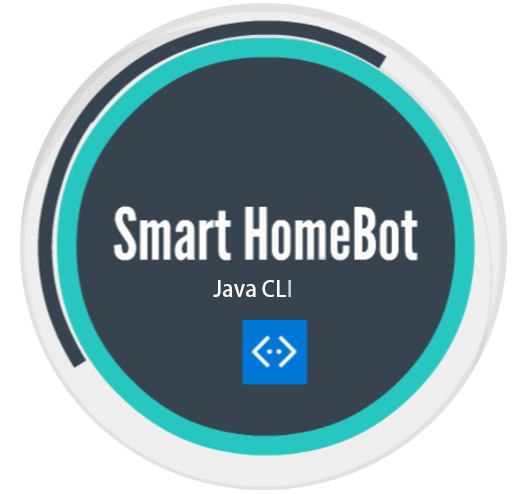

#  SmartHomeBot 

SmartHomeBot is a desktop application that consolidates all the home appliance's control into a centralized system via Command Line Interface (CLI).

Useful links:
* [User Guide](UserGuide.md)
* [Developer Guide](DeveloperGuide.md)
* [About Us](AboutUs.md)

 
 