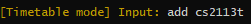
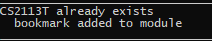
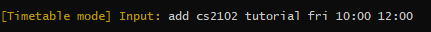
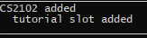
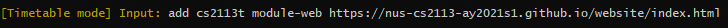
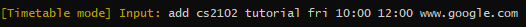
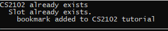
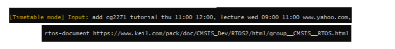
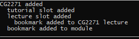
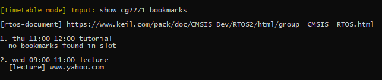

# User Guide  
  
## 1.0 Introduction  
  
Zoomaster is a desktop app for organizing website links, optimized for use via a 
Command Line Interface (CLI) while retaining benefits of a Graphical User Interface (GUI). 
If you can type fast, Zoomaster can help fetch useful website links for you quicker than the bookmark function on your browser.


<br/><br/> 
## 2.0 Preface
This user guide would help you walkthrough the features of Zoomaster and ways to input commands to it to access these features.


<br/><br/> 
## 3.0 Table of contents
* [4.0 Quick Start](#quick-start)
* [5.0 Features](#features)
  * [5.1 Global](#global)
    *  [Show help information:](#help) **help**
    *  [Switch mode:](#mode) **mode**
    *  [Clear:](#clear)  **clear**
    *  [Launch current lesson:](#launchnow)  **launch now**
    *  [Exit:](#exit)  **exit**
  * [5.2 Bookmark mode](#bookmarkmode)
    * [Show bookmarks:](#showbookmark) **show**
    * [Add bookmark:](#addbookmark)  **add**
    * [Delete bookmark:](#deletebookmark)  **delete**
    * [Find bookmark:](#findbookmark)  **find**
    * [Launch bookmark:](#launchbookmark)  **launch**
  * [5.3 Timetable mode](#timetablemode)
    * [Show timetable:](#showtimetable) **show**
    * [Show module, slot and bookmarks:](#showmoduledetails) **show**
    * [Add module, slot and bookmark:](#addtimeslot) **add**
    * [Delete module, time slot and bookmarks:](#deletetimeslot)  **delete**
    * [Edit slot's module, title, time:](#edittimeslot)  **edit**
    * [Launch bookmarks from module, slot:](#launchtimeslot)  **launch**
  * [5.4 Planner mode](#plannermode)
    * [Load planner:](#loadplanner) **load**
    * [Show planner:](#showplanner) **show**
    * [Add meeting:](#addmeeting) **add**
    * [Save planner:](#saveplanner) **save**
* [6.0 FAQ](#faq)
* [7.0 Command Summary](#command-summary)
  
<br/><br/>   
## 4.0 Quick Start  
  
1. Ensure that you have Java 11 or above installed.  
2. You can download the latest version of `Zoomaster` from [here](https://github.com/AY2021S1-CS2113T-W11-1/tp/releases) if you are running a older version.
3. Now move the **zoomaster.jar** file into your desired home folder for Zoomaster. <br/><br/> 
4. Copy the absolute path of your **zoomaster.jar** file by first highlighting your file, then while
holding the <kbd>Shift</kbd> key on your keyboard, right click on that file and select the option "Copy as path". <br/><br/> 
5. Afterwards, start Command Prompt by pressing <kbd>Windows</kbd> + <kbd>R</kbd> on the keyboard, then type in "cmd" and hit the <kbd>Enter</kbd> key. <br/><br/> 
6. In the Command Prompt, type in "java -jar", then paste the absolute path you copied previously in step 4. It should look similar to the picture below:  <br/><br/> 
7. Finally, press <kbd>Enter</kbd>. You should see this Zoomaster logo indicating that you have successfully started your Zoomaster program. <br/><br/> 


8. The app is now ready to go! Go ahead and test it out with a `help` command. The app should print out a list of different commands. <br/><br/> 

9. You can now refer to the section below to explore the different features of the Zoomaster app.
  
## 5.0 Features   

This section will explain to you the different features of Zoomaster and how you can interact with it. Zoomaster has three different modes you can use to interact with different features in each mode.

>[i] Notes on command format:
>* Word contained in `{curly brackets}` are parameters to be supplied by the user. 
>eg. in `delete {BOOKMARK_NUMBER}`, `BOOKMARK_NUMBER` is a parameter which can be used as `delete 1`.
> * Parameters with `/` inside are parameters which accept different types of inputs. 
> eg. `launch {INDEX/DESCRIPTION}` shows that either `INDEX` or `DESCRIPTION` can be used.
>* Parameters with `(optional)` are optional inputs. 
>eg. `show {DAY(optional)}` can be used as `show` or as `show mon`.
>* Parameter `DAY` takes three letter abbreviations of days in a week
>The full list of DAY parameters are **mon, tue, wed, thu, fri, sat, sun**
>eg. `show {DAY(optional)}` can be used as `show mon`, `show tue` etc.
>* Parameter `MODULE` has to be an NUS module recognised by NUSMods
>eg. `CS2113`, `CS2101`  
>* Parameters `START TIME` and `END TIME` requires input to be in the format `HH:mm` and in 24 Hours.
>eg. `12:00`, `14:00`, `00:00`

<a name="global"></a> 
### 5.1 Global Commands

These commands can be used by you in every mode of the app.


<a name="help"></a>  
#### 5.1.1 Show help information: `help` (Yu Shing + Zhan Hao)
You can see the list of commands available in mode you are currently in.
```
Format: help {COMMAND(optional)}
```
>Let's say you require help to see the commands you can access the main menu mode. You will first enter `help` into the console.
>
>
>
>Then you should see the following message to guide you with the relevant commands.
>
>

>Similarly, you require help to see the commands you can access in the bookmark mode. You will first enter `help` into the console.
>
>
>
>Then you should see the following message to guide you with the relevant commands.
>
>

>Alternatively, you require help to see the commands you can access in the timetable mode. You will first enter `help` into the console.
>
>
>
>Then you should see the following message to guide you with the relevant commands.
>
>

>Else, you require help to see the commands you can access in the planner mode. You will first enter `help` into the console.
>
>
>
>Then you should see the following message to guide you with the relevant commands.
>
>

<br/><br/> 

If you require additional information about a command, you can insert the optional parameter of `{COMMAND}` after `help` show you additional information about the commands and how to format the command properly.

Example of usage:   
* `help add`
* `help delete`
>The following example represents the case if you require help about the `add` command in timetable mode. First you type the command `help add`.
>
>
>
>Then you should see the following message to explain and instruct you on how to use the `add` command in timetable mode
>
>

<br/><br/> 
<a name="mode"></a>  
#### 5.1.2 Switch mode: `mode` (Yu Shing)
You can switches between the “bookmark” and “timetable” modes. Depending on the mode you select the behaviour of the commands below changes. <br/><br/> 

There are three modes for Zoomaster, Bookmark, Timetable and Planner modes.

```
Format: mode {bookmark/timetable/planner}
```

Example of usage:   
* `mode bookmark`
* `mode timetable` 
* `mode planner`

>Here are some examples of switching from the main menu of Zoomaster to the various modes.
>* When you are switching to the bookmark mode you would see the message shown below.<br/>
><br/><br/> 
>* When you are switching to the timetable mode you would see the message shown below.<br/>
><br/><br/> 
>* When you are switching to the planner mode you would see the message shown below.<br/>
>

<br/><br/> 
<a name="clear"></a>  
#### 5.1.3 Clear screen: `clear` (Zhan Hao)
This feature helps you clear the screen in the command prompt. It is useful if the screen gets too cluttered with past commands.
```
Format: clear
```

<br/><br/> 
<a name="launchnow"></a>  
<<<<<<< HEAD
#### Launch bookmarks of current lesson: `launch now` (Xing Rong)
You can launch the bookmarks of a current lesson slot in your timetable. 
=======
#### 5.1.4 Launch bookmarks of current lesson: `launch now` (Xing Rong)
You can launches the bookmarks of a current lesson slot in your timetable. 
>>>>>>> master
The time depends on the system time of your machine with an additional 5 minutes of buffer, allowing you to launch your zoom session ahead of time.
  
```
Format: launch now    
```

<br/><br/> 
<<<<<<< HEAD
<a name="clear"></a>  
#### 2.1.4. Clear screen: `clear`
This feature helps you clear the screen in the command prompt. It is useful if the screen gets too cluttered with past commands.
```
Format: clear
```

<br/><br/> 
=======
>>>>>>> master
<a name="exit"></a>  
#### 5.1.5 Exit the app: `exit`  
You can exit the application by using the exit command.
  
```
Format: exit    
```
>You should see this message on exit  


<br/>
---
<br/> 


<a name="bookmarkmode"></a>  
### 5.2 Bookmark Mode  

<a name="showbookmark"></a>  
#### 5.2.1 Show bookmarks: `show`  
It prints all bookmark in your bookmark list  
```
Format: show
```
<br/><br/> 
<a name="addbookmark"></a>  
#### 5.2.2 Add bookmark: `add`  
Adds a URL bookmark with a description.  
```
Format: add {DESCRIPTON} {URL}
``` 
* The `DESCRIPTION` must only contain one word (no whitespace inside).  
* The `URL` has to start with `www.`, `http://` or `https://`.  
* Note that validity of the `URL` cannot be checked. Please ensure that you enter the correct link.  
  
Example of usage:
* `add google www.google.com/`  
* `add example http://example.com`  
* `add cs2113t-website https://nus-cs2113-ay2021s1.github.io/website/`  

<br/><br/> 
<a name="deletebookmark"></a>  
#### 5.2.3 Delete bookmarks: `delete`  
Deletes a bookmark with the specified index.  
The index will correspond to the index of that bookmark in the list. 
You can do a `show` command to check the bookmark indexes.  

```
Format: delete {INDEX}
```

Example of usage:
* `delete 2`  
* `delete 4`  

<br/><br/> 
<a name="findbookmark"></a>  
#### 5.2.4 Find bookmarks: `find`  
Finds bookmarks with matching description and prints them.
```
Format: find {DESCRIPTION}
```
  
* The `DESCRIPTION` can only contain one word.  

Example of usage: 
* `find cs2113t-website`
* `find notes`  


<br/><br/> 
<a name="launchbookmark"></a>  
#### 5.2.5 Launch bookmarks: `launch`  
Launches bookmarks in the default browser using either:
* Index
* Matching description

The index will correspond to the index of that bookmark in the list. 
You can do a `show` command to check the bookmark indexes.  
```
Format: launch {INDEX/DESCRIPTION}
```

* The `DESCRIPTION` can only contain one word.   

Example of usage:  
* `launch 1`
* `launch cs2113t-website`  
  
<br/>
---
<br/> 

<a name="timetablemode"></a>  
### 5.3 Timetable mode    

<a name="showtimetable"></a>
#### 5.3.1 Show timetable: `show` (Yu Shing)
You will be able to see the timetable for a certain day or the whole week.  
**today** can also be a `DAY` input to show the timetable for the current day based on system time.  
If your selected timetable is the current day, you should be able to see a
"current time" indicator with your system local time. 
Else if you have a lesson ongoing currently, it will instead show a "lesson now" indicator.
around your current lesson.
```
Format: show {DAY(optional)}
```

Example of usage:   
* `show`
* `show wed`
* `show today`

>You will see an empty list message if your timetable is empty  
>  
>You will see your entire timetable if you use `show` input  
  
>You will see the timetable of your selected day if you use `show {day}` input. This example uses wednesday as its selected day input.  
>  
>You will see the timetable for today if you use `show today` input.  
>  
>Example of "current time" indicator  
>  
>Example of "lesson now" indicator  
>  


<br/><br/>
<a name="showmoduledetails"></a>
#### 5.3.2 Show module and slot details: `show` (Xing Rong)
Shows the details of a module or slot that has been added.  
You can see the respective indexes of each of the slots from the module 
and using the `bookmarks` keyword will show the bookmarks which are saved in the module and its slots.
```
Format (show module details): 
* show {MODULE} bookmarks(optional)

Format (show slot details):
* show {MODULE} {INDEX} bookmarks(optional)
```

Example of usage:   
* `show cs2113t`
* `show cs2113t bookmarks`
* `show cs2113t 1`
* `show cs2113t 1 bookmarks`

<br/><br/> 
<a name="addtimeslot"></a>
#### 5.3.3 Add module, time slot and bookmark: `add` (Xing Rong)
You can add modules, time slots and bookmarks using this feature.
You can also chain commands when adding multiple slots and bookmarks to a module by using `,` as a separator.
  
```
Format (adding a module): 
* add {MODULE}

Format (adding a slot to a module): 
* add {MODULE} {DESCRIPTION} {DAY} {START_TIME} {END_TIME} 

Format (adding a bookmark to a module): 
* add {MODULE} {DESCRIPTION} {URL}

Format (adding a bookmark to a slot): 
* add {MODULE} {DESCRIPTION} {DAY} {START_TIME} {END_TIME} {URL}
* add {MODULE} {INDEX} {URL}

Format (chaining commands): 
* add {MODULE} {DESCRIPTION} {DAY} {START_TIME} {END_TIME} {URL}, {DESCRIPTION} {URL}, ...
```  

* Multiple bookmarks can be added to a module and a slot.
  * To add another bookmark to an existing module, you have to enter the module code of the 
    existing module in the timetable. 
  * To add another bookmark to an existing slot, you can enter the command with the matching details 
    of the existing slot or use the index number of the slot in the module to access the slot. 
    Index number of the slot can be found by using the command `show {MODULE}`. 
* Each command works by checking if each of the components (module, slot, bookmark) 
  exists or is valid from left to right of the input before adding them.
  * In the command `add cs2113t lecture fri 16:00 18:00`, if `cs2113t` module already exists, 
    then it will not be added into the timetable. The slot `lecture fri 16:00 18:00` 
    which is valid and not a duplicate will then be added to the existing `cs2113t` module.
* The chaining of commands only performs on one module which is {MODULE}.    
* The `DESCRIPTION` must only contain one word (no whitespace inside).  
* The `URL` has to start with `www.`, `http://` or `https://`.  
 
* Note that validity of the `URL` cannot be checked. Please ensure that you enter the correct link. 
* Parameter `DAY` takes three letter abbreviations of days in a week
  * The full list of DAY parameters are **mon, tue, wed, thu, fri, sat, sun**

Example of usage:   

* Adding a module  
input:  
  
output:  
  


* Adding a slot to a module  
input:  
  
output:  
  

* Adding a bookmark to a module  
input:  
  
output:  
  

* Adding a bookmark to a slot  
input:  
  
output:  
  

* Chaining commands  
input:  
  
output:  
(The indentation of each line of the output shows the relationships between the components.
In the output shown below, `bookmarks added to CG2271 lecture` is one level of indentation 
higher than the previous line. This means that the bookmark is added to that lecture slot.
Similarly, `bookmark added to module` is one level of indentation higher than `CG2271 added`, 
which suggests that the bookmark is added to the module CG2271.)  
  
result:  

  


More examples:
* `add cs2113t`  
* `add cs2113t lecture fri 16:00 18:00`
* `add cs2113t notes www.google.com`
* `add cs2113t lecture fri 16:00 18:00 www.google.com`
* `add cs2113t 1 www.yahoo.com`
* `add cs2113t lecture fri 16:00 18:00 www.google.com, notes www.google.com, tutorial fri 10:00 12:00`


<br/><br/> 
<a name="deletetimeslot"></a>
<<<<<<< HEAD
#### Delete module, time slot and bookmarks: `delete` (Xing Rong)
=======
#### 5.3.4 Delete module, time slot and bookmarks: `delete`   (Xing Rong)
>>>>>>> master
Deletes module, time slot or bookmarks.
```
Format (deleting a module): 
* delete {MODULE}

Format (deleting a slot of a module): 
* delete {MODULE} {INDEX} 

Format (deleting bookmarks of a module): 
* delete {MODULE} bookmarks 

Format (deleting bookmarks of a slot of a module): 
* delete {MODULE} {INDEX} bookmarks 
```

* Deleting bookmarks will delete all bookmarks associated with the module or slot.

Example of usage:   
* `delete cs2113t`  
* `delete cs2113t 1`
* `delete cs2113t bookmarks`
* `delete cs2113t 1 bookmarks`
<br/><br/> 

<a name="edittimeslot"></a>
#### 5.3.5 Edit slot's module, title, time: `edit`  (Francisco) 
Edits the module, title or time for a specific slot.
```
Format (editing the module of a slot): 
* edit module {DAY} {INDEX} {new MODULE}

Format (editing the title of a slot): 
* edit title {DAY} {INDEX} {new TITLE}

Format (editing the time of a slot): 
* edit time {DAY} {INDEX} {new START_TIME} {new END_TIME}
```

* Obtain the `DAY` and `INDEX` of the slot to be edited using the `show` command.

Example of usage:   
* `edit module mon 1 CS1010`  
* `edit title mon 1 lecture`
* `edit time mon 1 fri 10:00 12:00`
<br/><br/> 

<a name="launchtimeslot"></a>
#### 5.3.6 Launch bookmarks from module, slot: `launch`  
Launches the bookmarks of slots or the bookmarks of the module
```
Format: (launch module bookmarks) 
* launch {MODULE}

Format: (launch slot bookmarks) 
* launch {MODULE} {INDEX}
```

* Obtain the `INDEX` of the slot to be launched using the `show {MODULE}` command.
* `launch {MODULE}` launches the bookmarks tagged to the module itself, for example the module website
* `launch {MODULE} {INDEX}` launches the bookmarks tagged to the second slot of the module, for example the zoom link for tutorial
<br/><br/> 

Example of usage:   
* `launch CS2113`  
* `launch CS2113 2`


<a name="plannermode"></a>  
<a name="plannermode"></a>  
### 5.4. Planner Mode  

<a name="loadplanner"></a>  
#### 5.4.1. Load planner: `load`  
Loads all the timetables from the `planner` folder and helps you find some common empty slots.
> [i] Notes:
> - You need to copy the different .txt files manually to the planner folder.
> - This command only displays the common empty time slots.
```
Format: load
```

<br/><br/> 
<a name="addmeeting"></a>  
#### 5.4.2. Add meeting: `add`  
You can add modules, time slots and bookmarks using this feature.
You can also chain commands when adding multiple slots and bookmarks to a module by using `,` as a separator.

> [i] Notes:
> - You can only add a new meeting to empty time slots.
> - Note that this command does not automatically store the newly added meeting to the .txt files.
> You will need to type `save` to save it.

Format: same as [add time slots](#addtimeslot) command.

<br/><br/> 
<a name="showplanner"></a>  
#### 5.4.3. Show planner: `show`
You will be able to see the empty time slots for a certain day or the whole week.  
**today** can also be a `DAY` input to show the timetable for the current day based on system time.  
If your selected timetable is the current day, you should be able to see a
"current time" indicator with your system local time. 
Else, if you have a lesson ongoing currently, it will instead show a "lesson now" indicator
around your current lesson.  

```
Format: show {DAY(optional)}
```
Example of usage:   
* `show`
* `show wed`
* `show today`

<br/><br/> 
<a name="saveplanner"></a>  
#### 5.4.4. Save planner: `save`  
Saves the newly added slot(s) to each individual timetables.
```
Format: save
```

<br/><br/> 
## 6.0 FAQ  
  
**Q**: How do I transfer my data to another computer?   
  
**A**: Copy the `data/bookmarks.txt` and `data/slots.txt` file to the **data** directory where the `jar` file is at.


Start the application and all the data should be loaded.
<br/><br/> 

**Q**: Can I add a module not from NUS?   
  
**A**: Yes you can! <br> In the **data** directory locate the  `modulelist.txt` file. Add the new module on a new line
and save the txt file. You can now add the module in Zoomaster.


<br/></br>
## 7.0 Command Summary
**Action** | **Format, Examples**
------------ | -------------
**Global**|
**help**|`help {COMMAND(optional)}`<br>example: `help`, `help add`
**mode**|`mode {bookmark/timetable}`<br>example: `mode bookmark`
**clear**|`launch now`
**launch now**|`clear`
**exit**|`exit`
**Bookmark Mode**|
**show**|`show`
**add**|`add {DESCRIPTION} {URL}` <br>example: `add cheatsheet www.google.com` <br/><br/>
**delete**|`delete {INDEX}`<br>example: `delete 2`|
**find**|`find {MODULE} {DESCRIPTION(optional)}` <br>example: `find CS2113 tutorial`
**launch**|`launch {MODULE} {DESCRIPTION(optional)}` <br>example: `launch CS2113`
**Timetable Mode**|
**show (lessons)**|`show {DAY(optional)}` <br>example: `show`, `show wed`, `show today` 
**show (bookmarks<br>attatched)**| `show {MODULE} bookmarks(optional)`<br>example: `show CS2113`, `show CS2113 bookmarks`
**add**|`add {MODULE}` <br>example: `add CS2113T` <br/><br/> `add {MODULE} {DESCRIPTION} {DAY} {START_TIME} {END_TIME}` <br>example: `add CS2113T tutorial wed 11:00 12:00` <br/><br/>`add {MODULE} {DESCRIPTION} {URL}` <br>example: `add CS2113T tutorial www.yahoo.com` <br/><br/> `add {MODULE} {DESCRIPTION} {DAY} {START_TIME} {END_TIME} {URL}` <br>example: `add CS2113T tutorial wed 11:00 12:00 www.yahoo.com` <br/><br/>`add {MODULE} {INDEX} {URL}` <br>example: `add CS2113T 2 www.yahoo.com`
**delete**| `delete {MODULE}` <br>example: `delete CS2113`<br/><br/>`delete {MODULE} {INDEX}` <br>example: `delete CS2113 2`<br/><br/>`delete {MODULE} bookmarks` <br>example: `delete CS2113 bookmarks`<br/><br/>`delete {MODULE} {INDEX} bookmarks` <br>example: `delete CS2113 2 bookmarks`<br/><br/>
**edit**| `edit module {DAY} {INDEX} {new MODULE}` <br> example: `edit module fri 2 CS1010` <br/><br/> `edit title {DAY} {INDEX} {new TITLE}`<br> example: `edit title fri 2 tutorial` <br/><br/>`edit time {DAY} {INDEX} {new START_TIME} {new END_TIME}` <br> example: `edit time fri 2 16:00 18:00`
**launch**|`launch {MODULE}` <br> example: `launch CS2113` <br/><br/> `launch {MODULE} {INDEX}` <br> example: `launch CS2113 1` 
***Planner Mode***|
**load**|`load`
**show**|`show {DAY(optional)}` <br>example: `show`, `show wed`, `show today` 
**add**|see add in timetable mode above
**save**|`save`
