# User Guide
 
# Table of contents
- [1. Introduction](#1introduction)
- [2. About this User Guide](#2-about-this-user-guide)
- [3. Quick Start](#3quick-start)
- [4. Features](#4features)
    - [Command Format](#command-format)
  - [4.1 Help `help`](#41-help-help)
  - [4.2 Exit the program: `bye`](#42-exit-the-program-bye)
  - [4.3 HR features `HR`](#43-hr-features-hr)
    - [Add members: `addMember`](#add-members-addmember)
    - [Delete members: `delMember`](#delete-members-delmember)
    - [list members: `listMember`](#list-members-listmember)
    - [change member information: `changeInfo`](#change-member-information-changeinfo)
    - [search members: `search`](#search-members-search)
    - [view contacts of prof/admin: `list prof&admin`](#view-contacts-of-profadmin-list-profadmin)
    - [view contacts of connections: `list connections`](#view-contacts-of-connections-list-connections)
  - [4.4 Event features`event`](#44-event-featuresevent)
    - [Add an event: `addEvent`](#add-an-event-addevent)
    - [Delete an event: `delEvent`](#delete-an-event-delevent)
    - [Clear all events: `delEvent all`](#clear-all-events-delevent-all)
    - [List events: `listEvent`](#list-events-listevent)
    - [Countdown events `countdown`](#countdown-events-countdown)
    - [Mark an event as completed `done`](#mark-an-event-as-completed-done)
    - [Search for an Event `search`](#search-for-an-event-search)
    - [Add a participant to an event: `addAttendance`](#add-a-participant-to-an-event-addattendance)
    - [Delete a participant from an event: `delAttendance`](#delete-a-participant-from-an-event-delattendance)
    - [List events: `listAttendance`](#list-participants-in-an-event-listattendance)
  - [4.5 Finance features `finance`](#45-finance-features-finance)
    - [4.5.1 Add finance log entry: `addLog`](#add-finance-log-entry-addlog)
    - [4.5.2 Delete finance log entry: `delLog`](#delete-finance-log-entry-dellog)
    - [4.5.3 View financial summary: `summary`](#view-financial-summary-summary)
  - [4.6 Importing features](#46-import)
- [5. FAQ](#5-faq)
- [6. Command Summary](#6-command-summary)
- [7. Glossary](#7-glossary)

## 1.Introduction

Welcome to **CCA Manager!**
CCA Manager is a revolutionary tool that changes the way you can manage interest groups with unrivaled efficiency and simplicity. Its lightweight Command Line Interface (CLI) allows administrators to breeze through tasks quickly and easily while offering powerful features to advanced users.

### 2. About this User Guide 
This user guide provides a quick start guide for you to easily setup install CCA manager, 
documentation of all the features that CCA manager offers, frequently asked questions and a summary of the available commands.
To navigate between the different sections, you could use the table of contents above.

Additionally, throughout this user guide, there will be various icons used as described below:
> :bulb: This symbol denotes a tip which you might find useful when using the application.

> :information_source: This symbol denotes some information that you will need to take note of when using the application.

> :`code` : Text that appears on the CLI / in code

> : [Hyperlinked]() : Leads you to the appropriate section 
>
## 3.Quick Start

:one: Ensure that you have Java 11 or above installed.
 > :bulb: To check the version of Java on your computer, follow the instructions [here](https://www.wikihow.com/Check-Your-Java-Version-in-the-Windows-Command-Line).  
 > :bulb: To download the latest version of Java on your computer, visit [here](https://www.oracle.com/java/technologies/javase-downloads.html).  
 
:two: Download the latest version of CCA manager from  [here](https://github.com/AY2021S1-CS2113T-F14-1/tp/releases)  

:three: Run the program by entering java -jar cca.java in a terminal.
 > :information_source: Please resize the terminal to full screen mode
 
You will see this welcome message if you have done the above steps correctly. 

(to add welcome message)

## 4.Features 
This section will show the features in our program in detail.
You can follow along as we go through each of the features if you are starting out, or skip ahead to the Command Summary
to see the commands of all features at a glance.

#### Command Format 

Words in UPPER CASE are the parameters to be supplies by user.
> :information_source: Our program also supports shorthand commands. 

(elaborate)

### 4.1 Help `help`
Shows a list of available commands 
Format: help

Expected Outcome: 

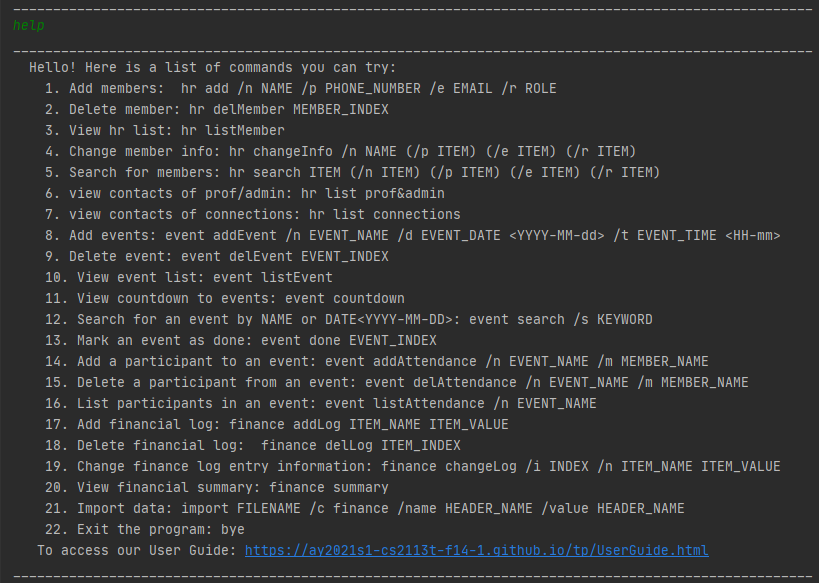

### 4.2 Exit the program: `bye` 
Exits the program.
Format: `bye`

### 4.3 HR features `HR` 
#### Add members: `addMember`
Adds a member to the list of members. 

Format: `hr add /n NAME /p PHONE_NUMBER /e EMAIL /r ROLE` 

Example of usage:  
 `hr addMember /n John Sterling /p 88888888 /e js@gmail.com /r president` 
 `hr addMember /n Harry Potter /p 12345678 /e H_P@gmail.com /r member` 
 
 Expected Outcome:
 
 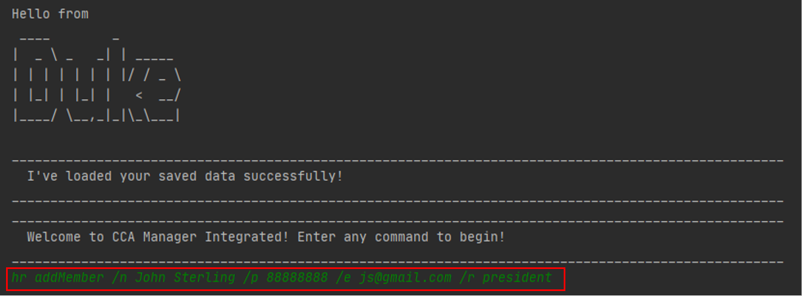
 
 [Return to the top](#user-guide)
 
 #### Delete members: `delMember`
 Deletes a member from the list of members.  
 Format: `hr delMember MEMBER_INDEX`  
 Deletes the member at the specified MEMBER_INDEX. 
 
 The MEMBER_INDEX refers to the index number shown in the list of members. 
 The MEMBER_INDEX must be an integer greater than 0.  
 
 Example of usage: 
 `hr delMember 1`  
 `hr delMember 19`  
 
  Expected Outcome:
  
  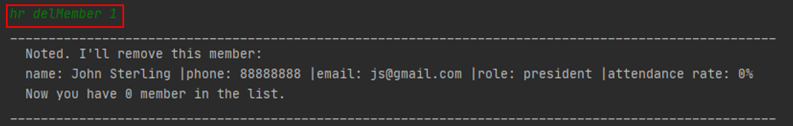
  
  [Return to the top](#user-guide)

#### list members: `listMember`
Prints the list of members, based on the order in which they are added into the list. 
Format: `hr listMember`  

Example of usage:
`hr listMember`  

 Expected Outcome:
 
 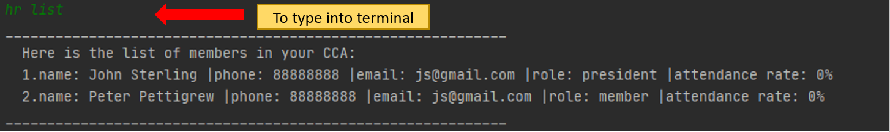
 
 [Return to the top](#user-guide)

#### change member information: `changeInfo`
Changes contacts and role of member in the list, based on the given member name. 
Format: `hr changeInfo /n MEMBER_NAME (/p PHONE_NUMBER) (/e EMAIL) (/r MEMBER_ROLE)`  

MEMBER_NAME and at least one of PHONE_NUMBER, EMAIL and MEMBER_ROLE must be provided. 

Example of usage:  
`hr changeInfo /n john sterling /p 12345678`  
`hr changeInfo /n Harry Potter /p 12345678 /e 123@gmail.com /r President`

 Expected Outcome:
 
 
 
 [Return to the top](#user-guide)

#### search members: `search`  
Search the members whose information matches user input.  
Format: `hr search ITEM (/n ITEM) (/p ITEM) (/e ITEM) (/r ITEM)`  

Example of usage:  
`hr search peter`  
`hr search /n peter /r president`  

#### view contacts of prof/admin: `list prof&admin`  
List the contacts of the professors and administrators.  
Format: `hr list prof&admin`  

Example of usage:  
`hr list prof&admin`  

#### view contacts of connections: `list connections`  
List the contacts of connections(alumni, speakers).  
Format: `hr list connections`  

Example of usage:  
`hr list connections`  

### 4.4 Event features`event` 
#### Add an event: `addEvent`
Adds an event to the list of events. 
Format: `event addEvent /n EVENT_NAME /d EVENT_DATE /t EVENT_TIME` 

Example of usage:  
 `event addEvent /n arduino course /d 2020-12-30 /t 8pm` 
 `event addEvent /n Autodesk course/d 2020-12-20 /t 8-10.30pm` 
 
Expected Outcome:

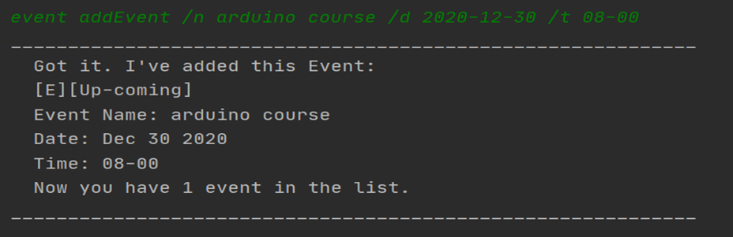

[Return to the top](#user-guide)
 
#### Delete an event: `delEvent`
 Deletes an event from the list of events   
 Format to clear a particular event: `event delEvent EVENT_INDEX`  
 Deletes the event at the specified EVENT_INDEX. 
 
 > :information_source The EVENT_INDEX refers to the index number shown in the list of events. 
 > :information_source The EVENT_INDEX must be an integer greater than 0.  
 
 Example of usage: 
 `event delEvent 1`  
 `event delEvent 19`  
 
 Expected Outcome: 
 
 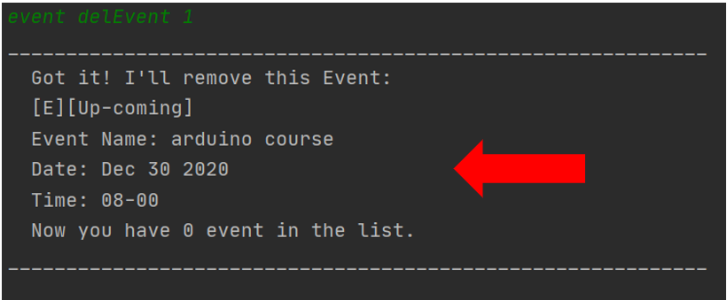
 
 [Return to the top](#user-guide)

#### Clear all events: `delEvent all`
Clear all events from the list of events  
Format to clear all events in the list: `event delEvent all`

Example of usage:
`event delEvent all`  

A confirmation message will be prompted. To clear, type `Y` in terminal.

Expected Outcome:

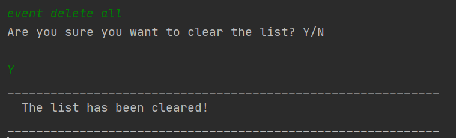

[Return to the top](#user-guide)

#### List events: `listEvent`
Prints the list of events, based on the order in which they are added into the list. 
Format: `event listEvent`  

Example of usage: 
`event listEvent`

Expected Outcome:

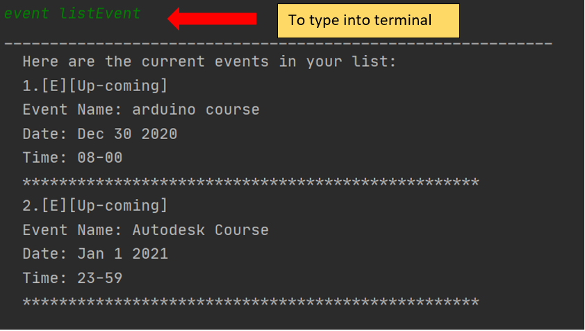

[Return to the top](#user-guide)

#### Countdown events `countdown`
lists the events with the number of days left. It also sorts them so that the event due first will be displayed first. 
Format: `event countdown`  

Example of usage: 
`event countdown`

Expected Outcome:

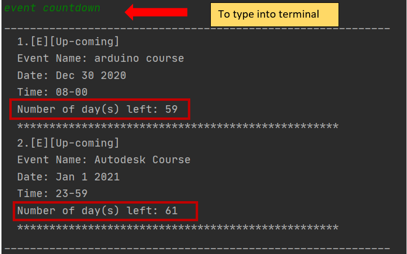

[Return to the top](#user-guide)

#### Mark an event as completed `done`
Mark an event as done. 
Format: `event done EVENT_INDEX`  

The EVENT_INDEX refers to the index number of the event that is to be marked as completed. 
The EVENT_INDEX must be an integer greater than 0.  

Example of usage:
`event done 1`

Expected Outcome:
Before and the after marking event as done

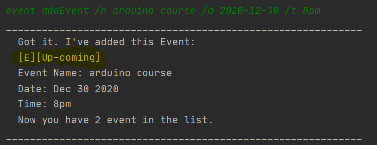  ->  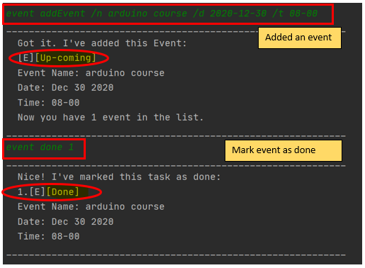

[Return to the top](#user-guide)

#### Search for an Event `search`
Search for a particular event by name or date.
Format: 'event search /s KEYWORD'  

Example of usage:
`event search /s arduino course`
`event search /s 2000-12-16`

Expected Outcome:

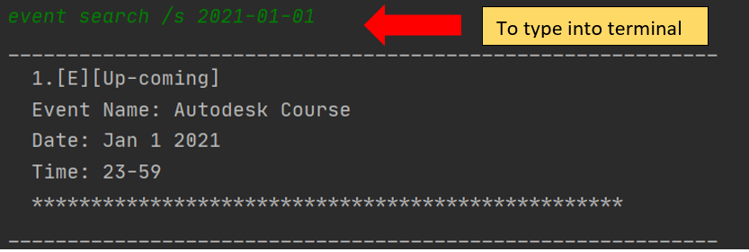 

[Return to the top](#user-guide)

#### Add a participant to an event: `addAttendance`
Adds an event to the list of events. 
Format: `event addAttendance /n EVENT_NAME /m MEMBER_NAME` 
> :information_source Both the `EVENT_NAME` and the `MEMBER_NAME` need to be added into the list of events and members prior to using this feature.  

Example of usage:  
 `event addAttendance /n arduino course /m peter` 
 `event addAttendance /n Autodesk course /m John` 
 
Expected Outcome:

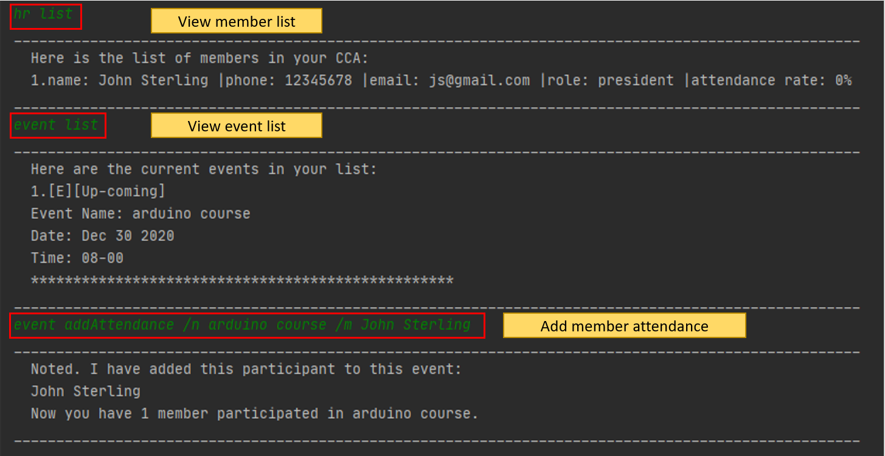

[Return to the top](#user-guide)
 
#### Delete a participant from an event: `delAttendance`
 Deletes a participant from an event in the list of events.  
 Format: `event delAttendance /n EVENT_NAME /m MEMBER_NAME`  
 
 Example of usage: 
 `event delAttendance /n arduino course /m peter` 
 `event delAttendance /n Autodesk course /m John` 
 
 Expected Outcome: 
 
 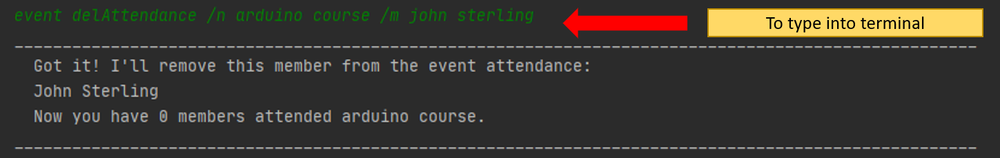
 
 [Return to the top](#user-guide)

#### List participants in an event: `listAttendance`
Prints the list of participants in an event, based on the order in which they are added into the list. 
Format: `event listAttendance /n EVENT_NAME`  

Example of usage: 
`event listAttendance /n arduino course`

Expected Outcome:

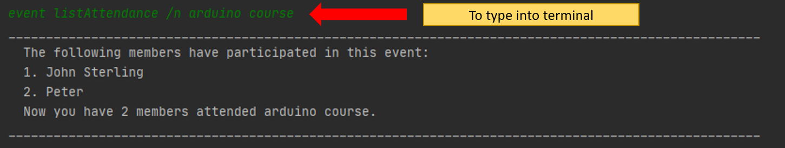

[Return to the top](#user-guide)

### 4.5 Finance features `finance`  
#### 4.5.1 Add finance log entry: `addLog`  
Adds an entry into the finance log.  
Format: `finance addLog ITEM_NAME ITEM_VALUE`  

Example of usage:  
`finance addLog have lunch 4.5`  
`f addlog buy flight ticket 750`  

Expected outcomes:  
  

  

[Return to the top](#user-guide)  

#### 4.5.2 Delete finance log entry: `delLog`  
Removes an entry from finance log.  
Format: `finance delLog ITEM_INDEX`  

Example of usage:  
`finance dellog 3`  
`f delLog 1`  

Expected outcomes:  
  

  

[Return to the top](#user-guide)  

#### 4.5.3 View financial summary: `summary`  
Brings up a summary of the financial log and shows the total amount of money expended.  
Format: `finance summary`  

Example of usage:  
`finance summary`  

Expected utcome:  
  

#### 4.5.4 Change finance log entry information: `changeLog`  
Change the finance log entry's name and budget amount.  
Format: `finance changeLog /i INDEX /n ITEM_NAME ITEM_VALUE`  

Example of usage:  
`finance changeLog /i 1 /n buy cake 5.5`  

Expected outcome:  
  

### 4.6 Import

You can import data from other existing CSVs quickly with the import command  
Format: `import FILENAME /c finance /name HEADER_NAME /value HEADER_NAME`  
OR `import FILENAME /c hr /name HEADER_NAME /phone HEADER_NAME /email HEADER_NAME /role HEADER_NAME`  
OR `import FILENAME /c event /name HEADER_NAME /date HEADER_NAME /time HEADER_NAME`

This command allows you to specify which columns of your CSV file you would like to copy over to the program.  

Example: Let's say you have a CSV file like shown below, and you would like to import it.    
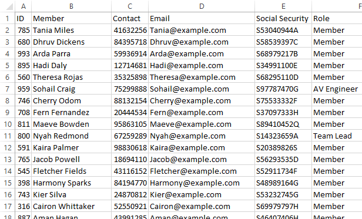  
In our example, the CSV file we are importing is in the same directory as CCA Manager.  
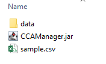  
You can use the command `import sample.csv /c hr /name Member /phone Contact /email Email /role Role` to import the document.  

The expected outcome is as follows:  

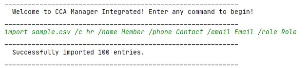  

[Return to the top](#user-guide)

## 5. FAQ

## 6. Command Summary

Command | Format | Example
------- | ---------- | ------------
addAttendance  | `event addAttendance /n EVENT_NAME /p MEMBER_NAME` | `event addAttendance /n arduino course /m Peter` 
addMember  | `hr addMember /n NAME /p PHONE_NUMBER /e EMAIL /r ROLE` | `hr addMember /n Harry /p 12345678 /e HP@gmail.com /r member` 
addEvent | `event addEvent /n EVENT_NAME /d EVENT_DATE /t EVENT_TIME` | `event addEvent /n arduino course /d 2020-09-16 /t 8pm` 
addLog | `finance addLog ITEM_NAME ITEM_VALUE` | `finance addLog have lunch 4.5`
bye | `bye` | -
changeInfo | `hr changeInfo /n MEMBER_NAME (/p PHONE_NUMBER) (/e EMAIL) (/r MEMBER_ROLE)` | `hr changeInfo /n Jack /p 12345678 /r president`  
changeLog | `finance changeLog /i INDEX /n ITEM_NAME ITEM_VALUE` | `finance changeLog /i 1 /n buy cake 5.5`
delAttendance  | `event delAttendance /n EVENT_NAME /p MEMBER_NAME` | `event delAttendance /n arduino course /m Peter` 
delMember  | `hr delMember MEMBER_INDEX` | `hr delMember 1`
delEvent | `event delEvent EVENT_INDEX`  | `event delEvent 1`
delEvent all | `event delEvent all` | -
delLog | `finance delLog ITEM_INDEX` | `finance delLog 3`
event done   | `event done EVENT_INDEX`| `event done 2`
event search | `event search /s <KEYWORD>` | `event search /s arduino` 
event countdown | `event countdown` | -
help | `help` | -
hr search | `hr search ITEM (/n ITEM) (/p ITEM) (/e ITEM) (/r ITEM)` | `hr search /n Peter /r president`
import  | `import FILENAME /c CATEGORY (...)` | `import sample.csv /c hr /name Member /phone Contact /email Email /role Role`
listAttendance | `event listAttendance /n EVENT_NAME` | `event listAttendance /n arduino course`
listMember  | `hr listMember` | -
listEvent | `event listEvent` | -
list prof&admin | `hr list prof&admin` | -
list connections | `hr list connections` | -
summary | `finance summary` |   -

[Return to the top](#user-guide)

## 7. Glossary

