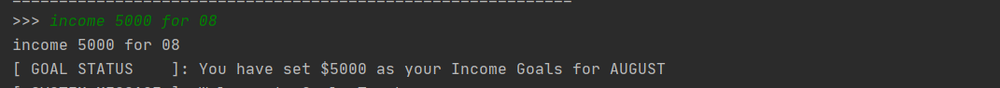
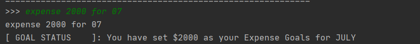
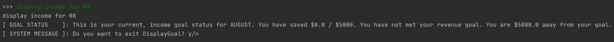
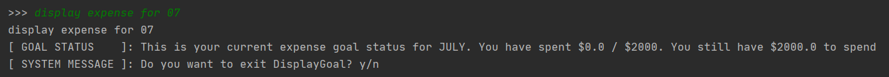
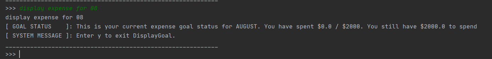
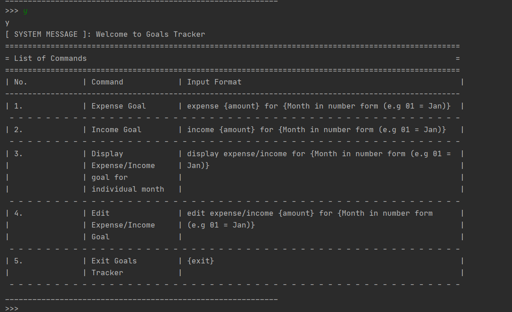
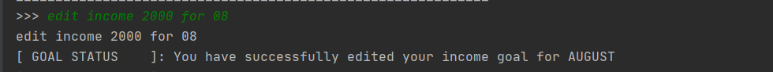
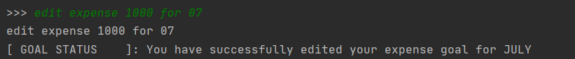

# FinanceIt: A finance management application with a CLI Interface.
FinanceIt is an all-in-one desktop application that handles the finance tracking needs of university students who are comfortable with a CLI interface.
It includes 5 different finance tools, all of which take in typed commands from the users to execute their respective functions.
## Setting up for Testers (IMPORTANT)

Prerequisites: A computer
1. Download the executable from our [latest release](https://github.com/AY2021S1-CS2113-T16-1/tp/releases/) .
1. Save the executable file in your preferred folder.
1. Run the program via the command line. The command is: ```java -jar financeit.jar```.
## Setting up in Intellij

Prerequisites: JDK 11, update Intellij to the most recent version.
1. Download the latest release from the release page.
1. Open Intellij (if you are not in the welcome screen, click `File` > `Close Project` to close the existing project dialog first)
1. Set up the correct JDK version, as follows:
   1. Click `Configure` > `Structure for New Projects` and then `Project Settings` > `Project` > `Project SDK`
   1. If JDK 11 is listed in the drop down, select it. If it is not, click `New...` and select the directory where you installed JDK 11
   1. Click `OK`
1. Import the project into Intellij as follows:
   1. Click `Open or Import`.
   1. Select the project directory, and click `OK`
   1. If there are any further prompts, accept the defaults.
1. After the importing is complete, locate the `src/main/java/Duke.java` file, right-click it, and choose `Run Duke.main()`. If the setup is correct, you should see something like the below:
   ```
    Status: 
    =====================================================================================================
    = Welcome to Main Menu                                                                              =
    =====================================================================================================
    | No.            |  Feature                                           |  Commands                    |
    -----------------------------------------------------------------------------------------------------
    | [1]            |  Manual Income/Expense Tracker                     |  manual                      |
     - - - - - - - - - - - - - - - - - - - - - - - - - - - - - - - - - - - - - - - - - - - - - - - - - -
    | [2]            |  Recurring Income/Expense Tracker                  |  recur                       |
     - - - - - - - - - - - - - - - - - - - - - - - - - - - - - - - - - - - - - - - - - - - - - - - - - -
    | [3]            |  Account Summary                                   |  acc                         |
     - - - - - - - - - - - - - - - - - - - - - - - - - - - - - - - - - - - - - - - - - - - - - - - - - -
    | [4]            |  Goals Tracker                                     |  goal                        |
     - - - - - - - - - - - - - - - - - - - - - - - - - - - - - - - - - - - - - - - - - - - - - - - - - -
    | [5]            |  Financial Calculator                              |  financial                   |
     - - - - - - - - - - - - - - - - - - - - - - - - - - - - - - - - - - - - - - - - - - - - - - - - - -
    | [6]            |  Toggle Log On or Off                              | logger                       |
     - - - - - - - - - - - - - - - - - - - - - - - - - - - - - - - - - - - - - - - - - - - - - - - - - -
    | [7]            |  Quit The Program                                  |  exit                        |
     - - - - - - - - - - - - - - - - - - - - - - - - - - - - - - - - - - - - - - - - - - - - - - - - - -
    ____________________________________________________________
    >>> 
   ```
   
# Features : Main Menu
Gateway to the various other features of the application. 
Users can enter an input to access the application they wish to use.

## Main Menu 1: Exit
Exits from the program. If you have an outstanding list, it will be saved automatically as lastSave.txt in
the saveStates folder. This folder will be automatically created when you first run the program.

>Syntax

    exit

> Example: 

       ||====================================================================||
       ||||$||||||||||||||||||||||||||||||||||||||||||||||||||||||||||||||$||||
       ||(100)==================|     Welcome to       |================(100)||
       ||||$||        ~         '------========--------'                ||$||||
       ||<< |        |$|              || ____ ||                         | >>||
       ||>>|  12    ||L||            || ///..) ||         L38036133B   12 |<<||
       ||<<|        || ||           || <||  >)  ||                        |>>||
       ||>>|         |$|            ||  $$ --)  ||        One Hundred     |<<||
    ||====================================================================||>||
    ||||$||||||||||||||||||||||||||||||||||||||||||||||||||||||||||||||$||||>||
    ||(100)==================|     FinanceIt!       |================(100)||>||
    ||||$||        ~         '------========--------'                ||$||||>||
    ||<< |        |$|              || ____ ||                         | >>||)||
    ||>>|  12    ||L||            || ///..) ||         L38036133B   12 |<<||/||
    ||<<|        || ||           || <||  >)  ||                        |>>||=||
    ||>>|         |$|            ||  $$ --)  ||        One Hundred     |<<||
    ||<<|      L38036133B        *||  |(_)  ||* series                 |>>||
    ||>>|  12                     *||(___)_||*   1989                  |<<||
    ||<<|      Treasurer     ______(  V2.0   )________     Secretary 12 |>>||
    ||||$|                 ~| A finanace tracking app |~               |$||||
    ||(100)===================  ONE HUNDRED DOLLARS =================(100)||
    ||||$||||||||||||||||||||||||||||||||||||||||||||||||||||||||||||||$//||
    ||====================================================================||
    Status: 
    =====================================================================================================
    = Welcome to Main Menu                                                                              =
    =====================================================================================================
    | No.            |  Feature                                           |  Commands                    |
    -----------------------------------------------------------------------------------------------------
    | [1]            |  Manual Income/Expense Tracker                     |  manual                      |
     - - - - - - - - - - - - - - - - - - - - - - - - - - - - - - - - - - - - - - - - - - - - - - - - - -
    | [2]            |  Recurring Income/Expense Tracker                  |  recur                       |
     - - - - - - - - - - - - - - - - - - - - - - - - - - - - - - - - - - - - - - - - - - - - - - - - - -
    | [3]            |  Account Summary                                   |  acc                         |
     - - - - - - - - - - - - - - - - - - - - - - - - - - - - - - - - - - - - - - - - - - - - - - - - - -
    | [4]            |  Goals Tracker                                     |  goal                        |
     - - - - - - - - - - - - - - - - - - - - - - - - - - - - - - - - - - - - - - - - - - - - - - - - - -
    | [5]            |  Financial Calculator                              |  financial                   |
     - - - - - - - - - - - - - - - - - - - - - - - - - - - - - - - - - - - - - - - - - - - - - - - - - -
    | [6]            |  Save Manager                                      |  saver                       |
     - - - - - - - - - - - - - - - - - - - - - - - - - - - - - - - - - - - - - - - - - - - - - - - - - -
    | [7]            |  Toggle Log On or Off                              |  logger                      |
     - - - - - - - - - - - - - - - - - - - - - - - - - - - - - - - - - - - - - - - - - - - - - - - - - -
    | [8]            |  Quit The Program                                  |  exit                        |
     - - - - - - - - - - - - - - - - - - - - - - - - - - - - - - - - - - - - - - - - - - - - - - - - - -
    ____________________________________________________________
    >>> exit
    exit

## Main Menu 2: Logger
Toggle Logger mode. Developers can toggle it on view more system messages and logs that are otherwise hidden from view.

>Syntax

    logger

> Example: 

    ____________________________________________________________
    >>> logger


       ||====================================================================||
       ||||$||||||||||||||||||||||||||||||||||||||||||||||||||||||||||||||$||||
       ||(100)==================|     Welcome to       |================(100)||
       ||||$||        ~         '------========--------'                ||$||||
       ||<< |        |$|              || ____ ||                         | >>||
       ||>>|  12    ||L||            || ///..) ||         L38036133B   12 |<<||
       ||<<|        || ||           || <||  >)  ||                        |>>||
       ||>>|         |$|            ||  $$ --)  ||        One Hundred     |<<||
    ||====================================================================||>||
    ||||$||||||||||||||||||||||||||||||||||||||||||||||||||||||||||||||$||||>||
    ||(100)==================|     FinanceIt!       |================(100)||>||
    ||||$||        ~         '------========--------'                ||$||||>||
    ||<< |        |$|              || ____ ||                         | >>||)||
    ||>>|  12    ||L||            || ///..) ||         L38036133B   12 |<<||/||
    ||<<|        || ||           || <||  >)  ||                        |>>||=||
    ||>>|         |$|            ||  $$ --)  ||        One Hundred     |<<||
    ||<<|      L38036133B        *||  |(_)  ||* series                 |>>||
    ||>>|  12                     *||(___)_||*   1989                  |<<||
    ||<<|      Treasurer     ______(  V2.0   )________     Secretary 12 |>>||
    ||||$|                 ~| A finanace tracking app |~               |$||||
    ||(100)===================  ONE HUNDRED DOLLARS =================(100)||
    ||||$||||||||||||||||||||||||||||||||||||||||||||||||||||||||||||||$//||
    ||====================================================================||
    Status: Logger is on.
    =====================================================================================================
    = Welcome to Main Menu                                                                              =
    =====================================================================================================
    | No.            |  Feature                                           |  Commands                    |
    -----------------------------------------------------------------------------------------------------
    | [1]            |  Manual Income/Expense Tracker                     |  manual                      |
     - - - - - - - - - - - - - - - - - - - - - - - - - - - - - - - - - - - - - - - - - - - - - - - - - -
    | [2]            |  Recurring Income/Expense Tracker                  |  recur                       |
     - - - - - - - - - - - - - - - - - - - - - - - - - - - - - - - - - - - - - - - - - - - - - - - - - -
    | [3]            |  Account Summary                                   |  acc                         |
     - - - - - - - - - - - - - - - - - - - - - - - - - - - - - - - - - - - - - - - - - - - - - - - - - -
    | [4]            |  Goals Tracker                                     |  goal                        |
     - - - - - - - - - - - - - - - - - - - - - - - - - - - - - - - - - - - - - - - - - - - - - - - - - -
    | [5]            |  Financial Calculator                              |  financial                   |
     - - - - - - - - - - - - - - - - - - - - - - - - - - - - - - - - - - - - - - - - - - - - - - - - - -
    | [6]            |  Save Manager                                      |  saver                       |
     - - - - - - - - - - - - - - - - - - - - - - - - - - - - - - - - - - - - - - - - - - - - - - - - - -
    | [7]            |  Toggle Log On or Off                              |  logger                      |
     - - - - - - - - - - - - - - - - - - - - - - - - - - - - - - - - - - - - - - - - - - - - - - - - - -
    | [8]            |  Quit The Program                                  |  exit                        |
     - - - - - - - - - - - - - - - - - - - - - - - - - - - - - - - - - - - - - - - - - - - - - - - - - -
    ____________________________________________________________
    >>>
    
# Features : Manual Tracker
Users can manage their daily entries of expenses/ income, which is organised in ledgers representing each day of transactions.

## Manual Tracker 1: Add ledger
Add a ledger to the record, representing a date.

>Syntax

    ledger new <param type> <parameter> 
        <param type> @ /date: Date of the ledger, and all the entries under that ledger.
            <parameter:String>: Input string of the date in YYMMDD or YY*MM*DD.

> Example: 

    example
    
## Manual Tracker 2: Remove ledger
Remove a specified ledger from the record, referenced by date or id on the list.

>Syntax
 
    ledger delete <param type> <parameter> 
        <param type> @ /date: Date of the ledger, and all the entries under that ledger.
            <parameter:String>: Input string of the date in YYMMDD or YY*MM*DD.
        <param type> @ /id: Index of the ledger on the ledger list.
            <parameter:Integer>: Input number that is between 1 and the last index in the ledger list.
        Note that either /date or /id is supplied.

> Example: 

    ==================================
    = List of Ledgers                =
    ==================================
    | Ledger Number  | Ledger Date    |
    ----------------------------------
    | 1              | 2020-04-04     |
     - - - - - - - - - - - - - - - - -
    | 2              | 2020-05-04     |
     - - - - - - - - - - - - - - - - -
    [ DIR            ]: [ MAIN_MENU -> MANUAL_TRACKER_MENU ]
    [ TODO           ]: Enter a command! 
                        Input "commands" for list of commands.
    ____________________________________________________________
    >>> ledger delete /id 2


    [ SYSTEM MESSAGE ]: Ledger 2 : [ May 4 2020 ] deleted!
    [ DIR            ]: [ MAIN_MENU -> MANUAL_TRACKER_MENU ]
    [ TODO           ]: Enter a command! 
                        Input "commands" for list of commands.
    ____________________________________________________________
    >>> ledger list


    ==================================
    = List of Ledgers                =
    ==================================
    | Ledger Number  | Ledger Date    |
    ----------------------------------
    | 1              | 2020-04-04     |
     - - - - - - - - - - - - - - - - -
    [ DIR            ]: [ MAIN_MENU -> MANUAL_TRACKER_MENU ]
    [ TODO           ]: Enter a command! 
                        Input "commands" for list of commands.
    ____________________________________________________________
    >>>
    
## Manual Tracker 3: Open ledger
Users will gain access into the entries associated with the specified ledger.
If the ledger do not exist, it will be created only if the param type supplied is "/date". This results in creation of the ledger instance
in accordance to the date supplied.
Tracker switches mode to track entries in the ledger that has been opened.
Refer to Feature Entry Tracker onwards for instructions concerned with the 
state of the application following this command.

>Syntax

    ledger open <param type> <parameter> 
        <param type> @ /date: Date of the ledger, and all the entries under that ledger.
            <parameter:String>: Input string of the date in YYMMDD or YY*MM*DD.
        <param type> @ /id: Index of the ledger on the ledger list.
            <parameter:Integer>: Input number that is between 1 and the last index in the ledger list.

> Example: 

    [ DIR            ]: [ MAIN_MENU -> MANUAL_TRACKER_MENU ]
    [ TODO           ]: Enter a command! 
                        Input "commands" for list of commands.
    ____________________________________________________________
    >>> ledger open /date 200404


    [ SYSTEM MESSAGE ]: Ledger 1 : [ Apr 4 2020 ] opened!
    [ DIR            ]: [ MAIN_MENU -> MANUAL_TRACKER_MENU -> ENTRY_TRACKER (LEDGER 2020-04-04)
    [ SYSTEM MESSAGE ]: You are now in entry tracker for ledger [2020-04-04]!
                        Enter command!
                        Input "commands" for list of commands.
    ____________________________________________________________
    >>>
    
## Manual Tracker 4: Show ledger list
Shows the record of ledgers that has been added.

>Syntax

    ledger list

> Example: 

    [ SYSTEM MESSAGE ]: Ledger 2 : [ May 4 2020 ] created!
    [ DIR            ]: [ MAIN_MENU -> MANUAL_TRACKER_MENU ]
    [ TODO           ]: Enter a command! 
                        Input "commands" for list of commands.
    ____________________________________________________________
    >>> ledger list


    ==================================
    = List of Ledgers                =
    ==================================
    | Ledger Number  | Ledger Date    |
    ----------------------------------
    | 1              | 2020-04-04     |
    - - - - - - - - - - - - - - - - -
    | 2              | 2020-05-04     |
    - - - - - - - - - - - - - - - - -

## Manual Tracker 4: Print command list
Prints available commands that users can enter in for manualTracker.

>Syntax

    commands

> Example: 

    [ SYSTEM MESSAGE ]: Welcome to Manual Tracker!
    [ DIR            ]: [ MAIN_MENU -> MANUAL_TRACKER_MENU ]
    [ TODO           ]: Enter a command! 
                        Input "commands" for list of commands.
    ____________________________________________________________
    >>> commands


    ======================================================================
    = List of Commands                                                   =
    ======================================================================
    | No.            | Command            | Input Format                  |
    ----------------------------------------------------------------------
    | 1.             | Open ledger        | ledger open /date {YYMMDD}    |
    - - - - - - - - - - - - - - - - - - - - - - - - - - - - - - - - - - -
    | 2.             | New ledger         | ledger new /date {YYMMDD}     |
    - - - - - - - - - - - - - - - - - - - - - - - - - - - - - - - - - - -
    | 3.             | list ledgers       | ledger list                   |
    - - - - - - - - - - - - - - - - - - - - - - - - - - - - - - - - - - -
    | 4.             | delete ledgers     | ledger delete /date {YYMMDD}  |
    - - - - - - - - - - - - - - - - - - - - - - - - - - - - - - - - - - -
    | 5.             | exit to main menu  | exit                          |
    - - - - - - - - - - - - - - - - - - - - - - - - - - - - - - - - - - -
    
## Manual Tracker 5: Exit to Main Menu
Exit to main menu where users can choose another feature to use.

>Syntax

    exit

> Example: 
    
    [ DIR            ]: [ MAIN_MENU -> MANUAL_TRACKER_MENU ]
    [ TODO           ]: Enter a command! 
                        Input "commands" for list of commands.
    ____________________________________________________________
    >>> exit


    [ SYSTEM MESSAGE ]: Exiting from ManualTracker


       ||====================================================================||
       ||||$||||||||||||||||||||||||||||||||||||||||||||||||||||||||||||||$||||
       ||(100)==================|     Welcome to       |================(100)||
       ||||$||        ~         '------========--------'                ||$||||
       ||<< |        |$|              || ____ ||                         | >>||
       ||>>|  12    ||L||            || ///..) ||         L38036133B   12 |<<||
       ||<<|        || ||           || <||  >)  ||                        |>>||
       ||>>|         |$|            ||  $$ --)  ||        One Hundred     |<<||
    ||====================================================================||>||
    ||||$||||||||||||||||||||||||||||||||||||||||||||||||||||||||||||||$||||>||
    ||(100)==================|     FinanceIt!       |================(100)||>||
    ||||$||        ~         '------========--------'                ||$||||>||
    ||<< |        |$|              || ____ ||                         | >>||)||
    ||>>|  12    ||L||            || ///..) ||         L38036133B   12 |<<||/||
    ||<<|        || ||           || <||  >)  ||                        |>>||=||
    ||>>|         |$|            ||  $$ --)  ||        One Hundred     |<<||
    ||<<|      L38036133B        *||  |(_)  ||* series                 |>>||
    ||>>|  12                     *||(___)_||*   1989                  |<<||
    ||<<|      Treasurer     ______(  V2.0   )________     Secretary 12 |>>||
    ||||$|                 ~| A finanace tracking app |~               |$||||
    ||(100)===================  ONE HUNDRED DOLLARS =================(100)||
    ||||$||||||||||||||||||||||||||||||||||||||||||||||||||||||||||||||$//||
    ||====================================================================||
    Status: 
    =====================================================================================================
    = Welcome to Main Menu                                                                              =
    =====================================================================================================
    | No.            |  Feature                                           |  Commands                    |
    -----------------------------------------------------------------------------------------------------
    | [1]            |  Manual Income/Expense Tracker                     |  manual                      |
     - - - - - - - - - - - - - - - - - - - - - - - - - - - - - - - - - - - - - - - - - - - - - - - - - -
    | [2]            |  Recurring Income/Expense Tracker                  |  recur                       |
     - - - - - - - - - - - - - - - - - - - - - - - - - - - - - - - - - - - - - - - - - - - - - - - - - -
    | [3]            |  Account Summary                                   |  acc                         |
     - - - - - - - - - - - - - - - - - - - - - - - - - - - - - - - - - - - - - - - - - - - - - - - - - -
    | [4]            |  Goals Tracker                                     |  goal                        |
     - - - - - - - - - - - - - - - - - - - - - - - - - - - - - - - - - - - - - - - - - - - - - - - - - -
    | [5]            |  Financial Calculator                              |  financial                   |
     - - - - - - - - - - - - - - - - - - - - - - - - - - - - - - - - - - - - - - - - - - - - - - - - - -
    | [6]            |  Save Manager                                      |  saver                       |
     - - - - - - - - - - - - - - - - - - - - - - - - - - - - - - - - - - - - - - - - - - - - - - - - - -
    | [7]            |  Toggle Log On or Off                              |  logger                      |
     - - - - - - - - - - - - - - - - - - - - - - - - - - - - - - - - - - - - - - - - - - - - - - - - - -
    | [8]            |  Quit The Program                                  |  exit                        |
     - - - - - - - - - - - - - - - - - - - - - - - - - - - - - - - - - - - - - - - - - - - - - - - - - -
    ____________________________________________________________
    >>>


    
# Features : Entry Tracker
Subroutine that is subsidiary off the ManualTracker. 
Users can manage entries associated with the ledger they have opened.

## Entry Tracker 1: Add entry
Add an entry to the ledger record.

>Syntax

    entry add <param type> <parameter> 
        <param type> @ /time: Time of entry
            <parameter:String>: Input string of the time in HHMM or HH*MM*SS.
        <param type> @ /amt: Amount associated with the entry, in $.
            <parameter:Double>: Amount of money in at most 2 decimal places.
        <param type> @ /desc: Details of the transaction that users can refer to when they view the list.
            <parameter:String>: Input string of the description of the transaction.
        <param type> @ /cat: Category of transaction
            <parameter:String>: {tpt, fd, tvl, shp, bll, slr, alw}
                                Only the above strings are allowed for entries. 
                                They represent shortcuts to recognised entry categories that were specified 
                                within the application.
        <param type> @ -i/-e: Represents income and expenses for the entry type.
> Example: 

    [ DIR            ]: [ MAIN_MENU -> MANUAL_TRACKER_MENU -> ENTRY_TRACKER (LEDGER 2020-04-04)
    [ SYSTEM MESSAGE ]: You are now in entry tracker for ledger [2020-04-04]!
                        Enter command!
                        Input "commands" for list of commands.
    ____________________________________________________________
    >>> entry new /time 1500 /desc Go to the poll -i /cat tpt /amt 1501


    [ SYSTEM MESSAGE ]: Entry 2 : [ 15:00 ] [ Go to the poll ] created!
    [ DIR            ]: [ MAIN_MENU -> MANUAL_TRACKER_MENU -> ENTRY_TRACKER (LEDGER 2020-04-04)
    [ SYSTEM MESSAGE ]: You are now in entry tracker for ledger [2020-04-04]!
                        Enter command!
                        Input "commands" for list of commands.
    ____________________________________________________________
    >>>

## Entry Tracker 2: Edit entry
Add an entry to the ledger record.
Users only need specify the param to edit, there is no need to fill out all params.
Parameter 1 is however compulsory, as there is a need to reference a particular entry.

>Syntax

    entry edit <param type 1> <parameter 1> <param type> <parameter> 
        <param type 1> @ /id: Index of the ledger in the entry list to edit.
            <parameter 1:Integer>: Input number that is between 1 and the last index in the entry list.
        <param type> @ /time: Time of entry
            <parameter:String>: Input string of the time in HHMM or HH*MM*SS.
        <param type> @ /amt: Amount associated with the entry, in $.
            <parameter:Double>: Amount of money in at most 2 decimal places.
        <param type> @ /desc: Details of the transaction that users can refer to when they view the list.
            <parameter:String>: Input string of the description of the transaction.
        <param type> @ /cat: Category of transaction
            <parameter:String>: {tpt, fd, tvl, shp, bll, slr, alw}
                                Only the above strings are allowed for entries. 
                                They represent shortcuts to recognised entry categories that were specified 
                                within the application.
        <param type> @ -i/-e: Represents income and expenses for the entry type.
        
> Example: 

    ======================================================================================================================
    = List of Entries for Ledger [2020-04-04]                                                                            =
    ======================================================================================================================
    | Entry Number   | Entry Type     | Category       | Amount         | Time           | Description                    |
    ----------------------------------------------------------------------------------------------------------------------
    | 1              | Income         | TRANSPORT      | $1500.00       | 15:00          | Go to the poll                 |
     - - - - - - - - - - - - - - - - - - - - - - - - - - - - - - - - - - - - - - - - - - - - - - - - - - - - - - - - - - -


    [ DIR            ]: [ MAIN_MENU -> MANUAL_TRACKER_MENU -> ENTRY_TRACKER (LEDGER 2020-04-04)
    [ SYSTEM MESSAGE ]: You are now in entry tracker for ledger [2020-04-04]!
                        Enter command!
                        Input "commands" for list of commands.
    ____________________________________________________________
    >>> entry edit /id 1 /time 1600


    [ SYSTEM MESSAGE ]: Entry 1 : [ 16:00 ] [ Go to the poll ] edited!
    [ DIR            ]: [ MAIN_MENU -> MANUAL_TRACKER_MENU -> ENTRY_TRACKER (LEDGER 2020-04-04)
    [ SYSTEM MESSAGE ]: You are now in entry tracker for ledger [2020-04-04]!
                        Enter command!
                        Input "commands" for list of commands.
    ____________________________________________________________
    >>> entry list
    
    ======================================================================================================================
    = List of Entries for Ledger [2020-04-04]                                                                            =
    ======================================================================================================================
    | Entry Number   | Entry Type     | Category       | Amount         | Time           | Description                    |
    ----------------------------------------------------------------------------------------------------------------------
    | 1              | Income         | TRANSPORT      | $1500.00       | 16:00          | Go to the poll                 |
     - - - - - - - - - - - - - - - - - - - - - - - - - - - - - - - - - - - - - - - - - - - - - - - - - - - - - - - - - - -

    
## Entry Tracker 3: Remove entry
Remove a specified entry from the record, referenced by id on the list.

>Syntax

    entry delete <param type> <parameter> 
        <param type> @ /id: Index of the ledger in the entry list.
            <parameter:Integer>: Input number that is between 1 and the last index in the entry list.

> Example: 

    ======================================================================================================================
    = List of Entries for Ledger [2020-04-04]                                                                            =
    ======================================================================================================================
    | Entry Number   | Entry Type     | Category       | Amount         | Time           | Description                    |
    ----------------------------------------------------------------------------------------------------------------------
    | 1              | Income         | TRANSPORT      | $1500.00       | 16:00          | Go to the poll                 |
     - - - - - - - - - - - - - - - - - - - - - - - - - - - - - - - - - - - - - - - - - - - - - - - - - - - - - - - - - - -
    | 2              | Income         | TRANSPORT      | $1501.00       | 15:00          | Go to the poll                 |
     - - - - - - - - - - - - - - - - - - - - - - - - - - - - - - - - - - - - - - - - - - - - - - - - - - - - - - - - - - -
    | 3              | Income         | TRANSPORT      | $1503.00       | 15:00          | Go to the poll where           |
    |                |                |                |                |                | 1.the rainbow used to be nice  |
    |                |                |                |                |                | 2. and colorful, haha          |
     - - - - - - - - - - - - - - - - - - - - - - - - - - - - - - - - - - - - - - - - - - - - - - - - - - - - - - - - - - -
    | 4              | Income         | TRANSPORT      | $1501.00       | 15:00          | Go to the pole                 |
     - - - - - - - - - - - - - - - - - - - - - - - - - - - - - - - - - - - - - - - - - - - - - - - - - - - - - - - - - - -
    [ DIR            ]: [ MAIN_MENU -> MANUAL_TRACKER_MENU -> ENTRY_TRACKER (LEDGER 2020-04-04)
    [ SYSTEM MESSAGE ]: You are now in entry tracker for ledger [2020-04-04]!
                        Enter command!
                        Input "commands" for list of commands.
    ____________________________________________________________
    >>> entry delete /id 1


    [ SYSTEM MESSAGE ]: Entry 1 : [ 16:00 ] [ Go to the poll ] deleted!
    [ DIR            ]: [ MAIN_MENU -> MANUAL_TRACKER_MENU -> ENTRY_TRACKER (LEDGER 2020-04-04)
    [ SYSTEM MESSAGE ]: You are now in entry tracker for ledger [2020-04-04]!
                        Enter command!
                        Input "commands" for list of commands.
    ____________________________________________________________
    >>> entry list


    ======================================================================================================================
    = List of Entries for Ledger [2020-04-04]                                                                            =
    ======================================================================================================================
    | Entry Number   | Entry Type     | Category       | Amount         | Time           | Description                    |
    ----------------------------------------------------------------------------------------------------------------------
    | 1              | Income         | TRANSPORT      | $1501.00       | 15:00          | Go to the poll                 |
     - - - - - - - - - - - - - - - - - - - - - - - - - - - - - - - - - - - - - - - - - - - - - - - - - - - - - - - - - - -
    | 2              | Income         | TRANSPORT      | $1503.00       | 15:00          | Go to the poll where           |
    |                |                |                |                |                | 1.the rainbow used to be nice  |
    |                |                |                |                |                | 2. and colorful, haha          |
     - - - - - - - - - - - - - - - - - - - - - - - - - - - - - - - - - - - - - - - - - - - - - - - - - - - - - - - - - - -
    | 3              | Income         | TRANSPORT      | $1501.00       | 15:00          | Go to the pole                 |
     - - - - - - - - - - - - - - - - - - - - - - - - - - - - - - - - - - - - - - - - - - - - - - - - - - - - - - - - - - -

    
## Entry Tracker 4: Show entry list
Shows the record of entries that has been added.

>Syntax

    entry list

> Example: 

    [ SYSTEM MESSAGE ]: Entry 1 : [ 16:00 ] [ Go to the poll ] deleted!
    [ DIR            ]: [ MAIN_MENU -> MANUAL_TRACKER_MENU -> ENTRY_TRACKER (LEDGER 2020-04-04)
    [ SYSTEM MESSAGE ]: You are now in entry tracker for ledger [2020-04-04]!
                        Enter command!
                        Input "commands" for list of commands.
    ____________________________________________________________
    >>> entry list


    ======================================================================================================================
    = List of Entries for Ledger [2020-04-04]                                                                            =
    ======================================================================================================================
    | Entry Number   | Entry Type     | Category       | Amount         | Time           | Description                    |
    ----------------------------------------------------------------------------------------------------------------------
    | 1              | Income         | TRANSPORT      | $1501.00       | 15:00          | Go to the poll                 |
     - - - - - - - - - - - - - - - - - - - - - - - - - - - - - - - - - - - - - - - - - - - - - - - - - - - - - - - - - - -
    | 2              | Income         | TRANSPORT      | $1503.00       | 15:00          | Go to the poll where           |
    |                |                |                |                |                | 1.the rainbow used to be nice  |
    |                |                |                |                |                | 2. and colorful, haha          |
     - - - - - - - - - - - - - - - - - - - - - - - - - - - - - - - - - - - - - - - - - - - - - - - - - - - - - - - - - - -
    | 3              | Income         | TRANSPORT      | $1501.00       | 15:00          | Go to the pole                 |
     - - - - - - - - - - - - - - - - - - - - - - - - - - - - - - - - - - - - - - - - - - - - - - - - - - - - - - - - - - -

## Entry Tracker 5: Print command list
Prints available commands that users can enter in for manualTracker.

>Syntax

    commands

> Example: 

    [ SYSTEM MESSAGE ]: Ledger 1 : [ Apr 4 2020 ] opened!
    [ DIR            ]: [ MAIN_MENU -> MANUAL_TRACKER_MENU -> ENTRY_TRACKER (LEDGER 2020-04-04)
    [ SYSTEM MESSAGE ]: You are now in entry tracker for ledger [2020-04-04]!
                        Enter command!
                        Input "commands" for list of commands.
    ____________________________________________________________
    >>> commands


    ========================================================================================================
    = List of Commands                                                                                     =
    ========================================================================================================
    | No.            | Command                 | Input Format                                               |
    --------------------------------------------------------------------------------------------------------
    | 1.             | New entry               | entry new /time {HHMM} /desc {string} /cat {category}      |
    |                |                         | -[i/e]                                                     |
     - - - - - - - - - - - - - - - - - - - - - - - - - - - - - - - - - - - - - - - - - - - - - - - - - - - -
    | 2.             | Edit entry              | entry edit /id {integer} {param-type/parameter to edit}    |
     - - - - - - - - - - - - - - - - - - - - - - - - - - - - - - - - - - - - - - - - - - - - - - - - - - - -
    | 3.             | list entries            | entry list                                                 |
     - - - - - - - - - - - - - - - - - - - - - - - - - - - - - - - - - - - - - - - - - - - - - - - - - - - -
    | 4.             | delete entry            | entry delete /id {integer}                                 |
     - - - - - - - - - - - - - - - - - - - - - - - - - - - - - - - - - - - - - - - - - - - - - - - - - - - -
    | 5.             | list transaction        | cat                                                        |
    |                | categories              |                                                            |
     - - - - - - - - - - - - - - - - - - - - - - - - - - - - - - - - - - - - - - - - - - - - - - - - - - - -
    | 6.             | exit to manual tracker  | exit                                                       |
     - - - - - - - - - - - - - - - - - - - - - - - - - - - - - - - - - - - - - - - - - - - - - - - - - - - -

## Entry Tracker 6: Print categories
Prints expenditure category shortcuts that the user can input in entry creation/ edit commands.

>Syntax

    cat

> Example: 

    [ DIR            ]: [ MAIN_MENU -> MANUAL_TRACKER_MENU -> ENTRY_TRACKER (LEDGER 2020-04-04)
    [ SYSTEM MESSAGE ]: You are now in entry tracker for ledger [2020-04-04]!
                        Enter command!
                        Input "commands" for list of commands.
    ____________________________________________________________
    >>> cat


    ==================================
    = List of Valid Categories       =
    ==================================
    | Category       | Input          |
    ----------------------------------
    | bll            | BILLS          |
     - - - - - - - - - - - - - - - - -
    | slr            | SALARY         |
     - - - - - - - - - - - - - - - - -
    | tpt            | TRANSPORT      |
     - - - - - - - - - - - - - - - - -
    | shp            | SHOPPING       |
     - - - - - - - - - - - - - - - - -
    | tvl            | TRAVEL         |
     - - - - - - - - - - - - - - - - -
    | alw            | ALLOWANCE      |
     - - - - - - - - - - - - - - - - -
    | fd             | FOOD           |
     - - - - - - - - - - - - - - - - -
    
## Entry Tracker 7: Exit to Manual Tracker main routine
Exit to Manual tracker where users can choose another ledger.

>Syntax

    exit

> Example: 

    [ DIR            ]: [ MAIN_MENU -> MANUAL_TRACKER_MENU -> ENTRY_TRACKER (LEDGER 2020-04-04)
    [ SYSTEM MESSAGE ]: You are now in entry tracker for ledger [2020-04-04]!
                        Enter command!
                        Input "commands" for list of commands.
    ____________________________________________________________
    >>> exit


    Exiting subroutine...
    [ DIR            ]: [ MAIN_MENU -> MANUAL_TRACKER_MENU ]
    [ TODO           ]: Enter a command! 
                        Input "commands" for list of commands.
    ____________________________________________________________
    >>>
    
#Features : Recurring Tracker
Users can manage expenses/income that recurs on a monthly basis e.g. monthly bill or salary.

## Recurring Tracker 1: Add entry
Creates a recurring entry. Entries can either be income or expense. If income, entries
can be set to "auto" which indicates that the income is automatically credited to the user's
bank account e.g. Salary which is transferred into bank account by company. 
Else, it will indicate a manually credited income, which requires the user to 
collect or take action upon e.g. collecting payment from customers (as a supplier), redeeming
of reward points on a monthly basis.

Vice versa for expense entries.

>Syntax

    add {-e OR -i} [-auto] /desc <DESCRIPTION> /amt <AMOUNT> /day <DAY_OF_MONTH> [/notes <NOTES>]
    
##Parameters
* `-e` OR `-i` - Indicates whether entry is income or expense (Mandatory to have 1 of 2)
* `-auto` - Whether entry is auto or manual (only serves as a reminder for user, 
is not linked to any functionality)
* `/desc` - Description of entry (Mandatory)
* `/amt` - Amount (Mandatory)
* `/day` - Day of month which entry occurs on (Mandatory)
* `/notes` - Additional notes and remarks

>Example
    
    add -e -auto /desc Netflix /amt 40 /day 2 /notes Cancel if Homemade ends
    //Netflix, $40 per month, auto-payment via credit card 
    on the 2nd of every month. Saved with a note of “Cancel if Homemade ends"
    
    add -i /desc Redeem air miles for vouchers /amt 50 /day 27
    //Redeem air miles for vouchers, $50 per month, user has to take manual action 
    on or by 27th of every month.
    
## Recurring Tracker 2: List all entries
Displays a list of all recurring entries.

>Syntax

    list
    
##Parameters
None
    
## Recurring Tracker 3: Delete entry
Deletes an entry at the given index. Index can be found via `list` and then checking the 
associated index in the leftmost column

>Syntax

    delete /id <INDEX>
    
##Parameters
* `/id` - Index of item to be deleted. 1-based indexing (Mandatory)

>Example
    
    delete /id 15
    
## Recurring Tracker 4: Edit entry
Update one or more fields of an existing entry. Overwrites any existing value corresponding to the 
field(s) being modified.

>Syntax

    edit /id <INDEX> [field(s) to edit]
    
##Parameters
* `/id` - Index of entry to edit. 1-based indexing (Mandatory)
* `field(s) to edit` - Follows the same format as add entry E.g. to edit amount, use `/amt <NEW_AMT>`

>Example
    
    edit /id 2 /desc Updated name!! /day 23
    //Overwrites existing description and day. Other fields are untouched.
    
## Recurring Tracker 5: Exit tracker
Exits to main menu.

>Syntax

    exit

    
# Features : FinanceTools
FinanceTools contains tools related to financial calculations.

## FinanceTools 1: Simple Interest Calculator
Calculate simple interest earned.

## Parameters
* ```/a``` - Amount (Mandatory)
* ```/r``` - Interest Rate (Mandatory)

>Syntax:
    
    simple /a {AMOUNT} /r {INTEREST_RATE}
   
> Example: 

    simple /a 1000 /r 5

.PNG)
## FinanceTools 2: Yearly Compound Interest Calculator
Calculate yearly compound interest earned with optional yearly deposit.

### Parameters
* ```/a``` - Amount (Mandatory)
* ```/r``` - Interest Rate (Mandatory)
* ```/p``` - Number of Years (Mandatory)
* ```/d``` - Yearly Deposit (Optional)

>Syntax:
    
    cyearly /a {AMOUNT} /r {INTEREST_RATE} /p {YEARS} /d {YEARLY_DEPOSIT}
   
> Example: 

    cyearly /a 1000 /r 3 /p 2
    cyearly /a 1000 /r 3 /p 2 /d 1200

.PNG)
<br />
<br />
.PNG)
## FinanceTools 3: Monthly Compound Interest Calculator
Calculate monthly compound interest earned with optional monthly deposit.

### Parameters
* ```/a``` - Amount (Mandatory)
* ```/r``` - Interest Rate (Mandatory)
* ```/p``` - Number of Months (Mandatory)
* ```/d``` - Monthly Deposit (Optional)

>Syntax:
    
    cyearly /a {AMOUNT} /r {INTEREST_RATE} /p {MONTHS} /d {MONTHLY_DEPOSIT}
   
> Example: 

    cmonthly /a 1000 /r 3 /p 2
    cmonthly /a 1000 /r 3 /p 2 /d 100

.PNG)
<br />
<br />
.PNG)
## FinanceTools 4: Cashback Calculator
Calculate cashback earned.

### Parameters
* ```/a``` - Amount (Mandatory)
* ```/r``` - Cashback Rate (Mandatory)
* ```/c``` - Cashback Cap (Mandatory)

>Syntax:
    
    cashb /a {AMOUNT} /r {CASHBACK_RATE} /c {CASHBACK_CAP}
   
> Example: 

    cashb /a 1000 /r 5 /c 1000
    cashb /a 1000 /r 5 /c 10

.PNG)
<br />
<br />
.PNG)
## FinanceTools 5: Miles Credit Calculator
Calculate cashback earned.

## Parameters
* ```/a``` - Amount (Mandatory)
* ```/r``` - Miles Rate (Mandatory)

>Syntax:
    
    miles /a {AMOUNT} /r {MILES_RATE}
   
> Example: 

    miles /a 1000 /r 5

.PNG)
## FinanceTools 6: Account Storage
Store account information.
<br />

Additionally, it implements the following operations:
* ```info``` - list account(s) information
* ```clearinfo``` - clear all information
* ```store /rm <ACCOUNT_NO>``` - delete corresponding account number in list

### Parameters
* ```/n``` - Account Name (Optional)
* ```/ir``` - Interest Rate (Optional)
* ```/r``` - Cashback Rate (Optional)
* ```/c``` - Cashback Cap (Optional)
* ```/o``` - Other Notes (Optional)
* ```/rm``` - Account Number (Optional)

>Syntax:
    
    store /n {ACCOUNT_NAME} /ir {INTEREST_RATE} /r {CASHBACK_RATE} /c {CASHBACK_CAP} /o {OTHER_NOTES}
   
> Example: 

    store
    store /n myaccount
    store /n myaccount /ir 2
    store /n myaccount /ir 2 /r 2
    store /n myaccount /ir 2 /r 2 /c 100
    store /n myaccount /ir 2 /r 2 /c 100 /o main account
    store /rm 1

.PNG)
<br />
<br />
.PNG)
<br />
<br />
.PNG)
<br />
<br />
.PNG)
<br />
<br />
.PNG)
<br />
<br />
.PNG)
<br />
<br />
.PNG)

## FinanceTools 7: Command and Calculation History
Store the commands inputted and results from calculations in FinanceTools.

>Syntax:
    
    history
   
> Example: 

    history

.PNG)
## FinanceTools 8: Exit FinanceTools
Exit FinanceTools to Main Menu.

>Syntax:
    
    exit
   
> Example: 

    exit

.PNG)

# Features : Goal Tracker
Goal Tracker that helps user to track their monthly incomes and expenses goal.

## Goal Tracker 1 : Set Goal
### Goal Tracker 1.1 : Set Income Goal
Setting of income goal for respective months.

>syntax

    income *amount* for *month in int form*
    
 
>Example:

    income 5000 for 08



### Goal Tracker 1.2 : Set Expense Goal
Setting of expense goal for respective months.

>syntax

    expense *amount* for *month in int form*
   
>Example

    expense 2000 for 07



## Goal Tracker 2 : Display Goal
Display income and expense goal for the individual month.

>syntax

    display income/expense for *month in int form*
   
>Example

    display income for 08
    display expense for 07




## Goal Tracker 3 : Exit Display Goal 
The system will auto prompt the user whether they want to exit DisplayGoal and return to Goal tracker main menu.

>syntax 

    enter *y* to exit

>Example

    y
    



## Goal Tracker 4 : Edit Goal
Edit income and expense goal for the individual month.

>syntax

    edit income/expense *amount* for *month in int form*
 
>Example
    
    edit income 2000 for 08
    edit expense 1000 for 07




## Goal Tracker 5 : Exit Goal Tracker
Exit Goal Tracker program and return to FinanceIt main UI.

>syntax

    exit
    
>Example 

    exit
    

## Manual Tracker
No. | Command | Syntax | 
----|---------|---------|
1.|Open ledger|_ledger open /date {YYMMDD}_|
2.|New ledger|_ledger new /date {YYMMDD}_|
3.|list ledgers|_ledger list_|
4.|delete ledgers|_ledger delete /date {YYMMDD}_|;
5.|exit to main menu|_exit_|

## Entry tracker
No. | Command | Syntax |
----|---------|---------|
1.|New entry|_entry new /time {HHMM} /desc {string} /cat {category} -[i/e]_|
2.|Edit entry|_entry edit /id {integer} {param-type/parameter to edit}_|
3.|list entries|_entry list_|
4.|delete entry|_entry delete /id {integer}_|
5.|list transaction categories|_cat_|
6.|exit to manual tracker|_exit_|

