# Kaji - User Guide
By: `Team F11-3` Since: `August 2020`
## Table of content
1. [Overview](#1-overview) 
1.1. [About Kaji](#11-about-kaji) 
1.2. [About this User Guide](#12-about-this-user-guide) 
1.3. [Understanding the Command Line Interface (CLI)](#13-understanding-the-command-line-interface-cli) 
1.4. [Understanding Kaji](#14-understanding-kaji) 
&nbsp;&nbsp;&nbsp;&nbsp;&nbsp;&nbsp;&nbsp;1.4.1. [Content Management](#141-content-management) 
&nbsp;&nbsp;&nbsp;&nbsp;&nbsp;&nbsp;&nbsp;1.4.2. [Schedule Management](#142-schedule-management) 
2. [Quick Start](#2-quick-start) 
3. [Features](#3-features) 
3.1. [Admin Level](#31-admin-level) 
&nbsp;&nbsp;&nbsp;&nbsp;&nbsp;&nbsp;&nbsp;3.1.1. [Adding a module: `add`](#311-adding-a-module-add) 
&nbsp;&nbsp;&nbsp;&nbsp;&nbsp;&nbsp;&nbsp;3.1.2. [Listing modules available: `list`](#312-listing-modules-available-list) 
&nbsp;&nbsp;&nbsp;&nbsp;&nbsp;&nbsp;&nbsp;3.1.3. [Editing a module name: `edit`](#313-editing-a-module-name-edit) 
&nbsp;&nbsp;&nbsp;&nbsp;&nbsp;&nbsp;&nbsp;3.1.4. [Removing a module: `remove`](#314-removing-a-module-remove) 
&nbsp;&nbsp;&nbsp;&nbsp;&nbsp;&nbsp;&nbsp;3.1.5. [Accessing the module level: `go`](#315-accessing-the-module-level-go) 
3.2. [Module Level](#32-module-level) 
&nbsp;&nbsp;&nbsp;&nbsp;&nbsp;&nbsp;&nbsp;3.2.1. [Adding a chapter: `add`](#321-adding-a-chapter-add) 
&nbsp;&nbsp;&nbsp;&nbsp;&nbsp;&nbsp;&nbsp;3.2.2. [Listing chapters available: `list`](#322-listing-chapters-available-list) 
&nbsp;&nbsp;&nbsp;&nbsp;&nbsp;&nbsp;&nbsp;3.2.3. [Editing a chapter name: `edit`](#323-editing-a-chapter-name-edit) 
&nbsp;&nbsp;&nbsp;&nbsp;&nbsp;&nbsp;&nbsp;3.2.4. [Removing a chapter: `remove`](#324-removing-a-chapter-remove) 
&nbsp;&nbsp;&nbsp;&nbsp;&nbsp;&nbsp;&nbsp;3.2.5. [Accessing the chapter level: `go`](#325-accessing-the-chapter-level-go) 
&nbsp;&nbsp;&nbsp;&nbsp;&nbsp;&nbsp;&nbsp;3.2.6. [Returning to admin level: `back`](#326-returning-to-admin-level-back) 
&nbsp;&nbsp;&nbsp;&nbsp;&nbsp;&nbsp;&nbsp;3.2.7. [Starting a revision session: `revise`](#327-starting-a-revision-session-revise) 
&nbsp;&nbsp;&nbsp;&nbsp;&nbsp;&nbsp;&nbsp;3.2.8. [Rescheduling a chapter: `reschedule`](#328-rescheduling-a-chapter-reschedule) 
3.3. [Chapter Level](#33-chapter-level) 
&nbsp;&nbsp;&nbsp;&nbsp;&nbsp;&nbsp;&nbsp;3.3.1. [Adding a flashcard: `add`](#331-adding-a-flashcard-add) 
&nbsp;&nbsp;&nbsp;&nbsp;&nbsp;&nbsp;&nbsp;3.3.2. [Listing flashcards available: `list`](#332-listing-flashcards-available-list) 
&nbsp;&nbsp;&nbsp;&nbsp;&nbsp;&nbsp;&nbsp;3.3.3. [Editing a flashcard content: `edit`](#333-editing-a-flashcard-content-edit) 
&nbsp;&nbsp;&nbsp;&nbsp;&nbsp;&nbsp;&nbsp;3.3.4. [Removing a flashcard: `remove`](#334-removing-a-flashcard-remove) 
&nbsp;&nbsp;&nbsp;&nbsp;&nbsp;&nbsp;&nbsp;3.3.5. [Returning to module level: `back`](#335-returning-to-module-level-back) 
&nbsp;&nbsp;&nbsp;&nbsp;&nbsp;&nbsp;&nbsp;3.3.6. [Checking overall performance for a chapter: `showrate`](#336-checking-overall-performance-for-a-chapter-showrate) 
3.4. [General](#34-general) 
&nbsp;&nbsp;&nbsp;&nbsp;&nbsp;&nbsp;&nbsp;3.4.1. [Showing a list of commands available: `help`](#341-showing-a-list-of-commands-available-help) 
&nbsp;&nbsp;&nbsp;&nbsp;&nbsp;&nbsp;&nbsp;3.4.2. [Listing the chapters due for today: `due`](#342-listing-the-chapters-due-for-today-due) 
&nbsp;&nbsp;&nbsp;&nbsp;&nbsp;&nbsp;&nbsp;3.4.3. [Listing the chapters due in the upcoming week: `preview`](#343-listing-the-chapters-due-in-the-upcoming-week-preview) 
&nbsp;&nbsp;&nbsp;&nbsp;&nbsp;&nbsp;&nbsp;3.4.4. [Viewing the revision history: `history`](#344-viewing-the-revision-history-history) 
&nbsp;&nbsp;&nbsp;&nbsp;&nbsp;&nbsp;&nbsp;3.4.5. [Excluding or including modules and chapters: `exclude`](#345-excluding-or-including-modules-and-chapters-exclude) 
&nbsp;&nbsp;&nbsp;&nbsp;&nbsp;&nbsp;&nbsp;3.4.6. [Exiting the program: `exit`](#346-exiting-the-program-exit) 
4. [Command Summary](#4-command-summary) 
4.1. [Admin Level](#41-admin-level) 
4.2. [Module Level](#42-module-level) 
4.3. [Chapter Level](#43-chapter-level) 
4.4. [General](#44-general) 

--------------------------------------------------------------------------------------------------------------------

## 1. Overview
This section gives an overview about Kaji and the purpose of this user guide.

### 1.1. About Kaji
In your past learning experience, have you encountered these problems? A large number of lecture notes and materials have made your computer desktop messy, 
and there is no way to find the materials you want. When the exam is approaching, you don’t know which subject to review first, or suddenly find that you have 
forgotten everything you learned before. No one wants to forget what they have dedicated time to learn.

Don't worry! <strong>Kaji</strong> will help you solve all these problems!

KAJI is a schedule manager that implements Spaced Repetition, optimised for use via a Command Line Interface (CLI).

### 1.2. About this User Guide
This User Guide explains how to use Kaji. It provides an understanding of the features and commands, as well as some common use cases of this application.

In this guide, we cover:
* How to use the Command Line Interface (CLI)
* Syntax of the commands available in different levels in Kaji
* Common use cases for each command
* Summary of all the commands

### 1.3. Understanding the Command Line Interface (CLI)
A <b>command line interface (CLI)</b> is a text-based user interface (UI) used to view and manage computer files. Command line interfaces are also called command-line user interfaces, console user interfaces and character user interfaces.

### 1.4. Understanding Kaji

#### 1.4.1. Content Management

#### 1.4.2. Schedule Management

--------------------------------------------------------------------------------------------------------------------

## 2. Quick Start
To get started on this application, please perform the following steps:

1. Ensure that you have Java 11 or above installed.
1. Download the latest version of `Kaji` from [here](https://github.com/AY2021S1-CS2113T-F11-3/tp/releases).
1. Copy the file to an empty folder you want to use as the <I>home folder</I> for your Kaji.
1. Open a command window in the folder you saved Kaji and run the command `java -jar kaji.jar`. You should get the output as shown below:  
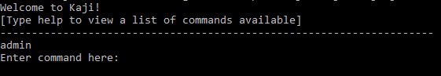
1. Type the command in the command window and press Enter to execute it. 
   e.g. typing `help` and pressing Enter will show the list of commands available. 
   Some example commands you can try:
   * `help` : Lists all commands available.
   * `exit` : Exits the app.
1. Refer to [Features](#3-features) below for details of each command.

--------------------------------------------------------------------------------------------------------------------

## 3. Features
This section introduces the syntax and usages of the commands for the features available in Kaji. 
In explaining the syntax, do take note of the following command format which applies to all Kaji commands:
* Words in `UPPER_CASE` are the parameters that you need to provide.
    * <b>Example:</b> In `add MODULE_NAME`, `MODULE_NAME` is a parameter which can be used as `add CS2113`.
* Parameters cannot be given in any order.
    * <b>Example:</b> In `edit MODULE_INDEX MODULE_NAME`, entering `edit CS2113 1` will result in an error as 
      the `MODULE_INDEX` and `MODULE_NAME` parameters are in the wrong order.
* The `INDEX` that is used for various commands is a number used to identify a module/chapter/flashcard within the list.
The `INDEX` of a module/chapter/flashcard is shown one the left of each module/chapter/flashcard whenever a `list` command is used.
    * <b>Example of index:<b> 
    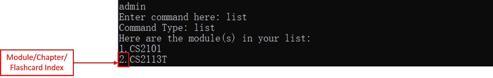
    

### 3.1. Admin Level
This section introduces the syntax and usages of the commands for the features that are available at the **Admin Level**. 
Ensure that you are at the **Admin Level** before trying the commands in the next few sections: 
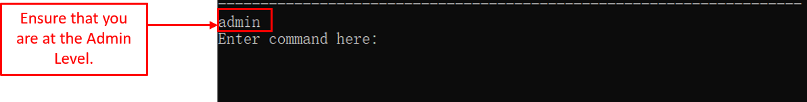

#### 3.1.1. Adding a module: `add`
(by Jiayi)

Welcome to the first feature of Kaji! In order to use this program, you first will need to create a module deck. Creating a new module deck in Kaji is like getting a new folder to store all the handouts for one module. This is important because it helps you to organize your messy notes. 

##### Format: `add \MODULE_CODE`
\MODULE_CODE is the name of the new module that you would like to create, such as `CS2113`, `Module 1` or `Biology`. 

##### Key Pointers:
* Kaji does not allow duplicate of module names, therefore, if the existing module has the same name as the new module, you will get an error message.
* Kaji is not case-sensitive, therefore, a new module named `module`  will be treated equally to a module named `MODULE`. 
* Kaji only allows creation of one module with the `add` command. If you enter command `add CS2113T CS2101` will creates a module named `CS2113T CS2101`, instead of two separated modules named `CS2113T` and `CS2101` respectively.

##### Example: 
In this example, you are going to add a new module called `CS2113T`.
Below are steps of using this `add` command:
* Step 1: Enters the command `add CS2113T` into the command prompt. Your new module name comes after the key word `add`.

* Step 2: As shown below, a new module named `CS2113T` has just been created! You are free to edit, delete and access this module!

This is an additional example to show you the unique property of Kaji's add feature. 
As you may aware from `Key Pointers` section above, Kaji is case-insensetive. This example belows shows you what will happen if you try to add a new module called `cs2113t` after completing the previous example.
Below are the breakdown of this example:
* Step 1: Types `add cs2113t` to add a new module named `cs2113t` after adding a module named `CS2113T` which essentially have a same name as our new module but in capital letters.

* Step 2: Opps, Kaji refuses to add the module `cs2113t` because a module with the same name is already existed!

This is an additional example to show you the unique property of Kaji's add feature. 
As you may aware from `Key Pointers` section above, Kaji only allows addition of one new module each time. Let's see what will happen if you try to add two modules `cs2113 cs2101` at same time.
Below are the breakdown of this example:
* Step 1: Types `add cs2113t cs2101` and attempts to add a new module named `cs2113t` and another new module `cs2101`.

* Step 2: Opps, Kaji has interpreted it as one single module with the name of `cs2113t cs2101`, instead of two seperate modules. 

#### 3.1.2. Listing modules available: `list` 
(by Zeyu)

This command shows a list of modules on the admin level.

Format: `list`

Here are some key points:
* Do not need to add `admin` after `list`.
* All list commands have the same command word `list`. 

Example of usage: 
* At Admin Level: enter the command `list`.
* Here is the expected output:
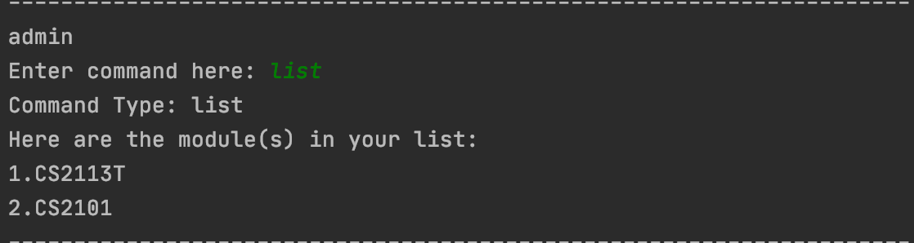
* After listing all modules, you can try all commands available in **Admin Level**.

#### 3.1.3. Editing a module name: `edit` 
(by Zeyu)

This command modifies the module name you want to change.

Format: `edit MODULE_INDEX MODULE_NAME`

Here are some key points:
* You can only edit content on the level below the one you are on.
* Edit the name / content at the specified `MODULE_INDEX`.
* The `MODULE_INDEX` refers to the index number shown in the displayed content list.
* The `MODULE_INDEX` **must be a positive integer** 1, 2, 3, …

Example of usage: 
* At Admin Level: enter `edit 1 CS2113T` changes current Module name at index 1 to CS2113T.
* Here is the expected output:
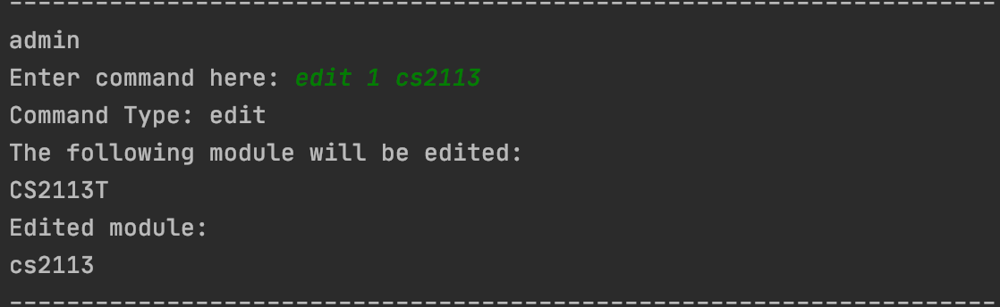
* After editing the module name, you can try all commands available in **Admin Level**.

#### 3.1.4. Removing a module: `remove` 
(by Jia Ern)

Removes a module from Kaji.

Format: `remove MODULE_INDEX`

Here are some key pointers:
* Removes the module based on the index provided.
* `MODULE_INDEX` refers to the index number shown in the current module list. 
* Index provided **must be a positive integer** 1, 2, 3, ...

Example:  
For instance, you are currently at the admin level and want to remove the module `CS2113T`, the steps to do so are shown below:
* Step 1: Enter the command `remove 1` to remove the first module in the list which in this case is `CS2113T`:  

* Step 2: The module as well as the chapters and flashcards in it are removed, and the output message below will be shown:  

#### 3.1.5. Accessing the module level: `go`
(by Jiayi)

Now you have learnt how to create, edit and delete the module deck, let's move to the next page. You can now access the module deck you have created by using the command `go \MODULE_CODE`.

##### Format: `go \MODULE_INDEX`
\MODULE_INDEX is the index of the module that you can find in the list command, such as `1`, `2` or `3`. 

##### Key Pointers:
* Kaji only allow access to the existing modules that are shown in the list, therefore, module that is deleted or has never been created will result in an error message.
* Kaji does not recognise any index out of bound such as `0` or index numbers that are not present in the list.

##### Example: 
In this example, you are going to access the module `CS2113T` that you have created in the previous sections.
Below are steps of using this `go` command:
* Step 1: Uses `list` command to check the index of the module that you would like to access.

* Step 2: In this example, the module you would like to access is `CS2113T` and its index is `2` as shown as the diagram below.

* Step 3: You can type `go 2` to access this module.

* Step 4: As shown below, you are now 

* Step 5: You may double check your access using the command prompt directory displayed on top of `Enter command here:`. As shown as the diagram, your current access directory is under `Admin/CS2113T`.

### 3.2. Module level
This section introduces the syntax and usages of the commands for the features that are available at the **Module Level**. 
Ensure that you are at the **Module Level** before trying the commands in the next few sections: 
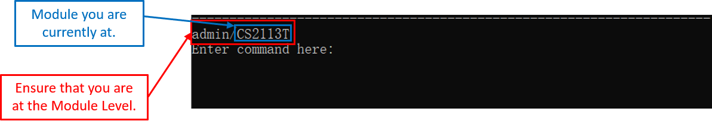

#### 3.2.1. Adding a chapter: `add`
(by Jiayi)

You are now at the module level! This command allows you to create a new chapter inside your current module deck. It belongs to the module level you are currently in. It is like preparing an empty paper to write notes for a lecture. Let's create a new chapter inside the module!

##### Format: `add \CHAPTER_NAME`
\CHAPTER_NAME is the name of the new chapter that you would like to create, such as `Topic 1`, `Chapter 1` or `Newton's laws of motion`. 

##### Key Pointers:
* Similar to module, Kaji does not allow duplicate of chapter names, therefore, if the existing chapter has the same name as the new chapter, you will get an error message
* Kaji is not case-sensitive, therefore, a new chapter named `chapter`  will be treated equally to a module named `CHAPTER`. 

##### Example 1: 
In this example, you are going to add a new chapter called `Chapter 1`.
Below are steps of using this `add` command:
* Step 1: Enters the command `add Chapter 1` into the command prompt which your new chapter name comes after the key word `add`.

* Step 2: In Kaji, you can give new chapters a rate to pre-set its revision schedules. If you would like to keep it as fault state, you can simply enter `N`. To demonstrate this feature fully, you may enter `Y` to rate the new chapter and check out how will Kaji responses!

* Step 3: You choose to rate the new chapter from the previous step, therefore, you can rate your chapter as `Easy`, `Medium` or `Hard` by entering `E`, `M` and `H` as shown as the instruction given by Kaji.

* Step 4: You have just created a new chapter! Good Job!

#### 3.2.2. Listing chapters available: `list`
(by Zeyu)

This command shows a list of chapters on the module level.

Format: `list`

Here are some key points:
* Do not need to add `module_name` after `list`.
* All list commands have the same command word `list`.

Example of usage: 
* At Module Level: enter the command `list`.
* Here is the expected output:
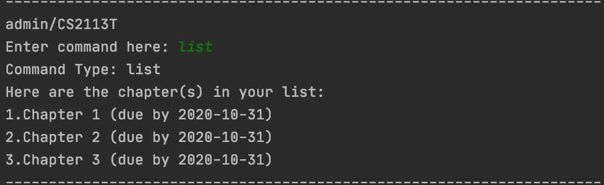
* The date in the bracket is the due date for each chapter.
* After listing all chapters, you can try all commands available in **Module Level**.

#### 3.2.3. Editing a chapter name: `edit`
(by Jane)

You can edit the name of an existing chapter from the list of chapters.
You can do so by using the `edit` command, followed by the edited name of the chapter.

**Format:** `edit CHAPTER_INDEX CHAPTER_NAME`

Here are some key pointers:
* `CHAPTER_INDEX` **must be a positive integer** 1, 2, 3, ...,
and must be a valid index number for a chapter as displayed from the list of chapters.
* `CHAPTER_NAME` is the edited name of your chapter.

**Example:**

Let's say you want to edit the chapter name to `Chapter 1` for the chapter `chap 1`.
* Step 1: Type `list` into the command prompt and press `Enter` to execute it. 
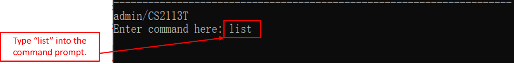
* Step 2: From the list of chapters displayed, you can see that the chapter `CHAPTER_INDEX` is 1. 
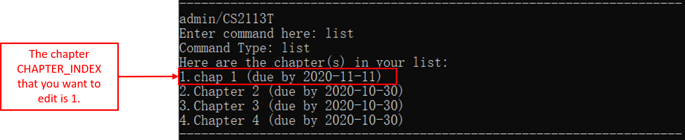
* Step 3: Next, you can type `edit 1 Chapter 1` into the command prompt and press `Enter` to execute it. 
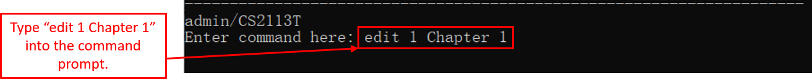
* Step 4: After the chapter name has been successfully edited, the result will be displayed as shown. 
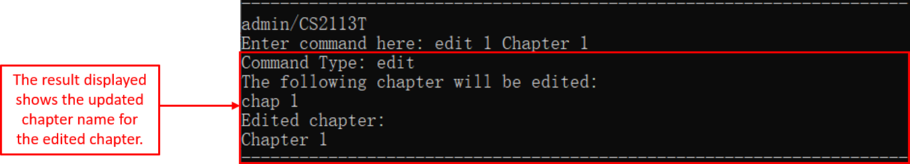

#### 3.2.4. Removing a chapter: `remove`
(by Jia Ern)

Removes a chapter from Kaji.

Format: `remove CHAPTER_INDEX`

Here are some key pointers:
* Removes the chapter based on the index provided.
* `CHAPTER_INDEX` refers to the index number shown in the current chapter list. 
* Index provided **must be a positive integer** 1, 2, 3, ...

Example:  
For instance, you are currently at the module level `CS2113T` and want to remove the chapter `Chapter 1`, the steps to do so are shown below:
* Step 1: Enter the command `remove 1` to remove the first chapter in the list which in this case is `Chapter 1`:  

* Step 2: The chapter and the flashcards in it are removed, and the output message below will be shown:  

#### 3.2.5. Accessing the chapter level: `go` 
(by Yan An)

Proceeds to the Chapter Level with reference to one of the Chapters within the module.

Format: `go CHAPTER_INDEX`
 
Example:  
For instance, you are currently in Module level `Module` and want to head to Chapter level `Chapter1` , the steps to
 do so are shown below:

* Step 1: Enter the command `go 1` to head down to the Chapter level below:  

  
   Figure <>. Example of the "go" command 

* Step 2: You should return to the Admin level as shown below:  

  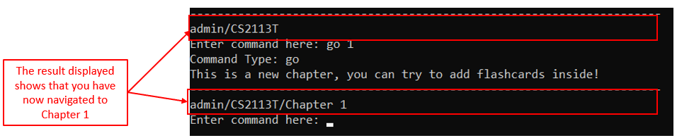
   Figure <>. Example of the "go" command Result

#### 3.2.6. Returning to admin level: `back`
(by Yan An)

Returns to the Admin level.

Format: `back`
 
Example:  
For instance, you are currently in Module level `Module` and want to return to the Admin level, the steps to do so
 are shown below:

* Step 1: Enter the command `back` to return to the previous level which is the module level:  

  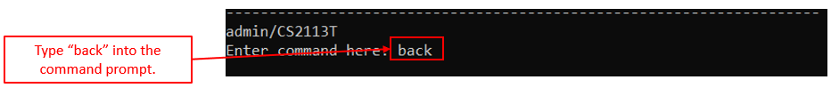
   Figure <>. Example of the "back" command 

* Step 2: You should return to the Admin level as shown below:  

  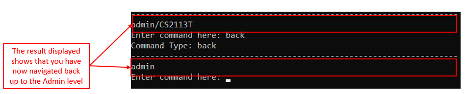
   Figure <>. Example of the "back" command Result

#### 3.2.7. Starting a revision session: `revise`
(by Jia Ern)

Starts a revision session for a chapter.

Format: `revise CHAPTER_INDEX` 

Here are some key pointers: 
* Revision can only be done at module level. 
* Starts a revision based on the index provided. 
* The index refers to the index number shown in the chapter list for the module level you are currently in.  
* Index provided **must be a positive integer** 1, 2, 3, ...

Example:  
For instance, you are currently in the module level `CS2113T` and want to start a revision for `Chapter 1`, the steps to do so are shown below:
* Step 1: Enter the command `revise 1` to start a revision on the first chapter in the list which in this case is `Chapter 1`:  
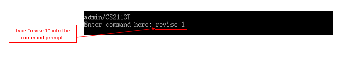
* Step 2: If the chapter is not due for revision yet, you will be shown the below message:  

* Step 3: Enter `Y` to start the revision.
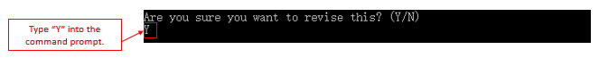
* Step 4: The message below will be shown at the start of the revision:  

* Step 5: The question of the flashcard will be shown as well:  

* Step 6: Enter `s` to see the answer for the flashcard:  
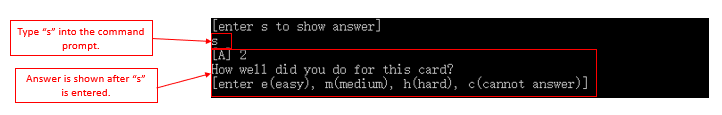
* Step 7: Based on the difficulty of the flashcard, you may enter either `e`/`m`/`h`/`c` to rate the flashcard as shown below:  

* Step 8: If you entered `c`, the same flashcard will be shown again after your last flashcard, and the process will repeat until you enter `e`/`m`/`h` for the particular flashcard you could not answer for.  
* Step 9: Once all the flashcards have been revised, the output message below will be shown:  

#### 3.2.8. Rescheduling a chapter: `reschedule`
(by Jane)

You can reschedule the due date of an existing chapter from the list of chapters.
Rescheduling a chapter allows you to reschedule a chapter to an earlier or later date than the specified due date.
You can do so by using the `reschedule` command, followed by the due date that you want to reschedule the chapter to.

**Format:** `reschedule CHAPTER_INDEX DATE`

Here are some key pointers:
* `CHAPTER_INDEX` **must be a positive integer** 1, 2, 3, ...,
and must be a valid index number for a chapter as displayed from the list of chapters.
* `DATE` is the rescheduled due date of your chapter.
* `DATE` should be in the format `yyyy-MM-dd`.

**Example:**

Let's say you want to reschedule the due date to `2020-12-20` for the chapter `Chapter 1`.
* Step 1: Type `list` into the command prompt and press `Enter` to execute it. 
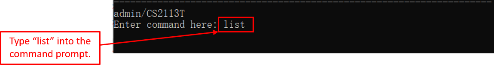
* Step 2: From the list of chapters displayed, you can see that the chapter `CHAPTER_INDEX` is 1. 
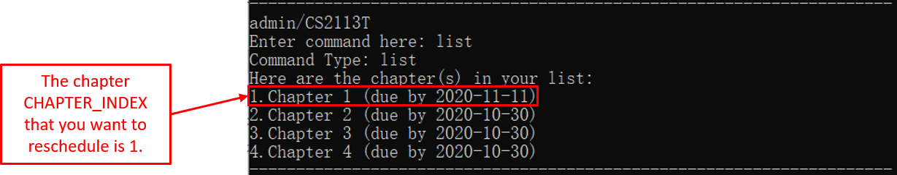
* Step 3: Next, you can type `reschedule 1 2020-12-20` into the command prompt and press `Enter` to execute it. 
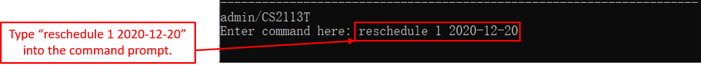
* Step 4: After the due date of the chapter has been successfully rescheduled, the result will be displayed as shown. 
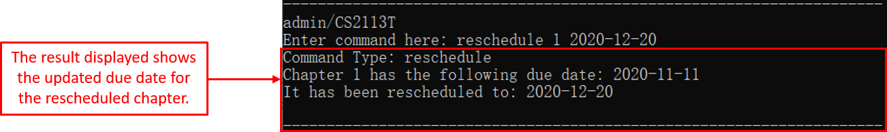

### 3.3. Chapter Level
This section introduces the syntax and usages of the commands for the features that are available at the **Chapter Level**. 
Ensure that you are at the **Chapter Level** before trying the commands in the next few sections: 
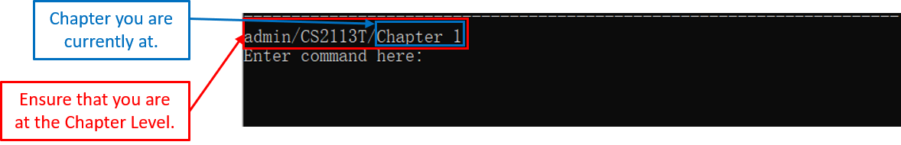

#### 3.3.1. Adding a flashcard: `add`
(by Jane)

After adding a new chapter, the first thing you might want to do is to add a flashcard to the chapter.
You can do so by using the `add` command, followed by the details of the flashcard.

**Format:** `add q:QUESTION | a:ANSWER`

Here are some key pointers:
* `QUESTION` is the question of your flashcard.
* `ANSWER` is the answer of your flashcard.
* You need to type `q:` before the `QUESTION` parameter. 
* You need to type `a:` before the `ANSWER` parameter.
* Having `|` between `q:QUESTION` and `a:ANSWER` is required.

**Example:**

Let's say you want to add a new flashcard with `1+1` as the `QUESTION` and `2` as the `ANSWER`:
* Step 1: Type `add q:1+1 | a:2` into the command prompt and press `Enter` to execute it. 
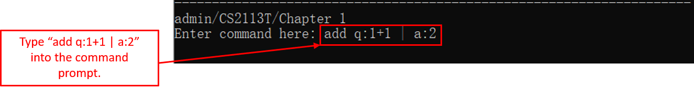
* Step 2: After the flashcard has been successfully added to the chapter, the result will be displayed as shown. 
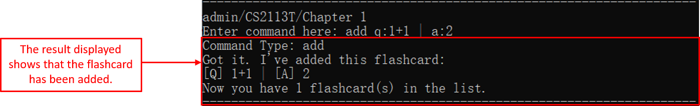

#### 3.3.2. Listing flashcards available: `list`
(by Jane)

After adding flashcards to the chapter, you can view the list of flashcards that you have for the chapter.
You can do so by using the `list` command.

**Format:** `list`

Here are some key pointers:
* You cannot type in any parameters after the `list` command.

**Example:**

Let's say you want to view all the flashcards for a chapter:
* Step 1: Type `list` into the command prompt and press `Enter` to execute it. 
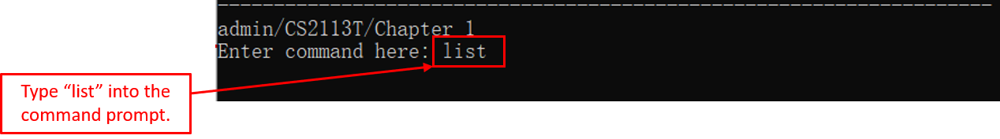
* Step 2: The result for the list of flashcards will be displayed as shown. 
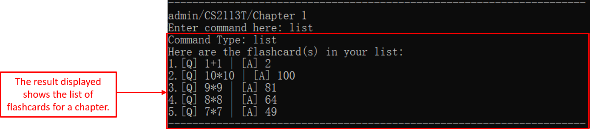

#### 3.3.3. Editing a flashcard content: `edit`
(by Jane)

You can edit the question and/or answer of an existing flashcard from the list of flashcards.
You can do so by using the `edit` command, followed by the details of the flashcard.

**Format:**  
Editing question and answer: `edit FLASHCARD_INDEX q:QUESTION | a:ANSWER` 
Editing question only: `edit FLASHCARD_INDEX q:QUESTION | a:` 
Editing answer only: `edit FLASHCARD_INDEX q: | a:ANSWER` 

Here are some key pointers:
* `FLASHCARD_INDEX` **must be a positive integer** 1, 2, 3, ...,
and must be a valid index number for a flashcard as displayed from the list of flashcards.
* `QUESTION` is the edited question of your flashcard.
* `ANSWER` is the edited answer of your flashcard.
* You need to type `q:` before the `QUESTION` parameter. 
* You need to type `a:` before the `ANSWER` parameter.
* Having `|` between `q:QUESTION` and `a:ANSWER` is required.
* If the question or answer of your flashcard does not need to be edited,
you do not need to type any content for the parameter `QUESTION` or `ANSWER`.

**Example:**

Let's say you want to edit the question to `2*1` for the flashcard that has `1+1` as the question and `2` as the answer.
* Step 1: Type `list` into the command prompt and press `Enter` to execute it. 
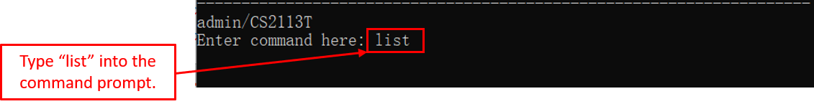
* Step 2: From the list of flashcards displayed, you can see that the flashcard `FLASHCARD_INDEX` is 1. 
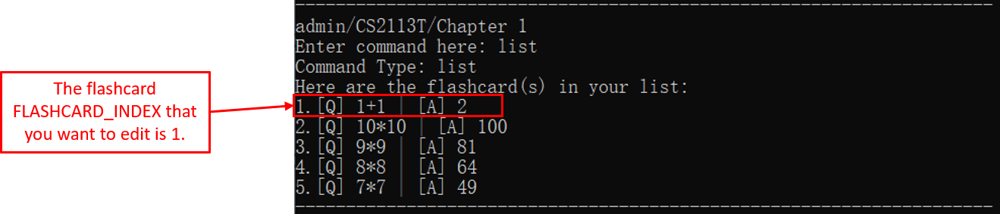
* Step 3: Next, you can type `edit 1 q:2*1 | a:` into the command prompt and press `Enter` to execute it. 
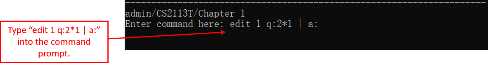
* Step 4: After the flashcard has been successfully edited, the result will be displayed as shown. 
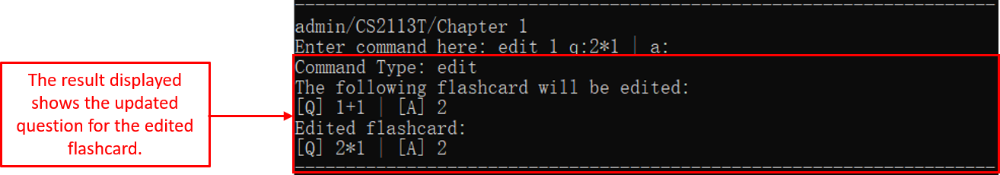

#### 3.3.4. Removing a flashcard: `remove`
(by Jia Ern)

Removes a flashcard from Kaji.

Format: `remove FLASHCARD_INDEX`

Here are some key pointers:
* Removes the flashcard based on the index provided.
* `FLASHCARD_INDEX` refers to the index number shown in the current flashcard list. 
* Index provided **must be a positive integer** 1, 2, 3, ...

Example:  
For instance, you are currently at the chapter level `Chapter 1` and want to remove the flashcard `[Q] 1+1 | [A] 2`, the steps to do so are shown below:
* Step 1: Enter the command `remove 1` to remove the first flashcard in the list which in this case is `[Q] 1+1 | [A] 2`:  

* Step 2: The flashcard is removed, and the output message below will be shown:  

#### 3.3.5. Returning to module level: `back`
(by Jia Ern)

Returns to the module level.

Format: `back`
 
Example:  
For instance, you are currently in chapter level `Chapter 1` and want to return to the module level `CS2113T`, the steps to do so are shown below:
* Step 1: Enter the command `back` to return to the previous level which is the module level:  
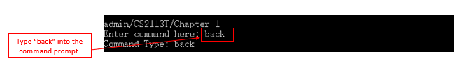
* Step 2: You should return to the module level as shown below:  

#### 3.3.6. Checking overall performance for a chapter: `showrate`
(by Jiayi)

Congratulations! You have learnt how to add flashcards and revise your flash cards, and now is the time to **check your overall performance** for a chapter.

It is very simple, all you have to do is to enter the command [`showrate`](#) in prompt. 

##### Format: `showrate`

##### Key Pointers:
* This command is only accessible in the chapter level. You will get an error message if you are in the wrong access level.
* Only overall performance of your current chapter level will be computed.
* Cards that has yet be answered will be label as <cannot answer>, therefore, if you find a `1.0` for `the percentage of cards that is labeled <cannot answer>`, don't panic, it will be updated as soon as you finish your first revision session of this particular chapter.
>:information_source: <b>Note:</b> As you now know, it is the level which you can add/edit/delete cards.

##### Example: 
For instance, you would like to check your overall performance after completing several rounds of revision.
Below are steps of using this `showrate` command.
* Step 1: Type "showrate" into the command prompt while you are in a chapter level.

* Step 2: Kaji calculates the percentage of card in different master level (i.e. `easy`, `medium`, `hard` and `cannot answer`).

### 3.4. General
This section introduces the syntax and usages of the commands for the features that are available at **All Levels**. 
You can use the commands in the next few sections at **Admin, Module and Chapter Level.**

#### 3.4.1. Showing a list of commands available: `help`
(by Zeyu)

This command shows a list of commands available.

Format: `help`

Here is a key point:
* This command can be **called from any Level**.

Example of usage: 
* At Any Level: enter the command `help`.
* Here is part of the expected output, the whole output is a list of all commands useage:
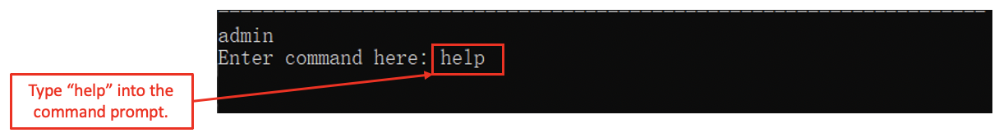
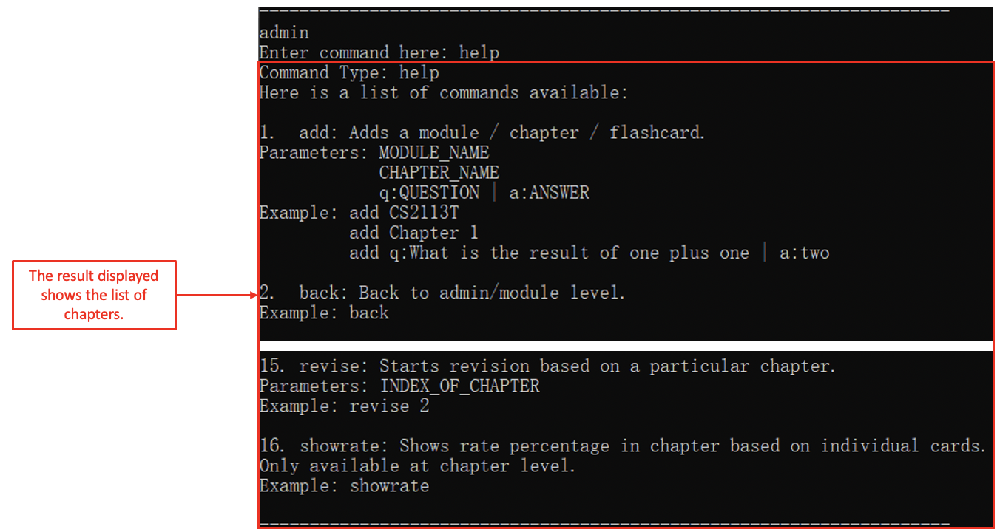
* After knowing waht are the commands, you can try any commands on the correct level.

#### 3.4.4. Viewing the revision history: `history`
(by Zeyu)

You can view the revision completed in the session/in a day by using this command.

Format: 
`history` 
`history DATE` 

Here are some key points:
* This command can be **called from any Level**.
* If you enter `history`, Kaji will show the revision completed today (the day you enter `history`).
* If you enter `history DATE`, the `DATE` need to be in the format of yyyy-mm-dd, then Kaji will show the revision completed on the given date.

Example of usage (`history` format): 
* At Any Level: enter the command `history`.
* Here is the expected output:
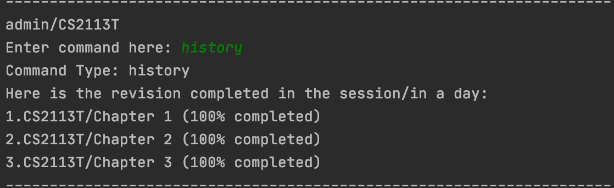

Example of usage (`history DATE` format): 
* At Any Level: enter the command `history 2020-10-30`.
* Here is the expected output:
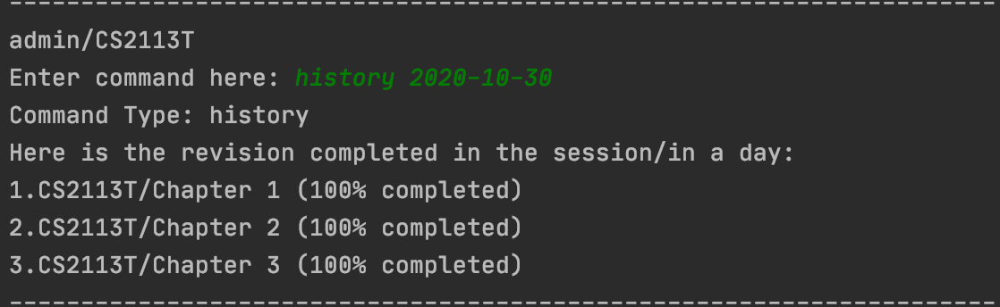
* After knowing the revision you have completed, you can try any commands on the correct level.

#### 3.4.6. Exiting the program: `exit`
(by Zeyu)

You can exit Kaji by using this command.

Format: `exit`

Example of usage: 
* At Any Level: enter the command `exit`
* Here is the expected output:
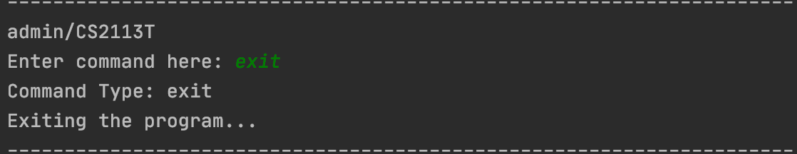

### 4.5 Scheduling In KAJI
(by Yan An)

Now that you know how to make KAJI manage your Database of revision content for you, **what about scheduling?** For your benefit, the **scheduling** in KAJI is mostly **automated**! 

**You don't have to do a thing** to enjoy the benefits of Spaced Repetition. Everything is scheduled for you, so all you have to do is to use the commands [`due`](#) and [`preview`](#) to view what chapters are due and complete the revision  for them accordingly. 

Despite that, this **does not mean that you cannot customise** the scheduling process. KAJI allows you to [`reschedule`](#451) and [`exclude`](#451) Chapters manually if you wish to do so, but more on that later. First, let us get into the specific introduction of each command.
  

### 4.5.1. Listing the chapters due for today: `due`
(by Yan An)

As you now know, **each Chapter will be scheduled** to be due on a date. However, it will be **tedious** for you to go through each chapter **one by one** to find their deadlines. Our **solution** to that, is the `due` command.

The `due` command simplifies the process for by **showing you the Chapters that you have scheduled on that day** and the Modules they belong to.
  

#### Format: `due`

#### Key Pointers:
* There are **no parameters** for this command.
* This command can be **called from any Level**

#### Example: 
At any point, if you want to **see what Chapters are due**, all you have to do is enter the `due` command. Below is an example of an execution of the `due` command.

* ***Step 1***: Key the **`due`** command **into the prompt** as shown below and **press *[Enter]***

  
   Figure <>. Example of the "due" command 

* ***Upon completion***: This is what you will see:

  
   Figure <>. Example of the "due" result

[Labeled expected output]

  

### 4.5.2. Listing the chapters that are due in the upcoming week: `preview`
(by Yan An)

Beyond simply being able to view the Chapters that are due on the day itself, what if you would like to **view your upcoming revision schedule** so that you can **plan ahead**? For that specific purpose, we have the `preview` command.

The `preview` command shows you **the Chapters that you have scheduled for each day of the upcoming week** and the Modules that they belong to.
 

#### Format: `preview`

#### Key Pointers:
* There are **no parameters** for this command.
* This command can be **called from any Level**

#### Example: 
At any point, if you **want to see a preview of which Chapters are going to be due within the upcoming week**, all you have to do is enter the `preview` command. Below is an example of an execution of the `preview` command.

* ***Step 1***: Key the **`preview`** command **into the prompt** as shown below and **press *[Enter]***

  
   Figure <>. Example of the "preview" command  

* ***Upon completion***: This is what you will see:

  
   Figure <>. Example of the "preview" result

[Labeled expected output]

  

### 4.5.3. Adding chapters to your list of Excluded Modules: `exclude`
(by Yan An)

Apart from viewing your schedule, what if the Semester has ended and you would like to take a Module or Chapter out of your schedule? If you were to remove the files from your database completely, it would be really tedious to add the content back Card by Card. Therefore, we created the `exclude` command.

The `exclude` command allows you to **add** a single Chapter or every Chapter from a Module to your Exclusion list so that you can **remove these items** from your schedule.
 

#### Format: `exclude MODULE_OR_CHAPTER`
The `exclude` command has two options for MODULE_OR_CHAPTER:
* ***module***: This option allows you to use `exclude` to add all the Chapters from a Module into the Exclusion List.
* ***chapter***: This option allows you to use `exclude` to add a Chpater into the Exclusion List.

#### Key Pointers:
* This command can be **called from any Level**
* This command **checks if the Chapter/Module** you are adding into the Exclusion List **exists**, so the List will not be filled with non-existing exclusions.
* Do note that the name of the Chapter/Module you provide has to be in the correct case as our check is **case-sensitive**.

#### Example
At any point, if you would like to **add to your Exclusion List**, all you have to do is enter the `exclude` command with the choice of "module" or "chapter" in the format specified above. Below are examples of the execution of the `exclude` command using both options.

Example of ***`exclude module`***
* ***Step 1***: Key the **`exclude module`** command **into the prompt** as shown below and **press *[Enter]***

  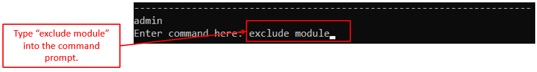
   Figure <>. Example of Exclude Command Module mode: Command

* ***Step 2***: Key the **Module name** that you wish to exclude from your schedule **into the prompt** as shown below and **press *[Enter]***

  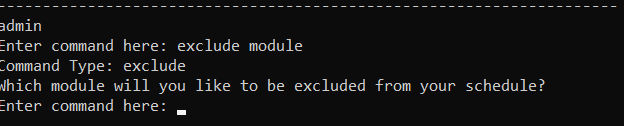
   Figure <>. Example of Exclude Command Module mode: ModuleName Prompt

  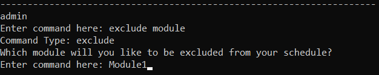
   Figure <>. Example of Exclude Command Module mode: ModuleName Filled

* ***Upon completion***: This is what you will see:

  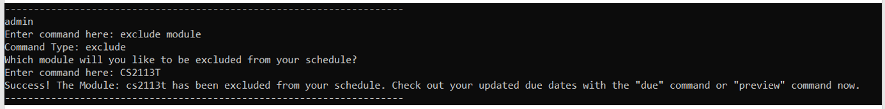
   Figure <>. Example of Exclude Command Module mode: Result

Example of ***`exclude chapter`***
* ***Step 1***: Key the **`exclude chapter`** command **into the prompt** as shown below and **press *[Enter]***

  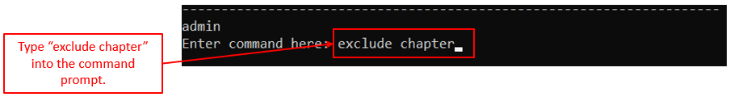
   Figure <>. Example of Exclude Command Chapter mode: ChapterName Command

* ***Step 2***: Key the **Module name** of the Module that contains Chapter that you wish to exclude from your schedule **into the prompt** as shown below and **press *[Enter]***

  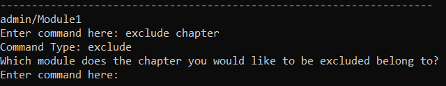
   Figure <>. Example of Exclude Command Chapter mode: ModuleName Prompt

  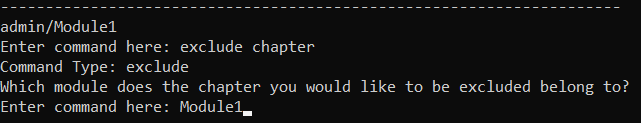
   Figure <>. Example of Exclude Command Chapter mode: ModuleName Filled

* ***Step 3***: Key the **Chapter name** that you wish to exclude from your schedule **into the prompt** as shown below and **press *[Enter]***

  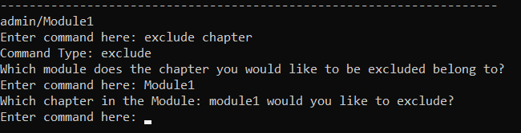
   Figure <>. Example of Exclude Command Chapter mode: ChapterName Prompt

  
   Figure <>. Example of Exclude Command Chapter mode: ChapterName Filled

* ***Upon completion***: This is what you will see:

  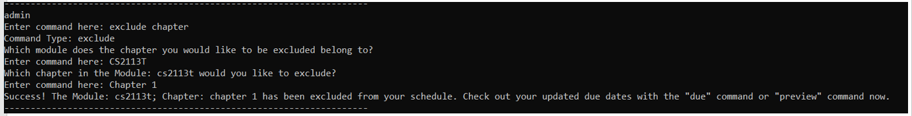
   Figure <>. Example of Exclude Command Chapter mode: Result

### 4.5.4. Removing chapters from the list of Excluded Modules: `include`
(by Yan An)

However, what should be done if you had excluded the Chapters of a Module from your schedule, only to find that it is a prerequisite for another module the next semester. To prepare for the upcoming semester, you would like to revise the excluded content again. This is why we created the `include` command.

The `include` command allows you to **remove** a single Chapter or every Chapter from a Module from your Exclusion list so that you can **add these items** back into your schedule.
 

#### Format: `include MODULE_OR_CHAPTER`
The `include` command has two options for MODULE_OR_CHAPTER:
* ***module***: This option allows you to use `include` to remove all the Chapters from a Module from the Exclusion List.
* ***chapter***: This option allows you to use `include` to remove a Chpater from the Exclusion List.

#### Key Pointers:
* This command can be **called from any Level**
* Do note that the name of the Chapter/Module you provide has to be in the correct case as our check is **case-sensitive**.

#### Example
At any point, if you wish to **remove from your Exclusion List**, you can either enter the `include` command with the choice of either "chapter" or "module" in the format specified above. Below are examples of the command's execution using both options.

Example of ***`include module`***
* ***Step 1***: Key the **`include module`** command **into the prompt** as shown below and **press *[Enter]***

  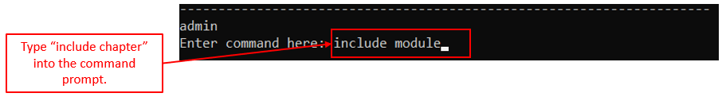
   Figure <>. Example of Include Command Module mode: ModuleName Command

* ***Step 2***: Key the **Module name** that you wish to include back into your schedule **into the prompt** as shown below and **press *[Enter]***

  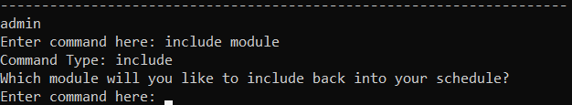
   Figure <>. Example of Include Command Module mode: ModuleName Prompt

  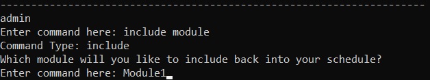
   Figure <>. Example of Include Command Module mode: ModuleName Filled

* ***Upon completion***: This is what you will see:

  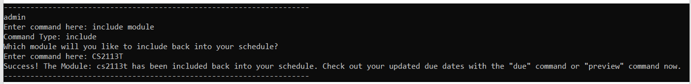
   Figure <>. Example of Include Command Module mode: Result

Example of ***`exclude chapter`***
* ***Step 1***: Key the **`exclude chapter`** command **into the prompt** as shown below and **press *[Enter]***

  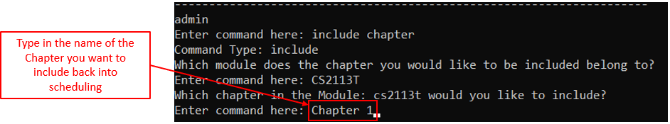
   Figure <>. Example of Include Command Chapter mode: ChapterName Command

* ***Step 2***: Key the **Module name** of the Module that contains the Chapter that you wish to include back into your schedule **into the prompt** as shown below and **press *[Enter]***

  
   Figure <>. Example of Include Command Chapter mode: ModuleName Prompt

  
   Figure <>. Example of Include Command Chapter mode: ModuleName Filled

* ***Step 3***: Key the **Chapter name** that you wish to include back into your schedule **into the prompt** as shown below and **press *[Enter]***

  
   Figure <>. Example of Include Command Chapter mode: ChapterName Prompt

  
   Figure <>. Example of Include Command Chapter mode: ChapterName Filled

* ***Upon completion***: This is what you will see:

  
   Figure <>. Example of Include Command Chapter mode: Result

--------------------------------------------------------------------------------------------------------------------

## 4. Command Summary

### 4.1. Admin Level

| Action | Format, Examples |
|--------|------------------|
| Add Module | `add MODULE_NAME`   e.g. `add CS2113T` |
| List Modules | `list` |
| Edit Module Name | `edit MODULE_INDEX MODULE_NAME`   e.g. `edit 1 CS2113` |
| Remove Module | `remove MODULE_INDEX`   e.g. `remove 1` |
| Access Module Level | `go MODULE_NAME`   e.g. `go CS2113` |

### 4.2. Module Level

| Action | Format, Examples |
|--------|------------------|
| Add Chapter | `add CHAPTER_NAME`   e.g. `add Chapter 1` |
| List Chapters | `list` |
| Edit Chapter Name | `edit INDEX CHAPTER_NAME`   e.g. `edit 1 Chapter 1` |
| Remove Chapter | `remove CHAPTER_INDEX`   e.g. `remove 1` |
| Access Chapter Level | `go CHAPTER_NAME`   e.g. `go Chapter 1` |
| Return Admin Level | `back` |
| Revise | `revise CHAPTER_INDEX`   e.g. `revise Chapter 1` |
| Reschedule | `reschedule CHAPTER_INDEX DATE`   e.g. `reschedule 1 2020-11-03` |

### 4.3. Chapter Level

| Action | Format, Examples |
|--------|------------------|
| Add Flashcard | `add q:QUESTION | a:ANSWER`   e.g. `add q:1+1 | a:2` |
| List Flashcards | `list` |
| Edit Flashcard | `edit FLASHCARD_INDEX q:QUESTION | a:ANSWER`   e.g. `edit 1 q:2*1 | a:2` |
| Remove Flashcard | `remove FLASHCARD_INDEX`   e.g. `remove 1` |
| Return Module Level | `back` |
| Show Rate | `showrate` |

### 4.4. General

| Action | Format, Examples |
|--------|------------------|
| Help | `help` |
| Show Revision History | `history` or `history DATE`   e.g. `history 2020-11-03` |
| Exit | `exit` |

### 4.5. Scheduling

| Action | Format, Examples |
|--------|------------------|
| List Due Chapters | `due` |
| Preview | `preview` |
| Exclude | `exclude MODULE_OR_CHAPTER`   e.g. `exclude module` or `exclude chapter` |
| Include | `include MODULE_OR_CHAPTER`   e.g. `include module` or `include chapter` |
