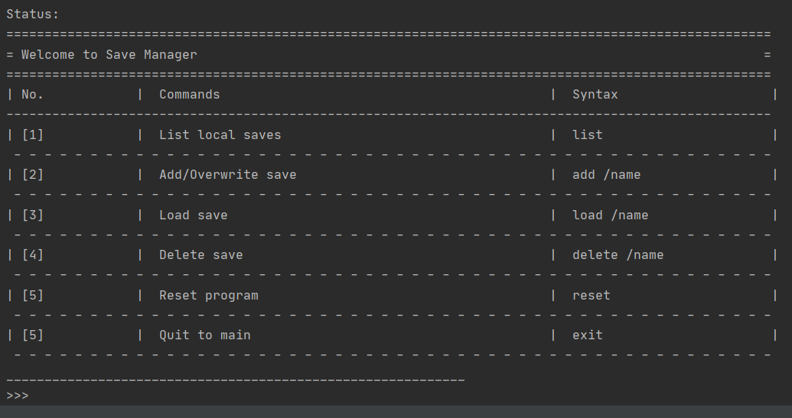
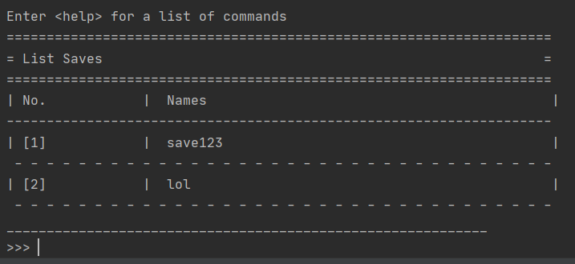
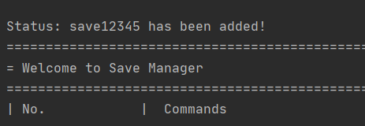
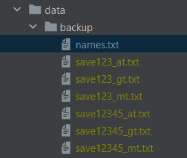
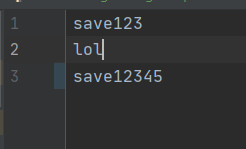
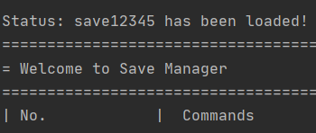
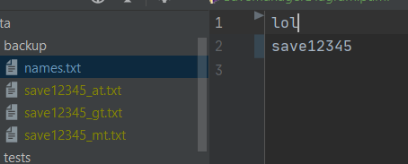
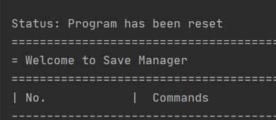

# FinanceIt: A finance management application with a CLI Interface.
FinanceIt is an all-in-one desktop application that handles the finance tracking needs of university students who are comfortable with a CLI interface.
It includes 5 different finance tools, all of which take in typed commands from the users to execute their respective functions.

# Table of Contents

No. |Content|
----|------|
1.|[Set-up](#setUp)
2.|[Features Overview](#featuresOverview)
3.|[Features Documentation](featuresDoc)
3.1|    &emsp;[Main Menu](#mainMenu)
3.2|    &emsp;[Manual Tracker](#manualTracker)
3.3|    &emsp;[Entry Tracker](#entryTracker)
3.4|    &emsp;[Recurring Tracker](#recurringTracker)
3.5|    &emsp;[Finance Tools](#financeTools)
3.6|    &emsp;[Goal Tracker](#goalTracker)
3.7|    &emsp;[Save Manager](#saveManager)
4.|[Features Summary](#featuresSummary)

# 1. <a name = setUp> </a> Set-up
## 1.1 Setting up for Testers (IMPORTANT)

Prerequisites: A computer
1. Download the executable from our [latest release](https://github.com/AY2021S1-CS2113-T16-1/tp/releases/) .
1. Save the executable file in your preferred folder.
1. Run the program via the command line. The command is: ```java -jar financeit.jar```.

## 1.2 Setting up in Intellij

Prerequisites: JDK 11, update Intellij to the most recent version.
1. Download the latest release from the release page.
1. Open Intellij (if you are not in the welcome screen, click `File` > `Close Project` to close the existing project dialog first)
1. Set up the correct JDK version, as follows:
   1. Click `Configure` > `Structure for New Projects` and then `Project Settings` > `Project` > `Project SDK`
   1. If JDK 11 is listed in the drop down, select it. If it is not, click `New...` and select the directory where you installed JDK 11
   1. Click `OK`
1. Import the project into Intellij as follows:
   1. Click `Open or Import`.
   1. Select the project directory, and click `OK`
   1. If there are any further prompts, accept the defaults.
1. After the importing is complete, locate the `src/main/java/seedu.financeit/Financeit.java` file, right-click it, and choose `Run Financeit.main()`. If the setup is correct, you should see something like the below:

> Output:

       ||====================================================================||
       ||||$||||||||||||||||||||||||||||||||||||||||||||||||||||||||||||||$||||
       ||(100)==================|     Welcome to       |================(100)||
       ||||$||        ~         '------========--------'                ||$||||
       ||<< |        |$|              || ____ ||                         | >>||
       ||>>|  12    ||L||            || ///..) ||         L38036133B   12 |<<||
       ||<<|        || ||           || <||  >)  ||                        |>>||
       ||>>|         |$|            ||  $$ --)  ||        One Hundred     |<<||
    ||====================================================================||>||
    ||||$||||||||||||||||||||||||||||||||||||||||||||||||||||||||||||||$||||>||
    ||(100)==================|     FinanceIt!       |================(100)||>||
    ||||$||        ~         '------========--------'                ||$||||>||
    ||<< |        |$|              || ____ ||                         | >>||)||
    ||>>|  12    ||L||            || ///..) ||         L38036133B   12 |<<||/||
    ||<<|        || ||           || <||  >)  ||                        |>>||=||
    ||>>|         |$|            ||  $$ --)  ||        One Hundred     |<<||
    ||<<|      L38036133B        *||  |(_)  ||* series                 |>>||
    ||>>|  12                     *||(___)_||*   1989                  |<<||
    ||<<|      Treasurer     ______(  V2.0   )________     Secretary 12 |>>||
    ||||$|                 ~| A finanace tracking app |~               |$||||
    ||(100)===================  ONE HUNDRED DOLLARS =================(100)||
    ||||$||||||||||||||||||||||||||||||||||||||||||||||||||||||||||||||$//||
    ||====================================================================||
    Status: 
    =====================================================================================================
    = Welcome to Main Menu                                                                              =
    =====================================================================================================
    | No.            |  Feature                                           |  Commands                    |
    -----------------------------------------------------------------------------------------------------
    | [1]            |  Manual Income/Expense Tracker                     |  manual                      |
     - - - - - - - - - - - - - - - - - - - - - - - - - - - - - - - - - - - - - - - - - - - - - - - - - -
    | [2]            |  Recurring Income/Expense Tracker                  |  recur                       |
     - - - - - - - - - - - - - - - - - - - - - - - - - - - - - - - - - - - - - - - - - - - - - - - - - -
    | [3]            |  Account Summary                                   |  acc                         |
     - - - - - - - - - - - - - - - - - - - - - - - - - - - - - - - - - - - - - - - - - - - - - - - - - -
    | [4]            |  Goals Tracker                                     |  goal                        |
     - - - - - - - - - - - - - - - - - - - - - - - - - - - - - - - - - - - - - - - - - - - - - - - - - -
    | [5]            |  Financial Calculator                              |  financial                   |
     - - - - - - - - - - - - - - - - - - - - - - - - - - - - - - - - - - - - - - - - - - - - - - - - - -
    | [6]            |  Toggle Log On or Off                              |  logger                      |
     - - - - - - - - - - - - - - - - - - - - - - - - - - - - - - - - - - - - - - - - - - - - - - - - - -
    | [7]            |  Quit The Program                                  |  exit                        |
     - - - - - - - - - - - - - - - - - - - - - - - - - - - - - - - - - - - - - - - - - - - - - - - - - -
    ____________________________________________________________
    >>> 

# 2. <a name = featuresOverview> </a>Features overview
## <a name = mainFeatures> </a>2.1 Main features

Feature|Command|Description|
-------|-------|-----------|
Manual Tracker|```manual```| Manual entry of transactions. In Manual Tracker, the user manages daily lists of entries called Ledgers. 
Entry Tracker|```entry```| Subsidiary subroutine of Manual Tracker. In Entry Tracker, the user manages ledger entries, which represents a unit of transaction for a particular day.
Recurring Tracker|```recur```| In recurring Tracker, the user manages special recurring entries that are deducted on a regular basis, which are too cumbersome to record regularly with Entry Tracker.
Goal Tracker|```goal```| fillme
Save Manager|```saver```| Allows save of multiple program running states and load them anytime you want. May also delete and reset running state.
Finance Tools|```finance```| FinanceTools contains tools related to financial calculations.

## 2.2 Auxillary features

These commands are not part of the main features, but are helpful for other functions of the program:

Feature|Command|Description|
-------|-------|-----------|
Logger|```logger```| Toggles logger visibility. If toggled on, log information will be displayed on the console.
  
# 3. <a name = featuresDoc> </a>Features Documentation
# 3.1 Features: Main Menu
Gateway to the various other features of the application. 
Upon running the application, you should be greeted by the main menu. Enter the corresponsing commands shown on the table to visit the desired feature!

Feature|Command|
-------|-------|
Manual Tracker|```manual```| 
Entry Tracker|```entry```| 
Recurring Tracker|```recur```| 
Goal Tracker|```goal```| 
Save Manager|```saver```| 
Finance Tools|```financial```| 
Logger|```logger```| 
Quit|```quit```|


## <a name = mainMenu> </a>3.1.1 Main Menu 1: Exit
Exits from the program. If you have an outstanding list, it will be saved automatically as lastSave.txt in
the saveStates folder. This folder will be automatically created when you first run the program.

>Syntax

    exit

> Example: 

       ||====================================================================||
       ||||$||||||||||||||||||||||||||||||||||||||||||||||||||||||||||||||$||||
       ||(100)==================|     Welcome to       |================(100)||
       ||||$||        ~         '------========--------'                ||$||||
       ||<< |        |$|              || ____ ||                         | >>||
       ||>>|  12    ||L||            || ///..) ||         L38036133B   12 |<<||
       ||<<|        || ||           || <||  >)  ||                        |>>||
       ||>>|         |$|            ||  $$ --)  ||        One Hundred     |<<||
    ||====================================================================||>||
    ||||$||||||||||||||||||||||||||||||||||||||||||||||||||||||||||||||$||||>||
    ||(100)==================|     FinanceIt!       |================(100)||>||
    ||||$||        ~         '------========--------'                ||$||||>||
    ||<< |        |$|              || ____ ||                         | >>||)||
    ||>>|  12    ||L||            || ///..) ||         L38036133B   12 |<<||/||
    ||<<|        || ||           || <||  >)  ||                        |>>||=||
    ||>>|         |$|            ||  $$ --)  ||        One Hundred     |<<||
    ||<<|      L38036133B        *||  |(_)  ||* series                 |>>||
    ||>>|  12                     *||(___)_||*   1989                  |<<||
    ||<<|      Treasurer     ______(  V2.0   )________     Secretary 12 |>>||
    ||||$|                 ~| A finanace tracking app |~               |$||||
    ||(100)===================  ONE HUNDRED DOLLARS =================(100)||
    ||||$||||||||||||||||||||||||||||||||||||||||||||||||||||||||||||||$//||
    ||====================================================================||
    Status: 
    =====================================================================================================
    = Welcome to Main Menu                                                                              =
    =====================================================================================================
    | No.            |  Feature                                           |  Commands                    |
    -----------------------------------------------------------------------------------------------------
    | [1]            |  Manual Income/Expense Tracker                     |  manual                      |
     - - - - - - - - - - - - - - - - - - - - - - - - - - - - - - - - - - - - - - - - - - - - - - - - - -
    | [2]            |  Recurring Income/Expense Tracker                  |  recur                       |
     - - - - - - - - - - - - - - - - - - - - - - - - - - - - - - - - - - - - - - - - - - - - - - - - - -
    | [3]            |  Account Summary                                   |  acc                         |
     - - - - - - - - - - - - - - - - - - - - - - - - - - - - - - - - - - - - - - - - - - - - - - - - - -
    | [4]            |  Goals Tracker                                     |  goal                        |
     - - - - - - - - - - - - - - - - - - - - - - - - - - - - - - - - - - - - - - - - - - - - - - - - - -
    | [5]            |  Financial Calculator                              |  financial                   |
     - - - - - - - - - - - - - - - - - - - - - - - - - - - - - - - - - - - - - - - - - - - - - - - - - -
    | [6]            |  Save Manager                                      |  saver                       |
     - - - - - - - - - - - - - - - - - - - - - - - - - - - - - - - - - - - - - - - - - - - - - - - - - -
    | [7]            |  Toggle Log On or Off                              |  logger                      |
     - - - - - - - - - - - - - - - - - - - - - - - - - - - - - - - - - - - - - - - - - - - - - - - - - -
    | [8]            |  Quit The Program                                  |  exit                        |
     - - - - - - - - - - - - - - - - - - - - - - - - - - - - - - - - - - - - - - - - - - - - - - - - - -
    ____________________________________________________________
    >>> exit
    exit

## 3.1.2 <a name = menu> </a> Main Menu 2: Logger
Toggle Logger mode. Developers can toggle it, and more system messages and logs will be printed onto the console.

>Syntax

    logger

> Example (Logger on): 

    ____________________________________________________________
    >>> logger


       ||====================================================================||
       ||||$||||||||||||||||||||||||||||||||||||||||||||||||||||||||||||||$||||
       ||(100)==================|     Welcome to       |================(100)||
       ||||$||        ~         '------========--------'                ||$||||
       ||<< |        |$|              || ____ ||                         | >>||
       ||>>|  12    ||L||            || ///..) ||         L38036133B   12 |<<||
       ||<<|        || ||           || <||  >)  ||                        |>>||
       ||>>|         |$|            ||  $$ --)  ||        One Hundred     |<<||
    ||====================================================================||>||
    ||||$||||||||||||||||||||||||||||||||||||||||||||||||||||||||||||||$||||>||
    ||(100)==================|     FinanceIt!       |================(100)||>||
    ||||$||        ~         '------========--------'                ||$||||>||
    ||<< |        |$|              || ____ ||                         | >>||)||
    ||>>|  12    ||L||            || ///..) ||         L38036133B   12 |<<||/||
    ||<<|        || ||           || <||  >)  ||                        |>>||=||
    ||>>|         |$|            ||  $$ --)  ||        One Hundred     |<<||
    ||<<|      L38036133B        *||  |(_)  ||* series                 |>>||
    ||>>|  12                     *||(___)_||*   1989                  |<<||
    ||<<|      Treasurer     ______(  V2.0   )________     Secretary 12 |>>||
    ||||$|                 ~| A finanace tracking app |~               |$||||
    ||(100)===================  ONE HUNDRED DOLLARS =================(100)||
    ||||$||||||||||||||||||||||||||||||||||||||||||||||||||||||||||||||$//||
    ||====================================================================||
    Status: Logger is on.
    =====================================================================================================
    = Welcome to Main Menu                                                                              =
    =====================================================================================================
    | No.            |  Feature                                           |  Commands                    |
    -----------------------------------------------------------------------------------------------------
    | [1]            |  Manual Income/Expense Tracker                     |  manual                      |
     - - - - - - - - - - - - - - - - - - - - - - - - - - - - - - - - - - - - - - - - - - - - - - - - - -
    | [2]            |  Recurring Income/Expense Tracker                  |  recur                       |
     - - - - - - - - - - - - - - - - - - - - - - - - - - - - - - - - - - - - - - - - - - - - - - - - - -
    | [3]            |  Account Summary                                   |  acc                         |
     - - - - - - - - - - - - - - - - - - - - - - - - - - - - - - - - - - - - - - - - - - - - - - - - - -
    | [4]            |  Goals Tracker                                     |  goal                        |
     - - - - - - - - - - - - - - - - - - - - - - - - - - - - - - - - - - - - - - - - - - - - - - - - - -
    | [5]            |  Financial Calculator                              |  financial                   |
     - - - - - - - - - - - - - - - - - - - - - - - - - - - - - - - - - - - - - - - - - - - - - - - - - -
    | [6]            |  Save Manager                                      |  saver                       |
     - - - - - - - - - - - - - - - - - - - - - - - - - - - - - - - - - - - - - - - - - - - - - - - - - -
    | [7]            |  Toggle Log On or Off                              |  logger                      |
     - - - - - - - - - - - - - - - - - - - - - - - - - - - - - - - - - - - - - - - - - - - - - - - - - -
    | [8]            |  Quit The Program                                  |  exit                        |
     - - - - - - - - - - - - - - - - - - - - - - - - - - - - - - - - - - - - - - - - - - - - - - - - - -
    ____________________________________________________________
    >>>
    
> Example (Logger in action):

    [ DIR            ]: [ MAIN_MENU -> MANUAL_TRACKER_MENU ]
    [ TODO           ]: Enter a command!
                        Input "commands" for list of commands.
    ____________________________________________________________
    >>> ledger open /date 200404
    Nov 01, 2020 5:43:12 AM seedu.financeit.utils.ParamChecker checkAndReturnDuplicateParamTypes
    INFO: Params: {}
    Nov 01, 2020 5:43:12 AM seedu.financeit.utils.ParamChecker checkAndReturnDuplicateParamTypes
    INFO: ParamType: /date
    Nov 01, 2020 5:43:12 AM seedu.financeit.parser.InputParser parseInput
    INFO:  ledger open , {/date=200404}


    Nov 01, 2020 5:43:12 AM seedu.financeit.utils.ParamChecker checkAndReturnDate
    INFO: Checking date...

    [ SYSTEM MESSAGE ]: Ledger 1 : [ Apr 4 2020 ] opened!
    [ DIR            ]: [ MAIN_MENU -> MANUAL_TRACKER_MENU -> ENTRY_TRACKER (LEDGER 2020-04-04)
    [ SYSTEM MESSAGE ]: You are now in entry tracker for ledger [2020-04-04]!
                        Enter command!
                        Input "commands" for list of commands.
    ____________________________________________________________
    >>> 
   
    
# <a name = manualTracker> </a> 3.2 Features : Manual Tracker
Users can manage lists of entries, which are known as ledgers. Each list represents a single date of record.
> Example
    If I wish to record my income and expenditures on 30 October 2020, I will use the program as follows:
    1. Use Manual Tracker to create a ledger of date 20-10-03
    2. Open the ledger of date 20-10-03 
    3. Use Entry Tracker to create entries to record the transactions for that particular date.
    
    
No. |Content|
----|------|
3.2.1|[Add Ledger](#manualTracker1)
3.2.2|[Remove Ledger](#manualTracker2)
3.2.3|[Open Ledger](#manualTracker3)
3.2.4|[Show Ledger List](#manualTracker4)
3.2.5|[Show commands](#manualTracker5)
3.2.6|[Exit](#manualTracker6)

## <a name = manualTracker1> </a> 3.2.1 Manual Tracker 1: Add ledger
Add a ledger to the record, representing a date.

>Syntax

    ledger new <param type> <parameter> 
    
Param Type| Param | Param Format
----------|-------|------------|
/date|Date of the ledger, and all the entries under that ledger.| Input string of the date in YYMMDD, YY-MM-DD or YY-M-D

> Example: 

    [ DIR            ]: [ MAIN_MENU -> MANUAL_TRACKER_MENU ]
    [ TODO           ]: Enter a command! 
                        Input "commands" for list of commands.
    ____________________________________________________________
    >>> ledger new /date 200504


    [ SYSTEM MESSAGE ]: Ledger 1 : [ May 4 2020 ] created!
    [ DIR            ]: [ MAIN_MENU -> MANUAL_TRACKER_MENU ]
    [ TODO           ]: Enter a command! 
                        Input "commands" for list of commands.
    ____________________________________________________________
    >>> ledger list


    ==================================
    = List of Ledgers                =
    ==================================
    | Ledger Number  | Ledger Date    |
    ----------------------------------
    | 1              | 2020-05-04     |
     - - - - - - - - - - - - - - - - -
    [ DIR            ]: [ MAIN_MENU -> MANUAL_TRACKER_MENU ]
    [ TODO           ]: Enter a command! 
                        Input "commands" for list of commands.
    ____________________________________________________________
    >>>
    
## 3.2.2 <a name = manualTracker2> </a> Manual Tracker 2: Remove ledger
Remove a specified ledger from the record, referenced by date or id on the list.
This means that the user only need to specify one of the two param types, either ```/date``` or ```/id```.

>Syntax
 
    ledger delete <param type> <parameter> 
    
Param Type| Param | Param Format
----------|-------|------------|
/date|Date of the ledger, and all the entries under that ledger.| Input string of the date in YYMMDD, YY-MM-DD or YY-M-D
/id|Index of the ledger in the list, where the first ledger is of index 1. | Input positive integer 

> Example: 

    ==================================
    = List of Ledgers                =
    ==================================
    | Ledger Number  | Ledger Date    |
    ----------------------------------
    | 1              | 2020-04-04     |
     - - - - - - - - - - - - - - - - -
    | 2              | 2020-05-04     |
     - - - - - - - - - - - - - - - - -
    [ DIR            ]: [ MAIN_MENU -> MANUAL_TRACKER_MENU ]
    [ TODO           ]: Enter a command! 
                        Input "commands" for list of commands.
    ____________________________________________________________
    >>> ledger delete /id 2


    [ SYSTEM MESSAGE ]: Ledger 2 : [ May 4 2020 ] deleted!
    [ DIR            ]: [ MAIN_MENU -> MANUAL_TRACKER_MENU ]
    [ TODO           ]: Enter a command! 
                        Input "commands" for list of commands.
    ____________________________________________________________
    >>> ledger list


    ==================================
    = List of Ledgers                =
    ==================================
    | Ledger Number  | Ledger Date    |
    ----------------------------------
    | 1              | 2020-04-04     |
     - - - - - - - - - - - - - - - - -
    [ DIR            ]: [ MAIN_MENU -> MANUAL_TRACKER_MENU ]
    [ TODO           ]: Enter a command! 
                        Input "commands" for list of commands.
    ____________________________________________________________
    >>>
    
##  3.2.3 <a name = manualTracker3> </a> Manual Tracker 3: Open ledger
Users will gain access into the entries associated with the specified ledger, referenced by date or id on the list.
This means that the user only need to specify one of the two param types, either ```/date``` or ```/id```.

* Automatic creation of non-existing ledgers 
    * If the ledger specified do not exist and if the param type supplied is "/date", the program will create a new ledger
    in accordance to the date supplied.
    * If the user specifies a non-existing index, then the program will not have enough information to create the new ledger instance. Automatic creation
    will not apply in this particular case.
    
Refer to Feature Entry Tracker onwards for further instructions.

>Syntax

    ledger open <param type> <parameter> 


Param Type| Param | Param Format
----------|-------|------------|
/date|Date of the ledger, and all the entries under that ledger.| Input string of the date in YYMMDD, YY-MM-DD or YY-M-D
/id|Index of the ledger in the list, where the first ledger is of index 1. | Input positive integer 

> Example: 

    [ DIR            ]: [ MAIN_MENU -> MANUAL_TRACKER_MENU ]
    [ TODO           ]: Enter a command! 
                        Input "commands" for list of commands.
    ____________________________________________________________
    >>> ledger open /date 200404


    [ SYSTEM MESSAGE ]: Ledger 1 : [ Apr 4 2020 ] opened!
    [ DIR            ]: [ MAIN_MENU -> MANUAL_TRACKER_MENU -> ENTRY_TRACKER (LEDGER 2020-04-04)
    [ SYSTEM MESSAGE ]: You are now in entry tracker for ledger [2020-04-04]!
                        Enter command!
                        Input "commands" for list of commands.
    ____________________________________________________________
    >>>
    
## 3.2.4 <a name = manualTracker4> </a> Manual Tracker 4: Show ledger list
Shows the record of ledgers that has been added.

>Syntax

    ledger list

> Example: 

    [ SYSTEM MESSAGE ]: Ledger 2 : [ May 4 2020 ] created!
    [ DIR            ]: [ MAIN_MENU -> MANUAL_TRACKER_MENU ]
    [ TODO           ]: Enter a command! 
                        Input "commands" for list of commands.
    ____________________________________________________________
    >>> ledger list


    ==================================
    = List of Ledgers                =
    ==================================
    | Ledger Number  | Ledger Date    |
    ----------------------------------
    | 1              | 2020-04-04     |
    - - - - - - - - - - - - - - - - -
    | 2              | 2020-05-04     |
    - - - - - - - - - - - - - - - - -

## 3.2.5 <a name = manualTracker5> </a> Manual Tracker 5: Print command list
Prints available commands that users can enter in for manualTracker.

>Syntax

    commands

> Example: 

    [ SYSTEM MESSAGE ]: Welcome to Manual Tracker!
    [ DIR            ]: [ MAIN_MENU -> MANUAL_TRACKER_MENU ]
    [ TODO           ]: Enter a command! 
                        Input "commands" for list of commands.
    ____________________________________________________________
    >>> commands


    ======================================================================
    = List of Commands                                                   =
    ======================================================================
    | No.            | Command            | Input Format                  |
    ----------------------------------------------------------------------
    | 1.             | Open ledger        | ledger open /date {YYMMDD}    |
    - - - - - - - - - - - - - - - - - - - - - - - - - - - - - - - - - - -
    | 2.             | New ledger         | ledger new /date {YYMMDD}     |
    - - - - - - - - - - - - - - - - - - - - - - - - - - - - - - - - - - -
    | 3.             | list ledgers       | ledger list                   |
    - - - - - - - - - - - - - - - - - - - - - - - - - - - - - - - - - - -
    | 4.             | delete ledgers     | ledger delete /date {YYMMDD}  |
    - - - - - - - - - - - - - - - - - - - - - - - - - - - - - - - - - - -
    | 5.             | exit to main menu  | exit                          |
    - - - - - - - - - - - - - - - - - - - - - - - - - - - - - - - - - - -
    
## 3.2.6 <a name = manualTracker6> </a> Manual Tracker 6: Exit to Main Menu
Exit to main menu where users can choose another feature to use.

>Syntax

    exit

> Example: 
    
    [ DIR            ]: [ MAIN_MENU -> MANUAL_TRACKER_MENU ]
    [ TODO           ]: Enter a command! 
                        Input "commands" for list of commands.
    ____________________________________________________________
    >>> exit


    [ SYSTEM MESSAGE ]: Exiting from ManualTracker


       ||====================================================================||
       ||||$||||||||||||||||||||||||||||||||||||||||||||||||||||||||||||||$||||
       ||(100)==================|     Welcome to       |================(100)||
       ||||$||        ~         '------========--------'                ||$||||
       ||<< |        |$|              || ____ ||                         | >>||
       ||>>|  12    ||L||            || ///..) ||         L38036133B   12 |<<||
       ||<<|        || ||           || <||  >)  ||                        |>>||
       ||>>|         |$|            ||  $$ --)  ||        One Hundred     |<<||
    ||====================================================================||>||
    ||||$||||||||||||||||||||||||||||||||||||||||||||||||||||||||||||||$||||>||
    ||(100)==================|     FinanceIt!       |================(100)||>||
    ||||$||        ~         '------========--------'                ||$||||>||
    ||<< |        |$|              || ____ ||                         | >>||)||
    ||>>|  12    ||L||            || ///..) ||         L38036133B   12 |<<||/||
    ||<<|        || ||           || <||  >)  ||                        |>>||=||
    ||>>|         |$|            ||  $$ --)  ||        One Hundred     |<<||
    ||<<|      L38036133B        *||  |(_)  ||* series                 |>>||
    ||>>|  12                     *||(___)_||*   1989                  |<<||
    ||<<|      Treasurer     ______(  V2.0   )________     Secretary 12 |>>||
    ||||$|                 ~| A finanace tracking app |~               |$||||
    ||(100)===================  ONE HUNDRED DOLLARS =================(100)||
    ||||$||||||||||||||||||||||||||||||||||||||||||||||||||||||||||||||$//||
    ||====================================================================||
    Status: 
    =====================================================================================================
    = Welcome to Main Menu                                                                              =
    =====================================================================================================
    | No.            |  Feature                                           |  Commands                    |
    -----------------------------------------------------------------------------------------------------
    | [1]            |  Manual Income/Expense Tracker                     |  manual                      |
     - - - - - - - - - - - - - - - - - - - - - - - - - - - - - - - - - - - - - - - - - - - - - - - - - -
    | [2]            |  Recurring Income/Expense Tracker                  |  recur                       |
     - - - - - - - - - - - - - - - - - - - - - - - - - - - - - - - - - - - - - - - - - - - - - - - - - -
    | [3]            |  Account Summary                                   |  acc                         |
     - - - - - - - - - - - - - - - - - - - - - - - - - - - - - - - - - - - - - - - - - - - - - - - - - -
    | [4]            |  Goals Tracker                                     |  goal                        |
     - - - - - - - - - - - - - - - - - - - - - - - - - - - - - - - - - - - - - - - - - - - - - - - - - -
    | [5]            |  Financial Calculator                              |  financial                   |
     - - - - - - - - - - - - - - - - - - - - - - - - - - - - - - - - - - - - - - - - - - - - - - - - - -
    | [6]            |  Save Manager                                      |  saver                       |
     - - - - - - - - - - - - - - - - - - - - - - - - - - - - - - - - - - - - - - - - - - - - - - - - - -
    | [7]            |  Toggle Log On or Off                              |  logger                      |
     - - - - - - - - - - - - - - - - - - - - - - - - - - - - - - - - - - - - - - - - - - - - - - - - - -
    | [8]            |  Quit The Program                                  |  exit                        |
     - - - - - - - - - - - - - - - - - - - - - - - - - - - - - - - - - - - - - - - - - - - - - - - - - -
    ____________________________________________________________
    >>>


    
# 3.3 <a name = entryTracker> </a> Main Feature : Entry Tracker
Subroutine that is subsidiary off the ManualTracker. 
Users can manage entries associated with the ledger they have opened.
Entries are specified by the following parameters:

* Time of transaction
   * Time in which the transaction ocurred
* Type of transaction 
   * Income or Expense
* Category of transaction. The user is only limited to the following set of categories. 
   * Income: {Salary, Allowance, Others}
   * Expense: {Transport, Food, Travel, Shopping, Bills, Others}
* Amount
   * Amount involved in the transaction. 
      * If the transaction type is expense, the amount is considered as a deduction to the account.
      * If the transaction type is income, the amount is considered as a credit to the account.
* Description
   * User input texts to help them record the details of the transaction.

> Example

    Ledger of date 20-10-03
        Entry 1: Shopping at MBS : $1500
        Entry 2: Salary : $3000
    
    From the above, we can infer that on the date 20-10-03, the user has one expense entry and one income entry.
    
No. |Content|
----|------|
3.3.1|[Add Entry](#entryTracker1)
3.3.2|[Edit Entry](#entryTracker2)
3.3.3|[Remove Ledger](#entryTracker3)
3.3.4|[Show Entry List](#entryTracker4)
3.3.5|[Show commands](#entryTracker5)
3.3.6|[Show Categories](#entryTracker6)
3.3.7|[Exit](#entryTracker7)

## 3.3.1 <a name = entryTracker1> </a> Entry Tracker 1: Add entry
Add an entry to the ledger record.

__Note:__
* For transaction categories, we require the users to enter the shortcut equivalent to the categories listed above. Refer to the following table.

Category|Category shortcut|Compatible transaction type
----------|-------|------------|
FOOD|fd|Expense
BILLS|bll|Expense
TRANSPORT|tpt|Expense
TRAVEL|tvl|Expense
SALARY|slr|Expense
ALLOWANCE|alw|Income
OTHERS|oth|Income

>Syntax

    entry add <param type> <parameter> 

        
Param Type| Param | Param Format
----------|-------|------------|
/time|Time of the entry.| Input string of the date in HHMM, HHMMSS or H.
/amt|Amount involved in the transaction.| Input floating point number in 2 d.p
/cat|Category of transaction. | Input string belonging in the set: {tpt, fd, tvl, shp, bll, slr, alw}
-i or -e|Type of transaction. | No parameter required. 

> Example: 

    [ DIR            ]: [ MAIN_MENU -> MANUAL_TRACKER_MENU -> ENTRY_TRACKER (LEDGER 2020-04-04)
    [ SYSTEM MESSAGE ]: You are now in entry tracker for ledger [2020-04-04]!
                        Enter command!
                        Input "commands" for list of commands.
    ____________________________________________________________
    >>> entry new /time 1500 /desc Go to the poll -i /cat tpt /amt 1501


    [ SYSTEM MESSAGE ]: Entry 2 : [ 15:00 ] [ Go to the poll ] created!
    [ DIR            ]: [ MAIN_MENU -> MANUAL_TRACKER_MENU -> ENTRY_TRACKER (LEDGER 2020-04-04)
    [ SYSTEM MESSAGE ]: You are now in entry tracker for ledger [2020-04-04]!
                        Enter command!
                        Input "commands" for list of commands.
    ____________________________________________________________
    >>>

## <a name = entryTracker2> </a> 3.3.2 Entry Tracker 2: Edit entry
Add an entry to the ledger record.
Users only need specify the param to edit, there is no need to fill out all params.

__Note__
* While the index is compulsory to be provided, the rest of the params are not compulsory.
The users will include the params that they wish to modify.
* Hence, a sample command ```entry edit /id 1 /time 1600``` will modify entry at __index 1__ to __time 1600__.

>Syntax

    entry edit /id <parameter> <param type> <parameter> 
        
Param Type| Param | Param Format
----------|-------|------------|
/id|Index of the entry in the list, where the first entry is of index 1. | Input positive integer
/time|Time of the entry.| Input string of the date in HHMM, HHMMSS or H.
/amt|Amount involved in the transaction.| Input floating point number in 2 d.p
/cat|Category of transaction. | Input string belonging in the set: {tpt, fd, tvl, shp, bll, slr, alw}
-i or -e|Type of transaction. | No parameter required. 
        
> Example: 

    ======================================================================================================================
    = List of Entries for Ledger [2020-04-04]                                                                            =
    ======================================================================================================================
    | Entry Number   | Entry Type     | Category       | Amount         | Time           | Description                    |
    ----------------------------------------------------------------------------------------------------------------------
    | 1              | Income         | TRANSPORT      | $1500.00       | 15:00          | Go to the poll                 |
     - - - - - - - - - - - - - - - - - - - - - - - - - - - - - - - - - - - - - - - - - - - - - - - - - - - - - - - - - - -


    [ DIR            ]: [ MAIN_MENU -> MANUAL_TRACKER_MENU -> ENTRY_TRACKER (LEDGER 2020-04-04)
    [ SYSTEM MESSAGE ]: You are now in entry tracker for ledger [2020-04-04]!
                        Enter command!
                        Input "commands" for list of commands.
    ____________________________________________________________
    >>> entry edit /id 1 /time 1600


    [ SYSTEM MESSAGE ]: Entry 1 : [ 16:00 ] [ Go to the poll ] edited!
    [ DIR            ]: [ MAIN_MENU -> MANUAL_TRACKER_MENU -> ENTRY_TRACKER (LEDGER 2020-04-04)
    [ SYSTEM MESSAGE ]: You are now in entry tracker for ledger [2020-04-04]!
                        Enter command!
                        Input "commands" for list of commands.
    ____________________________________________________________
    >>> entry list
    
    ======================================================================================================================
    = List of Entries for Ledger [2020-04-04]                                                                            =
    ======================================================================================================================
    | Entry Number   | Entry Type     | Category       | Amount         | Time           | Description                    |
    ----------------------------------------------------------------------------------------------------------------------
    | 1              | Income         | TRANSPORT      | $1500.00       | 16:00          | Go to the poll                 |
     - - - - - - - - - - - - - - - - - - - - - - - - - - - - - - - - - - - - - - - - - - - - - - - - - - - - - - - - - - -

    
## <a name = entryTracker3> </a> 3.3.3 Entry Tracker 3: Remove entry
Remove a specified entry from the record, referenced by id on the list.

>Syntax

    entry delete <param type> <parameter> 
        <param type> @ /id: Index of the ledger in the entry list.
            <parameter:Integer>: Input number that is between 1 and the last index in the entry list.
            
Param Type| Param | Param Format
----------|-------|------------|
/time|Time of the entry.| Input string of the date in HHMM, HHMMSS or H.
/id|Index of the entry in the list, where the first entry is of index 1. | Input positive integer

> Example: 

    ======================================================================================================================
    = List of Entries for Ledger [2020-04-04]                                                                            =
    ======================================================================================================================
    | Entry Number   | Entry Type     | Category       | Amount         | Time           | Description                    |
    ----------------------------------------------------------------------------------------------------------------------
    | 1              | Income         | TRANSPORT      | $1500.00       | 16:00          | Go to the poll                 |
     - - - - - - - - - - - - - - - - - - - - - - - - - - - - - - - - - - - - - - - - - - - - - - - - - - - - - - - - - - -
    | 2              | Income         | TRANSPORT      | $1501.00       | 15:00          | Go to the poll                 |
     - - - - - - - - - - - - - - - - - - - - - - - - - - - - - - - - - - - - - - - - - - - - - - - - - - - - - - - - - - -
    | 3              | Income         | TRANSPORT      | $1503.00       | 15:00          | Go to the poll where           |
    |                |                |                |                |                | 1.the rainbow used to be nice  |
    |                |                |                |                |                | 2. and colorful, haha          |
     - - - - - - - - - - - - - - - - - - - - - - - - - - - - - - - - - - - - - - - - - - - - - - - - - - - - - - - - - - -
    | 4              | Income         | TRANSPORT      | $1501.00       | 15:00          | Go to the pole                 |
     - - - - - - - - - - - - - - - - - - - - - - - - - - - - - - - - - - - - - - - - - - - - - - - - - - - - - - - - - - -
    [ DIR            ]: [ MAIN_MENU -> MANUAL_TRACKER_MENU -> ENTRY_TRACKER (LEDGER 2020-04-04)
    [ SYSTEM MESSAGE ]: You are now in entry tracker for ledger [2020-04-04]!
                        Enter command!
                        Input "commands" for list of commands.
    ____________________________________________________________
    >>> entry delete /id 1


    [ SYSTEM MESSAGE ]: Entry 1 : [ 16:00 ] [ Go to the poll ] deleted!
    [ DIR            ]: [ MAIN_MENU -> MANUAL_TRACKER_MENU -> ENTRY_TRACKER (LEDGER 2020-04-04)
    [ SYSTEM MESSAGE ]: You are now in entry tracker for ledger [2020-04-04]!
                        Enter command!
                        Input "commands" for list of commands.
    ____________________________________________________________
    >>> entry list


    ======================================================================================================================
    = List of Entries for Ledger [2020-04-04]                                                                            =
    ======================================================================================================================
    | Entry Number   | Entry Type     | Category       | Amount         | Time           | Description                    |
    ----------------------------------------------------------------------------------------------------------------------
    | 1              | Income         | TRANSPORT      | $1501.00       | 15:00          | Go to the poll                 |
     - - - - - - - - - - - - - - - - - - - - - - - - - - - - - - - - - - - - - - - - - - - - - - - - - - - - - - - - - - -
    | 2              | Income         | TRANSPORT      | $1503.00       | 15:00          | Go to the poll where           |
    |                |                |                |                |                | 1.the rainbow used to be nice  |
    |                |                |                |                |                | 2. and colorful, haha          |
     - - - - - - - - - - - - - - - - - - - - - - - - - - - - - - - - - - - - - - - - - - - - - - - - - - - - - - - - - - -
    | 3              | Income         | TRANSPORT      | $1501.00       | 15:00          | Go to the pole                 |
     - - - - - - - - - - - - - - - - - - - - - - - - - - - - - - - - - - - - - - - - - - - - - - - - - - - - - - - - - - -

    
## <a name = entryTracker4> </a> 3.3.4 Entry Tracker 4: Show entry list
Shows the record of entries that has been added.

>Syntax

    entry list

> Example: 

    [ SYSTEM MESSAGE ]: Entry 1 : [ 16:00 ] [ Go to the poll ] deleted!
    [ DIR            ]: [ MAIN_MENU -> MANUAL_TRACKER_MENU -> ENTRY_TRACKER (LEDGER 2020-04-04)
    [ SYSTEM MESSAGE ]: You are now in entry tracker for ledger [2020-04-04]!
                        Enter command!
                        Input "commands" for list of commands.
    ____________________________________________________________
    >>> entry list


    ======================================================================================================================
    = List of Entries for Ledger [2020-04-04]                                                                            =
    ======================================================================================================================
    | Entry Number   | Entry Type     | Category       | Amount         | Time           | Description                    |
    ----------------------------------------------------------------------------------------------------------------------
    | 1              | Income         | TRANSPORT      | $1501.00       | 15:00          | Go to the poll                 |
     - - - - - - - - - - - - - - - - - - - - - - - - - - - - - - - - - - - - - - - - - - - - - - - - - - - - - - - - - - -
    | 2              | Income         | TRANSPORT      | $1503.00       | 15:00          | Go to the poll where           |
    |                |                |                |                |                | 1.the rainbow used to be nice  |
    |                |                |                |                |                | 2. and colorful, haha          |
     - - - - - - - - - - - - - - - - - - - - - - - - - - - - - - - - - - - - - - - - - - - - - - - - - - - - - - - - - - -
    | 3              | Income         | TRANSPORT      | $1501.00       | 15:00          | Go to the pole                 |
     - - - - - - - - - - - - - - - - - - - - - - - - - - - - - - - - - - - - - - - - - - - - - - - - - - - - - - - - - - -

## <a name = entryTracker5> </a> 3.3.5 Entry Tracker 5: Print command list
Prints available commands that users can enter in for manualTracker.

>Syntax

    commands

> Example: 

    [ SYSTEM MESSAGE ]: Ledger 1 : [ Apr 4 2020 ] opened!
    [ DIR            ]: [ MAIN_MENU -> MANUAL_TRACKER_MENU -> ENTRY_TRACKER (LEDGER 2020-04-04)
    [ SYSTEM MESSAGE ]: You are now in entry tracker for ledger [2020-04-04]!
                        Enter command!
                        Input "commands" for list of commands.
    ____________________________________________________________
    >>> commands


    ========================================================================================================
    = List of Commands                                                                                     =
    ========================================================================================================
    | No.            | Command                 | Input Format                                               |
    --------------------------------------------------------------------------------------------------------
    | 1.             | New entry               | entry new /time {HHMM} /desc {string} /cat {category}      |
    |                |                         | -[i/e] /amt {Double, 2 decimal places}                                                    |
     - - - - - - - - - - - - - - - - - - - - - - - - - - - - - - - - - - - - - - - - - - - - - - - - - - - -
    | 2.             | Edit entry              | entry edit /id {integer} {param-type/parameter to edit}    |
     - - - - - - - - - - - - - - - - - - - - - - - - - - - - - - - - - - - - - - - - - - - - - - - - - - - -
    | 3.             | list entries            | entry list                                                 |
     - - - - - - - - - - - - - - - - - - - - - - - - - - - - - - - - - - - - - - - - - - - - - - - - - - - -
    | 4.             | delete entry            | entry delete /id {integer}                                 |
     - - - - - - - - - - - - - - - - - - - - - - - - - - - - - - - - - - - - - - - - - - - - - - - - - - - -
    | 5.             | list transaction        | cat                                                        |
    |                | categories              |                                                            |
     - - - - - - - - - - - - - - - - - - - - - - - - - - - - - - - - - - - - - - - - - - - - - - - - - - - -
    | 6.             | exit to manual tracker  | exit                                                       |
     - - - - - - - - - - - - - - - - - - - - - - - - - - - - - - - - - - - - - - - - - - - - - - - - - - - -

## <a name = entryTracker6> </a> 3.3.6 Entry Tracker 6: Print categories
Prints expenditure category shortcuts that the user can input in entry creation/ edit commands.

>Syntax

    cat

> Example: 

    [ DIR            ]: [ MAIN_MENU -> MANUAL_TRACKER_MENU -> ENTRY_TRACKER (LEDGER 2020-04-04)
    [ SYSTEM MESSAGE ]: You are now in entry tracker for ledger [2020-04-04]!
                        Enter command!
                        Input "commands" for list of commands.
    ____________________________________________________________
    >>> cat


    ==================================
    = List of Valid Categories       =
    ==================================
    | Category       | Input          |
    ----------------------------------
    | bll            | BILLS          |
     - - - - - - - - - - - - - - - - -
    | slr            | SALARY         |
     - - - - - - - - - - - - - - - - -
    | tpt            | TRANSPORT      |
     - - - - - - - - - - - - - - - - -
    | shp            | SHOPPING       |
     - - - - - - - - - - - - - - - - -
    | tvl            | TRAVEL         |
     - - - - - - - - - - - - - - - - -
    | alw            | ALLOWANCE      |
     - - - - - - - - - - - - - - - - -
    | fd             | FOOD           |
     - - - - - - - - - - - - - - - - -
    | oth            | OTHERS         |
     - - - - - - - - - - - - - - - - -
    
## <a name = entryTracker7> </a> 3.3.7 Entry Tracker 7: Exit to Manual Tracker main routine
Exit to Manual tracker where users can choose another ledger.

>Syntax

    exit

> Example: 

    [ DIR            ]: [ MAIN_MENU -> MANUAL_TRACKER_MENU -> ENTRY_TRACKER (LEDGER 2020-04-04)
    [ SYSTEM MESSAGE ]: You are now in entry tracker for ledger [2020-04-04]!
                        Enter command!
                        Input "commands" for list of commands.
    ____________________________________________________________
    >>> exit


    Exiting subroutine...
    [ DIR            ]: [ MAIN_MENU -> MANUAL_TRACKER_MENU ]
    [ TODO           ]: Enter a command! 
                        Input "commands" for list of commands.
    ____________________________________________________________
    >>>
    
# 3.3 <a name = recurringTracker> </a> Features : Recurring Tracker
Users can manage expenses/income that recurs on a monthly basis e.g. monthly bill or salary.

## 3.3.1 Recurring Tracker 1: Add entry
Creates a recurring entry. Entries can either be income or expense. If income, entries
can be set to "auto" which indicates that the income is automatically credited to the user's
bank account e.g. Salary which is transferred into bank account by company. 
Else, it will indicate a manually credited income, which requires the user to 
collect or take action upon e.g. collecting payment from customers (as a supplier), redeeming
of reward points on a monthly basis.

Vice versa for expense entries.

>Syntax

    add {-e OR -i} [-auto] /desc <DESCRIPTION> /amt <AMOUNT> /day <DAY_OF_MONTH> [/notes <NOTES>]
    
## Parameters
* `-e` OR `-i` - Indicates whether entry is income or expense (Mandatory to have 1 of 2)
* `-auto` - Whether entry is auto or manual (only serves as a reminder for user, 
is not linked to any functionality)
* `/desc` - Description of entry (Mandatory)
* `/amt` - Amount (Mandatory)
* `/day` - Day of month which entry occurs on (Mandatory)
* `/notes` - Additional notes and remarks

>Example
    
    add -e -auto /desc Netflix /amt 40 /day 2 /notes Cancel if Homemade ends
    //Netflix, $40 per month, auto-payment via credit card 
    on the 2nd of every month. Saved with a note of “Cancel if Homemade ends"
    
    add -i /desc Redeem air miles for vouchers /amt 50 /day 27
    //Redeem air miles for vouchers, $50 per month, user has to take manual action 
    on or by 27th of every month.
    
## 3.3.2 Recurring Tracker 2: List all entries
Displays a list of all recurring entries.

>Syntax

    list
    
## Parameters
None
 3  
## 3.3.3 Recurring Tracker 3: Delete entry
Deletes an entry at the given index. Index can be found via `list` and then checking the 
associated index in the leftmost column

>Syntax

    delete /id <INDEX>
    
## Parameters
* `/id` - Index of item to be deleted. 1-based indexing (Mandatory)

>Example
    
    delete /id 15
    
## 3.3.4 Recurring Tracker 4: Edit entry
Update one or more fields of an existing entry. Overwrites any existing value corresponding to the 
field(s) being modified.

>Syntax

    edit /id <INDEX> [field(s) to edit]
    
##Parameters
* `/id` - Index of entry to edit. 1-based indexing (Mandatory)
* `field(s) to edit` - Follows the same format as add entry E.g. to edit amount, use `/amt <NEW_AMT>`

>Example
    
    edit /id 2 /desc Updated name!! /day 23
    //Overwrites existing description and day. Other fields are untouched.
    
## 3.3.5 Recurring Tracker 5: Exit tracker
Exits to main menu.

>Syntax

    exit

    
# 3.4 <a name = financeTools> </a> Features : FinanceTools
FinanceTools contains tools related to financial calculations.

## 3.4.1 FinanceTools 1: Simple Interest Calculator
Calculate simple interest earned.
<br />
Simple interest is based on the principal amount of a deposit.

## Parameters
* ```/a``` - Amount (Mandatory)
* ```/r``` - Interest Rate (Mandatory)

>Syntax:
    
    simple /a {AMOUNT} /r {INTEREST_RATE}
   
> Example: 

    simple /a 1000 /r 5

.PNG)
## 3.4.2 FinanceTools 2: Yearly Compound Interest Calculator
Calculate yearly compound interest earned with optional yearly deposit.
<br />
Compound interest is based on the principal amount and the interest that accumulates on it every period.

### Parameters
* ```/a``` - Amount (Mandatory)
* ```/r``` - Interest Rate (Mandatory)
* ```/p``` - Number of Years (Mandatory)
* ```/d``` - Yearly Deposit (Optional)

>Syntax:
    
    cyearly /a {AMOUNT} /r {INTEREST_RATE} /p {YEARS} /d {YEARLY_DEPOSIT}
   
> Example: 

    cyearly /a 1000 /r 3 /p 2
    cyearly /a 1000 /r 3 /p 2 /d 1200

.PNG)
<br />
<br />
.PNG)
## 3.4.3 FinanceTools 3: Monthly Compound Interest Calculator
Calculate monthly compound interest earned with optional monthly deposit.
<br />
Compound interest is based on the principal amount and the interest that accumulates on it every period.

### Parameters
* ```/a``` - Amount (Mandatory)
* ```/r``` - Interest Rate (Mandatory)
* ```/p``` - Number of Months (Mandatory)
* ```/d``` - Monthly Deposit (Optional)

>Syntax:
    
    cyearly /a {AMOUNT} /r {INTEREST_RATE} /p {MONTHS} /d {MONTHLY_DEPOSIT}
   
> Example: 

    cmonthly /a 1000 /r 3 /p 2
    cmonthly /a 1000 /r 3 /p 2 /d 100

.PNG)
<br />
<br />
.PNG)
## 3.4.4 FinanceTools 4: Cashback Calculator
Calculate cashback earned.

### Parameters
* ```/a``` - Amount (Mandatory)
* ```/r``` - Cashback Rate (Mandatory)
* ```/c``` - Cashback Cap (Mandatory)

>Syntax:
    
    cashb /a {AMOUNT} /r {CASHBACK_RATE} /c {CASHBACK_CAP}
   
> Example: 

    cashb /a 1000 /r 5 /c 1000
    cashb /a 1000 /r 5 /c 10

.PNG)
<br />
<br />
.PNG)
## 3.4.5 FinanceTools 5: Miles Credit Calculator
Calculate cashback earned.

## Parameters
* ```/a``` - Amount (Mandatory)
* ```/r``` - Miles Rate (Mandatory)

>Syntax:
    
    miles /a {AMOUNT} /r {MILES_RATE}
   
> Example: 

    miles /a 1000 /r 5

.PNG)
## 3.4.6 FinanceTools 6: Account Storage
Store account information.
<br />

Additionally, it implements the following operations:
* ```info``` - list account(s) information
* ```clearinfo``` - clear all information
* ```store /rm <ACCOUNT_NO>``` - delete corresponding account number in list

### Parameters
* ```/n``` - Account Name (Optional)
* ```/ir``` - Interest Rate (Optional)
* ```/r``` - Cashback Rate (Optional)
* ```/c``` - Cashback Cap (Optional)
* ```/o``` - Other Notes (Optional)
* ```/rm``` - Account Number (Optional)

>Syntax:
    
    store /n {ACCOUNT_NAME} /ir {INTEREST_RATE} /r {CASHBACK_RATE} /c {CASHBACK_CAP} /o {OTHER_NOTES}
   
> Example: 

    store
    store /n myaccount
    store /n myaccount /ir 2
    store /n myaccount /ir 2 /r 2
    store /n myaccount /ir 2 /r 2 /c 100
    store /n myaccount /ir 2 /r 2 /c 100 /o main account
    store /rm 1

.PNG)
<br />
<br />
.PNG)
<br />
<br />
.PNG)
<br />
<br />
.PNG)
<br />
<br />
.PNG)
<br />
<br />
.PNG)
<br />
<br />
.PNG)

## 3.4.7 FinanceTools 7: Command and Calculation History
Store the commands inputted and results from calculations in FinanceTools.

>Syntax:
    
    history
   
> Example: 

    history

.PNG)
## 3.4.8 FinanceTools 8: Exit FinanceTools
Exit FinanceTools to Main Menu.

>Syntax:
    
    exit
   
> Example: 

    exit

.PNG)

# 3.5 <a name = goalTracker> </a> Features : Goal Tracker
Goal Tracker that helps user to track their monthly incomes and expenses goal.

## 3.5.1 Goal Tracker 1 : Set Goal
### 3.5.1.1 Set Income Goal
Setting of income goal for respective months.

>syntax

    income *amount* for *month in int form*
    
 
>Example:

    income 5000 for 08


### 3.5.1.2 Set Expense Goal
Setting of expense goal for respective months.

>syntax

    expense *amount* for *month in int form*
   
>Example

    expense 2000 for 07


## 3.5.2 Goal Tracker 2 : Display Goal
Display income and expense goal for the individual month.

>syntax

    display income/expense for *month in int form*
   
>Example

    display income for 08
    display expense for 07


## 3.5.3 Goal Tracker 3 : Exit Display Goal 
The system will auto prompt the user whether they want to exit DisplayGoal and return to Goal tracker main menu.

>syntax 

    enter *y* to exit

>Example

    y
    


## 3.5.4 Goal Tracker 4 : Edit Goal
Edit income and expense goal for the individual month.

>syntax

    edit income/expense *amount* for *month in int form*
 
>Example
    
    edit income 2000 for 08
    edit expense 1000 for 07


## 3.5.5 Goal Tracker 5 : Exit Goal Tracker
Exit Goal Tracker program and return to FinanceIt main UI.

>syntax

    exit
    
>Example 

    exit
    
# 3.7  <a name = saveManager> </a>Feature: Save Manager
This utility feature helps to save multiple program states and load them at will.


## 3.7.0 Save Manager Menu

Main menu shows all the available commands and how to use them
You can enter "help" anytime to return to this main menu


## 3.7.1 Save Manager List Save

You can enter "list" to list all backup saves.
>syntax

    list


## 3.7.2 Save Manager Add Save

To create a back up save
>syntax

    add /name save12345


In your data/backup directory, you can see 3 text files created.


In your names.txt file, an additional entry will be appended.


## 3.7.3 Save Manager Load Save

To load a back up save
>syntax

    load /name save12345


## 3.7.4 Save Manager Delete Save

To remove a back up save
>syntax

    delete /name save123


As you can see, the 3 text files you want to delete are gone.
names.txt file is also updated.


## 3.7.4 Save Manager Reset

To reset all data currently used by the program enter "reset"
>syntax

    reset


# 4. <a name = featuresSummary> </a>Summary of Features 

## 4.1 Manual Tracker

No. | Feature | Syntax |
----|---------|---------|
1.|Open Ledger|_ledger open /date {YYMMDD}_|
2.|New Ledger|_ledger new /date {YYMMDD}_|
3.|List Ledgers|_ledger list_|
4.|Delete Ledgers|_ledger delete /date {YYMMDD}_|;
5.|Exit to Main Menu|_exit_|

## 4.2 Entry tracker

No. | Feature | Syntax |
----|---------|---------|
1.|New Entry|_entry new /time {HHMM} /desc {string} /cat {category} -[i/e]_|
2.|Edit Entry|_entry edit /id {integer} {param-type/parameter to edit}_|
3.|list Entries|_entry list_|
4.|Delete Entry|_entry delete /id {integer}_|
5.|List Transaction Categories|_cat_|
6.|Exit to Manual Tracker|_exit_|

## 4.3 FinanceTools

No. | Feature | Syntax |
----|---------|---------|
1.|Simple Interest Calculator|_simple /a {AMOUNT} /r {INTEREST_RATE}_|
2.|Yearly Compound Interest Calculator|_cyearly /a {AMOUNT} /r {INTEREST_RATE} /p {YEARS} /d {YEARLY_DEPOSIT}_|
3.|Monthly Compound Interest Calculator|_cmonthly /a {AMOUNT} /r {INTEREST_RATE} /p {MONTHS} /d {MONTHLY_DEPOSIT}_|
4.|Cashback Calculator|_cashb /a {AMOUNT} /r {CASHBACK_RATE} /c {CASHBACK_CAP}_|
5.|Miles Credit Calculator|_miles /a {AMOUNT} /r {MILES_RATE}_|
6.|Account Storage|_store /n {ACCOUNT_NAME} /ir {INTEREST_RATE} /r {CASHBACK_RATE} /c {CASHBACK_CAP} /o {OTHER_NOTES}_|
7.|List Account(s) Information|_info_|
8.|Clear All Account Information|_clearinfo_|
9.|Command and Calculation History|_history_|
10.|Exit to Main Menu|_exit_|

