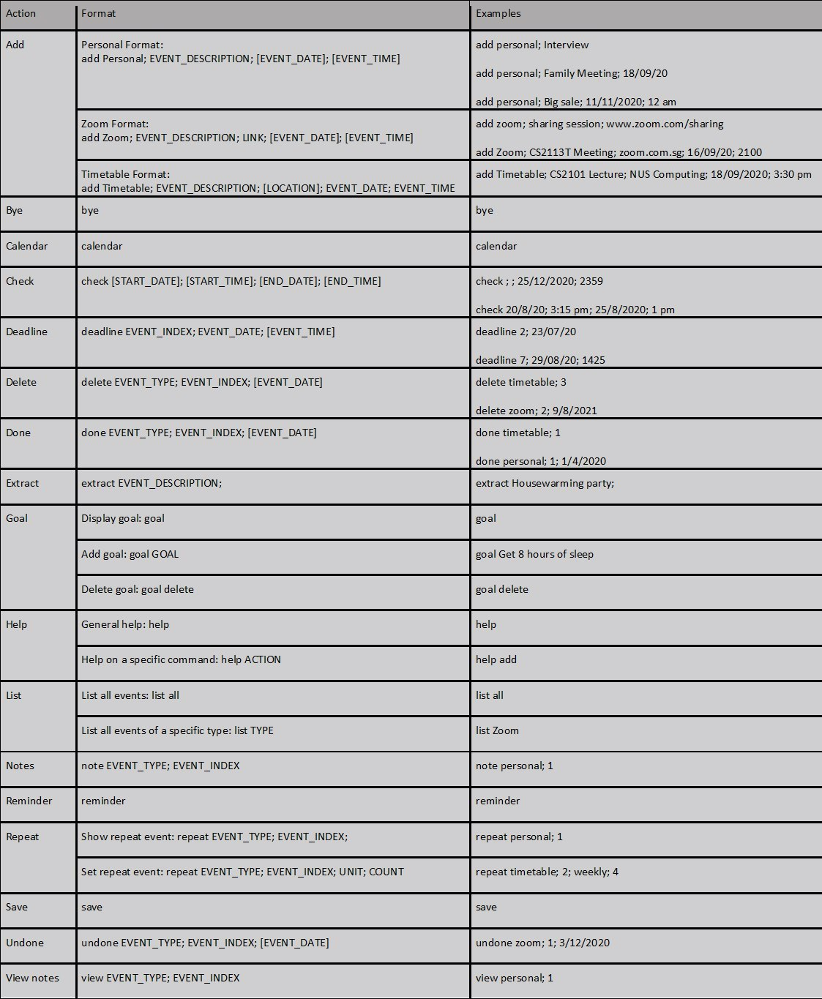

# User Guide

CS2113T – T12 – 04 Scheduler-\-;
 
Scheduler-\-; does the job.

## Table of Contents

- [1. About Scheduler-\-;](#1-about-scheduler--) 
    - [1.1 What can it do?](#11-what-can-it-do) 
    - [1.2 About this guide](#12-about-this-guide) 
    - [1.3 How to use this document?](#13-how-to-use-this-document) 
    - [1.4 Conventions used in this document](#14-conventions-used-in-this-document) 

- [2. Quick Start](#2-quick-start)
    - [2.1 System Requirements](#21-system-requirements)
    - [2.2 Setup Instructions](#22-setup-instructions)
        - [2.2.1 Windows](#221-windows)
        - [2.2.2 Mac OS X](#222-mac-os-x)
        - [2.2.3 Linux](#223-linux)
    - [2.3 Test run](#23-test-run)
    - [2.4 For Experienced Users](#24-for-experienced-users)

- [3. Features](#3-features)
    - [3.1 Viewing help: help](#31-viewing-help-help-colin-ng)
    - [3.2 Adding an event: add](#32-adding-an-event-add-matthew-gani)
    - [3.3 List events: list](#33-list-events-list-marcus-ng)
    - [3.4 Calendar format list: calendar](#34-calendar-format-list-calendar-marcus-ng)
    - [3.5 Deadlines: deadline](#35-deadlines-deadline-qing-ning)
    - [3.6 Repeat on daily/weekly/monthly basis: repeat](#36-repeat-on-dailyweeklymonthly-basis-repeat-colin-ng)
    - [3.7 Check availability on a specific date and time: check](#37-check-availability-on-a-specific-date-and-time-check-marcus-tan)
    - [3.8 Goal setting and viewing: goal](#38-goal-setting-and-viewing-goal-marcus-ng)
    - [3.9 Mark events as done: done](#39-mark-events-as-done-done-marcus-tan)
    - [3.10 Mark events as not done: undone](#310-mark-events-as-not-done-undone-marcus-tan)
    - [3.11 Deleting an event: delete](#311-deleting-an-event-delete-marcus-tan)
    - [3.12 Note taking: note](#312-note-taking-note-qing-ning)
    - [3.13 View note: view](#313-view-note-view-qing-ning)
    - [3.14 Reminder: reminder](#314-reminder-reminder-qing-ning)
    - [3.15 Extracting events from texts: extract](#315-extracting-events-from-texts-extract-matthew-gani)
    - [3.16 Save events: save](#316-save-events-save-colin)
    - [3.17 Exiting the program: bye](#317-exiting-the-program-bye)

- [4. FAQ](#4-faq)

- [5. Command Summary](#5-command-summary)

<div style="page-break-after: always;"></div>

## 1. About Scheduler-\-;

Hello! Welcome to Scheduler-\-;!

Scheduler-\-; (S-\-) is a desktop app for managing deadlines from different sources. The user will use a Command Line Interface to control it. It is specially designed for Computing students who are comfortable in using CLI and have Git project deadlines as well as consolidated Zoom session links due which will suit home based learning in this COVID period. 

### 1.1 What can it do?

Scheduler-\-; comes with the following list of features to help you keep organised of your schedule.  
- Check if your schedule is free between a certain date and time period.
- Categorise your events into personal events, zoom meetings or school timetable events. 
- Be reminded on the important tasks and expected deadlines. 
- Set certain events to occur repeatedly throughout your schedule. 
- Set a goal for yourself.
- And many more... 

### 1.2 About this guide

This user guide is for your reference on how to set up the Scheduler-\-; program on your computer. It provides you with information on how to get things done with Scheduler-\-; and how to use the commands in the program. 

### 1.3 How to use this document?

To get started, take a look at the section labelled “Quick Start” to set up the application to run on your computer.  

Once you have set up the application, you may use the table of contents present in this document to help find the correct command, learn how to use it and what it does.  

<div style="page-break-after: always;"></div>

### 1.4 Conventions used in this document

Words that are highlighted in grey, for instance, `list`, indicate that the words are commands to be typed into the command line interface. 

- Words that are highlighted in grey and are in lower case indicates commands that are to be typed exactly. For instance, if the instructions says to type the words `list all` to run a command,  type on the program the exact words “list all” 

- Words that are highlighted in grey and are in upper case indicates command arguments or parameters that are to be provided by the user. For instance, if the usage instruction informs you to type `delete EVENT_INDEX` and you know that the EVENT_INDEX is 2, type into the computer program “delete 2”. 

- Words that are highlighted in grey, in upper case and are surrounded by square brackets indicates command arguments or parameters that the user can choose to provide or not to provide. For instance, if the command instruction informs you to type `goal [NEW_GOAL]`, you can choose to omit the argument for NEW_GOAL and instead just simply type “goal”.

>**Note!**
>
>This is a note section. Additional information about the command will be written in sections such as this one. 

>**Warning!**
>
>This is a warning section. Any user interaction with the program that may result in issues or unintended results will be written in sections such as this one. 

<div style="page-break-after: always;"></div>

## 2. Quick Start

### 2.1 System Requirements

To run Scheduler-\-;, your computer must meet these minimum system requirements:

- Operating System: Windows 7 and above, Mac OS X or Linux. 
- Java 11 installed on your computer. 

You can install version 11 of Java from this [link](https://docs.aws.amazon.com/corretto/latest/corretto-11-ug/downloads-list.html).

### 2.2 Setup Instructions

#### 2.2.1 Windows

1. Install Java 11 or above in your computer if you have not done so. 
1. Download the latest scheduler.jar from [here](https://github.com/AY2021S1-CS2113T-T12-4/tp/releases).
1. Copy the file to the folder you want to use as the folder for Scheduler-\-;. 
1. Open the command prompt by entering `cmd` into the search bar and press enter. 
1. Navigate to the folder where you saved the jar file using the command prompt.
1. Type `java -jar scheduler.jar` into the command prompt and press enter. 
1. The welcome message for the program should appear. 

#### 2.2.2 Mac OS X

1. Install Java 11 or above in your computer if you have not done so. 
1. Download the latest scheduler.jar from here.
1. Copy the file to the folder you want to use as the folder for Scheduler-\-;. 
1. Open the terminal by clicking on Launchpad->Utilities->Terminal. 
1. Navigate to the folder you have stored the jar file in the command prompt. 
1. Type `java -jar scheduler.jar` into the terminal and press enter. 
1. The welcome message for the program should appear. 

#### 2.2.3 Linux

1. Install Java 11 or above in your computer if you have not done so. 
1. Download the latest scheduler.jar from here. 
1. Copy the file to the folder you want to use as the folder for Scheduler-\-;. 
1. Open the terminal in your linux distribution.
1. Navigate to the folder you have stored the jar file in the command prompt. 
1. Type `java -jar scheduler.jar` into the terminal and press enter. 
1. The welcome message for the program should appear. 

### 2.3 Test run 

Type the command in the command box and press Enter to execute. 
Refer to the [Features](#3-features) section for details of each command. 

Some examples you can try: 
- `add personal; run; 12/10/20; 4pm`: Adds a personal event to Scheduler-/-;. 
- `list personal`: Lists all personal events.
- `bye`: Exits the program. 
    
Congratulations! You have just finished setting up Scheduler-\-; Feel free to explore the program, or if you would like some assistance, take a look at the subsequent sections for instructions on how to use the available features of this program. Happy scheduling!

### 2.4 For Experienced users

If you are familiar with the commands used in the program, Scheduler-\-; now supports the processing of multiple commands.
To input more than one command into Scheduler-\-;, simply separate each command with a pipe character '|'.

Some examples you can try:
- `add personal; dental appointment; 2020-05-05; | repeat personal; 1; monthly; 3;` will cause the program to add a new personal event named "Dental Appointment" and subsequently set the event to repeat monthly for three more months as shown below:

```
add personal; dental appointment; 2020-05-05; | repeat personal; 1; monthly; 3;
_________________________________
You have successfully added this event to your list!
[P][X] dental appointment on 2020-05-05
_________________________________
[P][X] dental appointment on 2020-05-05
is now repeating monthly for 3 times.
_________________________________

```

> **Warning!**
>
> When writing multiple commands at once, keep in mind that the program processes each command entry from left to right. If you make a mistake for one command, the subsequent commands towards the right of the mistake will not be processed by the program.
>

<div style="page-break-after: always;"></div>

## 3. Features

This section introduces and explains the features of Scheduler-\-;!
>**Note!**
>
> * Do note that some of the expected output for longer code snippets may not be exactly the same. This is because this User Guide was edited due to the code snippets being too long and not translating well when converted to PDF. 

### 3.1 Viewing help: help (Colin Ng)

If you are ever unsure on how to use a command, or you would like to learn more about the uses of a command, the help command is Scheduler-\-;'s onboard helpline for getting information. The help command allows you to get more information when you are unsure on how to use the program. It can also assist you with getting more information on how to use a specific command in the program. 

Format: `help [COMMAND]`

#### Example usage

The following few scenarios present 3 examples of how the help command is used.

##### Scenario 1: Getting the summary of commands

Let us assume that you want to see all the commands that is available. 

You can do this by typing `help`.

The output from the program should be:
```
help
_________________________________
Here is a summary of all the commands that the program can run
help - Provides more information on how to use the commands available in the program
add - Records a personal, timetable or zoom event into the program
deadline - Sets or change a deadline for a personal event
repeat - repeat an event for a specified amount of times every day, week or month
goal - Sets up a goal for the user
done - mark the event as completed
delete - remove a personal, timetable or zoom event permamently from the program
note - Add in additional notes associate to the personal, timetable or zoom event
reminder - prints out events that will be occuring on the present day
extract - extracts out important event information from text to be recorded as events 
    in the program
save - save current changes made to the program
bye - exits the program 

To find out more about each of these functions, type in "help [COMMAND]" into the
     terminal where COMMAND is the name of the command you would like more information about
_________________________________
```

<div style="page-break-after: always;"></div>

##### Scenario 2: Getting help for `add` command

Let us assume that you want to add an event but you are unsure of the command. 

You can do this by typing `help add`.

The output from the program should be:

```
help add
_________________________________
add - Records a personal, timetable or zoom event into the program
Format: add EVENT_TYPE; EVENT_DESCRIPTION; [LINK/LOCATION]; EVENT_DATE; EVENT_TIME


EVENT_TYPE specify the type of event you want to add. These include “zoom”,
     “timetable” and “personal”.
EVENT_DESCRIPTION is the description or name of the event.
LINK/LOCATION is the website link or the location of the event. This is applicable and 
    optional for zoom and timetable events respectively. This field should always be after
    the event description if used.
- `EVENT_DATE` is the date associated with the event in the format DD/MM/YY or DD/MM/YYYY.
- `EVENT_TIME` is the time of the event. It can be written in 12 hour format (HH:mm am/pm or HH am/pm)
     or 24 hour format (HHmm or HH:mm). 

Timetable events can contain:
- Description, date and time
- Description, location, date and time

Timetable Format: add Timetable; EVENT_DESCRIPTION; [LOCATION]; EVENT_DATE; EVENT_TIME

Zoom events can contain:
- Description and link
- Description, link, date and time

Zoom Format: add Zoom; EVENT_DESCRIPTION; LINK; [EVENT_DATE]; [EVENT_TIME]

Personal events can contain:
- Description
- Description and date
- Description, date and time

Personal Format: add Personal; EVENT_DESCRIPTION; [EVENT_DATE]; [EVENT_TIME]

_________________________________
```

##### Scenario 3: Getting help to understand `help` command

Let us assume that you want to use the help command but you are unsure of how to read it.

You can do this by typing `help help`.

The output from the program should be:

```
help help
_________________________________
help - Provides more information on how to use the commands available in the program
Format: help [COMMAND]

[COMMAND] - command which you would like to find out more information about. 

text in lowercase indicates that you should type it exactly like this when you type
     the command in the terminal
text in uppercase indicates compulsory arguments that you will need to provide and 
    type into the terminal to operate the command
text in uppercase surrounded by square brackets [] indicates optional arguments that 
    you can choose to provide and type into the terminal to operate the command
_________________________________
```

<div style="page-break-after: always;"></div>

### 3.2 Adding an event: `add` (Matthew Gani)
New to creating your events using Scheduler-\-;?
Utilize our simple to use yet effective add feature which comprises of 3 different event types. 
You can add dates and times to these events and even website links and locations to some of them! 

The types of events available to be added include:
- Zoom Meetings: Zoom
- NUS timetable/lessons: Timetable
- Personal Events: Personal
Each event can have different combinations of fields.

General Format: `add EVENT_TYPE; EVENT_DESCRIPTION; [LINK/LOCATION]; EVENT_DATE; EVENT_TIME`

- `EVENT_TYPE` specify the type of event you want to add. These include "zoom", "timetable" and "personal".
- `EVENT_DESCRIPTION` is the description or name of the event.
- `LINK/LOCATION` is the website link or the location of the event. This is applicable and optional for zoom and timetable events respectively. This field should always be after the event description if used.
- `EVENT_DATE` is the date associated with the event in the format DD/MM/YY or DD/MM/YYYY.
- `EVENT_TIME` is the time of the event. It can be written in 12 hour format (HH:mm am/pm or HH am/pm) or 24 hour format (HHmm or HH:mm). 

If you would like to make a Timetable event, the format for the command is as follows: <br>
`add Timetable; EVENT_DESCRIPTION; [LOCATION]; EVENT_DATE; EVENT_TIME`

Timetable events can contain:
- Description, date and time 
- Description, location, date and time

If you would like to make a Zoom event, the format for the command is as follows: <br>
`add Zoom; EVENT_DESCRIPTION; LINK; [EVENT_DATE]; [EVENT_TIME]`

Zoom events can contain: 
- Description and link 
- Description, link, date and time

If you would like to make a Personal event, the format for the command is as follows: <br>
`add Personal; EVENT_DESCRIPTION; [EVENT_DATE]; [EVENT_TIMW]`

Personal events can contain: 
- Description 
- Description and date 
- Description, date and time

> **Note!**
>
> * When giving the event type, take note that it is case-insensitive:
> `add Zoom` is the same as `add zoom`.
> * Only the full word will be recognized as the event type:
>   `add z` will NOT add a zoom event.

> **Warning!**
>
> * Typing in the wrong format for date or time will cause the event to not be made. 
> * Events cannot contain an empty description.

#### Example usage

The following scenarios present 3 examples of how the add command is used.

##### Scenario 1: Adding a Timetable event

If you want to add a timetable event for a CS2101 Lecture at NUS Computing on 18/09/20 at 3.30pm,
you should input: `add Timetable; CS2101 Lecture; NUS Computing; 18/09/20; 3:30 pm`. 

The output from the program should be:
```
_________________________________
You have successfully added this event to your list!
[T][X] CS2101 Lecture, Location: NUS Computing on 2020-09-18, 15:30
_________________________________
```

##### Scenario 2: Adding a Zoom event

If you want to add a zoom event for a CS2113T meeting on 16/09/20 at 9pm,
you should input: `add Zoom; CS2113T meeting; zoom.com.sg; 16/09/20; 2100`. 

The output from the program should be:
```
_________________________________
You have successfully added this event to your list!
[Z][X] CS2113T meeting, Link: zoom.com.sg on 2020-09-16, 21:00
_________________________________
```

##### Scenario 3: Adding a Personal event

If you want to add a personal event for a family meeting on 18/09/20,
you should input: `add personal; family meeting; 18/09/20`.

The output from the program should be:
```
_________________________________
You have successfully added this event to your list!
[P][X] family meeting on 2020-09-18
_________________________________
```

<div style="page-break-after: always;"></div>

### 3.3 List events: `list` (Marcus Ng)

After you have added your events, it is essential that you can view the events you have added.
You can do so using the list command to print out a list of your events in the order it was added in.
You can also see events that you set to repeat in the list.

Format: ```list [EVENT_TYPE]```

- ```EVENT_TYPE``` specify what kind of event you would like to list.
The accepted arguments for this are “personal”, “timetable” and “zoom”.

When the optional argument `[EVENT_TYPE]` is omitted,
list will print a list of available event types.

#### Example usage

The following few scenarios present examples of how the list command can be used.

##### Scenario 1: Listing Zoom events

You want to list all your Zoom events.

You should input: ```list Zoom```

The output from the program should be:

```
list zoom
_________________________________
Here is a list of your Zoom events:
1. [Z][O] CS2113T tutorial, Link: zoom.com.sg on 2020-10-03, 13:30 is also on:
    1. 2020-10-10 13:30 [X]
    2. 2020-10-17 13:30 [X]
    3. 2020-10-24 13:30 [X]
_________________________________
```


> **Note!**
>
> * You do not need to type the exact event type, it is case-insensitive. In other words,
> `list Zoom` is the same as `list zoom`

##### Scenario 2: Listing all events

You want to list all your events.

You should input: ```list all```

The output from the program should be:

```
list all
_________________________________
Here is a list of your Personal events:
1. [P][X] sleep
   Type "view Personal 1" to see notes
_________________________________
Here is a list of your Timetable events:
1. [T][X] Science class, Location: S17 on 2020-05-04, 15:00
_________________________________
Here is a list of your Zoom events:
1. [Z][O] CS2113T tutorial, Link: zoom.com.sg on 2020-10-03, 13:30 is also on:
    1. 2020-10-10 13:30 [X]
    2. 2020-10-17 13:30 [X]
    3. 2020-10-24 13:30 [X]
_________________________________
```

> **Note!**
> 
> * Events will always be listed in the order: Personal, Timetable, Zoom.
> * The index of events in the list should be referenced for `EVENT_INDEX` of other commands unless stated otherwise.

<div style="page-break-after: always;"></div>

### 3.4 Calendar format list: `calendar` (Marcus Ng)

If you feel that the list command does not print the events in a format that you like,
you can use the calendar command to sort events with date and time in chronological order.
The calendar will also include events that are set to repeat.

Format: ```calendar```

This brings you into calendar printing mode.
- To print the next date, simply press enter.
- To exit the calendar printing mode, simply type in ```q```.
- This mode is exited once you see ```End of calendar``` on pressing enter.

#### Example usage

The following few scenarios present examples of how the calendar command can be used.

##### Scenario 1: Listing events in calendar

You want to list your events in a calendar format.

You should input: ```calendar```

The output from the program should be:

```
calendar
_________________________________
Calendar has 1 dates to display
1 event not on the calendar because it has no date and time
---------------------------------------------------------------------------------------
04 May 2020
---------------------------------------------------------------------------------------
T | 3:00 PM | X | Science class | S17
---------------------------------------------------------------------------------------
End of calendar
_________________________________
```

##### Scenario 2: Listing events in calendar but not all of them

You want end the calendar before all the dates are displayed.

You should input: `q` after inputting `calendar`

The output from the program should be:

```
calendar
_________________________________
Calendar has 5 dates to display
1 event not on the calendar because it has no date and time
---------------------------------------------------------------------------------------
04 May 2020
---------------------------------------------------------------------------------------
T | 3:00 PM | X | Science class | S17
---------------------------------------------------------------------------------------
Enter 'q' to exit or enter to continue...

---------------------------------------------------------------------------------------
03 Oct 2020
---------------------------------------------------------------------------------------
Z | 1:30 PM | O | CS2113T tutorial | zoom.com.sg
---------------------------------------------------------------------------------------
Enter 'q' to exit or enter to continue...
q
---------------------------------------------------------------------------------------
End of calendar
_________________________________
```

> **Note!**
>
> * Only events with date and time will be in the calendar.
> * In calendar printing mode, all input except ```q``` is ignored. In other words, commands cannot be executed until you exit this mode.

<div style="page-break-after: always;"></div>

### 3.5 Deadlines: `deadline` (Qing Ning)
Want to set a deadline after you have created your personal event? Afraid that you forget your deadlines? Deadline is here to help! You can set the date and time of the task to be completed and on the day itself, we will remind you.  

Format: `deadline EVENT_INDEX; DD/MM/YY; [HH:MM AM/PM]`

- `EVENT_INDEX` is a number. It contains the index of the personal event that will have its deadline set or changed. 

* `DD/MM/YY` contains a date string in the format `[DD/MM/YY]`. This is the date of the deadline for the personal event. 

* `[HH:MM AM/PM]` is an optional argument containing the time of the deadline for the personal event. It can be written in either 12-hour or 24-hour format. 

`deadline 2; 23/07/20` sets the deadline of event number 2 to be on 23 July 2020.

`deadline 7; 29/08/20; 14:25` sets the deadline of event number 7 to be on the 29 August 2020 at 2:25PM. 

`deadline 7; 29/08/20; 11:20 PM` sets the deadline of event number 7 to be on the 29 August 2020 at 11:20PM. 

> **Note!**
>
> * Deadline can only be used to set/update for Personal events
> * Date and time must be after the current date and time
> * The time can be omitted entirely. If you leave time field as blank, the command would not set any time for the event.
> * You may also omit the minutes in a time. If the minutes(MM) field of any time is empty, the time is read as when the hour begins (e.g. 4 pm would be taken as 4:00 pm)
> * AM/PM is required for 12 hour format


> **Warning!**
>
> The event index keyed in have to be valid so that deadline can be created for the specified event index.

#### Example Usage

The following few scenarios present examples of how the deadline command can be used.

##### Scenario 1: Setting a deadline for a personal event

Let us assume that you have a personal event titled `dental appointment` that you would like to set the deadline for.

Firstly, find out what index number the `dental appointment` personal event has been assigned to. You can do this easily by typing in `list personal`.
In my case, the following things will be printed out on the terminal.

You can do this by typing the command list personal into your application. The result for the following command is shown in the code snippet below:  

```
_________________________________
list personal
_________________________________
Here is a list of your Personal events:
1. [P][X] party on 2000-10-09, 13:00
2. [P][X] surprise on 2020-09-14, 08:00
3. [P][X] sleep on 2002-02-02, 23:00
4. [P][X] dental appointment 
_________________________________
```
In this case, the index number of our dental appointment is 4.

Next, type in the command `deadline 4; 29/08/20; 11:20 PM`. You should now see that the deadline command has successfully set your event `dental appointment` to be due on the 29/08/20 at 11:20 PM.

```
deadline 4; 29/08/20; 11:20 PM`
You have successfully updated the deadline for this event!
[P][X] sleep on 2020-08-29, 23:20
```


<div style="page-break-after: always;"></div>

### 3.6 Repeat on daily/weekly/monthly basis: `repeat` (Colin Ng)
Sets a specific event to be repeated either weekly or monthly in the calendar. 

Do you have any events that repeat frequently? For example, a dental appointment every month, or perhaps a math lesson every week? The repeat command in the program allows you to easily schedule such events into your event planner. Just select the event that you want to repeat, type in how often this event repeats and Scheduler-\-; will record down the event for you.  

Format: `repeat EVENT_TYPE EVENT_INDEX [UNIT] [COUNT]` 

- `EVENT_TYPE` specify what kind of event you would like to repeat. The accepted arguments for this are “personal”, “timetable” and “zoom” 
- `EVENT_INDEX` is a number. It contains the index of the event that is to be repeated 
- `[UNIT]` can either take the word “Weekly” or “Monthly”. It tells the program to repeat the event either every week or every month. 
- `[COUNT]` takes an integer which indicates how many units of time will this event repeat itself. For instance, if the unit input is Weekly, placing a number 5 will repeat the event for 5 weeks. 

If you would like to make an event a repeated event, the format for the command is as follows.

Format: `repeat EVENT_TYPE EVENT_INDEX [UNIT] [COUNT]` 

If you would like to view the status of a repeated event, the format for the command is as follows.

Format: `repeat EVENT_TYPE EVENT_INDEX`

> **Note!**
>
> When you repeat an event monthly, the date does not always increment up by 30 days. Incrementing monthly mainly changes the month without changing the day of the date being incremented.
> In the case of incrementing monthly from 31 Jan, the code will increment to 28 or 29 Feb followed by 31 Mar and 30 April and so on.
> In the case of incrementing monthly from 30 Jan, the code will increment to 28 or 29 Feb followed by 30 Mar and 30 April and so on.
>
> Setting the `EVENT_INDEX` argument to zero will cause the event to revert to a standard non-repeating event.

<div style="page-break-after: always;"></div>

#### Example Usage

The following few scenarios present examples of how the repeat command can be used.

##### Scenario 1: Setting a personal event to repeat monthly for four months

Let us assume that you have a personal event titled `dental appointment` that you would like to repeat monthly for four additional months.

Firstly, find out what index number the `dental appointment` personal event has been assigned to. You can do this easily by typing in `list personal`.
In my case, the following things will be printed out on the terminal.

You can do this by typing the command list personal into your application. The result for the following command is shown in the following code snippet. 

```
list personal
_________________________________
Here is a list of your Personal events:
1. [P][X] dental appointment on 2020-09-18
2. [P][X] birthday on 2020-11-09
3. [P][X] quiz on 2020-10-07, 16:00
_________________________________

```
In this case, the index number of the event `dental appointment` is 1. 

Next, type in the command `repeat personal; 1; monthly; 4;`. You should now see that the repeat command has successfully set your event `dental appointment` to be repeated monthly for the next four months.

```
repeat personal; 1; monthly; 4
_________________________________
[P][X] dental appointment on 2020-09-18
is now repeating monthly for 4 times.
_________________________________

``` 

##### Scenario 2: Erasing the repeat status of a personal event

Let us look at the previous scenario where we have set the personal event `dental appointment` to repeat for four months. 
Let us assume that you would like to remove the repeated event and set it to occur only once.

Firstly, find out what index number the `dental appointment` personal event has been assigned to. You can do this easily by typing in `list personal`.
The result for the following command is shown in the following code snippet.

```
list personal
_________________________________
Here is a list of your Personal events:
1. [P][X] dental appointment on 2020-09-18 is also on:
    1. 2020-10-18 [X]
    2. 2020-11-18 [X]
    3. 2020-12-18 [X]
    4. 2021-01-18 [X]
2. [P][X] birthday on 2020-11-09
3. [P][X] quiz on 2020-10-07, 16:00
_________________________________


```
In this case, the index number of the event `dental appointment` is 1. 

Next, type in the command `repeat personal; 1; monthly; 0;`. You should now see that the repeat command has successfully reverted your `dental appointment` personal event to be an ordinary, non-repeating event.

```
repeat personal; 1; monthly; 0
_________________________________
[P][X] dental appointment on 2020-09-18
is no longer a repeated event
_________________________________

``` 

##### Scenario 3: Setting a zoom event to repeat daily for three days

Let us assume that you have a zoom event titled `math class` that you would like to repeat daily for three additional days.

Firstly, find out what index number the `math class` zoom event has been assigned to. You can do this easily by typing in `list zoom`.
In my case, the following things will be printed out on the terminal.
 

```
list zoom
_________________________________
Here is a list of your Zoom events:
1. [Z][X] math class, Link: www.zoom.com/mathclass on 2020-12-03, 10:00
_________________________________

```
In this case, the index number of the event `math class` is 1. 

Next, type in the command `repeat zoom; 1; daily; 3;`. You should now see that the repeat command has successfully set your event `math class` to be repeated daily for the next three days.

```
repeat zoom; 1; daily; 3
_________________________________
[Z][X] math class, Link: www.zoom.com/mathclass on 2020-12-03, 10:00
is now repeating daily for 3 times.
_________________________________

``` 

##### Scenario 4: Viewing the repeat status of events

Let us assume that you have a zoom event titled `math class` that you would like to view the repeat status.

Firstly, find out what index number the `math class` zoom event has been assigned to. You can do this easily by typing in `list zoom`.
In my case, the following things will be printed out on the terminal.

```
list zoom
_________________________________
Here is a list of your Zoom events:
1. [Z][X] math class, Link: www.zoom.com/mathclass on 2020-12-03, 10:00
_________________________________

```
In this case, the index number of the event `math class` is 1. 

Next, type in the command `repeat zoom; 1;`. You should now see that the repeat command has successfully displayed the repeat status of the `math class` zoom event.

```
repeat zoom; 1;
_________________________________
[Z][X] math class, Link: www.zoom.com/mathclass on 2020-12-03, 10:00 is also on:
    1. 2020-12-04 10:00 [X]
    2. 2020-12-05 10:00 [X]
    3. 2020-12-06 10:00 [X]
_________________________________

``` 
From this, we know that the event `math class` is a repeated event that repeats itself daily for the next three days.

<div style="page-break-after: always;"></div>

### 3.7 Check availability on a specific date and time: `check` (Marcus Tan)
Would you like to check if you happen to be free at a certain time? The check command allows you to scan through your events to check for any events you might have within a given time period.

Format: `check [START_DATE]; [START_TIME]; [END_DATE]; [END_TIME]`

Acceptable date formats: DD/MM/YYYY or DD/MM/YY

Acceptable time formats: 
- 24 Hour format – HHmm or HH:mm (e.g. 14:00)
- 12 Hour format – hh:mm am/pm or hhmm am/pm (e.g. 2:00 pm)

> **Note!**
>
> *	You may omit the DD or DD/MM in a date. If you do not fill in these fields for the date, the command takes the current date for that field by default (e.g.  input 2021 on 11 Oct 2020 would be taken as 11/10/2021)
> *	The date can also be omitted entirely. If you leave a date field as blank, the command takes the current date for that field by default.
> *	You may also omit the minutes in a time. If the minutes(MM) field of any time is empty, the time is read as when the hour begins (e.g. 4 pm would be taken as 4:00 pm)
> *	The time can also be omitted entirely. If you leave a time field as blank, the command takes the current time by default.


> **Warning!**
>
> * Even when you leave a time field (e.g. `[START_DATE]`) as blank, a semicolon (;) should still be used to denote the blank field (e.g. `check ; 2:00 pm; 25/12/2020; 2359`)
> * The start date and time should occur before the end date and time (i.e. start date and time cannot be 11/11/2020; 1 pm if end date and time is 11/11/2020; 12 pm)

#### Example Usage

The following few scenarios present examples of how the check command can be used.

##### Scenario 1: Checking availability between 9 May 2021 and 1 August 2021
 
Let's say you want to check your availability between 9 May 2021 and 1 August 2021 in order to make plans for a holiday.

To do so, you can type in the command `check 9/5/2021; 12 am; 1/8/2021; 11:59 am`. This will check for events from the start of 9 May 2021 (12 am) till the end of 1 August 2021 (11:59 pm). If for instance you have a driving test set as a Personal event on 15 June 2021, it will show up in a list as shown in the following output:

```
check 9/5/2021; 12 am; 1/8/2021; 11:59 pm
_________________________________
Here is a list of your coinciding events:
1. [P][X] driving test on 2021-06-15, 13:00
_________________________________
```

##### Scenario 2: Checking availability from now till 25 December 2020

Let's say you are planning to do some Christmas shopping, and would like to check if you have any other events going on from now till then.

To do so, you can type in the command `check ; ; 25/12/2020; 2359`. Leaving the start date and start time fields blank sets them to the current date and time. This will check for events from now till 25 December 2020 11:59 pm. Assuming you have no events within that time period, you can expect the following output:

```
check ; ; 25/12/2020; 2359
_________________________________
You have no coinciding events!
_________________________________
```

> **Note!**
>
> * This assumes that the current date and time is before 25 December at 2359, since the start date and time has to be before the end date and time.


<div style="page-break-after: always;"></div>

### 3.8 Goal setting and viewing: `goal` (Marcus Ng)

Have a long term or short-term goal? The goal command helps you to keep track of it. 
You can use the goal command to print, set, remove or change your goal. 

Format: ```goal [GOAL]```

- `[GOAL]` specify the new goal you want to set.

When the optional argument `[GOAL]` is omitted, the current goal will be displayed.

When `[GOAL]` is specified as `delete`, the current goal will be removed.

#### Example usage

The following few scenarios present examples of how the goal command can be used.

##### Scenario 1: Setting goal

You want to set `get cap 5.0` as your goal.

You should input: `goal get cap 5.0`

The output from the program should be:

```
goal get cap 5.0
_________________________________
Goal changed to: get cap 5.0
_________________________________
```

##### Scenario 2: Delete goal

You want to delete your goal.

You should input: `goal delete`

The output from the program should:

```
goal delete
_________________________________
No more goal!
_________________________________
```

> **Note!**
>
> * You can only have one goal at any time.
> * You can use `na` or `nil` instead of `delete` to remove goal.

<div style="page-break-after: always;"></div>

### 3.9 Mark events as done: `done` (Marcus Tan)
If you would like to mark an event as done, you can use the done command to do so. 

Format: `done EVENT_TYPE; EVENT_INDEX; [EVENT_DATE]` 

Acceptable date formats: DD/MM/YYYY or DD/MM/YY 

If you wish to mark a specific event in a repeated task as done, you may enter the date of that repeated event.

> **Note!**
>
> *	If you want to mark an original repeat event as done rather than one of the subsequent repeated events, you can omit the date in the command. 

#### Example Usage

##### Scenario 1: Marking a non-repeat event as done

Let's say you wish to mark a Personal event `buy groceries` as done. In order to find the index of the event, you may type in the command `list personal` as shown below:
                                                                     
```
list personal
_________________________________
Here is a list of your Personal events:
1. [P][X] buy groceries on 2020-10-15, 13:00
2. [P][X] clean room on 2020-11-20, 12:00
_________________________________
```

You may also type in `list all` to list all Personal, Timetable and Zoom events.

As seen from the list, the index of the Personal event `buy groceries` is 1. To mark it as done, type in the command `done personal; 1`. This will set the event to done, as shown by the status icon changing from 'X' to 'O' in the following output:

```
done personal; 1
_________________________________
You have successfully marked this event as done!
[P][O] buy groceries on 2020-10-15, 13:00
_________________________________
```

##### Scenario 2: Setting a particular repetition of a repeat event as done

Let's say you now wish to mark a particular occurrence of the Timetable event `CG2271 lab` on 23 October 2020 as done. In order to find the event index, you may type in `list timetable` as shown below: 
                                                                                                                       
```
list timetable
_________________________________
Here is a list of your Timetable events:
1. [T][O] CG2271 lab, Location: E4A-04-08 on 2020-10-09, 08:00 is also on:
   1. 2020-10-16 08:00 [O]
   2. 2020-10-23 08:00 [O]
   3. 2020-10-30 08:00 [X]
   4. 2020-11-06 08:00 [X]
   5. 2020-11-13 08:00 [X]
2. [T][X] GER exam on 2020-11-16, 12:00
_________________________________
``` 

As seen from the list, the index of the Timetable event `CG2271 lab` is 1. To mark the repetition on 23 October 2020 as done, type in the command `done timetable; 1; 23/10/2020`. This sets the intended repetition of the event to done, as shown in the following output:

```
done timetable; 1; 23/10/2020
_________________________________
You have successfully marked this event as done!
[T][O] CG2271 lab, Location: E4A-04-08 on 2020-10-23, 08:00
_________________________________
```

> **Note!**
>
> * In this scenario, marking the first repetition of `CG2271 lab` occurring on 9 October 2020 can be done by typing the command `done timetable; 1`, without needing to enter the date.

<div style="page-break-after: always;"></div>

### 3.10 Mark events as not done: `undone` (Marcus Tan)
Did you accidentally mark an event as done? Not to worry, just use the undone command to set the event status back to undone.

Format: `undone EVENT_TYPE; EVENT_INDEX; [EVENT_DATE]`

Acceptable date formats: DD/MM/YYYY or DD/MM/YY 

If you wish to mark a specific event in a repeated task as undone, you may enter the date of that repeated event.

> **Note!**
>
> *	If you want to mark an original repeat event as undone rather than one of the subsequent repeated events, you can omit the date in the command. 

##### Scenario 1: Marking a non-repeat event as undone

Let's say you marked a Personal event `buy groceries` as done by accident, and want to mark it as undone again. In order to find the index of the event, you may type in the command `list personal` as shown below:

```
list personal
_________________________________
Here is a list of your Personal events:
1. [P][O] buy groceries on 2020-10-15, 13:00
2. [P][X] clean room on 2020-11-20, 12:00
_________________________________
```

You may also type in `list all` to list all Personal, Timetable and Zoom events.

As seen from the list, the index of the Personal event `buy groceries` is 1. To mark it as undone, type in the command `undone personal; 1`. This will set the event back to undone, as shown by the status icon changing from 'O' to 'X' in the following output:

```
undone personal; 1
_________________________________
You have successfully marked this event as undone!
[P][X] buy groceries on 2020-10-15, 13:00
_________________________________
```

##### Scenario 2: Setting a particular repetition of a repeat event as undone

Let's say you also marked another particular occurrence of the Timetable event `CG2271 lab` on 30 October 2020 as done by accident. In order to find the event index, you may type in `list timetable` as shown below: 

```
list timetable
_________________________________
Here is a list of your Timetable events:
1. [T][O] CG2271 lab, Location: E4A-04-08 on 2020-10-09, 08:00 is also on:
    1. 2020-10-16 08:00 [O]
    2. 2020-10-23 08:00 [O]
    3. 2020-10-30 08:00 [O]
    4. 2020-11-06 08:00 [X]
    5. 2020-11-13 08:00 [X]
2. [T][X] GER exam on 2020-11-16, 12:00
_________________________________
``` 

As seen from the list, the index of the Timetable event `CG2271 lab` is 1. To mark the repetition on 30 October 2020 as undone, type in the command `undone timetable; 1; 30/10/2020`. This sets the intended repetition of the event back to undone, as shown in the following output:

```
undone timetable; 1; 30/10/2020
_________________________________
You have successfully marked this event as undone!
[T][X] CG2271 lab, Location: E4A-04-08 on 2020-10-30, 08:00
_________________________________
```


<div style="page-break-after: always;"></div>

### 3.11 Deleting an event: `delete` (Marcus Tan)

Want to remove an event from your schedule? Use the delete command to get rid of unnecessary events.

Format: `delete EVENT_TYPE; EVENT_INDEX; [EVENT_DATE]`

> **Note!**
>
> *	If you want to delete an original repeat event rather than one of the subsequent repeated events, you can omit the date in the command. 


> **Warning!**
>
> * If you delete the original repeat event, all the subsequent repeated events will be deleted along with it.
> * Deleting an event on the original event's date will delete the main event, along with all the subsequent repeated events.


##### Scenario 1: Deleting a non-repeat event

Let's say you had a doctor's appointment (stored as a Personal event `doctor's appointment`) that you cancelled, and now wish to remove the event from Scheduler-/-;. In order to find the index of the event, you may type in the command `list personal` as shown below:

```
list personal
_________________________________
Here is a list of your Personal events:
1. [P][X] buy groceries on 2020-10-15, 13:00
2. [P][X] clean room on 2020-11-20, 12:00
3. [P][X] doctor's appointment on 2020-11-30, 15:00
_________________________________
```

You may also type in `list all` to list all personal, timetable and zoom events.

As seen from the list, the index of the Personal event `doctor's appointment` is 3. To delete it, type in the command `delete personal; 3`. This will delete the event from Scheduler-/-;, as shown in the following output:

```
delete personal; 3
_________________________________
You have successfully deleted this event!
[P][X] doctor's appointment on 2020-11-30, 15:00
_________________________________
```

##### Scenario 2: Deleting a particular repetition of a repeat event

Let's say you repeated the Timetable event `CG2271 lab` one too many times. In order to find the event index, you may type in `list timetable` as shown below: 

```
list timetable
_________________________________
Here is a list of your Timetable events:
1. [T][O] CG2271 lab, Location: E4A-04-08 on 2020-10-09, 08:00 is also on:
    1. 2020-10-16 08:00 [O]
    2. 2020-10-23 08:00 [O]
    3. 2020-10-30 08:00 [X]
    4. 2020-11-06 08:00 [X]
    5. 2020-11-13 08:00 [X]
2. [T][X] GER exam on 2020-11-16, 12:00
_________________________________
``` 

As seen from the list, the index of the Timetable event `CG2271 lab` is 1. To delete the last repetition on 13 November 2020, type in the command `delete timetable; 1; 13/11/2020`. This deletes the intended repetition of the event, as shown in the following output:

```
delete timetable; 1; 13/11/2020
_________________________________
You have successfully deleted this event!
[T][X] CG2271 lab, Location: E4A-04-08 on 2020-11-13, 08:00
_________________________________
```

> **Warning!**
>
> * Deleting the first repetition of a repeat event (such as the one occurring on 9 October 2020 for `CG2271 lab` here) will delete all subsequent repetitions along with it.
> * In this scenario, typing `delete timetable; 1` or `delete timetable; 1; 9/10/2020` will delete all repetitions of `CG2271 lab`.

<div style="page-break-after: always;"></div>

### 3.12 Note Taking: `note` (Qing Ning)
Need to take last minutes meeting notes? Need to write some notes but don’t know where to keep them? Fear not! We have got you covered. Use this command to take notes and attach them to the event you are attending. You can also choose to open an empty note and type the notes. 

Format: `note EVENT_TYPE; EVENT_INDEX`

* The `EVENT_TYPE` have to be either personal, zoom or timetable.
* Scheduler-/-; will prompt you to type your notes.

> **Warning!**
>
> * The event index keyed in have to be valid so that note can be created for the specified event index.
> * The grave accent symbol \` is an illegal character. If you use this symbol, the notes program will intepret it as a new line.

#### Example Usage

The following scenario presents an example of how the note command can be used.

##### Scenario 1: Creating a note for a personal event

Let us assume that you have a personal event titled `dental appointment` that you would like to create a note for.

Firstly, find out what index number the `dental appointment` personal event has been assigned to. You can do this easily by typing in `list personal`.
In my case, the following things will be printed out on the terminal.

You can do this by typing the command list personal into your application. The result for the following command is shown in the following code snippet. 

```
list personal
_________________________________
Here is a list of your Personal events:
1. [P][X] dental appointment on 2020-09-18
2. [P][X] birthday on 2020-11-09
3. [P][X] quiz on 2020-10-07, 16:00
_________________________________

```
In this case, the index number of the event `dental appointment` is 1. 

Next, type in the command `note personal; 1`. Scheduler-/-; will prompt you to key in your notes as shown in the code snippet below.

```
Please type in your notes. To stop note taking, ensure that you are in a new line and type 'noteend' and press enter 

```

Type in your notes and indicate end of note by `enter` to a new line and type `noteend`. The following code snippet should be what you type in.

```
Bring appointment card 
Bring reports for dental appointment
noteend
```

You should now see that the note command has successfully created your note for  `dental appointment`.

```
You have successfully written the note for this event!
[P][X] dental appointment on 2020-09-18
---------2020-10-30T00:53:01.907824900---------
Bring appointment card 
Bring reports for dental appointment
_________________________________
``` 


<div style="page-break-after: always;"></div>

### 3.13 View note: `view` (Qing Ning)
Typed your notes but want to view them? Here's how you view them!

Format: `view EVENT_TYPE; EVENT_INDEX`

* The `EVENT_TYPE` have to be either personal, zoom or timetable.
* Scheduler-/-; will prompt you to type your notes.
> **Warning!**
>
> The event index keyed in have to be valid so that note can be viewed for the specified event index.

Example of usage: 

`view personal; 1 `

#### Example Usage

The following scenario presents an example of how the view command can be used.

##### Scenario 1: Viewing a note for a personal event

Let us assume that you have a personal event titled `dental appointment` that you would like to view the notes from.

Firstly, find out what index number the `dental appointment` personal event has been assigned to. You can do this easily by typing in `list personal`.
In my case, the following things will be printed out on the terminal.

You can do this by typing the command list personal into your application. The result for the following command is shown in the following code snippet. 

```
list personal
_________________________________
Here is a list of your Personal events:
1. [P][X] dental appointment on 2020-09-18
2. [P][X] birthday on 2020-11-09
3. [P][X] quiz on 2020-10-07, 16:00
_________________________________

```
In this case, the index number of the event `dental appointment` is 1. 

Next, type in the command `view personal; 1`.

You should now see that the view command has successfully shown your note for  `dental appointment`.

```
These are the notes that you have taken:
---------2020-10-30T00:53:01.907824900---------
Bring appointment card 
Bring reports for dental appointment
_________________________________
``` 


<div style="page-break-after: always;"></div>

### 3.14 Reminder: `reminder` (Qing Ning)
Fear of forgetting what you have today? Scheduler-/-; is here to show you your events and task to be completed for the day.  Cheers to no more missed deadlines and meetings! 

Format: `reminder`

Expected Output:
```
You have the following events today:
[T][X] math, Location: S17 on 2020-10-26, 12:00
[Z][X] math, Link: www.zoom.com/blah on 2010-10-26, 12:00
[P][X] sleep on 2020-10-26, 23:00
```

<div style="page-break-after: always;"></div>

### 3.15 Extracting events from texts: `extract` (Matthew Gani)
Ever feel tired of reading long emails everyday? Copy and paste your email into this feature!
You can use our extract command which will help you read any text and extract out possible dates and times. 
You’ll be able to choose the dates and times detected and create a Personal or Zoom event. 

The extract feature detects dates in the DD/Month Name/YYYY format or the Month Name/DD/YYYY format which is used the most in emails. <br>
It will detect time in 12 and 24 Hour formats, with ":" or "." in between the time. It can detect time in the format of HH AM/PM too. <br>
If a valid zoom link is detected (links containing '.zoom.' and start with 'https://' or 'http://'), it will try to create a zoom event for you.
Otherwise, a personal event will be made.

Format: `extract EVENT_DESCRIPTION;`
- `EVENT_DESCRIPTION` could be the subject of the email or the name you want your event to be.

> **Note!**
>
> * The extract feature can also detect when there are suffixes like st/nd/rd/th for the day portion of the date.
> * The extract feature has the ability to attach the current year to the date if it is not specified in the text.
> * The text body can include multiple paragraphs that are copy and pasted from emails.
> * The month name detected can only be detected if spelled fully or is in its 3 letter short form. For example, `20 sep 2020` will be detected while `20 sept 2020` will not be detected. 
> * Unlike some other commands, 24 Hour time without "." or ":" will not be detected. 
> * The full date has to be in the same line to be detected properly. If the date is separated by a paragraph/by a new line it may not be detected properly. This goes for the time and zoom links too.

> **Warning!**
>
> * It is not advised to edit the copy and pasted text in the command line. It may result in this feature not working as expected.
> * It is not advised to copy and paste text containing emojis into the command line because the command line may crash. It is recommended to remove these emojis by editing the text in a text editor first like the Notepad app.

#### Example Usage

The following scenario presents an example of how the extract command can be used.

##### Scenario 1:

You receive an email for CG2271 Quiz 2 where the email body is "Hi all, we will be having the quiz on either
 4th October 2020 or October 15 2020 at either 3pm or 3.30pm. 
 The link is at https://nus-sg.zoom.us/j/2226375MG." and you want to use the extract command to quickly sieve out dates, times and zoom links for you.
 
To do so, you should type in: 
 ```
extract CG2271 Quiz 2;
 ```
Scheduler-/-; will prompt you to copy and paste or enter the text you want to extract from.
````
_________________________________
Copy and paste or enter the body of the text you want to extract from!
At the end of your text, press enter to go to the next line, enter 'extractend' with
     no quotation marks and press enter once more.
_________________________________
````
Next, copy and paste or type in the text you want to extract from.
````
Hi all, we will be having the quiz on either 4th October 2020 or October 15 2020 at 
    either 3pm or 3.30pm. 
The link is at https://nus-sg.zoom.us/j/2226375MG.
````
Then, tell Scheduler-/-; you are done by typing `extractend` on a new line.
````
extractend
````
The output should look like this:
````
One zoom link detected and chosen: https://nus-sg.zoom.us/j/2226375MG
We have detected 2 dates in this text body!
Please select the date you want for this event from the list below!
_________________________________
1. 2020-10-04
2. 2020-10-15
_________________________________
````
If you want choose the second option for your event's date to be 2020-10-15, input `2` and you should see something like this:
````
2
We have detected 2 timings in this text body!
Please select the time you want for this event from the list below!
_________________________________
1. 15:00
2. 15:30
_________________________________
````
Lastly, if you want the second option for your event's time to be 15:30, input `2` and your zoom event will be created.
````
2
You have successfully added this event to your list!
[Z][X] CG2271 Quiz 2, Link: https://nus-sg.zoom.us/j/2226375MG on 2020-10-15, 15:30
_________________________________
````
<div style="page-break-after: always;"></div>

### 3.16 Save events: `save` (Colin)
Unsure if your files have been saved successfully? Use this function to save it!

Format: `save`


<div style="page-break-after: always;"></div>

### 3.17 Exiting the program: `bye` 
Time to have a rest? See you later! Do not worry, we will keep your events in Scheduler-\-.

Format: `bye`


## 4. FAQ
In this section, you can find some frequently asked questions (FAQ).

**Q**: How do I transfer my data to another computer? <br>
**A**: Transfer your data by copying the `data` file and `scheduler.jar`.

**Q**: What if I run into bugs while using Scheduler-\-;? <br>
**A**: If you run into bugs that cause the program to crash, please contact us at scheduler@gmail.com with the `logging.txt`. 

**Q**: What if I have any suggestions for Scheduler-\-;? <br>
**A**: Feel free to drop us an email at scheduler@gmail.com.

**Q**: Can I create 2 events on the same date and time? <br>
**A**: Yes you can. We are allowing this function so that you can add an event that does not require your presence.

<div style="page-break-after: always;"></div>

## 5. Command Summary

In this section is a summary of all the commands with the accepted format and short examples for ease of usage.




