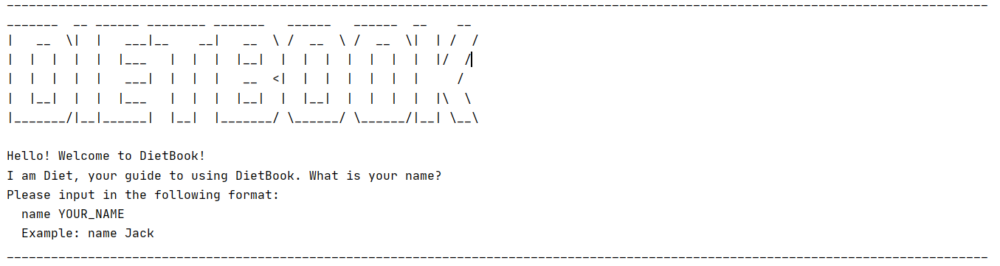

# DietBook User Guide

## Introduction
DietBook is a desktop application, optimized for use via a **Command Line Interface** (CLI). It is designed to **track your food and nutritional intake** as well as provide you with your **daily calorie recommendation**. As the application mainly targets _NUS students staying on campus_, it has a **database prepopulated with food items commonly found around NUS**. This allows for such food items to be easily added to the list of food items consumed for tracking.

* Table of Contents
{:toc} 

## Quick Start
1. Ensure that you have **Java 11** installed.
1. Download the latest version of `dietbook.jar` from [here](https://github.com/AY2021S1-CS2113-T14-4/tp/releases).
1. Copy the file to the folder you want to use as the home folder for your DietBook.
1. Navigate to the folder containing the jar file on command prompt and run the command `java -jar dietbook.jar`. 
1. Enable full-screen for a better experience but rest assure that DietBook will still function normally even in non full-screen mode.
1. For **first time users**: <br/>
A CLI, similar to the one shown below, should appear within a few seconds. Follow the instructions provided to setup DietBook or refer to [name](#entering-username-name) and [info](#entering-user-information-info) for more detailed explanations.<br/>
  
1. Start using DietBook by typing any valid command and pressing Enter to execute it.
1. Refer to the [Features](#features) section below for more details of each command or jump to [Command Summary](#command-summary) section for a list of valid commands.

## Features 

:warning: **Please take note of the following:**

* Words in `UPPER_CASE` are **parameters to be supplied** by the user.<br/> 
e.g. For `name YOUR_NAME_OR_NICKNAME`, `name Jack` would be a valid command.
  
* Parameters in **square brackets are optional**. However, if all parameters are optional, **at least one parameter needs to be given**. In such cases, any one of the parameters would be valid.<br/>
e.g. For `editinfo [n/NAME] [g/GENDER] [a/AGE] [h/HEIGHT] [o/ORIGINAL_WEIGHT] [c/CURRENT_WEIGHT] [t/TARGET_WEIGHT] [f/FITNESS_LEVEL]`, `editinfo a/31` and `editinfo h/173 o/87` are valid commands but `editinfo` is not.
 
* For commands with multiple parameters, the parameters can be in any order **only if the parameters are attached to a parameter tag** like `n/`, `a/`, etc. Otherwise, they **must be entered in the sequence as shown** in this guide, the [Help Command](#to-view-a-list-of-valid-commands-help) or the [Summary Command](#command-summary).<br/>
e.g. For `calculate NUTRIENT_TYPE [yyyy-mm-ddTHH:mm] [yyyy-mm-ddTHH:mm]`,`calculate fat 2020-07-03T23:59 2020-09-03T23:59` is valid but `calculate 2020-07-03T23:59 fat 2020-09-03T23:59` is not.<br/>
e.g. For `add i/INDEX x/PORTION_SIZE [yyyy-mm-ddTHH:mm]`, `add x/1 i/1 2020-09-03T23:59` is valid but `add i/1 2020-09-03T23:59 x/1 ` is not as time needs to be entered as the last parameter. 

* Command words and parameter indicators are **case-sensitive**.<br/>
e.g. `help` is a valid command but `Help` is not.<br/>
e.g. For `add i/INDEX x/PORTION_SIZE [yyyy-mm-ddTHH:mm]`, `add i/1 x/1 2020-07-03T23:59` is valid but `add I/1 x/1 2020-07-03T23:59` is not.

* **Spacing** to separate command word and parameters is required.<br/> 
e.g. For `calculate NUTRIENT_TYPE`, `calculate all` is valid but `calculateall` is not.

* Inappropriate usage of `/`, the forward slash, may lead to invalid commands. Only use **one** `/` in parameter tags like `n/`, `a/`, etc and avoid using `/` otherwise.

### Features related to user information

#### Entering username: `name`

Stores the user's name or nickname into DietBook during the initial setup.

Format: `name YOUR_NAME_OR_NICKNAME`

* The name given **must not be empty**.
* The name **can contain any numbers and characters except for `/`**, the forward slash.
    * FYI: DietBook accepts all characters from Dec 33 - 126 of the [ASCII table](http://www.asciitable.com/), **except Dec 47**, the forward slash `/`.
* This command is **only used when setting up DietBook for the first time**. Any subsequent editing of the name can be done using the [editinfo](#editing-user-information-editinfo) command.

Example of usage:

* `name Jack`

Output example:
```
Hi Jack!
Before we get started, I would like to know about about you so that I can make more
accurate calculations for you :). Therefore, could you please share with me the following:
- Your gender either F for female or M for male or O for others.
- Your age which is a positive integer.
- Your height in cm.
- Your original weight in kg, the weight when you first started using DietBook or you current weight.
- Your current weight in kg.
- Your target weight in kg, or your current weight if that is also your target weight.
- Your fitness level, represented by a number from 1 to 5.
  1 = You hardly engage in any exercise or have a job that requires little to no physical activity.
  2 = You engage in some form of light exercise or have a job that requires some physical activity.
  3 = You engage in moderate amount of exercise or have a job that requires moderate physical activity.
  4 = You engage in vigorous exercise or have a physically demanding job.
  5 = You engage in extremely vigorous exercise or have an extremely physically demanding job.

Please input your details in the following format:
  info g/GENDER a/AGE h/HEIGHT o/ORIGINAL_WEIGHT c/CURRENT_WEIGHT t/TARGET_WEIGHT f/FITNESS_LEVEL
  Example: info g/F a/21 h/165 o/65 c/65 t/55 f/2
```

#### Entering user information: `info`

Stores the user's personal information into DietBook during the initial setup. 

Format: `info g/GENDER a/AGE h/HEIGHT o/ORIGINAL_WEIGHT c/CURRENT_WEIGHT t/TARGET_WEIGHT f/FITNESS_LEVEL`

* This command is **only used when setting up DietBook for the first time**. Any subsequent editing of user information can be done using the [editinfo](#editing-user-information-editinfo) command.
* The gender must be either **`M` for male, `F` for female or `O` for others**.
* The age must be a positive **integer from 0 to 150, inclusive**.
* The height in cm must be a positive **integer from 1 to 300, inclusive**.
* The original, current and target weight in kg must be a positive **integer from 1 to 500, inclusive**.
* The fitness level must be a positive **integer from 1 to 5, inclusive**.
  * 1 = You hardly engage in any exercise or have a job that requires little to no physical activity.
  * 2 = You engage in some form of light exercise or have a job that requires some physical activity.
  * 3 = You engage in moderate amount of exercise or have a job that requires moderate physical activity.
  * 4 = You engage in vigorous exercise or have a physically demanding job.
  * 5 = You engage in extremely vigorous exercise or have an extremely physically demanding job.

Example of usage:

* `info g/M a/21 h/175 o/85 c/85 t/75 f/2` stores the user's gender, age, height, original, current and target weight as well as the fitness level to `male`, `21`, `175`, `85`, `85`, `75` and `You engage in some form of light exercise  or have a job that requires some physical activity.` respectively.

Output example:
```
Thank you! DietBook has been initialised and you may start by entering any valid commands.
If you require a list of valid commands, you can enter: help
```

#### Viewing user information: `userinfo`

Shows the user information stored in DietBook.

Format: `userinfo` 

Output example: 
```
Here is your information:
  Name: Jack
  Gender: male
  Age: 21
  Height: 175cm
  Original weight: 85kg
  Current weight: 85kg
  Target weight: 75kg
  Fitness level: You engage in some form of light exercise or have a job that requires some physical activity.
```

#### Editing user information: `editinfo`

Edits the user information stored in DietBook.

Format: `editinfo [n/NAME] [g/GENDER] [a/AGE] [h/HEIGHT] [o/ORIGINAL_WEIGHT] [c/CURRENT_WEIGHT] [t/TARGET_WEIGHT] [f/FITNESS_LEVEL]` 

* Although all parameters are listed as optional, **at least one of the optional fields needs to be provided**. In this case, any one of the parameters would work.
* Existing values will be updated to the input values, even if the new value given is the same as the existing value.
* The name given **must not be empty**.
* The name **can contain any numbers and characters except for `/`**, the forward slash.
    * FYI: DietBook accepts all characters from Dec 33 - 126 of the [ASCII table](http://www.asciitable.com/), **except Dec 47**, the forward slash `/`.
* The gender must be either **`M` for male, `F` for female or `O` for others**.
* The age must be a positive **integer from 0 to 150, inclusive**.
* The height must be a positive **integer from 1 to 300, inclusive**.
* The original, current and target weight must be a positive **integer from 1 to 500, inclusive**.
* The fitness level must be a positive **integer from 1 to 5, inclusive**.
  * 1 = You hardly engage in any exercise or have a job that requires little to no physical activity.
  * 2 = You engage in some form of light exercise or have a job that requires some physical activity.
  * 3 = You engage in moderate amount of exercise or have a job that requires moderate physical activity.
  * 4 = You engage in vigorous exercise or have a physically demanding job.
  * 5 = You engage in extremely vigorous exercise or have an extremely physically demanding job.

Example of usage: 

* Both `editinfo c/75 f/4` and `editinfo f/4 c/75` edits the current weight and fitness level of the user to be `75` and `You engage in vigorous exercise or have a physically demanding job.` respectively.
 
Output example: 
```
Got it! I've updated your personal information:
  Name: Jack
  Gender: male
  Age: 21
  Height: 175cm
  Original weight: 85kg
  Current weight: 75kg
  Target weight: 75kg
  Fitness level: You engage in vigorous exercise or have a physically demanding job.
```

### Features related to the food database

#### To view all food in the database: `data`

Displays a list of provided food database.

Format: `data`

Output example:
```
Here are the food items in the database:
  1. Prawn Mee Soup(Dry)(Large) | calorie : 490 | protein : 20 | carbohydrate : 30 | fats : 26
  2. Prawn Mee Soup(Dry)(Small) | calorie : 390 | protein : 15 | carbohydrate : 25 | fats : 19
  3. Fried Hokkien Prawn Mee(Large) | calorie : 470 | protein : 20 | carbohydrate : 40 | fats : 20
  4. Fried Hokkien Prawn Mee(Small) | calorie : 350 | protein : 15 | carbohydrate : 30 | fats : 15
  5. Clay Pot Chicken | calorie : 440 | protein : 15 | carbohydrate : 34 | fats : 15
  6. Black Pepper Chicken | calorie : 490 | protein : 16 | carbohydrate : 34 | fats : 16
  7. Ayam Penyet Set | calorie : 699 | protein : 30 | carbohydrate : 45 | fats : 30
  8. Steamed Chicken Set  | calorie : 475 | protein : 20 | carbohydrate : 35 | fats : 20
  9. Ikan Grouper Penyet Set | calorie : 669 | protein : 40 | carbohydrate : 50 | fats : 50
  10. kimchi fried rice | calorie : 520 | protein : 35 | carbohydrate : 45 | fats : 56
  11. ginseng chicken | calorie : 450 | protein : 32 | carbohydrate : 25 | fats : 66
  12. ramen | calorie : 530 | protein : 25 | carbohydrate : 76 | fats : 43
  13. gong cha green tea | calorie : 100 | protein : 0 | carbohydrate : 0 | fats : 0
  14. gong cha ooloong tea | calorie : 100 | protein : 0 | carbohydrate : 0 | fats : 0
  15. gong cha bubble tea | calorie : 200 | protein : 0 | carbohydrate : 0 | fats : 0
```

#### To add food from the database: `add` 

Adds a desired food in the database into the DietBook.

Format: `add i/FOOD_INDEX x/PORTION_SIZE [yyyy-mm-ddTHH:MM]`

Note : optional date time input, if not provided, the entry will have the current date time stamp
Inputting a future date time is not allowed.

Example of Usage:
* `add i/1 x/1` adds the food in the data base with index 1 with a portion of 1 at the current time
* `add i/3 x/2 2020-11-02T12:30` adds the food with index 3 with a portion of 2 at date and time 2 nov 2020 12:30

Output example:
```
  1. Prawn Mee Soup(Dry)(Large) | calorie : 490 | protein : 20 | carbohydrate : 30 | fats : 26 -- (1) [09 Nov 2020 2238]
  2. Fried Hokkien Prawn Mee(Large) | calorie : 470 | protein : 20 | carbohydrate : 40 | fats : 20 -- (2) [02 Nov 2020 1230]
```


### Features related to the food list

#### To add you own food: `add`
 
Format: `add x/PORTION_SIZE n/FOOD_NAME k/CALORIE [c/CARBOHYDRATE] [p/PROTEIN] [f/FAT]`

Examples of usage : 
* Example 1 : `add x/1 n/Salty Chicken Rice k/300 c/10 p/20 f/50`
* Output of Example 1 : 
```
Got it! I've added this food item:
  Salty Chicken Rice | calorie : 300 | protein : 20 | carbohydrate : 10 | fats : 50 -- (1)
```

* Example 2 : `add x/2 n/Chilli Pepper Crab k/400 c/10 p/10 f/20`
* Output of Example 2 :
```
Got it! I've added this food item:
  Chilli Pepper Crab | calorie : 400 | protein : 10 | carbohydrate : 10 | fats : 20 -- (2)
```

#### To view all food in DietBook: `list`

Example of usage : list

Output :
```
Here are the food items in DietBook:
  1. Salty Chicken Rice | calorie : 300 | protein : 20 | carbohydrate : 10 | fats : 50 -- (1)
  2. Salty Chicken Rice | calorie : 300 | protein : 20 | carbohydrate : 10 | fats : 50 -- (1)
  3. Chilli Pepper Crab | calorie : 400 | protein : 10 | carbohydrate : 10 | fats : 20 -- (2)
```
#### To view all food in DietBook recorded within a time period: `list`
 
Format: `list yyyy-mm-ddTHH:mm yyyy-mm-ddTHH:mm`

Example of usage : list 2020-10-29T11:30 2020-10-29T16:40

* Output :
```
Here are the food items recorded in DietBook between 29 Oct 2020 1130 and 29 Oct 2020 1640:
  1. Salty Chicken Rice | calorie : 300 | protein : 20 | carbohydrate : 10 | fats : 50 -- (1)
  2. Salty Chicken Rice | calorie : 300 | protein : 20 | carbohydrate : 10 | fats : 50 -- (1)
  3. Chilli Pepper Crab | calorie : 400 | protein : 10 | carbohydrate : 10 | fats : 20 -- (2)
```
        
#### To view all food in DietBook recorded from a certain date until now: `list yyyy-mm-ddTHH:mm`

Example of usage : list 1066-10-14T08:00

Output :
```
Here are the food items recorded in DietBook between 14 Oct 1066 0800 and 29 Oct 2020 1317:
  1. Salty Chicken Rice | calorie : 300 | protein : 20 | carbohydrate : 10 | fats : 50 -- (1)
  2. Salty Chicken Rice | calorie : 300 | protein : 20 | carbohydrate : 10 | fats : 50 -- (1)
  3. Chilli Pepper Crab | calorie : 400 | protein : 10 | carbohydrate : 10 | fats : 20 -- (2)
```
#### To delete a food from DietBook: `delete INDEX`

Example of usage : delete 2

Output : 
```
Noted. I've removed this food item:
  Salty Chicken Rice | calorie : 300 | protein : 20 | carbohydrate : 10 | fats : 50 -- (1)
```

The list after delete is done :
```
Here are the food items in DietBook:
  1. Salty Chicken Rice | calorie : 300 | protein : 20 | carbohydrate : 10 | fats : 50 -- (1)
  2. Chilli Pepper Crab | calorie : 400 | protein : 10 | carbohydrate : 10 | fats : 20 -- (2)
```

#### To delete all food items from the DietBook: clear

Example of usage : clear 

Output : 
```
All previous data has been deleted...
DietBook is now empty.
```

Before clearing : 
```
Here are the food items in DietBook:
  1. Salty Chicken Rice | calorie : 300 | protein : 20 | carbohydrate : 10 | fats : 50 -- (1)
  2. Chilli Pepper Crab | calorie : 400 | protein : 10 | carbohydrate : 10 | fats : 20 -- (2)
```

After clearing : 
```
DietBook is currently empty.
```

### Features related to nutritional intake calculation

#### Calculating nutrition intake: calculate
Calculate the amount of nutrition in the foods in intake list.

Format: `calculate NUTRITION_NAME [START_TIME] [END_TIME]`
* The NUTRITION_NAME should be one of the five cases, which are: `calorie`, `carbohydrate`, `protein`, `fat`, and `all`.
    * `calorie`: calculate the total amount of calorie from the foods in the intake list.
    * `carbohydrate`: calculate the total amount of carbohydrate from the foods in the intake list.
    * `protein`: calculate the total amount of protein from the foods in the intake list.
    * `fat`: calculate the total amount of fat from the foods in the intake list.
    * `all`: calculate the total amount of all five nutrition elements.
* Although two time inputs are listed as optional, the END_TIME is only meaningful inputted with the START_TIME.
    * `calculate NUTRITION_NAME`: calculate the amount of nutrition from all foods in the intake list.
    * `calculate NUTRITION_NAME [START_TIME]`: calculate the amount of nutrition from the foods after a time in the intake list.
    * `calculate NUTRITION_NAME [START_TIME] [END_TIME]`: calculate the amount of nutrition from the foods within a time period in the intake list.
* Two time time inputs should be in the format `yyyy-mm-ddTHH:mm`. For example: `2020-10-29T08:00`.
* The recalculated foods feature are supported. When user adds foods without carbohydrate, protein, and fat, the amount of these three nutrition elements would be recalculated assuming that they contribute to the amount of calories equally.

example usage:
* `calculate carbohydrate 2020-10-29T08:00 2020-10-29T17:00`

Output example:
```
Time period: between 29 Oct 2020 0800 and 29 Oct 2020 1700

Total carbohydrate intake: 80g
```

#### Calculating recommended calorie daily intake: recommend
Calculate the recommendation based on the person infomation.

Format: recommend
Example of usage: recommend

Output : 
```
Hi Jack!
  Here is your daily recommended calorie intake: 2607kcal
```

We use the following list as an example, to set up the list we have the following sequence of inputs
```
add x/1 n/Salty Chicken Rice k/300 c/10 p/20 f/50
add x/2 n/Chilli Pepper Crab k/400 c/10 p/10 f/20
add x/1 n/Steak Buns k/500 c/20 p/50 f/10
add x/3 n/Sweat potato tea k/300 c/30 p/0 f/0
add x/1 n/Chicken Wing Noodles k/400 c/10 p/30 f/10
list
```

```
Here are the food items in DietBook:
  1. Salty Chicken Rice | calorie : 300 | protein : 20 | carbohydrate : 10 | fats : 50 -- (1)
  2. Chilli Pepper Crab | calorie : 400 | protein : 10 | carbohydrate : 10 | fats : 20 -- (2)
  3. Steak Buns | calorie : 500 | protein : 50 | carbohydrate : 20 | fats : 10 -- (1)
  4. Sweat potato tea | calorie : 300 | protein : 0 | carbohydrate : 30 | fats : 0 -- (3)
  5. Chicken Wing Noodles | calorie : 400 | protein : 30 | carbohydrate : 10 | fats : 10 -- (1)
```

 
### Other features

#### To view a list of valid commands: `help`

Displays the helping guide for commands.

Format: `help`

Output example: 
```
Listed below are the valid commands for DietBook:
__________________________________________________________________________________________________________________________________________
__________________________________________________________________________________________________________________________________________
  userinfo    | To view user information:
              | userinfo
__________________________________________________________________________________________________________________________________________
  editinfo    | To edit user information:
              | editinfo [n/NAME] [g/GENDER] [a/AGE] [h/HEIGHT] [o/ORIGINAL_WEIGHT] [c/CURRENT_WEIGHT] [t/TARGET_WEIGHT] [f/FITNESS_LEVEL]
__________________________________________________________________________________________________________________________________________
  add         | To add a food from the database:
              | add i/INDEX x/PORTION_SIZE [yyyy-mm-ddTHH:mm]
__________________________________________________________________________________________________________________________________________
  data        | To view all food in the database:
              | data
__________________________________________________________________________________________________________________________________________
  add         | To add a food not in the database:
              | add x/PORTION_SIZE n/FOOD_NAME k/CALORIE [c/CARBOHYDRATE] [p/PROTEIN] [f/FAT] [yyyy-mm-ddTHH:mm]
__________________________________________________________________________________________________________________________________________
  list        | To view all food in DietBook:
              | list [yyyy-mm-ddTHH:mm] [yyyy-mm-ddTHH:mm]
__________________________________________________________________________________________________________________________________________
  delete      | To delete a food from DietBook:
              | delete INDEX
__________________________________________________________________________________________________________________________________________
  clear       | To delete all food items from the DietBook:
              | clear
__________________________________________________________________________________________________________________________________________
  recommend   | To get recommended calorie intake:
              | recommend
__________________________________________________________________________________________________________________________________________
  calculate   | To calculate nutritional intake:
              | calculate NUTRIENT_TYPE [yyyy-mm-ddTHH:mm] [yyyy-mm-ddTHH:mm]
              |   Valid NUTRIENT_TYPE: carb, calorie, fat, protein, all
__________________________________________________________________________________________________________________________________________
  help        | To view a list of valid commands:
              | help
__________________________________________________________________________________________________________________________________________
  exit        | To exit DietBook:
              | exit
__________________________________________________________________________________________________________________________________________
```

#### To exit DietBook: `exit`

Exits the DietBook.
 
Format: `exit`
 
Output example:
```
Bye! Hope to see you again soon!
```
 
#### Saving the DietBook: `Coming soon!`
 
Saves the DietBook data when the exit command have been input. The saved data is in 2 files: UserInfo.txt and FoodList.txt.
 
Output example:
 
```
Your data has been saved successfully.
```

## FAQ

**Q**: How do I transfer my data to another computer? 

**A**: Either download `dietbook.jar` on the other computer and overwrite the empty data files with the data files from your previous computer or copy the whole DietBook home folder from the previous computer to the new computer.
data from v2.1 is **NOT** compatible with earlier data. The data is found in `C/Users/{User name}/dietbook`. As of v2.1 the food list data is found in the folder
`Food##PORTION###dDATE##folder` and the Personal data is found in the folder `PERSONA_IS_NO_SUCH_PERSOOSOOSNSNSNS`.

## Command Summary

Action | Format, Examples
---- | ----
Enter name | **Note**: Used only when setting up DietBook for the first time.<br/>`name YOUR_NAME_OR_NICKNAME` <br/> e.g.,`name Jack`
Enter info | **Note**: Used only when setting up DietBook for the first time.<br/>`info g/GENDER a/AGE h/HEIGHT o/ORIGINAL_WEIGHT c/CURRENT_WEIGHT t/TARGET_WEIGHT f/FITNESS_LEVEL` <br/> e.g.,`info g/M a/21 h/175 o/85 c/85 t/75 f/2`
View user info | `userinfo`
Edit user info | `editinfo [n/NAME] [g/GENDER] [a/AGE] [h/HEIGHT] [o/ORIGINAL_WEIGHT] [c/CURRENT_WEIGHT] [t/TARGET_WEIGHT] [f/FITNESS_LEVEL]` <br/> e.g.,`editinfo c/75 f/4`
Calculate recommended calorie intake | `recommend`
Calculate nutrition intake | `calculate NUTRITION_NAME [START_TIME] [END_TIME]` <br/> e.g.,`calculate fat`
