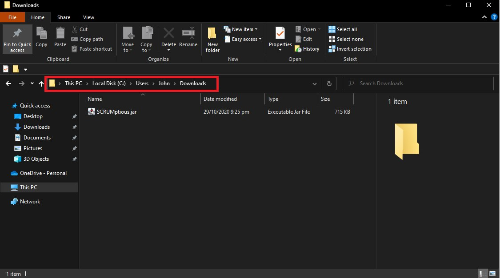

# User Guide

## Table of Contents

1. [Introduction](#introduction)<br>
&nbsp;&nbsp;1.1. [Purpose](#purpose)<br>
&nbsp;&nbsp;1.2. [Overview](#overview)<br>
&nbsp;&nbsp;1.3. [Features](#features)<br>
1. [Quick Start](#quick-start)<br>
1. [Commands](#commands)<br>
&nbsp;&nbsp;3.1. [Project `project`](#project-codeprojectcode)<br> 
&nbsp;&nbsp;&nbsp;&nbsp;&nbsp;&nbsp;&nbsp;&nbsp;3.1.1. [Create a New Project](#create-project)<br>
&nbsp;&nbsp;&nbsp;&nbsp;&nbsp;&nbsp;&nbsp;&nbsp;3.1.2. [View Project Information](#view-project-information)<br>
&nbsp;&nbsp;&nbsp;&nbsp;&nbsp;&nbsp;&nbsp;&nbsp;3.1.3. [List All Projects](#list-all-projects)<br>
&nbsp;&nbsp;&nbsp;&nbsp;&nbsp;&nbsp;&nbsp;&nbsp;3.1.4. [Select Project](#select-project)<br>
&nbsp;&nbsp;3.2. [Project Member `member`](#project-member-codemembercode)<br>
&nbsp;&nbsp;&nbsp;&nbsp;&nbsp;&nbsp;&nbsp;&nbsp;3.2.1. [Add Team Members](#add-team-members)<br>
&nbsp;&nbsp;&nbsp;&nbsp;&nbsp;&nbsp;&nbsp;&nbsp;3.2.2. [Remove Team Members](#remove-team-members)<br>
&nbsp;&nbsp;3.3. [Project Backlog `task`](#project-backlog-codetaskcode)<br>
&nbsp;&nbsp;&nbsp;&nbsp;&nbsp;&nbsp;&nbsp;&nbsp;3.3.1. [Add Tasks](#add-tasks)<br>
&nbsp;&nbsp;&nbsp;&nbsp;&nbsp;&nbsp;&nbsp;&nbsp;3.3.2. [View Tasks](#view-task)<br>
&nbsp;&nbsp;&nbsp;&nbsp;&nbsp;&nbsp;&nbsp;&nbsp;3.3.3. [Delete Tasks](#delete-tasks)<br>
&nbsp;&nbsp;&nbsp;&nbsp;&nbsp;&nbsp;&nbsp;&nbsp;3.3.4. [Change the Priority of Tasks](#change-the-priority-of-a-tasks)<br>
&nbsp;&nbsp;&nbsp;&nbsp;&nbsp;&nbsp;&nbsp;&nbsp;3.3.5. [Mark Tasks as Complete](#mark-task-as-complete)<br>
&nbsp;&nbsp;&nbsp;&nbsp;&nbsp;&nbsp;&nbsp;&nbsp;3.3.6. [View Tasks by descending priority](#view-tasks-in-descending-priority)<br>
&nbsp;&nbsp;3.4. [Sprint `sprint`](#sprint-codesprintcode)<br>
&nbsp;&nbsp;&nbsp;&nbsp;&nbsp;&nbsp;&nbsp;&nbsp;3.4.1. [Create a New Sprint](#create-a-new-sprint)<br>
&nbsp;&nbsp;&nbsp;&nbsp;&nbsp;&nbsp;&nbsp;&nbsp;3.4.2. [View Sprint Information](#view-sprint-information)<br>
&nbsp;&nbsp;&nbsp;&nbsp;&nbsp;&nbsp;&nbsp;&nbsp;3.4.3. [Edit Sprint Goal](#edit-sprint-goal)<br>
&nbsp;&nbsp;&nbsp;&nbsp;&nbsp;&nbsp;&nbsp;&nbsp;3.4.4. [Add Tasks to the Sprint](#add-tasks-to-the-sprint)<br>
&nbsp;&nbsp;&nbsp;&nbsp;&nbsp;&nbsp;&nbsp;&nbsp;3.4.5. [Delete Tasks from the Sprint](#delete-tasks-from-sprint)<br>
&nbsp;&nbsp;&nbsp;&nbsp;&nbsp;&nbsp;&nbsp;&nbsp;3.4.6. [Allocate Tasks to Team Members](#allocate-tasks-to-team-members)<br>
&nbsp;&nbsp;&nbsp;&nbsp;&nbsp;&nbsp;&nbsp;&nbsp;3.4.7. [Deallocate Tasks from Team Members](#deallocate-tasks-from-team-members)<br>
&nbsp;&nbsp;3.5. [Storage `storage`](#storage-codestoragecode)<br>
&nbsp;&nbsp;&nbsp;&nbsp;&nbsp;&nbsp;&nbsp;&nbsp;3.5.1. [Clear Storage](#clear-storage)<br>
&nbsp;&nbsp;3.6. [Help `help`](#help-codehelpcode)<br>
&nbsp;&nbsp;&nbsp;&nbsp;&nbsp;&nbsp;&nbsp;&nbsp;3.6.1. [Help Menu](#help-menu)<br>
&nbsp;&nbsp;&nbsp;&nbsp;&nbsp;&nbsp;&nbsp;&nbsp;3.6.2. [Project Help](#project-help)<br>
&nbsp;&nbsp;&nbsp;&nbsp;&nbsp;&nbsp;&nbsp;&nbsp;3.6.3. [Member Help](#member-help)<br>
&nbsp;&nbsp;&nbsp;&nbsp;&nbsp;&nbsp;&nbsp;&nbsp;3.6.4. [Task Help](#task-help)<br>
&nbsp;&nbsp;&nbsp;&nbsp;&nbsp;&nbsp;&nbsp;&nbsp;3.6.5. [Sprint Help](#sprint-help)<br>
&nbsp;&nbsp;&nbsp;&nbsp;&nbsp;&nbsp;&nbsp;&nbsp;3.6.6. [Storage Help](#storage-help)<br>
&nbsp;&nbsp;3.7. [Exit application `bye`](#exit-application-codebyecode)<br>
1. [Command Summary](#command-summary)


## 1. Introduction

### 1.1. Purpose
This document is the User Manual of the SCRUMptious. It is intended to provide all the necessary information to use this software.  

### 1.2. Overview
SCRUMptious is a command-line project management software, designed for project managers who adopt the [SCRUM](https://www.scrumguides.org/scrum-guide.html) methodology.  

### 1.3. Features   
* Manage multiple projects
* Breakdown projects into smaller iterations known as **sprints**
* Manage tasks in the form of **backlog** items
* Assign tasks to different **sprint** iterations
* Assign tasks to team members


## 2. Quick Start

1. Ensure that you have Java 11 or above installed.
1. Download the latest version of `Scrumptious.jar` from [here](https://github.com/AY2021S1-CS2113T-F11-4/tp/releases/download/v2.0/SCRUMptious.jar).
1. Ensure that you have a functional Command Line Interface (CLI).
1. Navigate to the folder where the `Scrumptious.jar` is located at. (E.g. `cd "C:\Users\John\Downloads"`)
  

1. Run the command `java -jar Scrumptious.jar`. Ensure that the `Scrumptious.jar` file path is specified correctly according to where you copied it to.
    ```
    User@This-PC:~/$ java -jar Scrumptious.jar
       _____  _____ _____  _    _ __  __       _   _  
      / ____|/ ____|  __ \| |  | |  \/  |     | | (_) 
     | (___ | |    | |__) | |  | | \  / |_ __ | |_ _  ___  _   _ ___
      \___ \| |    |  _  /| |  | | |\/| | '_ \| __| |/ _ \| | | / __|
      ____) | |____| | \ \| |__| | |  | | |_) | |_| | (_) | |_| \__ \ 
     |_____/ \_____|_|  \_\\____/|_|  |_| .__/ \__|_|\___/ \__,_|___/ 
                                        | |
                                        |_|
    WELCOME TO SCRUMPTIOUS
    command>
    ```
1. Type the command `project /create -title Scrumptious -desc A java project -dur 30 -sd 10` 
into the command line and press `Enter` to execute it.
1. If the setup is correct, you will be able to view the project by executing `project /view`:
   ```
   command> project /create -title Scrumptious -desc A java project -dur 30 -sd 10
   Project successfully created.
       Title: Scrumptious
   command> project /view
   ====================== PROJECT ======================
   [ID: 1]
   [Title: Scrumptious ]
   [Description: A java project ]
   [No members added]
   [Project will start along with the first sprint]
   [Project backlog is empty]
   [There are no Sprints]
   =====================================================
   ```

## 3. Commands   

### 3.1. Project `project`
#### 3.1.1. Create Project
Create a new project.  
##### Format: `project /create -title <title> -desc <description> -dur <duration> -sd <sprint interval>`
##### Constraints: 
* All tags are to be specified when creating a new project.  
##### Mandatory Tags:  
* `-title` Specify the title of the project.
* `-desc` Specify the project description.
* `-dur` Specify the duration of the project. (Number of days)
* `-sd` Specify the duration of a sprint. (Number of days)
##### Example: `project /create -title MeTube -desc video streaming software -dur 90 -sd 10`
* Creates a project titled MeTube which is a video streaming software. 
* The project will last for 90 days and the sprints will run on a 10 day interval.
##### Expected Outcome:
```
Project successfully created.
    Title: MeTube
```

#### 3.1.2. View Project Information
View project information which includes title, description, time-period and team members of the project. It displays the project backlog, and the details of the ongoing sprint.
##### Format: `project /view`
##### Example: `project /view`
##### Expected Outcome:
 ```
====================== PROJECT ======================
[Title: MeTube ]
[ID: 1]
[Description: video streaming software ]
[No members added]
[Project will start along with the first sprint]
[Project backlog is empty]
[There are no Sprints]
=====================================================
```
  
#### 3.1.3. List All Projects
Outputs a list of all projects added by the user. A summary page which shows the project `id`, project `description` and project `title`.
##### Format: `project /list`
##### Example: `project /list`
##### Expected Outcome:
```
Following are the added projects: 
  	ID Title 		Description
  	2) Scrump 	CLI Software Development Project
  	1) MeTube 	video streaming software
```

#### 3.1.4. Select Project 
Select the project that will be referenced to for any other commands. To get the `id` of all the projects added by
 the user, you can execute `project /list`.
##### Format: `project /select <id>`
##### Constraints: 
* A project corresponding to `id` exists.
##### Example: `project /select 2`
##### Expected Outcome:
```
Project 2 has been selected.
```

### 3.2. Project Member `member`
#### 3.2.1. Add Team Members
Add team member(s) into the project.  
##### Format: `member /add <username> [<username> ...]`
##### Constraints:
* At least one username must be specified
* Username must be an alphanumeric String without spaces
##### Example: `member /add john mary`
##### Expected Outcome:
```
john has been added to the project.
mary has been added to the project.
```


#### 3.2.2. Remove Team Members
Remove team member(s) from the project
##### Format: `member /del <username> [<username> ...]`
##### Constraints:
* At least one username must be specified
* Username must be an alphanumeric String
##### Example: `member /del john mary`
##### Expected Outcome:
```
john has been removed from the project.
mary has been removed from the project.
```

### 3.3. Project Backlog `task`
#### 3.3.1. Add Task
Add a task to the project backlog.
##### Format: `task /add -title <title> -desc <description> -priority <category>`
##### Constraints:
* The title, description and category must be specified, otherwise the task is not added.
* The priority entered must belong to the standard options as prescribed by the enum: [“HIGH”, “MEDIUM”, “LOW”]
* The task will be added as "not done" status. Users need to manually mark a task as done after creation.
* Tasks can only be created if a project has been created.
##### Example: `task /add -title Add UI -desc add an interactive UI -priority HIGH`
* Adds a task of title `Add UI`, description `add an interactive UI` and priority `HIGH` into the backlog.
##### Expected Outcome
(Assuming there are no prior tasks created)
```
Task successfully created.
[Task]
        ID: 1
        Title: Add UI
        Description: add an interactive UI
        Priority: High priority
        Completion: Incomplete
        Task have yet to be assigned to anyone
```

#### 3.3.2. View Task(s)
Display the information of the specified task.
##### Format: `task /view <taskid> [<taskid>...]`
##### Constraints:
* The task ID entered must be a positive integer smaller or equal to the total number of tasks added, and must be specified.
##### Example: `task /view 3 6 9`
* Views the third, sixth and ninth task.
##### Expected Outcome:
(Assuming the tasks have the following attributes respectively:
Title: `Foo`,`Bar`,`FooBar` , Description: `one`,`two`,`three`, Priority: `HIGH`,`MEDIUM`,`LOW`, Done: `false`,`false`,`true`)
```
The details of the tasks are as follows:
[Task]
    ID: 3
    Foo
    Description: one
    Priority: High priority
    Completion: Incomplete
[Task]
    ID: 6
    Bar
    Description: two
    Priority: Medium priority
    Completion: Incomplete
[Task]
    ID: 9
    FooBar
    Description: three
    Priority: Low priority
    Completion: Completed
 ```

#### 3.3.3. Delete Task(s)
Delete the specified task from the project backlog.
##### Format: `task /del <taskid> [<taskid>...]`
##### Constraints:
* There must be at least one supplied task ID for deletion.
* Each task ID supplied must be a positive integer smaller or equal to the total number of tasks added.
##### Example: `task /del 5 7 9`
* Deletes the fifth, seventh and ninth task.
##### Expected Outcome:
(Assuming the tasks have the following titles, respectively: `Add parser`, `Del UI` and `UI`)
```
The corresponding task Add parser has been removed from project.
The corresponding task Del UI has been removed from project.
The corresponding task UI has been removed from project.
```

#### 3.3.4. Change the Priority of a Task
Change the priority of the specified task.
##### Format: `task /priority -priority <category> -id <taskid>`
##### Constraints:
* Task ID and priority level must be entered.
* The Task ID entered must be a positive integer smaller or equal to the total number of tasks added.
* The priority entered must belong to the standard options as prescribed by the enum: [“HIGH”, “MEDIUM”, “LOW”]
##### Example: `task /priority -priority HIGH -id 1`
* Sets the first task with a priority of HIGH, regardless of its previous priority level
##### Expected Outcome: (Assuming task 1 has title `Add parser`)
```
The task Add parser has its priority changed to:
        High priority
```

#### 3.3.5. Mark Task(s) as Complete
Mark specified task as complete.
##### Format: `task /done <taskid> [<taskid>...]`
##### Example: `task /done 1 2 3`
* Marks the first task as done.
##### Constraints:
* There must be at least one supplied task ID for marking of completion.
* Each task ID supplied must be a positive integer smaller or equal to the total number of tasks added.
##### Expected outcome: (Assuming the tasks have titles `Add parser`, `Foo` and `Bar` respectively)
```
Add parser has been marked as done.
Foo has been marked as done.
Bar has been marked as done.
```

#### 3.3.6. View Tasks in descending priority
Views all tasks in current project, arranged by their priority. The higher priority tasks are shown first.
##### Format: `task /priorityview`
##### Constraints: 
* There are no parameters for this command. Any parameters added will be ignored.
##### Expected outcome: (Assuming there are 3 tasks with titles `Foo` of high priority, `Bar` of low priority and `FooBar` of medium priority respectively)
```
The details of the tasks, in descending priority, are as follows: 
[Task]
	ID: 1
	Title: Foo
	Description: abcdefg
	Priority: High priority
	Completion: Incomplete
	Task have yet to be assigned to anyone
[Task]
	ID: 3
	Title: FooBar
	Description: abcdefg
	Priority: Medium priority
	Completion: Incomplete
	Task have yet to be assigned to anyone
[Task]
	ID: 2
	Title: Bar
	Description: abcdefgh
	Priority: Low priority
	Completion: Incomplete
	Task have yet to be assigned to anyone
```

### 3.4. Sprint `sprint`
In SCRUMptious, a project will be broken down into smaller iterations known as **sprints**. After planning and creating the sprints, you can allocate tasks to these iterations and assign them to members of the project later on.

The following section will explain the commands to manage sprints.

#### 3.4.1. Create a New Sprint
Create a new sprint for the project.
##### Format: `sprint /create -goal <goal_input> [-start YYYYMMDD] [-project <id>]`
##### Constraints:   
* Project must be created.
##### Mandatory Tag:
* `-goal` Specify the goal for the sprint.
##### Optional Tags:   
* `-start` Specify the start date of the sprint.
    * Format: Start date must be in `YYYYMMDD` format.  
    * Example: `sprint /create -goal UI -start 20201010` - New sprint to start on 10 October 2020. 
    * If not specified: Start date will be the day the command executes.
    * Note: 
      * If this is the first sprint of the project, the date specified will be the start date for both the project and sprint.
      * Otherwise, this tag will be ignored.
* `-project` Specify the project using its ID that will hold the new Sprint. 
    * Example: `sprint /create -goal UI -start 20201010 -project 3` - New Sprint to be added to Project 3.    
    * If not specified: Last selected project will own the new Sprint. (see [Select Project](#select-project))
##### Example: `sprint /create -goal Shopping Cart -start 20201010`
##### Expected Outcome:
```
[Project ID: 1]
Project will start along with the newly created sprint
Project period: 2020-10-10 to 2020-11-08

============================ SPRINT =============================
[ID: 1]
[Goal: Shopping Cart ]
[Period: 2020-10-10 - 2020-10-19] 
[No allocated tasks]
=================================================================
```
  
#### 3.4.2. View Sprint Information
Display the information of the current or specified sprint.
##### Format: `sprint /view [optional tags]`
##### Constraints:   
* Project must be created.
* Sprint must be created. 
##### Optional Tags:
* No optional tag: View the ongoing sprint in the select project.
    * Example: `sprint /view`  
* No optional tag but specify the Sprint using its ID.
    * Example: `sprint /view 2` - View the second sprint of the selected Project.                                                                                    
* `-project` Specify the Project using its ID. 
    * Example: `sprint /view -project 2` - View the current sprint of the Project 2.
    * If not specified: Selected Project determined by the [Project select command](#select-project) will be chosen.
* `-sprint` Specify the Sprint using its ID.
    * Example: `sprint /view -project 2 -sprint 3` - View the third sprint of the Project 2.
    * If not specified: Ongoing Sprint.         
##### Example: `sprint /view`
##### Expected Outcome:
```
[Project ID: 1] 
========================= CURRENT SPRINT ========================
[ID: 1]
[Goal: Shopping Cart ]
[Period: 2020-10-10 - 2020-10-19] 
[Remaining: 4 days]
[No allocated tasks]
=================================================================
```
#### 3.4.3. Edit Sprint Goal                                                                                                       
Edit the Sprint goal of the selected sprint.                                                                                                  
##### Format: `sprint /edit -goal <goal_input> [optional tags]`                                                                     
##### Constraints:                                                                                                                    
* Project must be created. 
* Sprint must be created.                                                                                                           
* `goal` must be specified.                                                                                                           
##### Mandatory Tag:                                                                                                                  
* `-goal` Specify the new goal for the sprint.                                                                                            
##### Optional Tags:                                                                                                                  
* No optional tag: Edit the ongoing sprint in the select project.                                                                          
    * Example: `sprint /edit -goal Add Documentation` - Edit the goal for the ongoing sprint in the select project.                                         
* `-project` Specify the Project using its ID.                                                                           
    * Example: `sprint /edit -project 2 -goal Add Documentation` - Edit the goal for the ongoing sprint in Project 2.                                     
    * If not specified: Selected Project determined by the [Project select command](#select-project) will be chosen. 
* `-sprint` Specify the Sprint using its ID.                                                                                                               
    * Example: `sprint /edit -project 2 -sprint 3 -goal Add Documentation` - Edit the goal for the third sprint in Project 2.                                                               
    * If not specified: Ongoing Sprint.                                                                                                                                   
##### Example: `sprint /edit -goal Add Documentation`                                                                   
##### Expected Outcome:                                                                                                               
```                                                                                                                                   
[Project ID: 1]                                                                                                                                                                                                                                                                                                                                                                                                                       
============================ SPRINT =============================                                                                     
[ID: 1]                                                                                                                               
[Goal: Add Documentation]                                                                                                                
[Period: 2020-10-10 - 2020-10-19]                                                                                                     
[No allocated tasks]                                                                                                                  
=================================================================                                                                     
```                                                                                                                                   


  
#### 3.4.4. Add Tasks to the Sprint
Add task(s) from the project backlog to the current sprint.
##### Format: `sprint /addtask <task_id> [<task_id> ...] [optional tags]`
##### Constraints:
* Project must be created. 
* Sprint must be created.
* `task_id` must be a positive integer.
* At least one `task_id` must be specified .
* Specified tasks must exist in project backlog.
##### Mandatory Tag:
* Without tag: Specify the tasks to add to Sprint.
    * Cannot be used with other optional tags.
    * Example: `sprint /addtask 1 2` - Add Task 1 and 2 to Sprint.                       
* `-task` Specify the tasks to add to Sprint.
    * Must be used if other optional tags are used.
    * Example: `sprint /addtask -task 1 2` - Add Task 1 and 2 to Sprint.  
##### Optional Tags:                                                                                                                                                                                              
* All the following optional tags must be used with the `-task` tag as specified above.
* `-project` Specify the Project using its ID.                                                                              
    * Example: `sprint /addtask -project 2 -task 1 2` - Add Task 1 and 2 to current Sprint in Project 2.                                        
    * If not specified: Selected Project determined by the [Project select command](#select-project) will be chosen.    
* `-sprint` Specify the Sprint using its ID.                                                                                
    * Example: `sprint /addtask -project 2 -sprint 3 -task 1 2` - Add Task 1 and 2 to the third sprint of the Project 2.                              
    * If not specified: Ongoing Sprint.                                                                        

##### Example: `sprint /addtask 1 3 4`
##### Expected Outcome:
```
[Project ID: 1]
    DummyTask1 added to sprint 1.
    DummyTask3 added to sprint 1.
    DummyTask4 added to sprint 1.
```
  
#### 3.4.5. Delete Tasks from Sprint
Remove task(s) from the current sprint.
##### Format: `sprint /removetask <task_id> [<task_id> ...] [optional tags]`
##### Constraints:                              
* Project must be created.                           
* Sprint must be created.                            
* `task_id` must be a positive integer.         
* At least one `task_id` must be specified .    
* Specified tasks must exist in Sprint.
##### Mandatory Tag:                                                                                                      
* Without tag: Specify the tasks to remove from Sprint.                                                                   
    * Cannot use with other optional tags.                                                                            
    * Example: `sprint /removetask 1 2` - Remove Task 1 and 2 from Sprint.                                                        
* `-task` Specify the tasks to remove from Sprint.                                                                        
    * Must be used if other optional tags are used.                                                                       
    * Example: `sprint /removetask -task 1 2` - Remove Task 1 and 2 from Sprint.                                                  
##### Optional Tags:                                                                                                      
* All the following optional tags must be used with the `-task` tag as specified above.                                   
* `-project` Specify the Project using its ID.                                                                            
    * Example: `sprint /removetask -project 2 -task 1 2` - Remove Task 1 and 2 from the ongoing Sprint in Project 2.                  
    * If not specified: Selected Project determined by the [Project select command](#select-project) will be chosen.  
* `-sprint` Specify the Sprint using its ID.                                                                              
    * Example: `sprint /removetask -project 2 -sprint 3 -task 1 2` - Remove Task 1 and 2 from the third sprint of the Project 2.  
    * If not specified: Ongoing Sprint.                                                                      

##### Example: `sprint /removetask 1 3 4`
##### Expected Outcome:
```    
[Project ID: 1]
    DummyTask1 removed from sprint 1.
    DummyTask3 removed from sprint 1.
    DummyTask4 removed from sprint 1.
```
  
#### 3.4.6. Allocate Tasks to Team Members
Assign task(s) to team member(s).
##### Format: `sprint /allocate  -task <task_id> -user <user_id> [<user_id> ...] [optional tags]`
##### Constraints:                        
* Project must be created.
* Sprint must be created. 
* `task_id` must be a positive integer    
* `task_id` must be specified.             
* At least one `user_id` must be specified
* Specified tasks must exist in Sprint.  
* Specified members must exist in Project.  
##### Mandatory Tag:                                                                                                             
* `-task` Specify the task to be allocated.
* `-user` Specify the user(s) to be assign with a task.                                                                                                                                                                                                                                                                                                          
##### Optional Tags:                                                                                                                                                      
* `-project` Specify the Project using its ID.                                                                                   
    * Example: `sprint /allocate -project 2 -task 1 -user mary` - In the ongoing Sprint in Project 2, allocate Task 1 to mary.            
    * If not specified: Selected Project determined by the [Project select command](#select-project) will be chosen.         
* `-sprint` Specify the Sprint using its ID.                                                                                     
    * Example: `sprint /allocate -project 2 -sprint 3 -task 1 -user mary` - In the third Sprint in Project 2, allocate Task 1 to mary.
    * If not specified: Ongoing Sprint.                                                                                          

##### Example: `sprint /allocate -task 1 2 -user johntan mary jane`
##### Expected Outcome:
```
[Project ID: 1]
[Sprint ID: 1]
DummyTask1 is assigned to [johntan, mary, jane]
DummyTask2 is assigned to [johntan, mary, jane]  
```       

#### 3.4.7. Deallocate Tasks from Team Members                                                                                             
Deallocate a task from team member(s).                                                                                                     
##### Format: `sprint /deallocate -task <task_id> -user <user_id> [<user_id> ...] [optional tags]`                                      
##### Constraints:                                                                                                                     
* Project must be created.                                                                                                             
* Sprint must be created.                                                                                                              
* `task_id` must be a positive integer.                                                                                                 
* `task_id` must be specified.                                                                                                          
* At least one `user_id` must be specified.                                                                                             
* Specified tasks must exist in Sprint.                                                                                                
* Specified members must exist in Project.
* All specified task must be allocated to all specified members.                                                                                          
##### Mandatory Tag:                                                                                                                   
* `-task` Specify the task to be deallocated.                                                                                             
* `-user` Specify the user(s) to be deallocated from the task.                                                                                 
##### Optional Tags:                                                                                                                   
* `-project` Specify the Project using its ID.                                                                                         
    * Example: `sprint /deallocate -project 2 -task 1 -user mary` - In the ongoing Sprint in Project 2, deallocate Task 1 from mary.         
    * If not specified: Selected Project determined by the [Project select command](#select-project) will be chosen.               
* `-sprint` Specify the Sprint using its ID.                                                                                           
    * Example: `sprint /deallocate -project 2 -sprint 3 -task 1 -user mary` - In the third Sprint in Project 2, deallocate Task 1 to mary. 
    * If not specified: Ongoing Sprint.                                                                                                
                                                                                                                                       
##### Example: `sprint /deallocate -task 1 2 -user johntan mary jane`                                                                    
##### Expected Outcome:                                                                                                                
```                                                                                                                                    
[Project ID: 1]                                                                                                                        
[Sprint ID: 1]                                                                                                                         
DummyTask1 is removed to [johntan, mary, jane]                                                                                        
DummyTask2 is removed to [johntan, mary, jane]                                                                                        
```  
  
### 3.5. Storage `storage`

#### 3.5.1. Clear Storage  
Clear all the data from the program and the persistent storage.  
You will be prompted to confirm your decision by giving an input. Data will be cleared only when `y` (case-insensitive) is provided.  
**[WARNING]** This action will delete **ALL** the data and is **irreversible**!  

##### Format: `storage /clear`

##### Example: `storage /clear`
##### Expected Outcome:
_Clear data_  
```
command> storage /clear
[!WARNING!] Are you sure? This command is irreversible! (y/N) y
All data has been cleared!
```    
_Abort clear data_  
```
command> storage /clear
[!WARNING!] Are you sure? This command is irreversible! (y/N) N
Data clear aborted.
```    

### 3.6. Help `help`

#### 3.6.1 Help Menu
Shows a list of commands needed to use SCRUMptious. You can then type in the command number
to receive more information about that specific command.

##### Format: `help`
##### Example: `help`
##### Expected Outcome:
```
Here is the list of commands used in SCRUMptious. Type "help /*", where * is the command number for more information on that specific command.
1. Project
2. Member
3. Task
4. Sprint
5. Storage
```

#### 3.6.2 Project Help
Shows a list of project commands and examples of how to use them.

##### Format: `help /1`
##### Example: `help /1`
##### Expected Outcome:
```
1. Create project
   Format: project /create -title <title> -desc <description> -dur <duration> -sd <sprint interval>
   Example: project /create -title MeTube -desc video streaming software -dur 90 -sd 10
2. View project
   Format & example: project /view
3. Select project
   Format: project /select <projectid>
   Example: project /select 1
```

#### 3.6.3 Member Help
Shows a list of member commands and examples of how to use them.

##### Format: `help /2`
##### Example: `help /2`
##### Expected Outcome:
```
1. Add members
   Format: member /add <username> [<username> ...]
   Example: member /add john mary
2. Remove members
   Format: member /del <username> [<username> ...]
   Example: member /del john mary
```

#### 3.6.4 Task Help
Shows a list of task commands and examples of how to use them.

##### Format: `help /3`
##### Example: `help /3`
##### Expected Outcome:
```
1. Add tasks 
   Format: task /add -title <title> -desc <description> -priority <category>
   Example: task /add -title Add UI -desc add an interactive UI -priority HIGH
2. Delete tasks
   Format: task /del <taskid> [<taskid>...]
   Example: task /del 5 7 9
3. View task
   Format: task /view <taskid>
   Example: task /view 3
4. Change task priority
   Format: task /priority -priority <category> -id <taskid>
   Example: task /priority -priority HIGH -id 1
5. Mark task as complete
   Format: task /done <taskid>
   Example: task /done 1
```

#### 3.6.5 Sprint Help
Shows a list of sprint commands and examples of how to use them.

##### Format: `help /4`
##### Example: `help /4`
##### Expected Outcome:
```
1. Create sprint
   Format: sprint /create -goal <goal_input> [optional tags]
   Example 1: sprint /create Shopping Cart -start 20201010
   Example 2: sprint /create -goal UI -start 20201010
   Example 3: sprint /create -goal UI -start 20201010 -project 3
2. View sprint
   Format: sprint /view [optional tags]
   Example 1: sprint /view
   Example 2: sprint /view 2
   Example 3: sprint /view -project 2
   Example 4: sprint /view -project 2 -sprint 3
3. Edit sprint
   Format: sprint /edit -goal <goal_input> [optional tags]
   Example 1: sprint /edit -goal Add Documentation
   Example 2: sprint /edit -project 2 -goal Add Documentation
   Example 3: sprint /edit -project 2 -sprint 3 -goal Add Documentation
4. Add tasks to sprint
   Format: sprint /addtask <task_id> [<task_id> ...] [optional tags]
   Example 1: sprint /addtask 1 2
   Example 2: sprint /addtask -task 1 2
   Example 3: sprint /addtask -project 2 -task 1 2
   Example 4: sprint /addtask -project 2 -sprint 3 -task 1 2
5. Delete tasks from sprint
   Format: sprint /removetask <task_id> [<task_id> ...] [optional tags]
   Example 1: sprint /removetask 1 2
   Example 2: sprint /removetask -project 2 -task 1 2
   Example 3: sprint /removetask -project 2 -sprint 3 -task 1 2
6. Allocate task to team members
   Format: sprint /allocate -task <task_id> -user <user_id> [<user_id> ...] [optional tags]
   Example 1: sprint /allocate -task 1 2 -user johntan mary jane
   Example 2: sprint /allocate -project 2 -task 1 -user mary
   Example 3: sprint /allocate -project 2 -sprint 3 -task 1 -user mary
7. Deallocate tasks from team members
   Format: sprint /deallocate -task <task_id> -user <user_id> [<user_id> ...] [optional tags]
   Example 1: sprint /deallocate -task 1 2 -user johntan mary jane
   Example 2: sprint /deallocate -project 2 -task 1 -user mary
   Example 3: sprint /deallocate -project 2 -sprint 3 -task 1 -user mary
```

#### 3.6.6 Storage Help
Shows the storage command, and an example of how to use it.

##### Format: `help /5`
##### Example: `help /5`
##### Expected Outcome:
```
1. Clear all data. You will be prompted to confirm the decision.
   Data will be cleared if "y" (case-insensitive) is provided.
   Format: storage /clear
   Example: storage /clear
```

### 3.7. Exit application `bye`
Exits the application. Rest assured that your data have been saved by the application.

##### Format: `bye`
##### Expected Outcome:
`bye` and program terminates.

## 4. Command Summary

| **Action** | **Format** | **Examples** |
| --- | --- | --- |
| Create Project | `project /create -title <title> -desc <description> -dur <duration> -sd <sprint interval>` | `project /create -title MeTube -desc video streaming software -dur 90 -sd 10` |
| View Project Information | `project /view` | `project /view` |
| List All Projects | `project /list` | `project /list` |
| Select Project | `project /select <id>` | `project /select 2`|
| Add Team Members | `member /add <username> [<username> ...]` | `member /add john mary` |
| Remove Team Members | `member /del <username> [<username> ...]` | `member /del john mary` |
| Add Tasks | `task /add -title <title> -desc <description> -priority <category>` | `task /add -title Add UI -desc add an interactive UI -priority HIGH` |
| View Task | `task /view <taskid> [<taskid>...]` | `task /view 3 6 9` |
| Delete Tasks | `task /del <taskid> [<taskid>...]` | `task /del 5 7 9` |
| Change the Priority of a Tasks | `task /priority -priority <category> -id <taskid>` | `task /priority -priority HIGH -id 1` |
| Mark Task as Complete | `task /done <taskid> [<taskid>...]` | `task /done 1 2 3` |
| Create Sprint | `sprint /create -goal <goal_input> [-start YYYYMMDD] [-project <id>]` | `sprint /create -goal UI -start 20201010` |
| View Sprint  | `sprint /view [optional tags]` | `sprint /view` |
| Edit Sprint Goal | `sprint /edit -goal <goal_input> [optional tags]` | `sprint /edit -goal Add Documentation` |
| Add Tasks to the Sprint | `sprint /addtask <task_id> [<task_id> ...] [optional tags]` | `sprint /addtask 1 3 4` |
| Delete Tasks from Sprint | `sprint /removetask <task_id> [<task_id> ...] [optional tags]` | `sprint /removetask 1 3 4` |
| Allocate Tasks to Team Members | `sprint /allocate  -task <task_id> -user <user_id> [<user_id> ...] [optional tags]` | `sprint /allocate -project 2 -task 1 -user mary` |
| Deallocate Tasks from Team Members | `sprint /deallocate -task <task_id> -user <user_id> [<user_id> ...] [optional tags]` | `sprint /deallocate -project 2 -sprint 3 -task 1 -user mary` |
| Clear Storage | `storage /clear` | `storage /clear` |
| Exit program | `bye` | `bye` |
| Help Menu | `help` | `help /1` |

