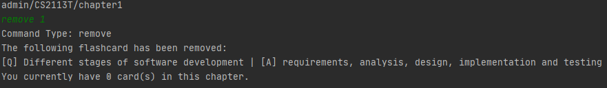
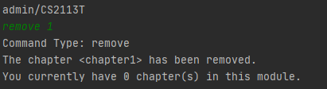
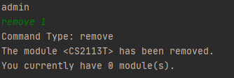
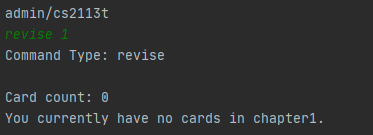
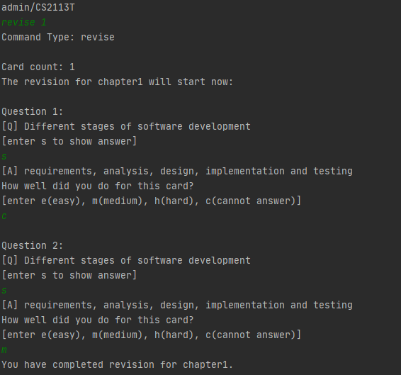

# User Guide

## Introduction

KAJI is a schedule manager that implements Spaced Repetition, optimised for use via a Command Line Interface (CLI).

## Quick Start

1. Ensure that you have Java 11 or above installed.
1. Download the latest version of `Kaji` from [here](https://github.com/AY2021S1-CS2113T-F11-3/tp/releases).
1. Copy the file to the folder you want to use as the <I>home folder</I> for your Kaji.
1. Double-click the file to start the app or open a command window in the folder you saved Kaji and run the command `java -jar kaji.jar`. You should see the welcome message `Welcome to Kaji` as well as a list of commands available.
1. Type the command in the command box and press Enter to execute it. 
   e.g. typing `help` and pressing Enter will open the help window. 
   Some example commands you can try:
   * `help` : List commands available
   * `exit` : Exits the app.
1. Refer to the Features below for details of each command.

## Features 

### Listing commands available: `help`
Shows a list of commands available.

Format: `help`

### Adding a new module / chapter / flashcard: `add`
Adds a module / chapter / flashcard to the schedule manager.

Format:  
`add MODULE_NAME` 
`add CHAPTER_NAME` 
`add q:QUESTION | a:ANSWER` 
        
* You can only add content to the level below the one you are on

Example of usage: 
* At Admin Level: `add CS2113T` Adds a new module `CS2113T`
* At Module Level: `add Chapter 1` Adds a new chapter `Chapter 1`
* At Chapter Level: `add q:1+1= | a:2` Adds a new flashcard with question as `1+1=` and answer as `2`

### Removing a module/chapter/flashcard: `remove`

To remove a module/chapter/flashcard from Kaji, you may use the `remove` command:

Format:  
`remove MODULE_INDEX`  
`remove CHAPTER_INDEX`  
`remove FLASHCARD_INDEX`  

* Removes content from the level directly below your current level.
* Removes the module/chapter/flashcard based on the index provided.
* The index refers to the index number shown in the module/chapter/flashcard list. 
* Index provided **must be a positive integer** 1, 2, 3, ...

Example of Usage: 
* At Admin level: `remove 1` removes a module with index 1 and the chapters and flashcards under it.
* At Module level: `remove 1` removes a chapter with index 1 and flashcards under it.
* At Chapter level: `remove 1` removes a flashcard with index 1.

Sample Output:

* Removing a flashcard:

* Removing a chapter:

* Removing a module:

### Listing modules / chapters / flashcards available: `list`
Shows a list of modules / chapters / flashcards available, depending on the level you are on.

Format: `list`

### Listing due chapters: `due`
Shows a list of all chapters that are due by the execution date.

Format: `due`

### Accessing the next level: `go`
Allows user to access a module / chapter.

Format:  
`go MODULE_NAME` 
`go CHAPTER_NAME` 

* You can only access the level directly below the current level

Example of Usage: 
* At Admin Level: `go CS2113T` allows you to access the module CS2113T
* At Module Level: `go Chapter 1`  allows you to access the chapter Chapter 1
        

### Returning to the previous level: `back`
Allows you to access the previous level. 

Format: `back`

### Editing the data you have created: `edit`
Modifies the category name / deck name / flashcard content.

Format:  
`edit INDEX MODULE_NAME` 
`edit INDEX CHAPTER_NAME` 
`edit INDEX q:QUESTION | a:ANSWER` 

* You can only edit content on the level below the one you are on
* Edit the name / content at the specified `INDEX`
* The index refers to the index number shown in the displayed content list
* The index <b>must be a positive integer</b> 1, 2, 3, …

Example of usage: 
* At Admin Level: `edit 1 CS2113T` changes current Module name at index 1 to CS2113T
* At Module Level: `edit 2 Chapter 2` changes current Chapter name at index 2 to Chapter 2 
* At Chapter Level: `edit 3 q:1+1= | a:2` changes current Flashcard content at index 3 to q:1+1= | a:2

### Starting a revision session: `revise`

To start a revision session in Kaji, you may use the `revise` command:

Format:  `revise CHAPTER_INDEX` 

* Starts a revision based on the index provided. 
* Revision can only be done at module level. 
* The index refers to the index number shown in the chapter list for the module level you are currently in.  
* Index provided **must be a positive integer** 1, 2, 3, ...

Example of Usage: 

* At Module level: `revise 1` starts a revision for the chapter with index 1.

Sample Output:

* Starting a revision with an empty chapter:

* Starting a revision with a chapter that is not due:

* Starting a revision with a chapter that is due:

### Rate a chapter: `rate`
Allows you to rate a chapter. You may only use it on the module level.

Format: 
`rate INDEX`

* You can only rate chapter on the **exact module level** where the chapter stored.
* Rate the chapter at the specified `INDEX`
* The index refers to the index number shown in the displayed chapter list
* The index **must be a positive integer** 1, 2, 3, …

Example of Usage: 

* At Module level: `rate 2` allows you to modify the rate of chapter with index 2.

Sample Output: 

* Rating chapter successfully for a chapter with index 2:

* Entering an out of range index:

* Entering a wrong rate format command:

### Check your overall performance for a chapter: `showrate`
Allows you to check your overall performance of each chapter. You may only use it on the chapter level.

Format: 
`showrate`

* You can only use this command at **chapter level**.
* This command will show you your overall performance by calculating percentage of card in each master level.

Example of Usage: 

* At Chapter level: `showrate` allows you to check your overall performance in the current chapter.

Sample Output: 

* Checking overall performance of a chapter:

* Entering a command with wrong format:

* When there is no card in the chapter:

### Exiting the program: `exit`
Exits the program.

Format: `exit`

## Command Summary

{Give a 'cheat sheet' of commands here}

* Add todo `todo n/TODO_NAME d/DEADLINE`
