#  SmartHomeBot User Guide 

SmartHomeBot is a **desktop application that consolidates all home appliance’s control into a 
centralized system via a Command Line Interface (CLI)**. Users can switch on or off appliances using this application
and review and monitor electricity usage; having a clearer picture of their electrical usage patterns.
SmartHomeBot has an auto-save feature that will automatically save all the appliances' data
and export it to a text file. Upon the start of the application, it will import the data 
from the text file and loads the appliances' data back.

## Table of Contents
* [Quick start](#quick-start)
* [Features](#features) 
  * [Viewing help: `help`](#viewing-help-help) 
  * [Creating a location: `create`](#creating-a-location-create)
  * [Removing a location: `remove`](#removing-a-location-remove)
  * [Adding an appliance : `add`](#adding-an-appliance-add)
  * [Deleting an appliance: `delete`](#deleting-an-appliance-delete)
  * [Switching on an appliance: `on`](#switching-on-an-appliance-on)
  * [Switching off an appliance: `off`](#switching-off-an-appliance-off)
  * [Listing all the locations/appliances: `list`](#listing-all-the-locations-or-appliances-list)
  * [Displaying the usage of appliance: `usage`](#displaying-the-usage-of-appliance-usage)
  * [Resetting all power usage in application: `p_reset`](#resetting-all-power-usage-in-application-p_reset)
  * [Exiting the application: `exit`](#exiting-the-application-exit)
  * [Saving the data](#saving-the-data)
* [Command summary](#command-summary)

## Quick start

1.  Ensure you have Java `11` or above installed in your Computer.

2.  Download the latest `SmartHomeBot.jar` from [here](https://github.com/AY2021S1-CS2113-T14-1/tp/releases/latest). 

3.  Copy the file to the folder you want to use as the home folder for your SmartHomeBot.

4.  Open your command prompt as administrator. Then input java -jar **c:pathtojarfile.jar** in 
Command Prompt and press ENTER. Replace the **c:pathtojarfile.jar** with the actual path and 
file title of the Jar. The display similar to the below should appear in a few seconds.
    
    
     
5.  Type the command in the command box and press Enter to execute it. 
e.g. typing `exit` and pressing Enter, it will exit the program.
Some example commands you can try:
    *   `create Bedroom1`: 
         Creates a 'location' named "Bedroom 1" in SmartHomeBot. 
         
    *   `remove Bedroom1`: 
         Remove a 'location' named "Bedroom 1" in SmartHomeBot.
            
    *   `list location`: 
         Lists all the location.
             
6.  Refer to the Features below for details of each command.

## Features 

   **Notes about the command format**
    
   * Words in **[UPPER_CASE]** are the parameters to be supplied by the user.
     e.g. `create [LOCATION_NAME]`, LOCATION_NAME is a parameter which can be used as 
   `create Bedroom1`.
   * Words in **[UPPER_CASE]** are case-sensitive.
   * Words in **[LOCATION_NAME]** and **[APPLIANCE_NAME]** has to be unique and not duplicate of each other. 
   * Words in **[LOCATION_NAME]** and **[APPLIANCE_NAME]** cannot contain `space` or ` \ `.

### Viewing help: `help`
Shows all available commands to the user

Format: `help`

Example: `help`
Output: 
   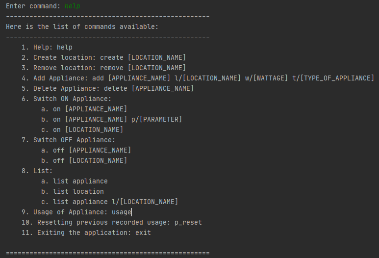   
  
### Creating a location: `create`
Adds a new location with a name. 

Format: `create [LOCATION_NAME]` 
* `LOCATION_NAME` must be a unique name 

Example: `create Bedroom1`

Output: 

   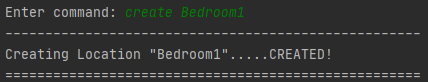 

  
### Removing a location: `remove`
Removes an added location with its name in the list. 

Format: `remove [LOCATION_NAME]`

Example: `remove Bedroom1`

Output: 

   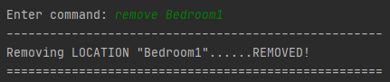 

> Note: If there are appliances in the Location of 'LOCATION_NAME' when removing, it will be deleted as well. 

  
### Adding an appliance: `add`
Adds an appliance to the location created previously. 

Format: `add [APPLIANCE_NAME] l/[LOCATION_NAME] w/[WATTAGE] t/[TYPE_OF_APPLIANCE]`
* `[APPLIANCE_NAME]` must be a unique name.
* `[LOCATION_NAME]` must be an existing location created by `create` command.
* `[WATTAGE]` must be an `int` value.
* `[TYPE_OF_APPLIANCE]` must be one of the type in the following list. 

List of `TYPE_OF_APPLIANCE` 
1. `fan`
2. `light`
2. `aircon`
3. `smartplug`

Example: `add AIRCON1 l/Bedroom1 w/3500 t/aircon`

Output: 

  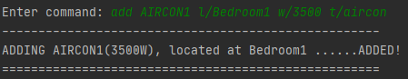 

  
### Deleting an appliance: `delete`
Deletes an appliance base on its name in the list. 

Format: `delete [APPLIANCE_NAME]`

Example: `delete AIRCON1`

Output: 

  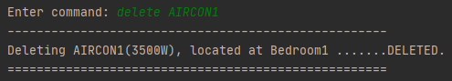 
   
  
### Switching on an appliance: `on` 
Switches ON an appliance base on its name in the list. 

Format: `on [APPLIANCE_NAME]` or `on [APPLIANCE_NAME] p/[PARAMETER]` or `on [LOCATION_NAME]`

1. `on [APPLIANCE_NAME]`: Switch ON the appliance by its name.
2. `on [APPLIANCE_NAME] p/[TEMPERATURE]`: Switch ON the appliance by its name with parameter for air-conditioner.
3. `on [APPLIANCE_NAME] p/[SPEED]`: Switch ON the appliance by its name with parameter for fan.
4. `on [LOCATION]`: Switch ON every appliance in the location. 

Example: `on AIRCON1`

Output: 
   
   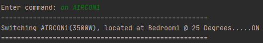 
   
Example: `on AIRCON1 p/27`

Output: 
   
   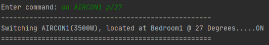 

Example: `on FAN1 p/3`

Output: 
   
   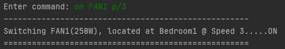 

Example: `on bedroom1`

Output: 
   
   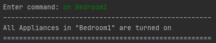 

   
### Switching off an appliance: `off`
Switches OFF an appliance base on its name in the list. 

Format: `off [APPLIANCE_NAME]` or `off [LOCATION]`

Example: `off AIRCON1`

Output: 
   
   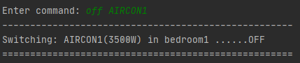 

Example: `off bedroom1`

Output: 
   
   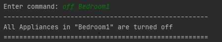 

   
### Listing all the locations OR appliances: `list`
List out all the appliances or all the location currently stored.

Format: `list appliance` or `list location` or `list appliance l/[LOCATION_NAME]`
* `list appliance` will list all the appliances entered by the user.
* `list location` will list all the locations entered by the user.
* `list appliance l/[LOCATION_NAME]` will list all the appliances in the location entered by the user.

Example: `list location`

Output: 
   
   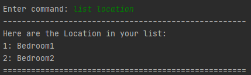 

Example: `list appliance`

Output: 
   
   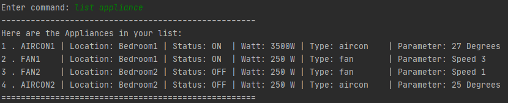 

Example: `list appliance l/bedroom1`

Output: 
   
   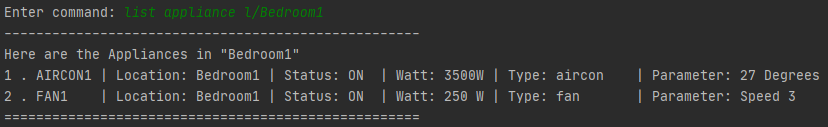 

   
### Displaying the recorded usage of appliance: `usage`
Display the current power usage of all appliances and total power consumption monitored within SmartHomeBot. 

Format: `usage`

Output: 
   
   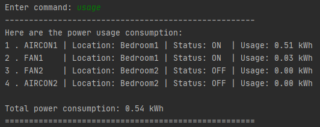 

   
### Resetting all power usage in application: `p_reset`
Reset the previous recorded power usage of all appliances and total power consumption to zero. Note that if appliance remains **ON**, its usage will be reset to zero, monitoring process continues, as the appliance remains running.

Format: `p_reset`

Output: 
   
   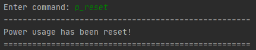 

   
### Exiting the application: `exit`
Exits the application and switch off all appliances within SmartHomeBot. The monitoring of all appliances will be stop.

Format: `exit`
   
  

### Saving the data
SmartHomeBot will auto-save the task list data in the hard disk after 
any command that changes the data. There is no need to save manually.

## FAQ

**Q**: How do I transfer my data to another Computer?

**A**: Install the app in the other computer and overwrite the empty data file it creates with the file 
that contains the data of your previous SmartHomeBot folder.

## Command summary

Function | Format | Example 
-------- |--------|-------- 
Help|`help`
Create location|`create [LOCATION_NAME]`|`create Bedroom 1`
Remove location|`remove [LOCATION_NAME]`|`remove Bedroom 1`
Add appliance|`add [APPLIANCE_NAME] l/[LOCATION_NAME] w/[WATTAGE] t/[TYPE_OF_APPLIANCE]`|`add AIRCON1 l/Bedroom 1 w/3500 t/airconditioner`
Delete appliance|`delete [APPLIANCE_NAME]`|`delete AIRCON1`
Switch On|`on [APPLIANCE_NAME]`|`on AIRCON1`
Switch Off|`off [APPLIANCE_NAME]`|`off AIRCON1`
List|`list appliance` or `list location`
Usage|`usage`
Reset|`p_reset`
Exit|`exit`
