# **WatchNext** User Guide

- [**WatchNext** User Guide](#watchnext-user-guide)
  - [1. Introduction](#1-introduction)
    - [1.a. What is **WatchNext**?](#1a-what-is-watchnext)
    - [1.b. Why use **WatchNext**?](#1b-why-use-watchnext)
    - [1.c. What will this guide do?](#1c-what-will-this-guide-do)
  - [2. Quick Start](#2-quick-start)
  - [3. Command Format](#3-command-format)
  - [4. Features](#4-features-br)
      - [4.a. `help` and `example` - Provides a condensed help list](#4a-help-and-example---provides-a-condensed-help-list)
      - [4.b. `add` - Adds a show](#4b-add---adds-a-show)
      - [4.c. `edit` - Edits your show details](#4c-edit---edits-your-show-details)
    - [4.d. `addreview` - Adding a review](#4d-addreview---adding-a-review)
    - [4.e. `changereview` - Changing a review](#4d-addreview---adding-a-review)
    - [4.f. `deletereview` - Deletes a review](#4f-deletereview---deletes-a-review)
    - [4.g. `list` - Displays all your shows in the list](#4g-list---displays-all-your-shows-in-the-list)
    - [4.h. `delete` - Deletes your show](#4h-delete---deletes-your-show)
    - [4.i. `deleterating` - Deletes rating of your show](#4i-deleterating---deletes-rating-of-your-show)
    - [4.j. `changerating` - Changes rating of your show](#4j-changerating---changes-rating-of-your-show)
    - [4.k. `episode` - Changes the episode of the show you are currently watching](#4k-episode---changes-the-episode-of-the-show-you-are-currently-watching)
    - [4.l. `season` - Changes the season of the show you are currently watching](#4l-season---changes-the-season-of-the-show-you-are-currently-watching)
    - [4.m. Managing your watch time limit](#4m-managing-your-watch-time-limit)
    - [4.m.a. `watch` - Watch a show in your watchlist](#4ma-watch---watch-a-show-in-your-watchlist)
    - [4.m.b. `updatetimelimit` - update your watch time limit](#4mb-updatetimelimit---update-your-watch-time-limit)
    - [4.n. `search` - search a show in the watchlist](#4n-search---search-a-show-in-the-watchlist)
    - [4.o. `bye` - Exits the program](#4o-bye---exits-the-program)
- [5. FAQ](#5-faq)
- [6. Command Summary](#6-command-summary)

## 1. Introduction

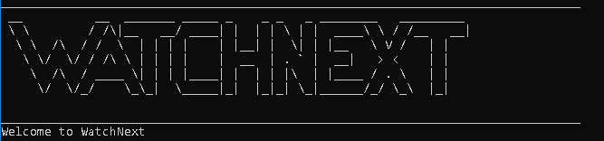

#### **WatchNext** is a show tracker made for teenagers and young adults.
   
### 1.a. What is **WatchNext**?

**WatchNext** is a show tracker designed for users who watch their favourite shows on multiple free streaming platforms and other open source streaming websites.
**WatchNext** records your progress for the different shows you are currently watching, and even for upcoming shows that you plan to watch.
 It additionally serves as a tracker to limit your weekly watch time to help you better manage your time.
 For students, **WatchNext** serves the same purpose of tracking your learning progress for lectures and webcasts.
  This motivated our team to create an application that would not only help track all your shows and lectures, 
but also foster a community where everyone will be able to share their watchlist with like-minded individuals and friends.  

### 1.b. Why use **WatchNext**?
It is difficult and can be taxing to track your favourite shows through browser bookmarks.
This is especially pertinent for younger teenagers and adults who make up a large part of video entertainment media consumers.

For students, there is also a need to manually track lecture videos and webcast progress as lecturers may use different learning management systems.

**WatchNext** is optimized for users who prefer to work with the Command Line Interface (CLI).  

### 1.c. What will this guide do?

This guide aims to equip you with the knowledge on how to use our application by providing you with detailed examples for all of **WatchNext's** features. 
The features can be found in [Section 4: “Features”](#4-features-br).

Interested in using **WatchNext**? Jump to [Section 2: “Quick Start”](#2-quick-start) to get started now!
  
## 2. Quick Start

Prerequisite: Ensure that you have Java 11 installed in your Computer.

1. Download the latest version from [here](https://github.com/AY2021S1-CS2113T-W12-3/tp/releases).

2. Copy the file to the folder you want to use as the home folder for your program.

3. Open a command window in that folder.

4. Run the command `java -jar WatchNext.jar`.

5. You will be greeted with this:

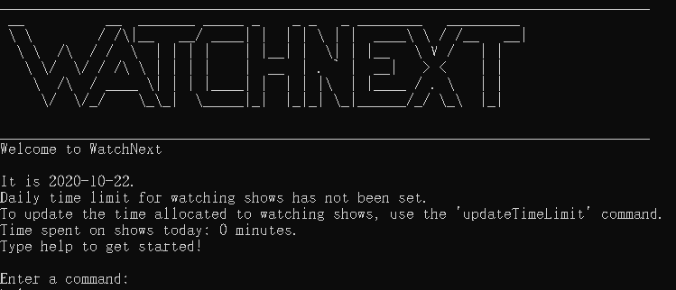

&nbsp;  

If you are unfamilar with the CLI (Command Line Interface), do give this helpful [guide](https://www.cs.princeton.edu/courses/archive/spring14/cos126/precepts/CommandPromptTutorial.pdf) by Princeton a quick read!

## 3. Command Format

* Words in `UPPER_CASE` and within the `<>` field are the inputs that need to be supplied by the user e.g. rating `<SCORE>`.

* The maximum length for a Show `SHOWNAME` is 100 characters.

* The `<SHOWNAME>` to be entered is case-sensitive.  

## 4. Features  

#### 4.a. `help` and `example` - Provides a condensed help list

 The `help` command provides a list which contains information about all the possible accepted commands.
 
 Format:
  `help`
  
 Example of usage: Let's say you want a quick description of each available command in **WatchNext**. Simply typing `help`
 will display a condensed list of each command and description to you.
  
Expected outcome:
 
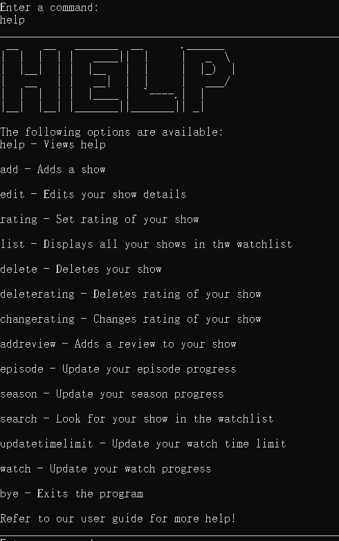
 
&nbsp;

 >  **[NOTE]**
 >
 >  * The `help` command does not provide the correct format. The `example` command below provides the correct format for each command.

To supplement the `help` command, The `example` command provides the correct format for every command available in **WatchNext**.
 
 Format:
  `example`

Expected outcome:
 
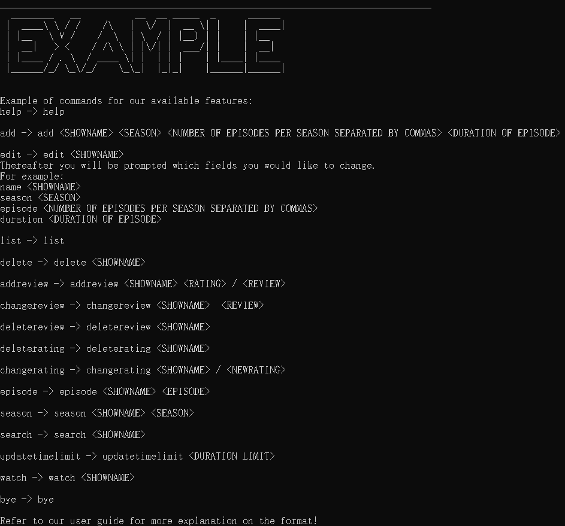

&nbsp;

 >  **[NOTE]**
 >  * The command format listed by the `example` command adheres to the same rules as the [command format in this user guide](#3-command-format).
 >  * The `example` command is meant to be a quick refresher on the correct format, and is in no way meant to replace the user guide.Please refer to the user guide if you want a better understanding of each command.

#### 4.b. `add` - Adds a show
 The `add` command adds a show into your existing watchlist.
 
  Format:
   `add <SHOWNAME> <NUMBER OF SEASONS> <NUMBER OF EPISODES PER SEASON> <DURATION OF EPISODE>`
   
   Examples of usage: 
     `add RunningMan 2 10,12 90`  
     `add Friends 3 10,20,30 25`   
  Explanation of input:  
  For the example input, `add Friends 3 10,20,30 25`, a show named `Friends` is being added.  The show has `3` seasons, where season 1 has `10` episodes, season 2 has `20` and season 3 has `30` episodes.
   _Note how the `10`,`20` and `30` are separated by commas without spaces in between._ 
  The duration of each episode is `25` minutes. 
 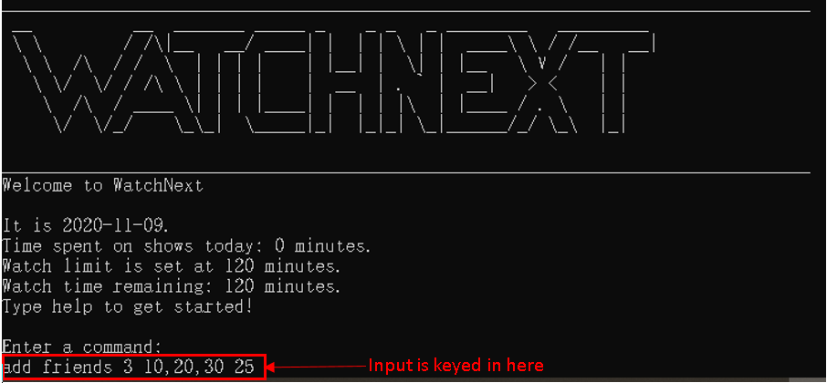
  &nbsp;
 After keying in the input as shown in the image above, the next image shows the expected output.
 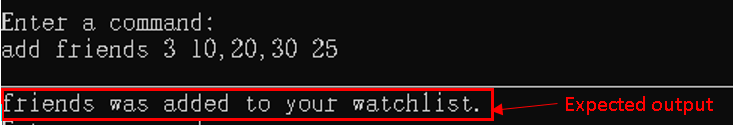
  &nbsp;
 If you see the outcome as pictured above, it means that the show has been successfully added to **WatchNext**.

 >  **[NOTE]**
 >
 >  * The `<DURATION OF EPISODE>` input, which is `25` in the Friends example, is in minutes.
 >
 >  * If a show has 3 seasons, you will need to input the number of episodes for all three seasons in the `<NUMBER OF EPISODES PER SEASONS>` field. The program will not add the show into the watchlist otherwise.
 >  
 >  * You will need to input `<SHOWNAME>` as one word. If the name of your show contains more than one word you will need to input the name with no spaces (an example would be `<RunningMan>` or you may use `_` to represent a space and use `Running_Man`.)
   
 

 
#### 4.c. `edit` - Edits your show details
 The `edit` command allows you to edit the name of the show, number of seasons, number of episodes, or the duration 
 of an episode depending on the input of the user when prompted.
  
 
* Suppose you want to edit details for your favorite show, friends.
  Format:
     `edit <SHOWNAME>`
     
* Input in the following format to use the edit feature
  Example of usage:
      `edit friends`
    
     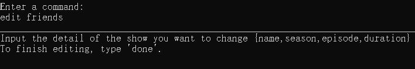
     
[Output](Insert picture here)

 * You will be prompted thereafter to enter the fields you want to change such as:
 name, season, episode, duration (of an episode).
 
Format:
    `name <SHOWNAME>`, `season <NUMBER OF SEASONS>`, `episode <NUMBER OF EPISODES PER SEASON,SEPERATED BY COMMAS>`, `duration <DURATION OF EPISODE>`

* Suppose you would like to update the name of the show
Example of usage:
     `name F.r.i.e.n.d.s` 
     
* A new season of F.r.i.e.n.d.s just started airing and you would like to update your show details from 1 season to 2.
Example of usage:
     `season 2`
     
* Suppose the first season has 10 episodes and the new season of F.r.i.e.n.d.s has 11 episodes.
Example of usage:
     `episode 10,11`
     
* The duration of each episode of F.r.i.e.n.d.s is extended to 30 minutes
Example of usage:
     `duration 30`
     
* When you have completed all changes, input `done`.
Example of usage:
    `done`
 
> **[NOTE]**
>
>  * The `<DURATION OF EPISODE>` can either be inputted in minutes, such as `duration 30` or in hours and minutes
> such as `duration 1h25m` .
>
>  * The program will wait for your command to edit the show details until you input `done`.

 
 Expected outcome:
  
 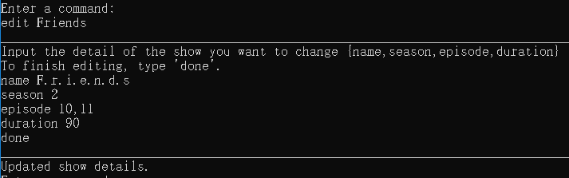
  
 &nbsp;
 
 To help you better understand the flow of this command we have included a program flow diagram to illustrate the process.
 
 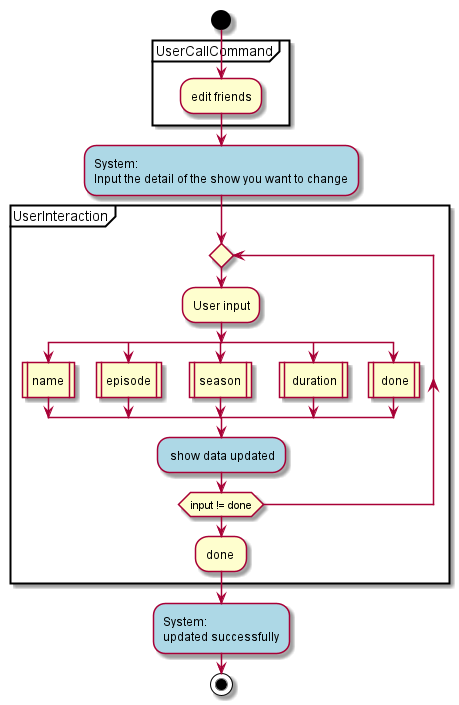
 
 The blue bubbles represent the Program portion of the interaction, while the yellow bubbles indicate the user input

 &nbsp;
 
### 4.d. `addreview` - Adding a review

The `addreview` command allows you to add a review for a show, including adding a rating.

 Format:
  `addreview <SHOWNAME> <RATING> / <REVIEW>`
  
  > **[NOTE]**
  >
  > * The `<RATING>` is out of 10. The rating will not be added if it is not a value between 0 and 10.

 Example of usage:
 `addreview Friends 9 / very funny `
 
   Expected outcome:
 
  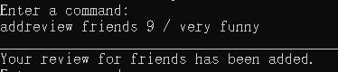

   &nbsp;
   
### 4.e. `changereview` - Changing a review

The `changereview` command allows you to change a review for a show that is already in the show list.

 Format:
  `changereview <SHOWNAME> / <REVIEW>`
  
   > **[NOTE]**
   >
   > * You can change the rating of your show with the [changerating](#4j-changerating---changes-rating-of-your-show) command.

  
 Example of usage:
 `changereview friends / very unfunny `
 
   Expected outcome:
   
  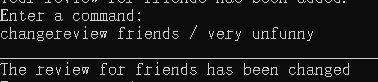
     
### 4.f. `deletereview` - Deletes a review

The `deletereview` command allows you to delete a review for a show that is already in the show list.

 Format:
  `deletereview <SHOWNAME>`
  
 Example of usage:
 `deletereview Friends `
 
   Expected outcome: 
   
  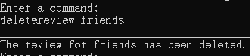
 
### 4.g. `list` - Displays all your shows in the list

The `list` command displays all existing shows in your watchlist in an easy-to-read format, including the episode and
season that you are currently at.

The rating of your show will also be shown if you have added it using the [addreview](#4d-addreview---adding-a-review) command.

   Format:
    `list`
    
   Example of usage:
   `list`
   
   Expected outcome:
    
   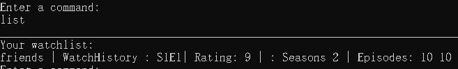
    
   &nbsp;

### 4.h. `delete` - Deletes your show

 The `delete` command removes a specified show from the watchlist.
 
 Format:
  `delete <SHOWNAME>`
  
 Example of usage:
 `delete Friends`
 
 Expected outcome:
  
 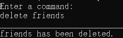

 &nbsp;
  
 
### 4.i. `deleterating` - Deletes rating of your show

The `deleterating` command deletes the rating for an existing show in the watchlist.

 Format:
  `deleterating <SHOWNAME>`
  
 Example of usage:
 `deleterating Friends`
 
 Expected outcome:
  
 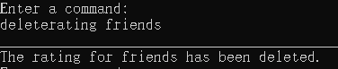

 &nbsp;

### 4.j. `changerating` - Changes rating of your show

The `changerating` command changes the rating for an existing show which already has a rating in the watchlist.

 Format:
  `changerating <SHOWNAME> / <NEWRATING>`
  
  > **[NOTE]**
  >
  > * The `<NEWRATING>` is out of 10. The rating will not be added if it is not a value between 0 and 10.
  
 Example of usage:
 `changerating Friends 10`
 
 Expected outcome:
  
 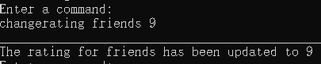
  
 &nbsp;

### 4.k. `episode` - Changes the episode of the show you are currently watching

The `episode` command updates the current episode of an existing show in your watchlist.

> **[NOTE]**
> 
> * This command changes the current episode that you are watching in your watch history. To change the number of episodes a show has, use the [edit](#4c-edit---edits-your-show-details) command. 

 Format:
  `episode <SHOWNAME> <EPISODE>`
  
 Example of usage:
 `episode Friends 10`
 
 Expected outcome:
  
 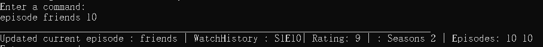
  
 &nbsp;
 
### 4.l. `season` - Changes the season of the show you are currently watching

The `season` command updates the current season of an existing show in your watchlist.

> **[NOTE]**
>
> * This command changes the current season that you are watching in your watch history. To change the number of episodes a show has, use the [edit](#4c-edit---edits-your-show-details) command. 

 Format:
  `season <SHOWNAME> <SEASON>`
  
 Example of usage:
 `season Friends 3`
 
 Expected outcome:
  
 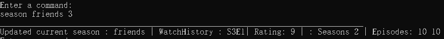
  
 &nbsp;

### 4.m. Managing your watch time limit

 **WatchNext** allows you to set and track your daily watch time with its two commands , `watch` and `updatetimelimit`. 
 
### 4.m.a. `watch` - Watch a show in your watchlist

The `watch` command updates the watching progress for your show, and automatically updates your watch time limit.

 Format:
  `watch <SHOWNAME> `
  
 Example of usage:
 `watch friends`
 
  > **[NOTE]**
  > * The show name must have already been added into the list.
  > * Refer to our section on [adding a show](#4b-add---adds-a-show) if you need help with adding a show into your watch list. 
 
 Explanation of input: Assuming `friends` has already been added into the watch list, we use the example input `watch friends`. 
 
 Before input:
 
 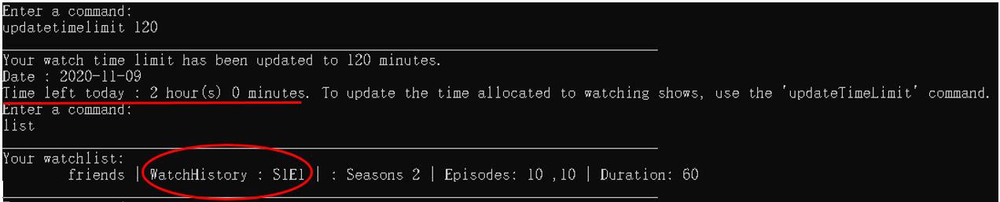
 &nbsp;
 To illustrate the change in your watch time limit, we have added the time limit to 120 minutes.
 The duration of the show friends is 60 minutes. the change in time limit can be seen in the expected outcome below. 
 
 
 Expected outcome:
  
 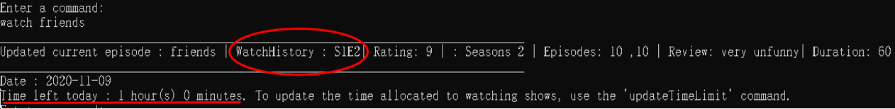
  
 &nbsp;
 
 Note from the expected outcome that the show WatchHistory has been updated from S1E1 to S1E2. That is because you have told the program that you have watched S1E1 of friends, and 
 are now watching S1E2 of friends! 
 
 In addition, the previously set time limit of 120 minutes has been reduced to 60 minutes.
 
### 4.m.b. `updatetimelimit` - update your watch time limit

The `updatetimelimit` command updates your current watch time limit.

 Format:
  `updatetimelimit <DURATION LIMIT> `
  
 > **[NOTE]**
 >
 > * `<DURATION LIMIT>` should be entered in minutes. Your set duration will be stored until the next day.
 >
 > * If you have watched a show before updating your time limit, it will automatically be taken into account after you enter the `updatetimelimit` command.
 
 Example of usage:
 `updatetimelimit 120 `
 
 Expected outcome:
  
 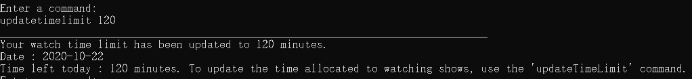
  
 &nbsp;

### 4.n. `search` - search a show in the watchlist  

The `search` command helps you search for a specific show in the watchlist and prints out the show information.  

 Format:
 `search <SHOWNAME>`  
 
 Example of usage:
 `search Friends`  
 
 > **[NOTE]**
 >
 > * The `<SHOWNAME>` is case-sensitive.
  
 Expected output:
 
 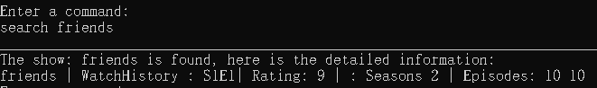  
 
 &nbsp;
  
### 4.o. `bye` - Exits the program

The `bye` command exits the program.

Format:
 `bye`
 
Example of usage:
`bye`

Expected outcome:
 
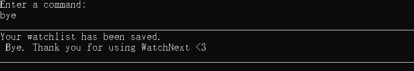
 
&nbsp;

### 5. FAQ 
 

**Q**: Is my watchlist saved after I exit the program?  

**A**: Of course! The watchlist is saved into a local storage file after every input entered by the user.The same file will be loaded up when you start **WatchNext** again.     

**Q**: Where can I find the watchlist file if I want to share it with my friends?  

**A**: The file will be stored in the same path as the jar file, inside the "data" folder. Look for `data/userData.txt`.     

**Q**: Can I edit my watchlist directly in the local file?  

**A**: Yes, it is possible but not recommended. The save file stores the data in a specific format. If the format is not consistent, **WatchList** will be unable to load up file. Your stored shows may disappear.     

**Q**: What should I do if there was an error while I was typing in some input?

**A**: It depends on the nature of the error. WatchNext provides insightful error messages which will inform and guide you on any actions necessary.    

**Q**: What format should I use if I want to track my lectures?  

**A**: We suggest you try `add <MODULENAME> <TOPICS> <NUMBER OF LECTURES PER TOPIC,SEPERATED BY COMMAS> <DURATION OF LECTURE>`.However, feel free to be creative and think of any format that suits you!   

 

### 6. Command Summary

This section showcases the list of available features and usage examples for your reference.
             

|Action|Format|Example|
|--------|----------|---------------|
|Display help| `help`| `help`|
|Add show|`add <SHOWNAME> <SEASON> <NUMBER OF EPISODES>,<EPISODE YOU ARE WATCHING> <DURATION OF EPISODE>` |`add Friends 2 10,10 90`|
|Edit show |`edit <SHOWNAME>`| `edit Friends`|
|Add review |`addreview <SHOWNAME> <RATING> / <REVIEW>`| `addreview Friends 9 / very funny`|
|Change review |`changereview <SHOWNAME> / <REVIEW>`| `changereview Friends / very unfunny`|
|Delete review |`deletereview <SHOWNAME>`| `deletereview Friends`|
|Show watchlist |`list`|  `list`|
|Delete show |`delete <SHOWNAME>`| `delete Friends`|
|Change rating |`changerating <SHOWNAME> <NEWSCORE>`| `changerating Friends 10`|
|Delete rating |`deleterating <SHOWNAME>`|  `deleterating Friends`|
|Update episode |`episode <SHOWNAME> <EPISODE>`|  `episode Friends 10`|
|Update season |`season <SHOWNAME> <SEASON>`|   `season Friends 3`|
|Watch a show  |`watch <SHOWNAME>`|  `watch Friends`|
|Update watch time limit |`updatetimelimit <DURATION LIMIT>`|   `updatetimelimit 100`|
|Search a show |`search <SHOWNAME>`|  `search Friends`|
|Exit program |`bye`|   `bye`|

