# Kaji - User Guide
By: `Team F11-3` Since: `August 2020`
## Table of content
1. [Overview](#1-overview) 
1.1. [About Kaji](#11-about-kaji) 
1.2. [About this User Guide](#12-about-this-user-guide) 
1.3. [Understanding the Command Line Interface (CLI)](#13-understanding-the-command-line-interface-cli) 
1.4. [Understanding Kaji](#14-understanding-kaji) 
&nbsp;&nbsp;&nbsp;&nbsp;&nbsp;&nbsp;&nbsp;1.4.1. [Content Management](#141-content-management) 
&nbsp;&nbsp;&nbsp;&nbsp;&nbsp;&nbsp;&nbsp;1.4.2. [Schedule Management](#142-schedule-management) 
2. [Quick Start](#2-quick-start) 
3. [Features](#3-features) 
3.1. [Admin Level](#31-admin-level) 
&nbsp;&nbsp;&nbsp;&nbsp;&nbsp;&nbsp;&nbsp;3.1.1. [Adding a module: `add`](#311-adding-a-module-add) 
&nbsp;&nbsp;&nbsp;&nbsp;&nbsp;&nbsp;&nbsp;3.1.2. [Listing modules available: `list`](#312-listing-modules-available-list) 
&nbsp;&nbsp;&nbsp;&nbsp;&nbsp;&nbsp;&nbsp;3.1.3. [Editing a module name: `edit`](#313-editing-a-module-name-edit) 
&nbsp;&nbsp;&nbsp;&nbsp;&nbsp;&nbsp;&nbsp;3.1.4. [Removing a module: `remove`](#314-removing-a-module-remove) 
&nbsp;&nbsp;&nbsp;&nbsp;&nbsp;&nbsp;&nbsp;3.1.5. [Accessing the module level: `go`](#315-accessing-the-module-level-go) 
3.2. [Module Level](#32-module-level) 
&nbsp;&nbsp;&nbsp;&nbsp;&nbsp;&nbsp;&nbsp;3.2.1. [Adding a chapter: `add`](#321-adding-a-chapter-add) 
&nbsp;&nbsp;&nbsp;&nbsp;&nbsp;&nbsp;&nbsp;3.2.2. [Listing chapters available: `list`](#322-listing-chapters-available-list) 
&nbsp;&nbsp;&nbsp;&nbsp;&nbsp;&nbsp;&nbsp;3.2.3. [Editing a chapter name: `edit`](#323-editing-a-chapter-name-edit) 
&nbsp;&nbsp;&nbsp;&nbsp;&nbsp;&nbsp;&nbsp;3.2.4. [Removing a chapter: `remove`](#324-removing-a-chapter-remove) 
&nbsp;&nbsp;&nbsp;&nbsp;&nbsp;&nbsp;&nbsp;3.2.5. [Accessing the chapter level: `go`](#325-accessing-the-chapter-level-go) 
&nbsp;&nbsp;&nbsp;&nbsp;&nbsp;&nbsp;&nbsp;3.2.6. [Returning to admin level: `back`](#326-returning-to-admin-level-back) 
&nbsp;&nbsp;&nbsp;&nbsp;&nbsp;&nbsp;&nbsp;3.2.7. [Starting a revision session: `revise`](#327-starting-a-revision-session-revise) 
&nbsp;&nbsp;&nbsp;&nbsp;&nbsp;&nbsp;&nbsp;3.2.8. [Rating a chapter: `rate`](#328-rating-a-chapter-rate) 
&nbsp;&nbsp;&nbsp;&nbsp;&nbsp;&nbsp;&nbsp;3.2.9. [Rescheduling a chapter: `reschedule`](#329-rescheduling-a-chapter-reschedule) 
3.3. [Chapter Level](#33-chapter-level) 
&nbsp;&nbsp;&nbsp;&nbsp;&nbsp;&nbsp;&nbsp;3.3.1. [Adding a flashcard: `add`](#331-adding-a-flashcard-add) 
&nbsp;&nbsp;&nbsp;&nbsp;&nbsp;&nbsp;&nbsp;3.3.2. [Listing flashcards available: `list`](#332-listing-flashcards-available-list) 
&nbsp;&nbsp;&nbsp;&nbsp;&nbsp;&nbsp;&nbsp;3.3.3. [Editing a flashcard content: `edit`](#333-editing-a-flashcard-content-edit) 
&nbsp;&nbsp;&nbsp;&nbsp;&nbsp;&nbsp;&nbsp;3.3.4. [Removing a flashcard: `remove`](#334-removing-a-flashcard-remove) 
&nbsp;&nbsp;&nbsp;&nbsp;&nbsp;&nbsp;&nbsp;3.3.5. [Returning to module level: `back`](#335-returning-to-module-level-back) 
&nbsp;&nbsp;&nbsp;&nbsp;&nbsp;&nbsp;&nbsp;3.3.6. [Checking overall performance for a chapter: `showrate`](#336-checking-overall-performance-for-a-chapter-showrate) 
3.4. [General](#34-general) 
&nbsp;&nbsp;&nbsp;&nbsp;&nbsp;&nbsp;&nbsp;3.4.1. [Showing a list of commands available: `help`](#341-showing-a-list-of-commands-available-help) 
&nbsp;&nbsp;&nbsp;&nbsp;&nbsp;&nbsp;&nbsp;3.4.2. [Listing the chapters due for today: `due`](#342-listing-the-chapters-due-for-today-due) 
&nbsp;&nbsp;&nbsp;&nbsp;&nbsp;&nbsp;&nbsp;3.4.3. [Listing the chapters due in the upcoming week: `preview`](#343-listing-the-chapters-due-in-the-upcoming-week-preview) 
&nbsp;&nbsp;&nbsp;&nbsp;&nbsp;&nbsp;&nbsp;3.4.4. [Viewing the revision history: `history`](#344-viewing-the-revision-history-history) 
&nbsp;&nbsp;&nbsp;&nbsp;&nbsp;&nbsp;&nbsp;3.4.5. [Excluding or including modules and chapters: `exclude`](#345-excluding-or-including-modules-and-chapters-exclude) 
&nbsp;&nbsp;&nbsp;&nbsp;&nbsp;&nbsp;&nbsp;3.4.6. [Exiting the program: `exit`](#346-exiting-the-program-exit) 
4. [Command Summary](#4-command-summary) 
4.1. [Admin Level](#41-admin-level) 
4.2. [Module Level](#42-module-level) 
4.3. [Chapter Level](#43-chapter-level) 
4.4. [General](#44-general) 

--------------------------------------------------------------------------------------------------------------------

## 1. Overview

In the past learning experience, have you encountered these problems? A large number of lecture notes and materials have made your computer desktop messy, and there is no way to find the materials you want. When the exam is approaching, you don’t know which subject to review first, or suddenly find that you have forgotten everything you learned before. No one wants to forget what they have dedicated time to learn.

Don't worry! <strong>Kaji</strong> will help you solve all these problems!

### 1.1. About Kaji
KAJI is a schedule manager that implements Spaced Repetition, optimised for use via a Command Line Interface (CLI).

### 1.2. About this User Guide
This User GUide is divided into four sections, Overview, Quik Start, Features, and Command Summary.

<b>Overview section</b> will briefly introduce Kaji and its User Guide, also the Command Line Interface to you.

<b>Quik Start section</b> will guide you to make some preparations in advance and teach you how to run Kaji.

<b>Features section</b> will introduce all features of Kaji according to different levels, you can learn features in details in this section.

<b>Command summary section</b> will sum up different command type in a table.

### 1.3. Understanding the Command Line Interface (CLI)
A <b>command line interface (CLI)</b> is a text-based user interface (UI) used to view and manage computer files. Command line interfaces are also called command-line user interfaces, console user interfaces and character user interfaces.

### 1.4. Understanding Kaji

#### 1.4.1. Content Management

#### 1.4.2. Schedule Management

--------------------------------------------------------------------------------------------------------------------

## 2. Quick Start
To get started on this application, please perform the following steps:

1. Ensure that you have Java 11 or above installed.
1. Download the latest version of `Kaji` from [here](https://github.com/AY2021S1-CS2113T-F11-3/tp/releases).
1. Copy the file to the folder you want to use as the <I>home folder</I> for your Kaji.
1. Double-click the file to start the app or open a command window in the folder you saved Kaji and run the command `java -jar kaji.jar`. You should see the welcome message `Welcome to Kaji` as well as a list of commands available.
1. Type the command in the command window and press Enter to execute it. 
   e.g. typing `help` and pressing Enter will open the help window. 
   Some example commands you can try:
   * `help` : List commands available
   * `exit` : Exits the app.
1. Refer to [Features](#4-features) below for details of each command.

--------------------------------------------------------------------------------------------------------------------

## 3. Features

### 3.1. Admin Level

#### 3.1.1. Adding a module: `add`
(by Jiayi)

#### 3.1.2. Listing modules available: `list` 
(by Zeyu)

#### 3.1.3. Editing a module name: `edit` 
(by Zeyu)

#### 3.1.4. Removing a module: `remove` 
(by Jia Ern)

#### 3.1.5. Accessing the module level: `go`
(by Jiayi)

### 3.2. Module level

#### 3.2.1. Adding a chapter: `add`
(by Jiayi)

#### 3.2.2. Listing chapters available: `list`
(by Zeyu)

#### 3.2.3. Editing a chapter name: `edit`
(by Jane)

#### 3.2.4. Removing a chapter: `remove`
(by Jia Ern)

#### 3.2.5. Accessing the chapter level: `go` 
(by Yan An)

#### 3.2.6. Returning to admin level: `back`
(by Yan An)

#### 3.2.7. Starting a revision session: `revise`
(by Jia Ern)

#### 3.2.8. Rating a chapter: `rate`
(by Jiayi)

#### 3.2.9. Rescheduling a chapter: `reschedule`
(by Jane)

### 3.3. Chapter Level

#### 3.3.1. Adding a flashcard: `add`
(by Jane)

#### 3.3.2. Listing flashcards available: `list`
(by Jane)

#### 3.3.3. Editing a flashcard content: `edit`
(by Jane)

#### 3.3.4. Removing a flashcard: `remove`
(by Jia Ern)

#### 3.3.5. Returning to module level: `back`
(by Jia Ern)

#### 3.3.6. Checking overall performance for a chapter: `showrate`
(by Jiayi)

### 3.4. General

#### 3.4.1. Showing a list of commands available: `help`
(by Zeyu)

#### 3.4.4. Viewing the revision history: `history`
(by Zeyu)

#### 3.4.6. Exiting the program: `exit`
(by Zeyu)

### 4.5 Scheduling In KAJI
(by Yan An)

Now that you know how to make KAJI manage your Database of revision content for you, **what about scheduling?** For your benefit, the **scheduling** in KAJI is mostly **automated**! 

**You don't have to do a thing** to enjoy the benefits of Spaced Repetition. Everything is scheduled for you, so all you have to do is to use the commands [`due`](#) and [`preview`](#) to view what chapters are due and complete the revision  for them accordingly. 

Despite that, this **does not mean that you cannot customise** the scheduling process. KAJI allows you to [`reschedule`](#451) and [`exclude`](#451) Chapters manually if you wish to do so, but more on that later. First, let us get into the specific introduction of each command.
  

### 4.5.1. Listing the chapters due for today: `due`
(by Yan An)

As you now know, **each Chapter will be scheduled** to be due on a date. However, it will be **tedious** for you to go through each chapter **one by one** to find their deadlines. Our **solution** to that, is the `due` command.

The `due` command simplifies the process for by **showing you the Chapters that you have scheduled on that day** and the Modules they belong to.
  

#### Format: `due`

#### Key Pointers:
* There are **no parameters** for this command.
* This command can be **called from any Level**

#### Example: 
At any point, if you want to **see what Chapters are due**, all you have to do is enter the `due` command. Below is an example of an execution of the `due` command.

* ***Step 1***: Key the **`due`** command **into the prompt** as shown below and **press *[Enter]***

  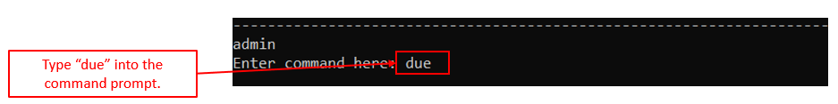
   Figure <>. Example of the "due" command 

* ***Upon completion***: This is what you will see:

  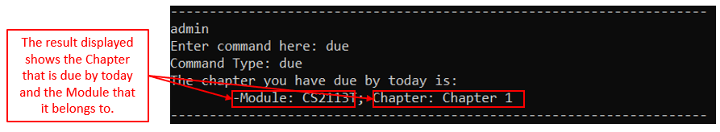
   Figure <>. Example of the "due" result

[Labeled expected output]

  

### 4.5.2. Listing the chapters that are due in the upcoming week: `preview`
(by Yan An)

Beyond simply being able to view the Chapters that are due on the day itself, what if you would like to **view your upcoming revision schedule** so that you can **plan ahead**? For that specific purpose, we have the `preview` command.

The `preview` command shows you **the Chapters that you have scheduled for each day of the upcoming week** and the Modules that they belong to.
 

#### Format: `preview`

#### Key Pointers:
* There are **no parameters** for this command.
* This command can be **called from any Level**

#### Example: 
At any point, if you **want to see a preview of which Chapters are going to be due within the upcoming week**, all you have to do is enter the `preview` command. Below is an example of an execution of the `preview` command.

* ***Step 1***: Key the **`preview`** command **into the prompt** as shown below and **press *[Enter]***

  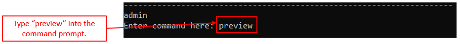
   Figure <>. Example of the "preview" command  

* ***Upon completion***: This is what you will see:

  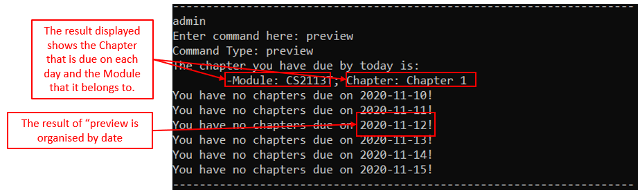
   Figure <>. Example of the "preview" result

[Labeled expected output]

  

### 4.5.3. Customising your list of Excluded Modules: `exclude`
(by Yan An)

As your Database grows in size over time, you might want to **customise the automated scheduling** that KAJI provides for you. However, it would **take considerable effort** for you to **delete** an entire Module or Chapter, only to find that you have to **add it back** into your Database **Card by Card**.

Our solution to that is an Exclusion List: **a list of Chapters that KAJI will ignore** as it creates your schedule for you. In this way, you will only have to **add** a Chapter to the list to **exclude** it from your schedule and **remove** it from the list to **include** it back into your schedule.

The `exclude` command allows you to **add or remove** a single Chapter or an entire Module, to and from your Exclusion list to **customise which Chapters are scheduled** in your Database.
 

#### Format: `exclude \PRIMARY_OPTION`
\PRIMARY_OPTION has two values which changes the mode of the `exclude` command:
* ***more***: This option allows you to use `exclude` to **add** to the Exclusion List
* ***less***: This option allows you to use `exclude` to **remove** from the Exclusion List

#### Key Pointers:
* This command can be **called from any Level**
* This command **checks if the Chapter/Module** you are adding into the Exclusion List **exists**, so the List will
 not be filled with non-existing exclusions.
* After calling the command with either "more" or "less", there will be **a guided secondary option** on whether you
 would like to add/remove **a single Chapter** or **an entire Module**
* The name entry of the Chapter/Module to be operated on is **case-sensitive**

#### Example
At any point, if you **customise your Exclusion List**, all you have to do is enter the `exclude` command with the
 choice of "more" or "less" in the format specified above. Below are examples of the execution of the `exclude` command using both options.

Example of ***`exclude more`***
* ***Step 1***: Key the **`exclude more`** command **into the prompt** as shown below and **press *[Enter]***

  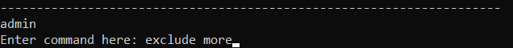
   Figure <>. Example of the "exclude more" command  

* ***Step 2***: Key either **"chapter"**, to exclude a new Chapter, or **"module"**, to exclude an entire Module
, **into the prompt** as shown below and **press *[Enter]***

  
   Figure <>. Example of "exclude more" Secondary Option 

* ***`exclude more`*** + ***chapter***    
        

  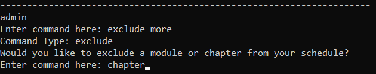
   Figure <>. 

* ***Step 3***: Key the **Module name** of the Module that the Chapter you wish to exclude from your schedule
     belongs to **into the prompt** as shown below and **press *[Enter]***
        

  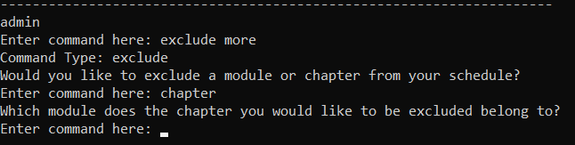
   Figure <>. Example of "exclude more" + ModuleName prompt 

  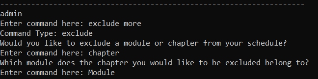
   Figure <>. Example of "exclude more" + ModuleName filled 

* ***Step 4***: Key the **Chapter name** that you wish to exclude from your schedule **into the prompt** as shown
 below and **press *[Enter]***
        

  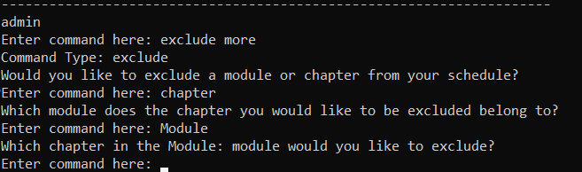
   Figure <>. Example of "exclude more" + ChapterName prompt 

  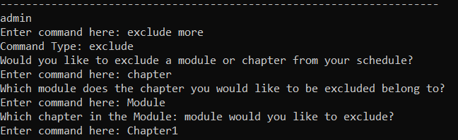
   Figure <>. Example of "exclude more" + ChapterName result

* ***Upon completion***: This is what you will see:

  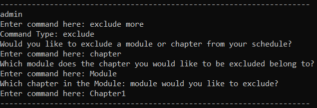
   Figure <>. Example of "exclude more" + chapter Result

* ***`exclude more`*** + ***module***
* ***Step 3***: Key the **Module name** that you wish to exclude from your schedule **into the prompt** as shown
 below and **press *[Enter]***

  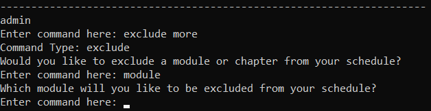
   Figure <>. Example of "exclude more" + module prompt

  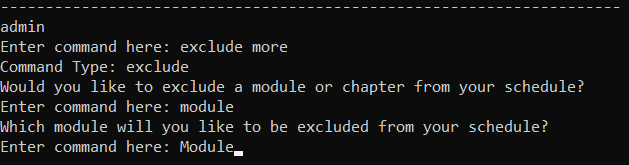
   Figure <>. Example of "exclude more" + module filled  

* ***Upon completion***: This is what you will see:

  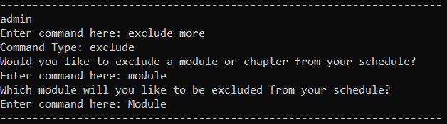
   Figure <>. Example of "exclude more" + module Result 

Example of ***`exclude less`***
* ***Step 1***: Key the **`exclude less`** command **into the prompt** as shown below and **press *[Enter]***

  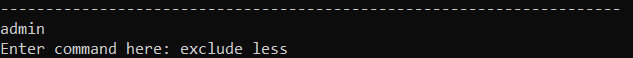
   Figure <>. Example of "exclude less" command  

* ***Step 2***: Key either **"chapter"**, to include a excluded Chapter, or **"module"**, to include a excluded
 Module, **into the prompt** as shown below and **press *[Enter]***

  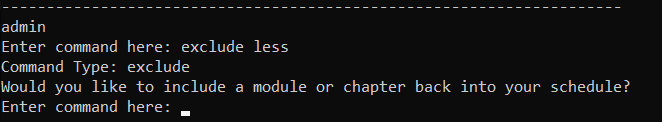
   Figure <>. Example of "exclude less" Secondary Option

* ***`exclude less`*** + ***chapter***
* ***Step 3***: Key the **Module name** of the Module that the Chapter you wish to include back into your schedule
     belongs to **into the prompt** as shown below and **press *[Enter]***

  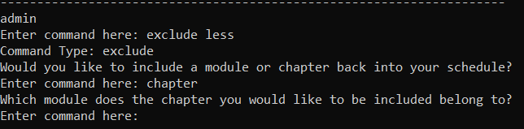
   Figure <>. Example of "exclude less" + chapter ModuleName prompt 

  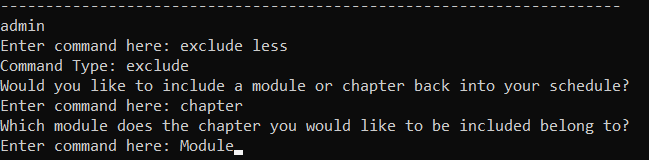
   Figure <>. Example of "exclude less" + chapter ModuleName filled

* ***Step 4***: Key the **Chapter name** that you wish to include back into your schedule **into the prompt** as shown
 below and **press *[Enter]***

  
   Figure <>. Example of "exclude less" + chapter ChapterName prompt

  
   Figure <>. Example of "exclude less" + chapter ChapterName filled

* ***Upon completion***: This is what you will see:

  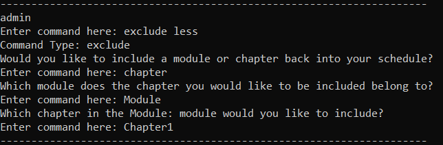
   Figure <>. Example of "exclude less" + chapter Result 

* ***`exclude less`*** + ***module***
* ***Step 3***: Key the **Module name** that you wish to include back into your schedule **into the prompt** as shown
 below and **press *[Enter]***

  
   Figure <>. Example of "exclude less" + module ModuleName prompt 

  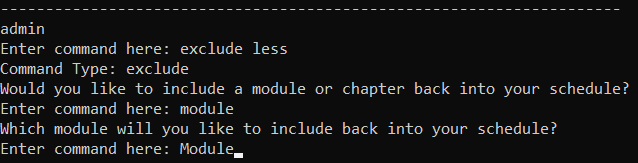
   Figure <>. Example of "exclude less" + module ModuleName filled 

* ***Upon completion***: This is what you will see:

  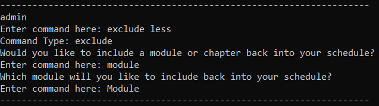
   Figure <>. Example of "exclude less" + module Result

 

--------------------------------------------------------------------------------------------------------------------

## 4. Command Summary

### 4.1. Admin Level

| Action | Format, Examples |
|--------|------------------|

### 4.2. Module Level

| Action | Format, Examples |
|--------|------------------|

### 4.3. Chapter Level

| Action | Format, Examples |
|--------|------------------|

### 4.4. General

| Action | Format, Examples |
|--------|------------------|
