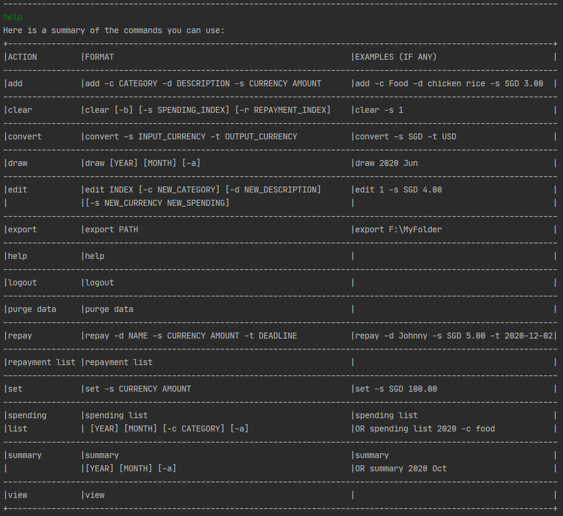

# User Guide

## Introduction

E-Duke-8 helps CS2113/T students learn and understand software engineering and OOP principles through a gamified
platform and enhances their learning experience. It also consolidates key concepts for easy revision.

## Quick Start

1. Ensure that you have Java 11 or above installed.
2. Download the latest version of `E-Duke-8` from [here](https://github.com/AY2021S1-CS2113T-F12-3/tp/releases).
3. Copy the files to the folder you want to use as the eduke8 folder for the application.
4. Run E-Duke-8.
5. Type a command in the terminal and press Enter to execute it. e.g. typing 'help' and pressing Enter will list all the commands that you can use in this application. Here is a list of commands you can try:
   - about : Provides product information.
   - topics : Lists the topics involved in CS2113T.
   - textbook : Links to the CS2113T website.
   - quiz : Starts a quiz. Eg. quiz t/OOP n/5  will start a quiz with five questions based on OOP concepts.
   - hint	  :   Shows a hint to the current question
   - exit : Exits the app.

6. Refer to the Features below for details of each command.

## Features 

ℹ️ Notes about the command format:
- Words in UPPER_CASE are the parameters to be supplied by the user.
- e.g. in add t/TOPIC, TOPIC is a parameter which can be used as quiz t/OOP.
- Items in square brackets are optional.
- e.g quiz t/TOPIC [t/TOPIC] can be used as quiz t/OOP t/Requirements or as quiz t/OOP.

### Loading data

Data is loaded from the .json files in the data folder for use in quizzes and notes.  This is part of the setup and is to be done prior to the running of the app. Upon successful startup this screen should shown:

### Viewing product Information : `about`

Shows a message explaining the purpose of using E-Duke-8.

Format: `about`

### Viewing help : `help`

Shows a list of commands that can be used.

Format: `help`

### Listing all topics : `topics`

Shows the entire list of topics that are listed in the CS2113T Github.io website.

Format: `topics`

### Accessing the CS2113T textbook content: `textbook`

Redirects users to the github textbook website.

Format: `textbook`

### Starting a quiz: `quiz`

Starts a quiz with a specified number of questions from up to two topics

Format: `quiz t/TOPIC n/QUESTIONS`
- The quiz will contain QUESTIONS number of questions 
- TOPIC follows that of the topics shown when using the topics command
- Questions in the quiz will be related to the topics you chose

Examples:
- `quiz t/OOP n/5` will start a quiz that contains 5 questions from the topic on OOP.  

### Showing a hint : `hint`

Shows a hint to the current question

Format: `hint`
- A maximum of one hint can be shown for each question

### Exiting the program : `exit`

Exits the program.

Format: `exit`

## FAQ
**Q**: How do I change the questions in the quizzes?
**A**: Open topics.json in any text editor to edit the questions, make sure to follow the format of the questions already provided.

## Command summary

| Action | Format, Examples |
| ------ | ---------------- |
| About       | `about`                                                |
| Textbook    | `textbook`                                             |
| Quiz        | `quiz t/TOPIC n/QUESTIONS`   e.g. `quiz t/OOP n/5` |
| Hint        | `hint`                                                 |
| List Topics | `topics`                                               |
| Help        | `help`                                                 |
| Exit        | `exit`                                                 |

