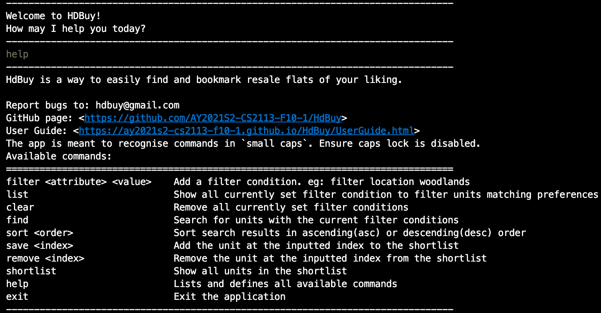
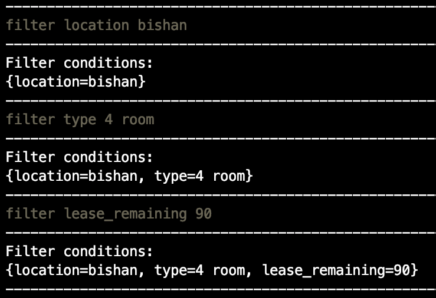

# User Guide

## Introduction

HdBuy allows you to easily find and bookmark resale flats available matching your preference.

## Quick Start

1. Ensure that you have Java 11 or above installed.
2. Down the latest version of `HdBuy` from [here](https://github.com/AY2021S2-CS2113-F10-1/tp/releases/tag/v2.0).
3. Execute the jar file by going to the directory and running `java -jar hdbuy.jar` in command line.
4. Execute your first command, 'help', to view all other available commands.

## How to Use

1. Decide on the filter parameters on resale units matching your preferences. There are 3 possible attributes to filter by:
    1. `location` : The area your preferred unit will be situated in. The app takes in location with spaces too. For example: 'ang mo kio' is valid.
    2. `type`: The type of unit, such as it being an executive flat or 4-room flat. Valid inputs here are: 'executive', '1 room' ... '5 room'.
    3. `lease_remaining`: Number of years left on the unit's lease. Of course, the maximum lease is 99.

2. Set the filters
    1. You can any combination of the 3 attributes listed above as filters
    2. Note that if you set the same attribute twice (filter by location at 'jurong' then at 'bishan'), the latter value will overwrite the former.
    3. An example is shown below:

    

3. Find your units
    1. Execute `find`, you will then see up to 100 units matching your preferences.
    2. Every time you have successfully searched for units (searches with units to show), the filters set previously will automatically be cleared.
    
4. Shortlisting of unit
    1. From the latest search results, you can choose to shortlist units. For example: `save 10`, to shortlist the 10th unit from results.
    2. You can also choose view your shortlist using `shortlist`.
    3. Note that even after closing the app, your previous shortlist will be kept.
    
5. Closing the app
    1. Execute `exit` at any time to quit the app.

## Features 

**Notes about the command format:**

* Words in `UPPER_CASE` are the parameters to be supplied by the user. 
  e.g. in `remove INDEX`, `INDEX` is a parameter which can be used as `remove 1`.
  e.g. in `filter ATTRIBUTE VALUE`, `ATTRIBUTE` is the attribute of a unit to filter. `VALUE` is the value of the attribute.

### Add a Filter : `filter`

Add a filter condition. 

Format: `filter ATTRIBUTE VALUE`

### Search for units : `find`

Search for units with the current filter conditions.

Format: `find`

### View Shortlist : `shortlist`

Shows all units in the shortlist.

Format: `shortlist`

### Append to shortlist: `save`

Adds a unit to the shortlist.

Format: `save INDEX​`

**Note:**
You have to complete a search before saving a unit to shortlist.
Only indexes shown in search results are valid.

Example:
* `save 1` to save the first unit in search result.

### Remove from shortlist: `remove`

Removes a unit from the shortlist.

Format: `remove INDEX​`

**Note:**
You have to have at least 1 unit in shortlist.
Only indexes shown in shortlist are valid.

Example:
* `remove 1` to remove the first unit in shortlist.

### List filter conditions: `list`

Shows all currently set filter condition to filter units matching preferences.

Format: `list`

### Clear filter conditions: `clear`

Removes all currently set filter conditions.

### Display help guide: `help`

Shows the available commands and directs the user to the appropriate links.

Format: `help`

### Sort: `sort`

Sorts listings either in ascending or descending order with respect to price.

Format: `sort TYPE`

Example:
* `sort asc` to sort listings in ascending order with respect to price.

## Error Handling

Listed in the table below are the possible errors, how they can occur and how to remedy it.

|How can this error occur|Description|How to remedy|
|----|------|---------|
|Prerequisites: `filter` not set  `find`|"FIND" has no parameters currently. Please specify a filter to use before executing this command. Filters available: [LOCATION, TYPE, LEASE_REMAINING] An example will be "filter location clementi"|`find` requires a valid filter to function. Please specify a filter to use before executing this command.
|`filter quality good`|This is an invalid command. Please try the following: Filter types: [LOCATION, TYPE, LEASE_REMAINING] Example: "filter location clementi" Example: "filter type 4 room", can be any of X room (X = 1 - 5) or executive Example: "filter lease_remaining 90", can be any whole number from 0 - 99|`filter` command only allows for predetermined attributes. Please use these filters: [LOCATION, TYPE, LEASE_REMAINING].
|`filter lease_remaining 100` `find`|There are no flats to be shown.|`clear` the filters before setting a new valid one.
|`sort`|This is an invalid command. Please try the following: Example: "sort <sorttype>", <sorttype>: {asc, desc}.|`sort` requires a direction. Either asc (ascending) or desc(descending).
|Prerequisites: `find` not run or it does not have flats to show   `save 1`|Please perform unit search first.|Set an appropriate filter and run the `find` command before attempting to `save`.
Prerequisites: `find` is run and shows some flats   `save 101`|101 is invalid. It is either a non-integer or an out of range value.|Enter an integer from 1 to 100 instead.
|`remove`|This is an invalid command. Please try the following: Example: "remove X", X is the index of the unit in the shortlist.|Input the index of the unit to remove.
|Prerequisites: `shortlist` is empty   `remove 1`|1 is invalid. It is either a non-integer or an out of range value.|Have at least one unit in the shortlist by using the `save` command.
|Prerequisites: Bad internet connection or server down.|Server seems to be down, or was it your Internet connection?|Troubleshoot internet connection. If it is the server issue, please report it to our email.|

## FAQ

**Q**: How do I transfer my data (shortlisted units) to another computer? 

**A**: Install the app in the other computer and copy the current `shortlist.txt` file into the same directory as the app.

## Command Summary

Action | Format
--------|----------------------------------------
**View Shortlist** | `shortlist`
**Save Shortlist** | `save INDEX` eg: `save 1`
**Remove Shortlist** | `remove INDEX` eg: `remove 1`
**Add a filter condition** | `filter ATTRIBUTE VALUE` eg: `filter location woodlands`
**Show filter conditions** | `list`
**Clear filter conditions** | `clear`
**Search for units** | `find`
**Displays help guide** | `help`
**Sort search results by ascending price** | `sort asc`
**Sort search results by descending price** | `sort desc`

