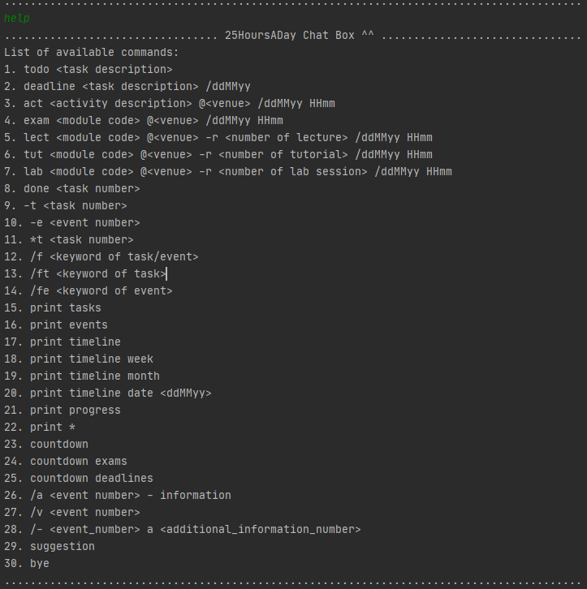
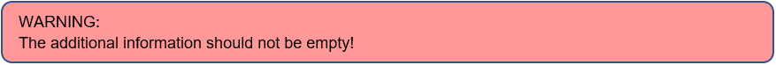
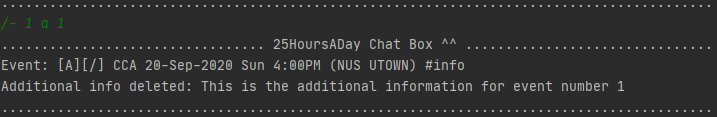
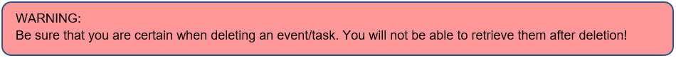
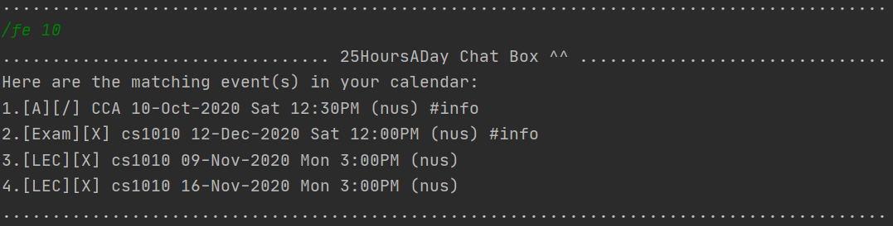
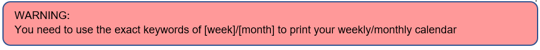
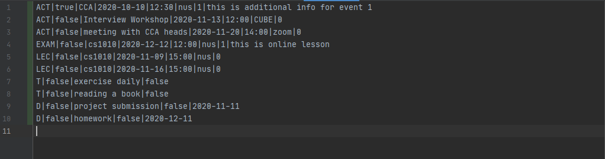

# User Guide

## Table of Contents
* [Introduction](#introduction)
* [Foreword](#foreword)
* [Important Notes](#important-notes)
* [Quick Start](#quick-start)
* [Features](#features)
    * [Viewing available commands](#viewing-available-commands)
    * [Adding a task](#adding-a-task)
        * [Adding a todo task](#adding-a-todo-task)
        * [Adding a deadline task](#adding-a-deadline-task)
    * [Adding an event](#adding-an-event)
        * [Adding an activity event](#adding-an-activity-event)
        * [Adding an examination event](#adding-an-examination-event)
        * [Adding recurring laboratory session event](#adding-recurring-laboratory-session-events)
        * [Adding recurring lecture event](#adding-recurring-lecture-events)
        * [Adding recurring tutorial event](#adding-recurring-tutorial-events)
    * [Adding additional information of an event](#adding-additional-information-to-an-event)
    * [Viewing additional information of an event](#viewing-the-additional-information-of-an-event)
    * [Deleting additional information of an event](#deleting-the-additional-information-of-an-event)
    * [Marking a task as done](#marking-a-task-as-done)
    * [Deleting a calendar item](#deleting-a-calendar-item)
        * [Deleting a task](#deleting-a-task)
        * [Deleting an event](#deleting-an-event)
    * [Finding a calendar item](#finding-a-calendar-item)
        * [Finding any item available](#finding-an-item-from-the-calendar-list)
        * [Finding a task](#finding-an-item-from-the-task-list)
        * [Finding an event](#finding-an-item-from-the-event-list)
    * [Prioritizing task](#prioritizing-a-task)
    * [Printing tasks](#printing-tasks)
    * [Printing events](#printing-events)
    * [Printing progress](#printing-progress)
    * [Giving suggestion](#giving-suggestion)
    * [Printing time line](#printing-timeline)
        * [Printing default calendar](#printing-default-calendar)
        * [Printing calendar for the current week](#printing-calendar-for-the-current-week)
        * [Printing calendar for the current month](#printing-calendar-for-the-current-month)
        * [Printing calendar before a specific date](#printing-calendar-before-a-specific-date)
    * [Printing countdown](#printing-countdown)
        * [Printing countdown of both deadline and exam events](#printing-countdown-of-both-deadline-and-exam-events)
        * [printing countdown for deadline tasks only](#printing-countdown-for-deadline-tasks-only)
        * [printing countdown for exam events only](#printing-countdown-for-exam-events-only)
    * [Saving the data](#saving-the-data)
    * [Exiting the application](#exiting-the-application)
* [Frequently Asked Questions (FAQ)](#faq)
* [Command summary](#command-summary)

## Introduction

**_25HoursADay_** is a scheduling application optimized for users via a convenient yet powerful Command Line Interface (CLI) 
while still having the benefits of a Graphical User Interface (GUI). If you can type fast, **_25HoursADay_** can 
schedule your tasks and events faster than traditional GUI applications.

## Foreword

**_25HoursADay_** is targeted towards students from National University of Singapore (NUS). This user guide is designed 
to provide documentation for potential users who will use **_25HoursADay_** on a day-to-day basis. This document will provide a 
step-by-step guide to show you how to access following features of the application:

1)	View available commands of the application
2)	Add tasks and events to the application
3)	View your personalized calendar and the items available
4)	Search an item in the application
5)	Prioritize your tasks and keep track of your progress

After familiarizing with all the functionalities, you will definitely be able to better manage your day-to-day matters. Feeling excited? Let’s begin!

## Important Notes

Before we jump into the main content, kindly read this section before proceeding to the feature section for a better understanding of it. This section consists of the legends and common terminology used in the feature section.

The following table shows the list of legends used in this document:

The following table displays the list of terminologies used in this document:

|Term| Meaning | 
|--------|----------|
|Task|A to-do item or a deadline item|
|Event|An activity or a school event|
|School event|Lecture, tutorial, laboratory session or examination|
|Task list|List of tasks*|
|Event list|List of events*|
|Task number|Refers to the index of the task in the task list|
|Event number|Refers to the index of the event in the event list|
|Calendar item| A Task or an Event|
|Calendar list|List of calendar items|

*You may view your task list and event list using the `print tasks` and `print events` feature respectively.

**！！！Caution！！!**

**All command parameters used in **_25HoursADay_** are case-sensitive!**

For example: 

`help` is a valid command while `HELP` is an invalid command!

**All command parameters are not be used as user input!**

For example:

`@`, `/`, `-`, `*` and `-r` are intended command parameters and are not allowed to be used as place holders! 

## Quick Start

1. Ensure you have Java 11.0.8 installed.
1. Download the latest version of the project file **_25HoursADay.jar_** and the JSON data file **_NUS_Mod_info.json_** from [here](https://github.com/AY2021S1-CS2113T-T12-2/tp/releases/tag/V1.0).
1. Copy the JAR file and the JSON data file to the same folder that you want to use as the _home folder_ for the project file.
1. In the _Command Prompt_, navigate to the working directory of the _home folder_.
1. Type the command "java -jar" and drag the downloaded **_25HoursADay.jar_** onto the command box and press _Enter_ to start the application.
1. The _Command Prompt_ should display a similar output as shown in the figure below:
    
1. Type the command in the _Command Prompt_ and press _Enter_ to execute it. 
    * E.g. typing `help` and pressing _Enter_ will display the help information.
1. Refer to the [Features](#features) below for details of each command.

## Features 

This section provides the features **_25HoursADay_** has to offer. It entails a brief description of what it does and how to use it.

### Viewing available commands:

As a first-time user, you can always type `help` in the terminal to view the list of available commands. 

Format: `help`

### Adding a task:

Are you sometimes overwhelmed by different tasks and not sure how to document them properly? Why not just use our task adding features? This feature allows you to add 2 types of tasks:

•	Todo task which has no specific due date and just serves as a reminder for your day to day matters.

•	Deadline tasks which has a specific due date and the application has a count down feature to monitor them.

The following 2 sub-sections will provide you with the guide on how to add a task to the calendar list.  

Note: You can input a task description with or without spaces.

#### Adding a todo task:

This function allows you to add a todo task, such as exercise plans or small reminders for your day to day matters 
which can be a great help if you are a forgetful person.

Format: `todo <task_description>`

Example: 

`todo exercise for 10 minutes` 

This adds a todo task of exercising for 10 minutes to the calendar list as demonstrated in the figure below.

Note: The above figure is for illustration purpose only. The total number of tasks may differ if you have more tasks stored in the application.

#### Adding a deadline task:

This function allows you to add a deadline task, such as project submission or assignment submission and the application 
will keep track of the due date which will definitely make your study life more manageable! The function will also display a 
warning message if the due date of the deadline item is already passed (with respect to today's date), making sure all your deadlines are properly recorded and
minimise any potential careless typo.

Format: `deadline <task_description> / <due_date>`

Example of a passed deadline:

`deadline project submission /301020` 

This adds a deadline task of project submission which is due on 30 October 2020 (a past date), 
as illustrated by the figure below.

Example of a proper deadline:

`deadline project video demo /090922` 

This adds a deadline task of project video demo which is due on 09 September 2022 (a future date), as illustrated 
by the figure below.

### Adding an event:

You can add different events to the calendar list, including school events, 
such as`lecture`, `tutorial`, `exam`, and `lab` events, and other events in `activity` type. 
You may add both past and upcoming events to your calendar list.
You can add `lecture`, `tutorial`, and `lab` events as recurring events, but the `exam` and `activity` events cannot be recurring. 
When you add events to the list, you can use `lect`, `lab`, `tut`, `exam` or `act` command in following formats:  

#### Adding an activity event:

This function allows you to add activities, such as interview workshops or Co-Curriculum Activities (CCAs). 
This is definitely the best way to keep track of your commitments and will surely make your student life more vibrant and gain the most out of it! 

Format: `act <activity_description> @<venue> / <date> <time>`

Example:

`act CCA @NUS UTOWN / 200920 1600` 

This adds a CCA event held at NUS UTOWN on 20th September 2020, 4pm as shown in the figure below.

Note: You can input an activity description with or without spaces.

#### Adding an examination event:

You can add an examination event to the calendar list by using the following format.

Format: `exam <module_name> @<venue> / <date> <time>`

Example:

`exam CS1010 @com1-b1-12 / 121220 1700` 

This adds CS1010 exam at 2020-12-12 5pm to the event list. The venue is com1-b1-12.

Note: Only valid modules provided by NUS are allowed to be added! 

#### Adding recurring laboratory events:

When you have new recurring laboratory events and want to add them to the calendar list, you can use `lab` command.

Format: `lab <module_name> @<venue> -r <number of lab session> / <date> <time>`

Example:

`lab CS1010 @com1-b1-14 -r 9 / 210920 1600` 

This adds CS1010 lab at 2020-09-21 4pm to the event list, the venue is com1-b1-14 and the lab will happen for the next 9 weeks.

Note: Only valid modules provided by NUS are allowed to be added! 

Note: The value for `<number of lab session>` is in the range of 1 to 13 only!

#### Adding recurring lecture events:

When you have new recurring lecture events and want to add them to the calendar list, you can use `lect` command.

Format: `lect <module_name> @<venue> -r <number of lecture> / <date> <time>`

Example:

`lect CS2113 @lt12 -r 10 / 030220 1200` 

This adds CS2113 lecture at 2020-02-03 12pm to the event list, the venue is lt12 and the lecture will happen for the next 10 weeks.

Note: Only valid modules provided by NUS are allowed to be added! 

Note: The value for `<number of lecture>` is in the range of 1 to 13 only!

#### Adding recurring tutorial events:

When you have new recurring tutorial events and want to add them to the calendar list, you can use `tut` command.

Format: `tut <module_name> @<venue> -r <number of tutorial> / <date> <time>`

Example:

`tut CS1010 @com1-b1-12 -r 5 / 121020 1700` 

This adds CS1010 lab at 2020-10-20 5pm to the event list, the venue is com1-b1-12 and the tutorial will happen for the next 5 weeks.

Note: Only valid modules provided by NUS are allowed to be added! 

Note: The value for `<number of tutorial>` is in the range of 1 to 13 only!

### Additional information of an event
You can add additional information pertaining to an event in your calendar list, 
view the list of added information and delete irrelevant ones! Use this as a one stop application to store everything you need to know!

#### Adding additional information to an event:
You can add additional information pertaining to an event in your calendar list. You may use this feature to store
the module website for a school event or the things to bring to an event.

Format: `/a <event_number> - <additional information>`

Example:

`/a 1 - This is the additional information for event number 1`

This addes "This is the additional information for event number 1" to the event with index of 1.

Note: The above figure is for illustration purpose only. The desired output will differ if you have a different event 
stored in the event index number 1.

You may then view the additional information using the view additional information feature below.

#### Viewing the additional information of an event:
After adding the additional information related to the event, you can then view the list of additional information 
 pertaining to that event. Use this feature to recall what you need to do before the event!

Format: `/v <event_number>`

Example:

`/v 1` 

This allows you to view all the additional information that you have added for event number 1 in a form of a list.

Note: The above figure is for illustration purpose only. The desired output will differ if you have a different event 
or different additional information stored in the event index number 1.

#### Deleting the additional information of an event:
Should you have wrongly added any additional information to an event, fret not, you can delete them using this feature.

Format: `/- <event_number> a <additional_information_number>`

Example:

`/- 1 a 1`

This deletes the additional information number 1 pertaining to the event with index of 1.

Note: The above figure is for illustration purpose only. The desired output will differ if you have a different event 
or different additional information stored in the event index number 1.
 
### Marking a task as done:

To help manage your tasks better, you can mark a task on your calendar list as completed by using the `done` command. 
If the task is done, you will be able to see a small tick [/] beside the task. Else, you will see a cross [X] beside the task.

Format: `done <task_number>`

Example:

`done 1`

By using this command, you will mark the first task on your task list as done! 

Note: The above figure is for illustration purpose only. The desired output will
differ if you have a different task stored in the task index number 1.

### Deleting a calendar item:

You may delete any calendar items you have added wrongly or any items that have become obsolete. It is advisable
 for you to use this feature frequently to keep your task and event lists uncluttered!
 

#### Deleting a task:

You can delete a task from your calendar list. You can use this to delete the tasks that you have already completed!

Format: `-t <task_number>`

Example:
 
 `-t 1` 
 
After executing this command, notice that task number 1 has been removed from your calendar.
 
 
 
 
 Note: The above figure is for illustration purpose only. The desired output will
 differ if you have a different task stored in the task index number 1.

#### Deleting an event:

You can delete an event from your calendar list. Use this to delete the events that are already over!

Format: `-e <event_number>`

Example:
 
 `-e 1` 
 
  After executing this command, notice that event number 1 has been removed from your calendar.
 
 
 
 Note: The above figure is for illustration purpose only. The desired output will
 differ if you have a different event stored in the event index number 1.
 
### Finding a calendar item:

If you have a long list of calendar items, you may use this feature to find a calendar item based on a specific
keyword of the item’s description. Additionally, for a more specific search, you may search based on whether
it is a task or an event. 

#### Finding an item from the calendar list:

You can search the entire calendar based on a keyword. For example, you might want to search for the due date of an
assignment in your calendar.

Format: `/f <keyword>`

Example: 

`/f assignment` 

This displays a list of items (both tasks and events) containing the keyword “assignment”.

Note: The above figure is for illustration purpose only. The desired output depends on the items stored in the application.

Note: The items printed by the find functions are in the order of how the user added them, this is to facilitate other commands 
such as deleting the item.

#### Finding an item from the task list: 

You can also search from your task list based on a keyword. This will be useful if you need to narrow your search to
just your list of tasks instead of both tasks and events. For example, if you are just searching for your tuition
homework tasks, you can use this feature to exclude any events with description containing “tuition”!

Format: `/ft <keyword>`

Example: 

`/ft tuition` 

This displays a list of tasks containing the keyword “tuition”.

Note: The above figure is for illustration purpose only. The desired output depends on the tasks stored in the application.

#### Finding an item from the event list: 

Likewise, you can also search your event list based on a keyword. This is especially useful if you have multiple
tasks and events having a similar description. For example, if you are looking for events happening on the same date
, you can use this feature to exclude all deadline tasks with the same date!

Format: `/fe <keyword>`

Example: 

`/fe 09-Nov-2020`

This displays the list of events containing the keyword “09-Nov-2020”.

Note: The above figure is for illustration purpose only. The desired output depends on the events stored in the application.

### Prioritizing a task:                                                                                                

When you have important tasks, you can prioritize them in the task list to distinguish from ordinary tasks.
If you want to prioritize an important task, you can use `*t <task_number>` to mark the task as important. 
    
Format: `*t <task_number>`
    
Example: 

`*t 1` 

This marks the first task in the task list as important.

 Note: The above figure is for illustration purpose only. The desired output will
 differ if you have a different task stored in the task index number 1.

### Printing tasks:

If you want to prioritize or delete some of the tasks on hand but cannot recall the task number as there are simply 
too many tasks, you can always ask _**25HoursADay**_ to print out all tasks saved in the application. 
In this way, you can have a better picture of the tasks on hand! 

Format: `print tasks`

Example:

`print tasks`

This prints all tasks stored in the application.

Note: The above figure is for illustration purpose only. The desired output will
differ if you have different tasks stored in the calendar list.

Note: The events are printed in the order of how the user added them, this is to facilitate other commands such as marking a
task as done or deleting a task.

### Printing events:

If you want to delete past events or to add additional information to a certain event, you can always ask the application 
to display all events saved in the application. This feature will definitely save your brain space wasted on memorising them.

Format: `print events`

Example:

`print events`

This prints all events stored in the application.

Note: The above figure is for illustration purpose only. The desired output will
differ if you have different events stored in the calendar list.

Note: The events are printed in the order of how the user added them, this is to facilitate other commands such as adding 
additional information for an event or deleting an event.

### Printing important tasks:
    
If you just want to view all the important tasks instead of all the tasks in the calendar list now, 
you can type `print *` command to view the list of important tasks together with their information.                           
                                                    
Format: `print *`

Example:

`print *`

This prints all important tasks in the application.

Note: The above figure is for illustration purpose only. The desired output will
differ if you have different tasks stored in the calendar list.

### Printing progress: 

If you have a lot of tasks and want to trace the progress of how many of the tasks have been finished, 
you can type  `print progress` command to see the fraction and percentage proportion of the finished tasks among all the tasks.

Format: `print progress`

Example:

`print progress`

This displays your current progress.

Note: The above figure is for illustration purpose only. The desired output will
differ if you have completed different number of tasks.

### Giving suggestion: 

When you have a lot of tasks and do not know preparing for which several tasks first, you can get some simple suggestions from the 25HoursADay. 
This application can select several important and urgent tasks in the task list for you. If you want to view the suggestions, 
you can type the `suggestion` command to see the recommended tasks together with their information.  
    
Format: `suggestion`

Example:

`suggestion`

This prints the more urgent items for you.

Note: The above figure is for illustration purpose only. The desired output will
differ if you have different items stored in the calendar list.

### Printing timeline

If you want to see your calendar items in a timeline format, you can always use the personalised calendar feature. 
There are four kinds of personalised calendar that you can print: default calendar, weekly calendar, monthly calendar, 
and calendar before a specific date you choose.

#### Printing default calendar: 

Print the personal calendar including all calendar items, with todo items (which do not have a specific date) printed as a list at the bottom of the timeline.

Format: `print timeline`

Example:

`print timeline`

This prints the default calendar for you.

Note: The above figure is for illustration purpose only. The desired output will
differ if you have different items stored in the calendar list.

#### Printing calendar for the next 7 days: 

Wanting to find out what is going to happen in the next 7 days? `print timeline week` can be of great help.

Format: `print timeline week`

Example:

`print timeline week`

This prints the personal calendar fot the next 7 days.

Note: The above figure is for illustration purpose only. The desired output will
differ if you have different items stored in the calendar list.

#### Printing calendar for the next 31 days: 

Wanting to find out what is going to happen in the next 31 days? `print timeline month` can be of great help.

Format: `print timeline month`

Example:

`print timeline month`

This prints the personal calendar fot the next 31 days.

Note: The above figure is for illustration purpose only. The desired output will
differ if you have different items stored in the calendar list.

#### Printing calendar before a specific date:

Wanting to find out what is going to happen before a specific date? `print timeline date <date>` can be of great help.

Format: `print timeline date <date>`

Example:

`print timeline date <date>`

This prints the personal calendar before a specific date.

Note: The above figure is for illustration purpose only. The desired output will
differ if you have different items stored in the calendar list.

### Printing countdown:
      
If you want to see the countdown of all the upcoming exams and know how much time you still have to review, or you want to 
double check how many days you still have before the deadline, you can type the `countdown`, `countdown exams`, or `countdown deadlines` command.

#### Printing countdown of both deadline and exam events: 

If you type `countdown`, you can see the countdown of all the unfinished deadlines tasks and all the upcoming exam events.

The item with the closest date will be printed first.
 
All the unfinished deadlines will be printed before all the upcoming exams.

Format: `countdown`

Example:

`countdown`

This shows you the countdown to your deadlines and exams.
 
 
 
 Note: The above figure is for illustration purpose only. The desired output will
 differ if you have different items stored in the calendar list.

#### Printing countdown for exam events only: 

If you type `countdown exams`, you can see the countdown of all upcoming exams.

The exam with the closest date will be printed first.

Format: `countdown exams`

Example:

`countdown exams`

This displays the countdown for examinations only.

 Note: The above figure is for illustration purpose only. The desired output will
 differ if you have different items stored in the calendar list.

#### Printing countdown for deadline tasks only: 

If you type `countdown deadlines`, you can see the countdown of all unfinished deadlines.

The deadline with the closest due date will be printed first.

Format: `countdown deadlines`

Example:

`countdown deadlines`

This prints the countdown for the deadlines only.

 Note: The above figure is for illustration purpose only. The desired output will
 differ if you have different items stored in the calendar list.

### Saving the data

When you close the application or you make some changes to the application such as adding an event, the data for the tasks and events 
are automatically saved locally. So, there is no need for users to save manually.
Next time when you start the application, all the data will automatically be loaded from the local file to the application.

### Exiting the application: 

If you want to exit the application, you can always type `bye` in the terminal to quit and all the data entered will be saved 
automatically for your future use. 

Format: `bye`

Example:

`bye`

This exits the application for you.

## FAQ

Want to find out more about 25HoursADay? 
How to transfer our data to another device? Or how to store our data? 
Here are the most common questions that NUS students would ask about our application. 
The questions and the answers to them can be found below.

**Q**: How do I transfer my data to another computer? 

**A**: Download the application in the other computer and overwrite the empty data file it creates with the data from your 
previous **_25HoursADay.jar_**.

**Q**: Can I use **_25HoursADay_** on different operating systems like Linux, Windows, or macOS?  

**A**: Yes, **_25HoursADay_** is compatible with Linux, Windows and macOS.

**Q**: Will the data be saved if I accidentally close my application without typing the command bye?  

**A**: Yes, the data will automatically be saved locally even when you close your application halfway.

**Q**: If I wrongly deleted my task, can I undo it?

**A**: No, currently **_25HoursADay_** doesn't have an undo feature, therefore you need to manually add your calendar item back 
using `add` command.

## Command Summary

|Term| Meaning | Command Format|
|--------|----------------|--------|
|Add|activity event|`act <activity_description> @<venue> / <date> <time>`|
|Add|additional information for an event|`/a <event_number> - <additional_information>`|
|Add|deadline task|`deadline <task_description> / <due_date>`|
|Add|exam event|`exam <module_name> @<venue> / <date> <time>`|
|Add|lab event|`lab <module_name> @<venue> -r <recurring_number> / <date> <time>`|
|Add|lecture event|`lect <module_name> @<venue> -r <recurring_number> / <date> <time>`|
|Add|todo task|`todo <task_description>`|
|Add|tutorial event|`tut <module_name> @<venue> -r <recurring_number> / <date> <time>`|
|Delete|additional information for an event|`/- <event_number> a <additional_information_number>`|
|Delete|events|`-e <event_number>`|
|Delete|tasks|`-t <task_number>`|
|Find|all calendar items|`/f <keyword>`|
|Find|events|`/fe <keyword>`|
|Find|tasks|`/ft <keyword>`|
|Print|countdown for all items|`countdown`|
|Print|countdown for deadlines|`countdown deadlines`|
|Print|countdown for exams|`countdown exams`|
|Print|events|`print events`|
|Print|important tasks|`print *`|
|Print|progress|`print progress`|
|Print|tasks|`print tasks`|
|Print|timeline (default)|`print timeline`|
|Print|timeline before a date|`print timeline date <date>`|
|Print|timeline for the next 31 days|`print timeline month`|
|Print|timeline for the next 7 days|`print timeline week`|
|Quit|exit the application|`bye`|
