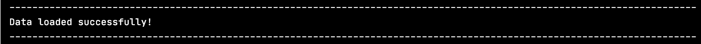
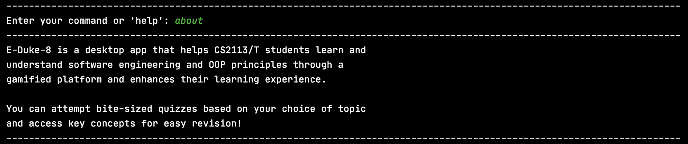
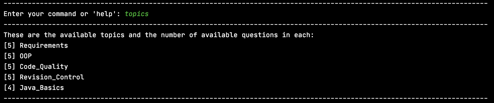
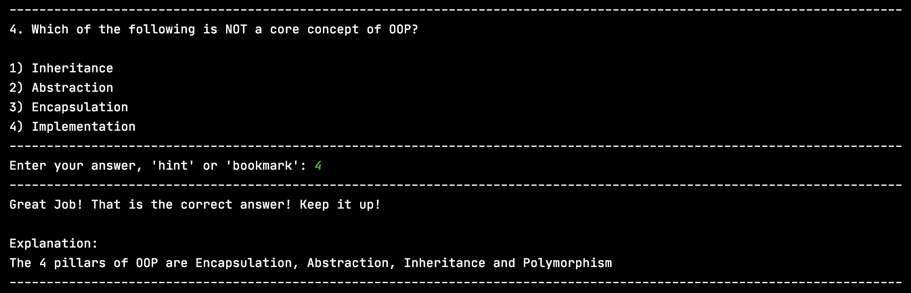
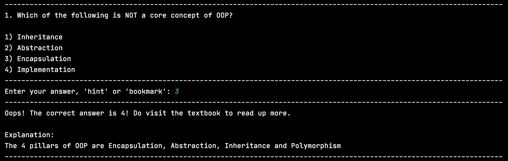
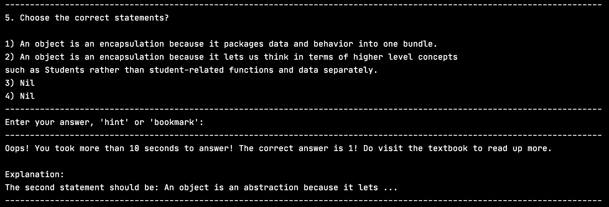
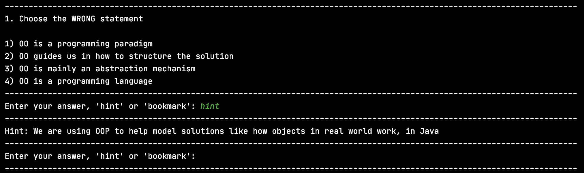
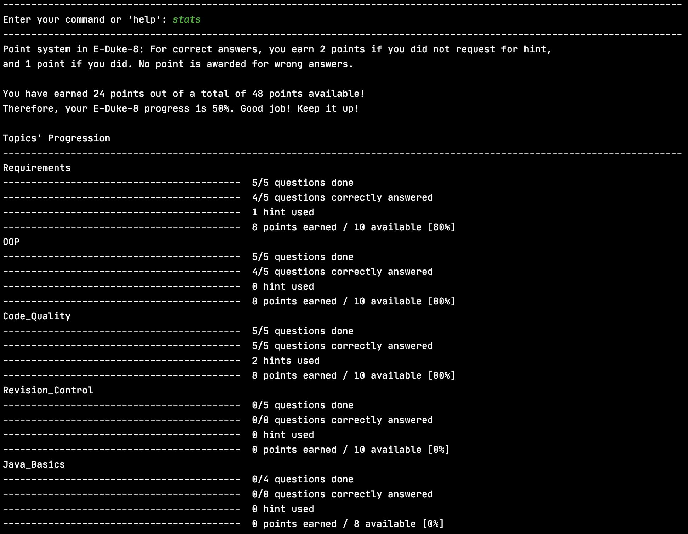
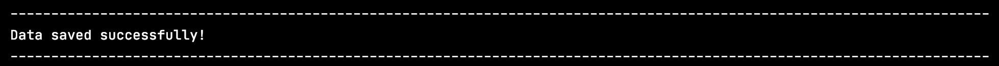

# User Guide for E-Duke-8
* Table of Contents
{:toc}

## 1. Introduction

E-Duke-8 (pronounced "Educate") helps CS2113/T students **learn and understand software engineering and [Object-oriented Programming (OOP)](#7-glossary) principles** through a gamified
platform and enhances their learning experience. 

It is a desktop application where CS2113/T students can attempt bite-sized quizzes, through the [Command Line Interface (CLI)](#7-glossary), to test their understanding of the concepts taught, and serves to consolidate key concepts for easy revision.

On E-Duke-8, you can earn points for yourself as you attempt the quizzes! You can also view the statistics of your past quiz attempts to understand your current level of mastery of the various topics!

Challenge your friends to see who can earn the most points on E-Duke-8!

Understand more about E-Duke-8, and how you can use it to aid your learning, through this User Guide.

## 2. Quick Start

1. Ensure that you have Java 11 or above installed.
2. Download the latest version of **E-Duke-8** from [here](https://github.com/AY2021S1-CS2113T-F12-3/tp/releases).
3. Copy the files to the folder you want to use for the application.
4. If you download the jar file by itself, you will also need the question , `topics.json`, found in `data.zip`. After extracting, include the `data` folder and the `eduke8.jar` file in the same folder for E-Duke-8 to run smoothly. Alternatively, you can simply download `eduke8.zip` which includes both the jar file along with the data folder.
5. Double click on eduke8.jar to start up the program. If the program does not start up, continue to step 6, otherwise skip to step 8.
6. If double clicking on the jar file does not work, open up the command prompt in the same folder used in step 3.
7. Enter the following command `java -jar eduke8.jar`.
8. Type a command in the terminal and press Enter to execute it. e.g. typing 'help' and pressing Enter will list all the commands that you can use in this application. Here is a list of commands you can try:
   - about : Provides information about E-Duke-8.
   - topics : Lists CS2113/T topics that E-Duke-8 knows.
   - textbook : Provides you with a link to the CS2113/T website.
   - quiz : Starts a quiz. Eg. `quiz t/OOP n/5 s/10` will start a quiz with five questions based on OOP concepts. You will have 10 seconds to complete each question. 
   - hint	  :   Shows a hint to the current question.
   - exit : Exits the app.

9. Refer to the section on **Features** below for details of each command.

## 3. Features 

ℹ️ Notes about the command format:
- Words in UPPER_CASE are the parameters that you can specify for your usage.
- e.g. in `quiz t/TOPIC n/NUM_QUESTIONS s/TIMER`, 'TOPIC' is a parameter that allows you to choose the topic you want the quiz to be based on, 'NUM_QUESTIONS' specifies the number of questions you want to have in your quiz, and 'TIMER' specifies the number of seconds given to complete each question. 

### 3.1. Loading Data 

Data will be automatically loaded from the files in the **data** folder for use in quizzes and notes.
You will see this message while the data loads:


To ensure that data could be loaded successfully, ensure that the data folder that comes along with the eduke8.jar file is placed in the same folder as eduke8.jar. This is part of the setup and is to be done prior to the running of the app. 
If the data has been loaded successfully you should see this message:



If you wish to edit the data such as add questions you follow instructions found in [**4. FAQ**](#4-faq).

If have trouble opening E-Duke-8 and receive the following warning message then please refer to section [**6. Troubleshooting**](#6-troubleshooting).


### 3.2. Welcome Page

Upon successful startup, you should be greeted with a screen like this:


### 3.3. Viewing E-Duke-8 information: `about`

Shows a message explaining what E-Duke-8 is about and your benefits of using it.

Example of usage:
```
about
```

What you should see:




### 3.4. Viewing available commands: `help`

Shows a list of commands that you can use.

Example of usage:
```
help
```

What you should see:


### 3.5. Listing all topics: `topics`

Shows the entire list of CS2113/T's topics that you can choose for your quiz to be based upon. 

You can see the number of questions available for each topic beside the topic itself.

Example of usage:
```
topics
```

What you should see:




### 3.6. Accessing the CS2113T textbook content: `textbook`

You can find a link to the module's textbook using this command. 

Example of usage:
```
textbook
```

What you should see:


### 3.7. Starting a quiz: `quiz`

By following a specific input format for your command (shown below), you can start a quiz with the number of questions, topic and time to complete each question as specified by you.

While on a question, you can choose to answer it, ask for a hint if you are unsure of the answer or bookmark it for future reference!

You will have to complete the question within the specified time as well. If you are unable to complete it in time, it will be regarded as an incorrect answer and the correct answer, along with the explanation, will be shown to you. You will then proceed to the next question where the timer will restart. 

A correct answer without requesting for a hint will earn you **2 points**! Whereas a correct answer with hint requested will earn you **1 point**. No point will be awarded for incorrect answers. You can view the points you have accumulated with the `stats` command, which will be further explained in a later section of this guide.

Regardless of right or wrong answer, an explanation about the question will be displayed after you give an answer. You will then proceed to the next question.

Note:
- Each of the questions in the quiz will be related to the topic you have chosen.
- You can choose any topic from the topic list.
- Refer to [topics](#35-listing-all-topics-topics) to see the number of questions you can choose from.
- The first question will be immediately displayed to you once the quiz starts.
- The quiz will only end when you have attempted all of the questions in the it.

Input format: `quiz t/TOPIC n/NUM_QUESTIONS s/TIMER`

Example of usage:
```
quiz t/OOP n/5 s/10
```
- This will start a quiz that contains 5 randomly-chosen questions from the topic on OOP. Each question will have to be completed within 10 seconds. 

What you should see:


From here on you can either:

1) Enter in your answer by typing '1', '2', '3' or '4' and pressing enter.

2) If you do not know the answer, you can request for a hint by typing 'hint' and pressing enter. Refer to section [**3.8. Hint**](#38-showing-a-hint-hint) for more information.

If you have entered the correct answer, this is what you will see:


If you have entered the wrong answer, this is what you will see:


If you did not answer the question within the specified time, this is what you will see: 


After attempting all of the questions, the quiz will automatically end:


After the quiz ends, you will be prompted to enter in a new command. At this point, you are free to choose any feature of E-Duke-8 you want to access, or you can also start a new quiz!

### 3.8. Showing a hint: `hint`

Shows a hint to the current question.

Example of usage:
```
hint
```

What you should see:




### 3.9. Adding a note: `note add`

Adds a note to a specified topic.

Note:
- There can be many notes under each topic
- The UI will guide you through the note-adding process

Example of usage:
```
note add
```

What you should see:

### 3.10. Deleting a note: `note delete`

Deletes a note from a specific topic.

Example of usage:
```
note delete
```

### 3.11. Listing out notes: `note list`

Lists out all notes belonging to a specific topic.

Example of usage:
```
note list
```

### 3.12. Bookmarking a question: `bookmark`

Stores any question encountered in a quiz in a list.

Note: 
- Bookmarking a question can only be done during a quiz

Example of usage:
```
bookmark
```

### 3.13. Listing out all bookmarked questions: `bookmark`

Lists out all the bookmarked questions and each of their four options.

Note:
- Listing out all bookmarked questions can only be done in the main menu

Example of usage:
```
bookmark
```

### 3.14. Displaying stats: `stats`

Displays the points you have earned, and the accumulated statistics of your quiz attempts on E-Duke-8.

Both overall statistics of all your previous quiz attempts and topic-level statistics will be displayed.

Example of usage:
```
stats
```

If you are a new user, this is what you should see:


If you have attempted the quizzes on E-Duke-8, you would be able to see your own stats. 

This is an example of what you should see:




### 3.15. Exiting the program: `exit`

Exits E-Duke-8.
- You can only exit the application when you are not in a quiz.
- If you are in the middle of a quiz and really want to exit, you can give random answers for the questions.

Example of usage:
```
exit
```


### 3.16. Saving user data

User data will be saved after every command that changes the data completes such as at the end of using
`quiz`, `note`, and `bookmark`. There will be a final save confirmation message upon successful exit of the application
through the `exit` command.
You will see this message while the data saves:


When the data has been saved successfully you should see this message:



This is stored in the `user.json` file in the `data` folder and can be transferred between machines to keep your own
history. Please do not attempt to edit this file as it will disrupt the running of application.
If you want a better score you can always reattempt a quiz!

## 4. FAQ

**Q**: How do I change the questions in the quizzes?

**A**: Open `topics.json` in any text editor to edit the questions, make sure to follow the format of the questions
already provided an example is shown below.

```json
[
  {
    "topic": "Topic Title", 
    "questions": [
      {
        "description": "What is your question?",
        "hint": "Put the hint here",
        "explanation": "Put the explanation here",
        "options": [ 
          {
            "description": "This is the first option and correct answer",
            "correct": true
          },
          {
            "description": "This is the second option",
            "correct": false
          },
          {
            "description": "This is the third option",
            "correct": false
          },
          {
            "description": "This is the fourth option",
            "correct": false
          }
        ]
      }
    ]
  }
]
```

Note that the title will be loaded with spaces replaced with underscores, there must be 4 options for each question,
and there must be one and only one option chosen as the correct answer by specifying `true` as the value of the
`correct` key. If you edit the title of existing topics or description of existing questions then their associated user 
data might be erased.

**Q**: What happens if I modify the user data in `user.json`?

**A**: If you still wish to modify the user data, the application may not be able to load it successfully. You will 
receive the following message, and the affected user data will be erased.


## 5. Command summary

| Action | Format, Examples |
| ------ | ---------------- |
| Viewing E-Duke-8 information       | `about`                                                |
| Viewing available commands    | `help`                                              |
| Listing all topics        | `topics`  |
| Accessing the CS2113T textbook content        | `textbook`                                                 |
| Starting a quiz |  `quiz t/TOPIC n/QUESTIONS s/TIMER` <br/> e.g. `quiz t/OOP n/5 s/10`                                              |
| Showing a hint        |           `hint`                                      |
| Adding a note | `note add` | 
| Deleting a note | `note delete` | 
| Listing out notes | `note list` | 
| Displaying statistics | `stats` | 
| Exit        | `exit`                                                 |

## 6. Troubleshooting

If you have trouble starting the application there could be two sources of error for loading data.
Firstly, `topics.json` may not present in the right folder.
Please check inside the `data` folder followed by the `main` folder that `topics.json` is present.

Next, it is possible that the format of data inside `topics.json` or `user.json` is wrong and thus cannot be parsed
correctly. Please ensure if you wish to edit the data in `topics.json` such as add questions you follow instructions found in [**4. FAQ**](#4-faq).

On the other hand, `user.json` should not be manually edited. If you have accidentally changed this file, you may delete
the file to reset the data. A new file will be created on start up. 

If the above fixes do not work please download `data.zip` from the release page again and use its contents as the `data`
folder.

## 7. Glossary

- **Command Line Interface (CLI):** CLI is a text-based interface that allows users to respond to visual prompts by typing single commands into the interface and receiving a reply in the same way. (From [techopedia](https://www.techopedia.com/definition/3337/command-line-interface-cli))

- **Object-oriented Programming (OOP):** OOP is a programming paradigm. A programming paradigm guides programmers to analyze programming problems, and structure programming solutions, in a specific way. (From [CS2113/T textbook](https://nus-cs2113-ay2021s1.github.io/website/se-book-adapted/chapters/oop.html))
