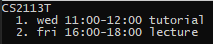

# User Guide  
  
## 1.0 Introduction  
  
Zoomaster is a desktop app for organizing website links, optimized for use via a 
Command Line Interface (CLI) while retaining benefits of a Graphical User Interface (GUI). 
If you can type fast, Zoomaster can help fetch useful website links for you quicker than the bookmark function on your browser.
This user guide would help you walkthrough the features of Zoomaster and ways to input commands to it to access these features.

<br/>

## 2.0 About this Document

Please take note that the 
symbol is used to indicate important warnings throughout the document.

<a name="command_format"></a>
Please also take note of the labels on command formatting:

| Label | Meaning |
| --- | --- |
| `{curly brackets}` | Words contained in `{curly brackets}` are parameters to be supplied by the user. <br> eg. in `delete {BOOKMARK_NUMBER}`, `BOOKMARK_NUMBER` is a parameter which can be used as `delete 1`.
| `{PARAM1/PARAM2}` | Parameters with `/` inside are parameters which accept different types of inputs. <br> eg. `launch {INDEX/DESCRIPTION}` shows that either `INDEX` or `DESCRIPTION` can be used.
|`(optional)`| Parameters with `(optional)` are optional inputs. <br> eg. `show {DAY(optional)}` can be used as `show` or as `show mon`.
| `DAY` | Parameter `DAY` takes three letter abbreviations of days in a week <br> The full list of DAY parameters are **mon, tue, wed, thu, fri, sat, sun**.<br> Your inputs need not be case sensitive. <br> eg. `show {DAY(optional)}` can be used as `show mon`, `show tue` etc.|
|`MODULE`|Parameter `MODULE` has to be an NUS module recognised by NUSMods.<br> You can go to https://nusmods.com/ to get the full list of NUS modules available. <br> eg. `CS2113`, `CS2101`  |
|`START TIME`,<br> `END TIME`| Parameters `START TIME` and `END TIME` requires input to be in the format `HH:mm` and in 24 Hours. <br> eg. `12:00`, `14:00`, `00:00`|

<br/><br/> 
## 3.0 Table of contents
* [4.0 Quick Start](#quick-start)
* [5.0 Features](#features)
  * [5.1 Global](#global)
    *  [Show help information:](#help) **help**
    *  [Switch mode:](#mode) **mode**
    *  [Clear:](#clear)  **clear**
    *  [Launch current lesson:](#launchnow)  **launch now**
    *  [Show user settings:](#showsettings)  **showsettings**
    *  [Set a setting:](#setsetting)  **set**
    *  [Exit:](#exit)  **exit**
  * [5.2 Bookmark mode](#bookmarkmode)
    * [Show bookmarks:](#showbookmark) **show**
    * [Add bookmark:](#addbookmark)  **add**
    * [Delete bookmark:](#deletebookmark)  **delete**
    * [Edit bookmark:](#editbookmark)  **edit**
    * [Find bookmark:](#findbookmark)  **find**
    * [Launch bookmark:](#launchbookmark)  **launch**
  * [5.3 Timetable mode](#timetablemode)
    * [Show timetable:](#showtimetable) **show**
    * [Show module, slot and bookmarks:](#showmoduledetails) **show**
    * [Add module, slot and bookmark:](#addtimeslot) **add**
    * [Delete module, time slot and bookmarks:](#deletetimeslot)  **delete**
    * [Edit slot's module, title, time:](#edittimeslot)  **edit**
    * [Launch bookmarks from module, slot:](#launchtimeslot)  **launch**
  * [5.4 Planner mode](#plannermode)
    * [Load planner:](#loadplanner) **load**
    * [Add meeting:](#addmeeting) **add**
    * [Show planner:](#showplanner) **show**
    * [Save planner:](#saveplanner) **save**
* [6.0 FAQ](#faq)
* [7.0 Command Summary](#command-summary)
  
<br/><br/>   
## 4.0 Quick Start  
  
1. Ensure that you have Java 11 or above installed.  
2. You can download the latest version of `Zoomaster` from [here](https://github.com/AY2021S1-CS2113T-W11-1/tp/releases)
 if you are running a older version.
3. Now move the **zoomaster.jar** file into your desired home folder for Zoomaster. <br/><br/> 
4. Copy the absolute path of your **zoomaster.jar** file by first highlighting your file, then while
holding the <kbd>Shift</kbd> key on your keyboard, right click on that file and select the option "Copy as path". 
<br/><br/> 
5. Afterwards, start Command Prompt by pressing <kbd>Windows</kbd> + <kbd>R</kbd> on the keyboard, 
then type in "cmd" and hit the <kbd>Enter</kbd> key. <br/><br/> 
6. In the Command Prompt, type in "java -jar", then paste the absolute path you copied previously in step 4. 
It should look similar to the picture below:  
 <br/><br/> 
7. Finally, press <kbd>Enter</kbd>. You should should see something similar to this Zoomaster logo indicating 
that you have successfully started your Zoomaster program. <br/><br/> 


8. The app is now ready to go! Go ahead and test it out with a `help` command. 
The app should print out a list of different commands. <br/><br/> 

9. You can now refer to the section below to explore the different features of the Zoomaster app.
  
## 5.0 Features   

This section will explain to you the different features of Zoomaster and how you can interact with it. 
<!-- @@author fchensan -->
Zoomaster has three different modes:
* **Bookmark mode**
    In this mode, Zoomaster stores all of your bookmarks that are not related to any modules.
* **Timetable mode**
    Here, you can create a timetable of all of your classes, and assign a bookmark or Zoom link on each of the time slots.
* **Planner mode**
    Have you ever had diffulties deciding when to have a meeting as all of your groupmates have different classes? In Planner mode, Zoomaster can help you find common free timings by allowing you to import your teammates' timetables.

Each mode has its own different sets of features and commands, which will be explained in sections 5.2, 5.3, and 5.4.
<!-- @@author -->

<a name="global"></a> 
### 5.1 Global Commands

These commands can be used by you in every mode of the app.


<a name="help"></a>  
#### 5.1.1 Show help information: `help` (Yu Shing + Zhan Hao)
You can see the list of commands available in mode you are currently in.
```
Format: help {COMMAND(optional)}
```
>Let's say you require help to see the commands you can access the main menu mode. 
>You will first enter `help` into the console.
>
>
>
>Then you should see the following message to guide you with the relevant commands.
>
>

<br/><br/> 
>Typing `help` in bookmark mode will show these commands.
>
>
>
<br/><br/> 
>Typing `help` in timetable mode will show these commands.
>
>

<br/><br/> 
>Lastly, typing `help` in planner mode will show these commands.
>
>
>


<br/><br/> 

If you require additional information about a command, you can insert the optional parameter of `{COMMAND}` 
after `help` show you additional information about the commands and how to format the command properly.

Example of usage:   
* `help add`
* `help delete`
>The following example represents the case if you require help about the `add` command in timetable mode. 
>First you type the command `help add`.
>
>
>
>Then you should see the following message to explain and instruct you on how to use the `add` command in timetable mode
>
>

<br/><br/> 

<!-- @@author TYS0n1 -->
<a name="mode"></a>  
#### 5.1.2 Switch mode: `mode` (Yu Shing)
You can switch between “bookmark”, “timetable” and "planner" modes. Depending on the mode you select the behaviour of the commands below changes. <br/><br/> 

There are three modes for Zoomaster, Bookmark, Timetable and Planner modes.

```
Format: mode {bookmark/timetable/planner}
```

Example of usage:   
* `mode bookmark`
* `mode timetable` 
* `mode planner`

>Here is an example of switching from the main menu of Zoomaster to the bookmark modes. <br/><br/> 
> <br/><br/> 
>For the other modes, you should see a similar message like "changing to timetable/planner mode".


<!-- @@author Speedweener -->

<br/><br/> 
<a name="clear"></a>  
#### 5.1.3 Clear screen: `clear` (Zhan Hao)
You can clear the command prompt screen using this command. 
It is useful when your screen gets cluttered with prior commands. For example, when you have added a whole bunch
of modules and timeslots to your timetable. Then you can use `clear` command to remove those commands. <br></br>
Note that if your monitor screen has high dimensions, you might need multiple calls of this command to fully
clear your screen.
```
Format: clear
```

>Here is an example of clearing the screen using the clear command. <br/><br/> 
> <br/><br/> 


<a name="launchnow"></a>  
<!-- @@author xingrong123-->
#### 5.1.4 Launch bookmarks of current lesson: `launch now` (Xing Rong)
You can launch the bookmarks of a current lesson slot in your timetable. 
The time depends on the system time of your machine with an additional 5 minutes of buffer, 
allowing you to launch your zoom session ahead of time.
  
```
Format: launch now    
```

>Here is an example of launching the bookmark of the current lesson. In this case, the URL attached to the slot
>is www.google.com. <br/><br/> 
> <br/><br/> 

You should expect to see the urls of the current or 5 minutes advance lesson slot launching
in your native browser. Otherwise, you should see the message `no lesson now`.
<!-- @@author -->

<br/><br/> 
<!-- @@author fchensan -->
<a name="showsettings"></a>  
#### 5.1.5. Show settings: `showsettings` (Francisco)
Once you are comfortable using Zoomaster, this command, along with the `set` command, helps you customise Zoomaster's behaviour.
```
Format: showsettings
```
When you type in this command, you will see two settings that you can adjust: <br></br>
 <br></br>
The two settings are:
* Default mode on start-up.
    You can choose between `mainmenu`, `timetable`, or `bookmark` as the first mode you will enter when you start Zoomaster.
* Autosave.
    By default, this is turned on and Zoomaster will save files every time you make changes. You might want to turn this off if you prefer to save only when you exit. 

<br/><br/> 
<a name="setsetting"></a>  
#### 5.1.6. Set a setting: `set {SETTING_NAME} {NEW_OPTION}` (Francisco)
While `showsettings` shows you the settings, this command lets you change one of the settings.
* `{SETTING_NAME}` is the name of the setting as shown when you type in the `showsettings` command.
* `{NEW_OPTION}` is the new setting option that you would like to select. This needs to be typed in exactly as show from the `showsettings` command.

For example, let's say that you want Zoomaster to enter `bookmark` mode when you start it. 
You can type in `set def_mode bookmark` and Zoomaster will change your settings, as shown below.  


The next time you run Zoomaster, you will automatically enter bookmark mode.
<!-- @@author -->
<br/><br/> 
<a name="exit"></a>  
#### 5.1.7 Exit the app: `exit`  
You can exit the application by using the exit command.
  
```
Format: exit    
```
>You should see this message on exit  


<br/>
---
<br/> 


<a name="bookmarkmode"></a>  
### 5.2 Bookmark Mode  

<!-- @@author Speedweener -->
<a name="showbookmark"></a>   
#### 5.2.1 Show bookmarks: `show` (Zhan Hao)
This feature helps you print out all bookmark in your bookmark list.
```
Format: show
```
Example of a printed out bookmark list.  


If your bookmark list is empty you will get the message show in the screenshot below  


<br/><br/> 
<a name="addbookmark"></a>  
#### 5.2.2 Add bookmark: `add` (Zhan Hao)
You can add bookmarks to your bookmark list. A bookmark contains its description and URL.

> 
>* The validity of the `URL` you entered cannot be checked. Please ensure that you entered the correct link. 
>* Your `DESCRIPTION` must only contain one word (no whitespace inside). You can use underscore("_") or dashes("-") to string
>multiple words together. Eg. "github_team_repo" or "cs2113t-website".
>* Your input `URL` has to start with `www.`, `http://` or `https://`.

```
Format: add {DESCRIPTON} {URL}
``` 

Example of usage:
* `add google www.google.com/`  
* `add example http://example.com`  
* `add cs2113t-website https://nus-cs2113-ay2021s1.github.io/website/`  

<br/><br/> 
<a name="deletebookmark"></a>  
#### 5.2.3 Delete bookmarks: `delete` (Zhan Hao)
Deletes a bookmark with the specified index.  
The index will correspond to the index of that bookmark in the list. 
You can do a `show` command to check the bookmark indexes.  

```
Format: delete {INDEX}
```

Example of usage:
* `delete 2`  
* `delete 4`  

You should see a message similar to the screenshot below.  


<!-- @@author fchensan -->
<br/><br/> 
<a name="editbookmark"></a>  
#### 5.2.3 Edit bookmarks: `edit` (Francisco) 
This command edits a bookmark's description or URL with the specified index.  
Just like `delete`, the index will correspond to the index of that bookmark in the list. 
You can do a `show` command to check the bookmark indexes.  

```
Format: edit {desc/url} {INDEX}
```

You should enter a `desc` or `url` depending on which one you want to edit.

> For example, let's say that you have `[news] www.straitstimes.com` as your third bookmark on the list.
> You can type in `edit desc 3 straitstimes` to change the description to "straitstimes". The following message will 
> appear:  
> 


<br/><br/> 
<!-- @@author Speedweener -->
<a name="findbookmark"></a>  
#### 5.2.4 Find bookmarks: `find` (Zhan Hao) 
You can use this command to find bookmarks with matching description.

> 
>* Your `DESCRIPTION` must only contain one word (no whitespace inside). 
>See the [command format](#command_format) for more details.

```
Format: find {DESCRIPTION}
```

Example of usage: 
* `find cs2113t-website`
* `find notes`  

You should see a message similar to the screenshot below when a successful match is found.  


Else you should see "No bookmarks contain the specified keyword!".

<br/><br/> 
<a name="launchbookmark"></a>  
#### 5.2.5 Launch bookmarks: `launch` (Zhan Hao)  
You can use this feature to launch bookmarks in your native browser. <br></br>
Your selection of bookmark(s) can be via:
* Index
* Matching description

The index will correspond to the index of that bookmark in the list. 
You can do a `show` command to check the bookmark indexes.  

> 
>* Your `DESCRIPTION` must only contain one word (no whitespace inside). 
>See the [command format](#command_format) for more details.
>
```
Format: launch {INDEX/DESCRIPTION}
``` 

Example of usage:  
* `launch 1`  
* `launch cs2113t-website`  
* `launch abc`  


<br/>
---
<br/> 

<a name="timetablemode"></a>  
### 5.3 Timetable mode    

<!-- @@author TYS0n1 -->
<a name="showtimetable"></a>
#### 5.3.1 Show timetable: `show` (Yu Shing)
You will be able to see the timetable for a certain day or the whole week.  
**today** can also be a `DAY` input to show the timetable for the current day based on system time.  
If your selected timetable is the current day, you should be able to see a
"current time" indicator with your system local time. 
Else if you have a lesson ongoing currently, it will instead show a "lesson now" indicator
*around* your current lesson.

>  
> 
> * You have to enter `DAY` input according to the command format else it will not be recognised as a valid date. 
>The valid inputs are `mon`, `tue`, `wed`, `thu`, `fri`, `sat`, `sun`and `today`. 
>You can see the [command format](#command_format) for more information.
>* Zoomaster will interpret you command as the [Show module and slot feature](#showmoduledetails) 
>if you do not enter the correct `DAY` input. As such, you would see an error message saying you have entered an invalid module.

```
Format: show {DAY(optional)}
```

Example of usage:   
* `show`
* `show wed`
* `show today`

>Here are some examples of outcomes you will see on the command line interface <br></br>
>* You will see an empty list message if your timetable is empty. <br></br>
> <br></br><br></br>
>* You will see your entire timetable if you use `show` input. <br></br>
> <br></br><br></br>
>* You will see the timetable of your selected day if you use `show {day}` input. 
>This example uses wednesday as its selected day input. <br></br>
> <br></br><br></br>
>* You will see the timetable for today if you use `show today` input. <br></br>
> <br></br><br></br>
>* Example of "current time" indicator showing the current time <br></br>
> 
><br></br><br></br>
>* Example of "lesson now" indicator hightlighting the current lesson <br></br>
> <br></br><br></br>

<!-- @@author -->
<!-- @@author xingrong123-->
<br/><br/>
<a name="showmoduledetails"></a>
#### 5.3.2 Show module and slot details: `show` (Xing Rong)
You can use this command to show the details of a module or slot that has been added.  
You can see the respective indexes of each of the slots from the module 
and using the `bookmarks` keyword will show the bookmarks which are saved in the module and its slots.

> 
> * You can only see modules that are listed on the NUSMods website. 
> You can see the [command format](#command_format) for more information.
>
```
Format (show module details): show {MODULE} bookmarks(optional)
```

Example of usage:   
>* `show CS2113T`  
>  
>
>* `show CS2113T bookmarks`  
>

<br/><br/> 
<a name="addtimeslot"></a>
#### 5.3.3 Add module, time slot and bookmark: `add` (Xing Rong)
You can add modules, time slots and bookmarks using this feature.
You can also chain commands when adding multiple slots and bookmarks to a module by using `,` as a separator.

> 
>* You are required to insert **a space** between each parameter.
>* The chaining of commands only performs on **one module** which is `{MODULE}`.    
>* You can only add a module that is listed on the NUSMods website. 
>* You have to format your commands as shown below for Zoomaster to read it properly.
>You can see the [command format](#command_format) for more information.
>* Your `DESCRIPTION` must only contain one word (no whitespace inside). 
>See the [command format](#command_format) for more details.
>* Your input `URL` has to start with `www.`, `http://` or `https://`.
>* That validity of the `URL` you entered cannot be checked. Please ensure that you entered the correct link. 
>* You have to enter `DAY` input according to the command format else it will not be recognised as a valid date. 
>The valid inputs are `mon`, `tue`, `wed`, `thu`, `fri`, `sat`, `sun`and `today`. 
>You can see the [command format](#command_format) for more information.
>* The period you enter from `{START_TIME}` to `{END_TIME}` cannot cross over midnight. 
>Eg. 23:30 to 00:30 is not a valid period you can enter.
>You can work around this by splitting up your timeslot into the two period, one before midnight and one after.
>Eg. 23:30 to 23:59 and 00:00 to 00:30

```
Format (adding a module): add {MODULE}

Format (adding a slot to a module): add {MODULE} {DESCRIPTION} {DAY} {START_TIME} {END_TIME} 

Format (adding a bookmark to a module): add {MODULE} {DESCRIPTION} {URL}

Format (adding a bookmark to a slot): add {MODULE} {DESCRIPTION} {DAY} {START_TIME} {END_TIME} {URL}
                                      add {MODULE} {INDEX} {URL}

Format (chaining commands): add {MODULE} {DESCRIPTION} {DAY} {START_TIME} {END_TIME} {URL}, {DESCRIPTION} {URL}, ...
```  

* Multiple bookmarks can be added to a module and a slot.
  * To add another bookmark to an existing module, you have to enter the module code of the 
    existing module in the timetable. 
  * To add another bookmark to an existing slot, you can enter the command with the matching details 
    of the existing slot or use the index number of the slot in the module to access the slot. 
    Index number of the slot can be found by using the command `show {MODULE}`. 
* Each command works by checking if each of the components (module, slot, bookmark) 
  exists or is valid from left to right of the input before adding them.
  * In the command `add cs2113t lecture fri 16:00 18:00`, if `cs2113t` module already exists, 
    then it will not be added into the timetable. The slot `lecture fri 16:00 18:00` 
    will then be added to the existing `cs2113t` module.


Example of usage:   

>* **Adding a module**  
>  * Input: `add CS2113T`  
>  * Output:  
>  
>
>* **Adding a slot to a module**  
>  * Input: `add CS2102 tutorial fri 10:00 12:00`  
>  * Output:  
>  
>
>* **Adding a bookmark to a module**  
>  * Input: `add CS2113T module-website https://nus-cs2113-ay2021s1.github.io/website/index.html`  
>  * Output:  
>  
>
>* **Adding a bookmark to a slot**  
>  * Input: `add CS2102 tutorial fri 10:00 12:00 www.google.com`   
>  * Output:  
>  
>
>* **Chaining commands**  
>  * Input: `add CG2271 tutorial thu 11:00 12:00, lecture wed 09:00 11:00 www.yahoo.com, example-bookmark https://www.youtube.com`  
>  * Output:  
>(The indentation of each line of the output shows the relationships between the components.
>In the output shown below, `bookmarks added to CG2271 lecture` is one level of indentation 
>higher than the previous line. This means that the bookmark is added to that lecture slot.
>Similarly, `bookmark added to module` is one level of indentation higher than `CG2271 added`, 
>which suggests that the bookmark is added to the module CG2271.)  
>  
>  * Result:  
>
  


More examples:
* `add cs2113t`  
* `add cs2113t lecture fri 16:00 18:00`
* `add cs2113t notes www.google.com`
* `add cs2113t lecture fri 16:00 18:00 www.google.com`
* `add cs2113t 1 www.yahoo.com`
* `add cs2113t lecture fri 16:00 18:00 www.google.com, notes www.google.com, tutorial fri 10:00 12:00`


<br/><br/> 
<a name="deletetimeslot"></a>
#### 5.3.4 Delete module, time slot and bookmarks: `delete` (Xing Rong)
Deletes module, time slot or their bookmarks.

> 
>* You can only delete a module that is listed on the NUSMods website. 
> You can see the [command format](#command_format) for more information.

```
Format (deleting a module): delete {MODULE}

Format (deleting a slot of a module): delete {MODULE} {INDEX} 

Format (deleting bookmarks of a module): delete {MODULE} bookmarks 

Format (deleting bookmarks of a slot of a module): delete {MODULE} {INDEX} bookmarks 
```

* Deleting bookmarks will delete all bookmarks associated with the module or slot.

Example of usage:   
>* `delete CS2113T` 
>* `delete CG2271 1` 
>* `delete CS2113T bookmarks` 
>* `delete CS2113T 1 bookmarks` 
<!-- @@author -->
<br/><br/> 

<a name="edittimeslot"></a>
#### 5.3.5 Edit slot's module, title, time: `edit`  (Francisco) 
Edits the module, title or time for a specific slot.

> 
>* You can only edit a module that is listed on the NUSMods website. 
>You can see the [command format](#command_format) for more information. 

```
Format (editing the module of a slot): edit module {DAY} {INDEX} {new MODULE}

Format (editing the title of a slot): edit title {DAY} {INDEX} {new TITLE}

Format (editing the time of a slot): edit time {DAY} {INDEX} {DAY} {new START_TIME} {new END_TIME}
```

* Obtain the `DAY` and `INDEX` of the slot to be edited using the `show` command.
* For editing the time of a slot, the first `DAY` parameter is to choose the slot you wish to edit.
The second `DAY` parameter is for the new day of the week you wish to set your slot.

<!-- @@author fchensan -->
> For example, let's say that you have these two slots on wednesday:
> 
>
> If you want to change the title of the second slot to "tutorial", you can simply type `edit title wed 2 tutorial`.
> You should then see a message as shown below:  
>
> 
>
> More examples of usage:   
>* `edit module mon 1 CS1010`  
>* `edit title mon 1 lecture`
>* `edit time mon 1 fri 10:00 12:00`
<br/><br/> 

<!-- @@author xingrong123-->
<a name="launchtimeslot"></a>
#### 5.3.6 Launch bookmarks from module, slot: `launch` (Xing Rong)  
Launches the bookmarks of slots or the bookmarks of a module

> 
>* You can only launch a module that is listed on the NUSMods website. 
>You can see the [command format](#command_format) for more information.

```
Format (launch module bookmarks): launch {MODULE}

Format (launch slot bookmarks): launch {MODULE} {INDEX}
```

* Obtain the `INDEX` of the slot to be launched using the `show {MODULE}` command.
* `launch {MODULE}` launches the bookmarks tagged to the module itself, for example the module website
* `launch {MODULE} {INDEX}` launches the bookmarks tagged to the second slot of the module, 
for example the zoom link for tutorial
<br/><br/> 

Example of usage:   
* `launch CS2113`  
* `launch CS2113 2`

<!-- @@author -->

<br>

<!-- @@author jusufnathanael -->

<a name="plannermode"></a>  
### 5.4. Planner Mode (Jusuf)

<a name="loadplanner"></a>  
#### 5.4.1. Load planner: `load`  
Loads all the timetables from the `planner` folder and helps you find some common empty slots.

```
Format: load
```
* You need to copy the different .txt files manually to the planner folder before entering this command.
* This command only displays the common empty time slots between.

You can try to download some timetable samples from [here](https://github.com/AY2021S1-CS2113T-W11-1/tp/tree/master/docs/timetable_samples).

<br/>

<a name="addmeeting"></a>  
#### 5.4.2. Add meeting: `add`  
You can add modules, time slots and bookmarks using this feature.
You can also chain commands when adding multiple slots and bookmarks to a module by using `,` as a separator.

Format: same as [add time slots](#addtimeslot) command.

* You can only add a new meeting to empty time slots.
* Note that this command does not automatically store the newly added meeting to the .txt files. 
* You will need to type `save` to save your changes.

<br/>

<a name="showplanner"></a>  
#### 5.4.3. Show planner: `show`
You will be able to see the empty time slots for a certain day or the whole week.

If your selected timetable is the current day, you should be able to see a 
"current time" indicator with your system local time. Else, if you have a lesson ongoing currently,
it will instead show a "lesson now" indicator *around* your current lesson.

```
Format: show {DAY(optional)}
```

* The valid day inputs are `mon`, `tue`, `wed`, `thu`, `fri`, `sat`, `sun`, and `today`. 
* You have to enter `DAY` input according to the command format else it will not be recognised as a valid date. 
* You can see the [command format](#command_format) for more information.

Example of usage:   
* `show`
* `show wed`
* `show today`

Output:


<br/>

<a name="saveplanner"></a>  
#### 5.4.4. Save planner: `save`  
Saves the newly added slot(s) to each individual timetables.
```
Format: save
```
<!-- @@author Speedweener -->

<br/><br/> 
## 6.0 FAQ  

**Q**: My Zoomaster logo looks weird! Is there something wrong with my program?   

  
**A**: Some users might encounter a start-up screen that looks like this. <br></br>


This is only a visual bug. Other than the weird looking logo, Zoomaster will work as per normal. No
need to worry!
<br/><br/> 

  
**Q**: How do I transfer my data to another computer?   
  
**A**: Simply copy the `data/bookmarks.txt` and `data/slots.txt` file to the **data** directory. This directory should be
 in the same location where you have stored the `jar` file. <br></br>


Start the application and all the data should be loaded.
<br/><br/> 

**Q**: Can I add a module not from NUS?   
  
**A**: Yes you can! <br> In the **data** directory locate the  `modulelist.txt` file. Add the new module on a new line
and save the txt file. You can now add the module in Zoomaster.


<br/></br>
## 7.0 Command Summary
**Action** | **Format, Examples**
------------ | -------------
***Global***|
**help**|`help {COMMAND(optional)}`<br>example: `help`, `help add`
**mode**|`mode {bookmark/timetable}`<br>example: `mode bookmark`
**clear**|`launch now`
**launch now**|`clear`
**show settings**|`showsettings`
**set a setting**|`set {SETTING_NAME} {NEW_OPTION}`
**exit**|`exit`
***Bookmark Mode***|
**show**|`show`
**add**|`add {DESCRIPTION} {URL}` <br>example: `add cheatsheet www.google.com` <br/><br/>
**delete**|`delete {INDEX}`<br>example: `delete 2`|
**edit**|`edit {desc/url} {INDEX} {NEW_VALUE}`<br>example: `edit desc 1 math`, `edit url 3 www.google.com`|
**find**|`find {MODULE} {DESCRIPTION(optional)}` <br>example: `find CS2113 tutorial`
**launch**|`launch {MODULE} {DESCRIPTION(optional)}` <br>example: `launch CS2113`
***Timetable Mode***|
**show (lessons)**|`show {DAY(optional)}` <br>example: `show`, `show wed`, `show today` 
**show (bookmarks<br>attatched)**| `show {MODULE} bookmarks(optional)`<br>example: `show CS2113`, `show CS2113 bookmarks`
**add**|`add {MODULE}` <br>example: `add CS2113T` <br/><br/> `add {MODULE} {DESCRIPTION} {DAY} {START_TIME} {END_TIME}` <br>example: `add CS2113T tutorial wed 11:00 12:00` <br/><br/>`add {MODULE} {DESCRIPTION} {URL}` <br>example: `add CS2113T tutorial www.yahoo.com` <br/><br/> `add {MODULE} {DESCRIPTION} {DAY} {START_TIME} {END_TIME} {URL}` <br>example: `add CS2113T tutorial wed 11:00 12:00 www.yahoo.com` <br/><br/>`add {MODULE} {INDEX} {URL}` <br>example: `add CS2113T 2 www.yahoo.com`
**delete**| `delete {MODULE}` <br>example: `delete CS2113`<br/><br/>`delete {MODULE} {INDEX}` <br>example: `delete CS2113 2`<br/><br/>`delete {MODULE} bookmarks` <br>example: `delete CS2113 bookmarks`<br/><br/>`delete {MODULE} {INDEX} bookmarks` <br>example: `delete CS2113 2 bookmarks`<br/><br/>
**edit**| `edit module {DAY} {INDEX} {new MODULE}` <br> example: `edit module fri 2 CS1010` <br/><br/> `edit title {DAY} {INDEX} {new TITLE}`<br> example: `edit title fri 2 tutorial` <br/><br/>`edit time {DAY} {INDEX} {new START_TIME} {new END_TIME}` <br> example: `edit time fri 2 16:00 18:00`
**launch**|`launch {MODULE}` <br> example: `launch CS2113` <br/><br/> `launch {MODULE} {INDEX}` <br> example: `launch CS2113 1` 
***Planner Mode***|
**load**|`load`
**show**|`show {DAY(optional)}` <br>example: `show`, `show wed`, `show today` 
**add**|see add in timetable mode above
**save**|`save`
