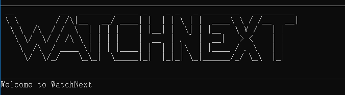
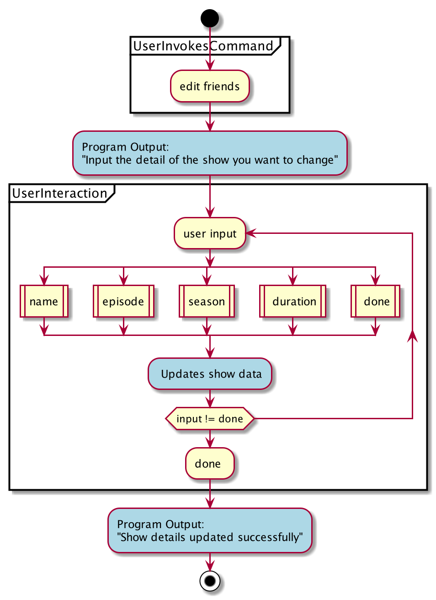
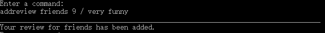
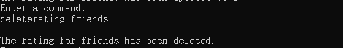
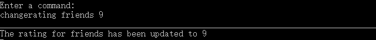
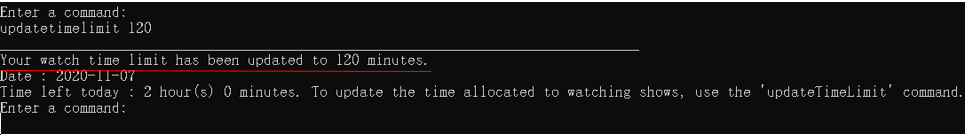
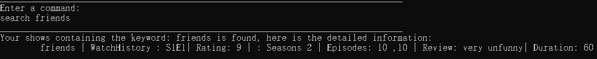

# **WatchNext** User Guide

- [**WatchNext** User Guide](#watchnext-user-guide)
  - [1. Introduction](#1-introduction)
      - [**WatchNext** is a show tracker made for teenagers and young adults.](#watchnext-is-a-show-tracker-made-for-teenagers-and-young-adults)
    - [1.a. What does **WatchNext** do?](#1a-what-does-watchnext-do)
    - [1.b. Why use **WatchNext**?](#1b-why-use-watchnext)
    - [1.c. What will this guide do?](#1c-what-will-this-guide-do)
  - [2. Quick Start](#2-quick-start)
  - [3. Command Format](#3-command-format)
  - [4. Features](#4-features)
      - [4.a. `help` - Views help](#4a-help---views-help)
      - [4.b. `add` - Adds a show](#4b-add---adds-a-show)
      - [4.c. `edit` - Edits your show details](#4c-edit---edits-your-show-details)
    - [4.d. `rating` - Modifies rating of your show](#4d-rating---modifies-rating-of-your-show)
    - [4.e. `list` - Displays all your shows in the list](#4e-list---displays-all-your-shows-in-the-list)
    - [4.f. `delete` - Deletes your show](#4f-delete---deletes-your-show)
    - [4.g. `deleterating` - Deletes rating of your show](#4g-deleterating---deletes-rating-of-your-show)
    - [4.h. `changerating` - Changes rating of your show](#4h-changerating---changes-rating-of-your-show)
    - [4.i. `episode` - Changes the episode of the show you are currently watching](#4i-episode---changes-the-episode-of-the-show-you-are-currently-watching)
    - [4.j. `season` - Changes the season of the show you are currently watching](#4j-season---changes-the-season-of-the-show-you-are-currently-watching)
    - [4.k. `addreview` - Adding a review](#4k-addreview---adding-a-review)
    - [4.l. Managing your watch time limit](#4l-managing-your-watch-time-limit)
    - [4.l.a. `watch` - Watch a show in your watchlist](#4la-watch---watch-a-show-in-your-watchlist)
    - [4.l.b. `updatetimelimit` - update your watch time limit](#4lb-updatetimelimit---update-your-watch-time-limit)
    - [4.m. `search` - search a show in the watchlist](#4m-search---search-a-show-in-the-watchlist)
    - [4.n. `bye` - Exits the program](#4n-bye---exits-the-program)
    - [5. FAQ](#5-faq)
    - [6. Command Summary](#6-command-summary)

## 1. Introduction

#### **WatchNext** is a show tracker made for teenagers and young adults.

### 1.a. What does **WatchNext** do?

For users who watch their favourite shows on multiple free streaming platforms and other open source streaming websites,
WatchNext will track their progress for the different shows they watch, and upcoming shows that they intend to watch. In addition, it provides a tracker 
to limit users' weekly watch time to help users better manage their time.

For students, **WatchNext** serves the same purpose of tracking your learning progress for lectures and webcasts.

**WatchNext** is optimized for users who prefer to work with the Command Line Interface (CLI).

### 1.b. Why use **WatchNext**?

**WatchNext** allows you to watch shows on multiple free streaming platforms or other open source stream websites and keep track of which episode you are at.
 It is difficult and can be taxing to track your favourite shows through browser bookmarks.
This is especially pertinent for younger teenagers and adults who make up a large part of video entertainment media consumers.

For students, there is also a need for to manually track lecture videos and webcast progress as lecturers may use different learning management systems.

This motivated our team to create an application that would not only help track all your shows and lectures, 
but also foster a community where everyone will be able to share their favourite shows and their watchlist with like-minded individuals and friends.
<!-- I used foster for ambiguous language so we can get away with the feature not being implemented yet -->
 
### 1.c. What will this guide do?

This guide aims to equip you with the knowledge on how to use our application by providing example usages of all its features. 
The features can be found in [Section 4: “Features”](#4-features).

Interested in using **WatchNext**? Jump to [Section 2: “Quick Start”](#2-quick-start) to get started!

## 2. Quick Start

Prerequisite: Ensure that you have Java 11 installed in your Computer.

1. Download the latest version from [here](https://github.com/AY2021S1-CS2113T-W12-3/tp/releases).

2. Copy the file to the folder you want to use as the home folder for your program.

3. Open a command window in that folder.

4. Run the command `java -jar WatchNext.jar`.

5. You will be greeted with this:

&nbsp;  

## 3. Command Format

* Words in `UPPER_CASE` and within the `<>` field are the parameters to be supplied by the user e.g. rating `<SCORE>`.

* The maximum length for a Show `SHOWNAME` is 100 characters.

* The `<SHOWNAME>` to be entered is case-sensitive.

## 4. Features
 
#### 4.a. `help` - Views help
 The help list contains information about all the possible accepted commands.
 
 Format:
  `help`
  
 Example of usage:
 `help`
  
Expected outcome:
 

 
&nbsp;

#### 4.b. `add` - Adds a show
 The `add` command adds a show into your existing watchlist.
 
  Format:
   `add <SHOWNAME> <SEASON> <NUMBER OF EPISODES PER SEASON,SEPERATED BY COMMAS> <DURATION OF EPISODE>`
   
   **[NOTE]**
   
   * The `<DURATION OF EPISODE>` is in minutes.
   
   * If a show has 2 seasons, you will need to input the number of episodes for both seasons (see example of usage below) for the `<NUMBER OF EPISODES PER SEASON,SEPERATED BY COMMAS>` field. The program will not add the show into the watchlist otherwise.
   
   * You will need to input `<SHOWNAME>` as one word. If the name of your show contains more than one word you will need to input the name with no spaces (example of usage below for `<RunningMan>` or you may use `_` to represent a space.)
   
  Example of usage:
  
  `add Friends 2 10,10 60`
  
  `add RunningMan 3 10,12,11 90`
 
 Expected outcome:
  
 
  
 &nbsp;
 
#### 4.c. `edit` - Edits your show details
 The `edit` command allows you to edit the name of the show, number of seasons, number of episodes or the duration 
 of an episode depending on the input of the user when prompted.
  
   Format:
     `edit <SHOWNAME>`
     
   Example of usage:
    `edit Friends`
 
 
    
 You will be prompted thereafter to enter the fields you want to change such as:
 name, season, episode, duration(of an episode).
 
 Format:
    `name <SHOWNAME>`, `season <NUMBER OF SEASONS>`, `episode <NUMBER OF EPISODES PER SEASON,SEPERATED BY COMMAS>`, `duration <DURATION OF EPISODE>`
 
Example of usage:
     `name F.r.i.e.n.d.s` , `season 2`, `episode 10,11`, `duration 90`
     
     
 When you have completed all changes, input `done`.
 
**[NOTE]**

* The `<DURATION OF EPISODE>` is in minutes.  

* The program will wait for your command to edit the show details until you input `done`.

 
 Expected outcome:
  
 
  
 &nbsp;
 
 To help you better understand the flow of this command we have included a program flow to illustrate the process.
 
 
 
 The blue bubbles represent the Program portion of the interaction, while the yellow bubbles indicate the user input

 
 &nbsp;
 
### 4.d. `addreview` - Adding a review

The `addreview` command allows you to add a review for a show, including adding a rating.

 Format:
  `addreview <SHOWNAME> <RATING> <REVIEW>`
  
  * The `<RATING>` is out of 10. The rating will not be added if it is not a value between 0 and 10.
  
 Example of usage:
 `addreview Friends 9 very funny `
 
   Expected outcome:
 
  

   &nbsp;
 
### 4.e. `list` - Displays all your shows in the list

The `list` command displays all existing shows in your watchlist in an easy-to-read format, including the episode and
season that you are currently at.

   Format:
    `list`
    
   Example of usage:
   `list`
   
   Expected outcome:
    
   
    
   &nbsp;

### 4.f. `delete` - Deletes your show

 The `delete` command removes a specified show from the watchlist.
 
 Format:
  `delete <SHOWNAME>`
  
 Example of usage:
 `delete Friends`
 
 Expected outcome:
  
 

 &nbsp;
  
 
### 4.g. `deleterating` - Deletes rating of your show

The `deleterating` command deletes the rating for an existing show in the watchlist.

 Format:
  `deleterating <SHOWNAME>`
  
 Example of usage:
 `deleterating Friends`
 
 Expected outcome:
  
 

 &nbsp;

### 4.h. `changerating` - Changes rating of your show

The `changerating` command changes the rating for an existing show which already has a rating in the watchlist.

 Format:
  `changerating <SHOWNAME> <NEWRATING>`
  
  **[NOTE]**
  
  * The `<NEWRATING>` is out of 10. The rating will not be added if it is not a value between 0 and 10.
  
 Example of usage:
 `changerating Friends 10`
 
 Expected outcome:
  
 
  
 &nbsp;

### 4.i. `episode` - Changes the episode of the show you are currently watching

The `episode` command updates the current episode of an existing show in your watchlist.

**[NOTE]**

* This command changes the current episode that you are watching in your watch history. To change the number of episodes a show has, use the [edit](#4c-edit---edits-your-show-details) command. 

 Format:
  `episode <SHOWNAME> <EPISODE>`
  
 Example of usage:
 `episode Friends 10`
 
 Expected outcome:
  
 
  
 &nbsp;
 
### 4.j. `season` - Changes the season of the show you are currently watching

The `season` command updates the current season of an existing show in your watchlist.

**[NOTE]**

* This command changes the current season that you are watching in your watch history. To change the number of episodes a show has, use the [edit](#4c-edit---edits-your-show-details) command. 

 Format:
  `season <SHOWNAME> <SEASON>`
  
 Example of usage:
 `season Friends 3`
 
 Expected outcome:
  
 
  
 &nbsp;

### 4.k. Managing your watch time limit

 **WatchNext** allows you to set and track your daily watch time with its two commands , `watch` and `updatetimelimit`. 
 
### 4.k.a. `watch` - Watch a show in your watchlist

The `watch` command increments the current episode that you are on, and automatically updates your watch time limit.

 Format:
  `watch <SHOWNAME> `
  
 Example of usage:
 `watch friends`
 
 Expected outcome:
  
 
  
 &nbsp;

### 4.k.b. `updatetimelimit` - update your watch time limit

The `updatetimelimit` command updates your current watch time limit.

 Format:
  `updatetimelimit <DURATION LIMIT> `
  
  **[NOTE]**
  
 * `<DURATION LIMIT>` should be entered in minutes. Your set duration will be stored until the next day.
 
 * If you have watched a show before updating your time limit, it will automatically be taken into account after you enter the `updatetimelimit` command.
 
 Example of usage:
 `updatetimelimit 120 `
 
 Expected outcome:
  
 
  
 &nbsp;

### 4.l. `search` - search a show in the watchlist  

The `search` command helps you search for a specific show in the watchlist and prints out the show information.  

 Format:
 `search <SHOWNAME>`  
 
 Example of usage:
 `search Friends`  
 
 **[NOTE]**
 
 * The `<SHOWNAME>` is case-sensitive.
  
 Expected output:
 
   
 
 &nbsp;
  
### 4.m. `bye` - Exits the program

The `bye` command exits the program.

Format:
 `bye`
 
Example of usage:
`bye`

Expected outcome:
 

 
&nbsp;

### 5. FAQ

**Q**: Is my watchlist saved after I exit the program?  

**A**: Of course! The watchlist is saved into a local storage file after every input entered by the user.The same file will be loaded up when you start **WatchNext** again.  

**Q**: Where can I find the watchlist file if I want to share it with my friends?  

**A**: The file will be stored at the same path of the jar file, inside the "data" folder.  

**Q**: Can I edit my watchlist directly in the local file?  

**A**: Yes, it is allowed but not recommended. The file is written in a specific format. If the format is not consistent, **WatchList** will be unable to load up the file so stored shows message may disappear.  

**Q**: What should I do if there was an error while I was typing in some input?

**A**: It depends on the nature of the error. WatchNext provides insightful error messages which will inform and guide you on any actions necessary.  

**Q**: What format should I use if I want to track my lectures?  

**A**: A suggested format would be `add <MODULENAME> <TOPICS> <NUMBER OF LECTURES PER TOPIC,SEPERATED BY COMMAS> <DURATION OF LECTURE>`.However, feel free to be creative and think of a format that suits you!

### 6. Command Summary

This section showcases the list of available features and usage examples for your reference.
             

|Action|Format|Example|
|--------|----------|---------------|
|Display help | `help`| `help`|
|Add show  |`add <SHOWNAME> <SEASON> <NUMBER OF EPISODES>,<EPISODE YOU ARE WATCHING> <DURATION OF EPISODE>` |`add Friends 2 10,10`|
|Edit show |`edit <SHOWNAME>`| `edit Friends`|
|Add rating |`rating <SHOWNAME> <SCORE>`| `rating Friends 9`|
|Show watchlist |`list`|  `list`|
|Delete show |`delete <SHOWNAME>`|   `delete Friends`|
|Change rating |`changerating <SHOWNAME> <NEWSCORE>`|   `changerating Friends 10`|
|Delete rating |`deleterating <SHOWNAME>`|  `deleterating Friends`|
|Update episode |`episode <SHOWNAME> <EPISODE>`|  `episode Friends 10`|
|Update season |`season <SHOWNAME> <SEASON>`|   `season Friends 3`|
|Watch a show  |`watch <SHOWNAME>`|  `watch Friends`|
|Update watch time limit |`updatetimelimit <DURATION LIMIT>`|   `updatetimelimit 100`|
|Search a show |`search <SHOWNAME>`|  `search Friends`|
|Exit program |`bye`|   `bye`|

