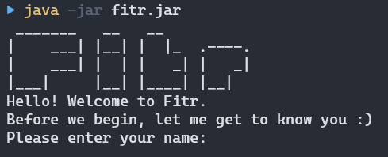

# Fitr User Guide

* Table of Contents
{:toc}

# 1. Introduction
**Fitr** is a command line application, helping you keep track of your food intake and exercises. 
Fitr is targeted at university students, who want a comprehensive application to track your food consumption and exercises. 
You can enter your food intake and the exercises that you have done for the day, and track your net calories along the way. 
If you are unsure of what exercises to do, you can also ask for recommendations from Fitr.

This user guide provides a detailed documentation on how to use Fitr, and also shows you how to get started using Fitr.

## 1.1 Prerequisites
You must have **Java 11** or above installed on your computer. You must also be comfortable using the command line or the terminal.

## 1.2 How to use this guide
Note the formatting used in this guide:
- A command that you need to enter at the command line is formatted as `command`.
- Important information is indicated with :bulb:.
- Warnings are indicated with :warning:.
- Words formatted as `UPPER_CASE` are to be supplied by you.

## 1.3 Quick start
This quick start section provides a step-by-step procedure to get you started with Fitr.
1. Ensure that you have **Java 11** or above installed.
2. Download the latest version of `Fitr` from [here](https://github.com/AY2021S1-CS2113T-W13-2/tp/releases).
3. Open the command prompt/terminal on your computer, and navigate to the location where you stored `fitr.jar`.
4. Run the command `java -jar {filename}.jar` e.g., `java -jar fitr.jar` (i.e., run the command in the same folder as the jar file).
5. If you have performed the previous steps correctly, you should see a welcome screen, shown below in Figure 1
6. Follow the setup process by entering your name, age, height, weight, gender and your fitness level. Note that the height is in metres and weight is in kilograms.
7. Once done, you are ready to use Fitr. You can type help to find out what commands are supported in Fitr.

<p align="center"></p>
<p align="center">Figure 1: Welcome screen of Fitr for new users</p>
   
# 2. Features
This section introduces the features available in Fitr, explaining how you can use each feature and its expected outcomes.

## 2.1 Adding Commands
You can add various types of entries to Fitr, such as your food intake, exercise completed and goals you wish to achieve. These features are documented below.

### 2.1.1 Adding a food entry
You can add a food entry to keep track of what you have eaten and the calories consumed from that food.

Format: `food NAME_OF_FOOD /NUMBER_OF_CALORIES` or `food NAME_OF_FOOD /NUMBER_OF_CALORIES AMOUNT_OF_FOOD`

For example, you can enter `food apple /50` and this will be the result after the application records the food entry:

```
The following food has been added:
Name of Food: apple
Calorie Consumed: 50
```

### 2.1.2 Adding an exercise entry
You can add an exercise entry to keep track of what exercise you have done, as well as the calories burnt from that exercise.

Format: `exercise NAME_OF_EXERCISE /CALORIES_BURNT`

For example, you can enter `exercise push ups /500` and this will be the result after the application records the exercise entry:

```
The following exercise has been added:
Name of Exercise: push ups
Burnt Cal: 500
```

### 2.1.3 Adding a food goal
You can add a food goal to the application to encourage yourself to eat more or less. 

Format: `goal food GOAL_DESCRIPTION`

For example, you can enter `goal food eat less food than yesterday` and this will be the result after the application records the food goal entry:

```
Okay! The following goal has been added:
        [F] eat less food than yesterday
```

Fitr also understands particular keywords. For example, if you would like to set a target for your calorie intake, you can key in your goal following the format below. By adding a smart food goal, Fitr will help you calculate your percentage completion and update it accordingly.

Format: `goal food > NUMBER_OF_CALORIES` or `goal food < NUMBER_OF_CALORIES`

### 2.1.4 Adding an exercise goal
You can add an exercise goal to the application to encourage yourself to exercise more or less. 

Format: `goal exercise GOAL_DESCRIPTION`

Fitr also understands particular keywords. For example, if you would like to set a target for your calorie burnt, you can key in your goal following the format below. By adding a smart exercise goal, Fitr will help you calculate your percentage completion and update it accordingly.

Format: `goal exercise > NUMBER_OF_CALORIES` or `goal exercise < NUMBER_OF_CALORIES`

## 2.2 Viewing Commands
You can view various aspects of Fitr, such as commands the application supports and its usages, your profile details, previous food and exercise entries, and your goals. These features are documented below.

### 2.2.1 Viewing help
If you are unsure of what commands the application supports or the format and usage of them, you can use this command.

Format: `help`

### 2.2.2 Viewing your profile
If you want to check your profile, you can use this command. The profile includes your name, age, gender, height, weight, and your fitness level.

Format: `view profile`

### 2.2.3 Viewing your BMI
Body mass index (BMI) is a value derived from the mass and height of a person (BMI = mass (kg) / height^2 (m^2)). The BMI is a convenient rule of thumb used to broadly categorize a person as underweight, normal weight, overweight, or obese. You can view your BMI using this command.

Format: `view bmi`

### 2.2.4 Viewing food entries
You can view the past food entries you have previously added to Fitr. All food entries will be grouped by their dates and displayed in a list form within their groups. You may choose to view all the food entries or only food entries for a specific date.

To view all food entries, you may use the view food command.

Format: `view food`

To view food entries for a specific day, you may enter the date at the back of the view food command. 

Format: `view food DD/MM/YYYY`

For example, if you would like to view your food entries on 26/10/2020, you may key in `view food 26/10/2020`.

### 2.2.5 Viewing exercise entries
You can view the past exercise entries you have previously added to Fitr. All exercise entries will be grouped by their dates and displayed in a list form within their groups. You may choose to view all the exercise entries or only exercise entries for a specific date.

To view all exercise entries, you may use the view exercise command.

Format: `view exercise`

To view exercises for a specific day, you may enter the date at the back of the view exercise command. 

Format: `view exercise DD/MM/YYYY`

For example, if you would like to view your exercises on 22/10/2020, you may key in `view exercise 22/10/2020`.

### 2.2.6 Viewing goal entries
You can view the goals you have previously set for yourself and track your progress using this command. 

Format: `view goal`

### 2.2.7 Viewing calorie summary
If you want to see the calories you consumed from food or burnt from exercise, you can use this command. Note that positive net calorie does not mean you are gaining weight. It does not take calories burnt from being alive into account and you actually burn much more calories from being alive than doing workout.

Format: `view summary`

You may also choose to view the summary for a specific day by specifying a date at the back of view summary.

Format: `view summary DD/MM/YYYY`

For example, if you would like to view your caloric summary on 22/10/2020, you may key in `view summary 22/10/2020`.

## 2.3 Editing Commands
You can edit various aspects of Fitr, such as your profile, previous food and exercise entries, and your goals. These features are documented below.

### 2.3.1 Editing your profile
You can edit your name, age, gender, height, weight, and fitness level in your profile by using this command.

Format: `edit name/age/gender/height/weight/fitness`

For example, if you want to change your height to be 1.9 m. You can use edit height command and type 1.9 as shown below.

```
Change your height (in m) to:
1.9
Height (in m) changed to: 1.9
```

### 2.3.2 Editing a food entry
You can edit your previous food entries, for example, if you previously made a mistake when entering a food that you consumed.

Format: `edit food DATE/MONTH/YEAR INDEX NAME_OF_FOOD /CALORIES_OF_FOOD QUANTITY`

### 2.3.3 Editing an exercise entry
You can edit your previous exercise entries, for example, if you previously made a mistake when entering an exercise that you performed.

Format: `edit exercise DATE/MONTH/YEAR INDEX NAME_OF_EXERCISE /CALORIES_BURNT`

### 2.3.4 Editing a goal entry
You can edit your previous goal entries, for example, if you previously made a mistake when entering the type or description of a goal.
By editing the goal entry, it will reset the status of the goal to zero unless it is a smart goal.

Format: `edit goal INDEX TYPE_OF_GOAL GOAL_DESCRIPTION`

## 2.4 Deleting Commands
If you would like to delete a particular entry, you can utilise the various delete commands as listed below. 

> :warning: **Warning:** The delete action is irreversible.

### 2.4.1 Deleting a food entry
You can delete a food entry using this command. You would need to know the index of that particular food entry as well as the date in which you wish to delete. You can try to use the view food command to find the index of the food before deleting.

Format: `delete food DATE_OF_ENTRY INDEX_OF_FOOD`

### 2.4.2 Deleting an exercise entry
You can delete an exercise entry using this command. You would need to know the index of that particular exercise entry as well as the date of it’s entry. You can try to use the view exercise command to find the index of the exercise before deleting.

Format: `delete exercise DATE_OF_ENTRY INDEX_OF_EXERCISE`

### 2.4.3 Deleting a goal entry
To delete a particular goal entry, you can use this command. However, you would need to know the index of that particular goal entry to utilise this command.

Format: `delete goal INDEX`

## 2.5 Clearing Commands
Want to start anew? Instead of deleting entries one by one, you can clear all your entries in just one command. These features are documented below.

> :warning: **Warning:** The clear action is irreversible.

### 2.5.1 Clearing all food entries
If you wish to clear all your previous food entries, you can do so with this command.

Format: `clear food`

Expected outcome:
```
Food list is cleared!
```

### 2.5.2 Clearing all exercise entries
If you wish to clear all your previous exercise entries, you can do so with this command.

Format: `clear exercise`

Expected outcome:
```
Exercise list is cleared!
```

### 2.5.3 Clearing all goal entries
If you do decide to reset your whole goal list (i.e. removing all goal entries stored), you can utilise this command.

Format: `clear goal`

Expected outcome:
```
Goal list is cleared!
```

### 2.5.4 Clearing all entries
If you decide to clear all past entries made, regardless of the type (food, exercise or goal), you can utilise this command.

Format: `clear`

Expected outcome:
```
Food, exercise and goal lists are all cleared!
```

## 2.6 Other Commands
Other than the commands mentioned above, Fitr is also able to give you a workout to do, mark your goal as complete and if you have finished using the application, you can exit as well. The following documents the other commands available. 

### 2.6.1 Getting a recommended workout
If you wish to be recommended a workout that is tailored to your fitness level, you can use this command. The command will recommend a workout and ask if you wish to accept this workout or reject it. If you do accept it, It will automatically be added into your exercise entries.

Format: `recommend`

### 2.6.2 Marking a goal as complete
After completing a goal, you can mark it as complete. However, if it is a smart goal, Fitr will mark it as complete according to your calorie intake or calorie burnt.

Format: `complete goal INDEX`

### 2.6.3 Exiting the application
Once you are done with Fitr, you can exit the application by running the command below.

Format: `bye`

## 2.7 Saving your Data
Your profile, food consumed and exercises done are saved automatically after any command that changes the data.
There is no need to save manually. All your data will be saved in the same location as `fitr.jar`.

## 2.8 Tip of the Day
Fitr will tell you a fun fact every time when you open the application. It can be an exercise tip or an interesting trivia, which can give you some motivation to do exercise! An example is shown below:

<p align="center"></p>

# 3. FAQ
In this section, you can find answers to some of the frequently asked questions (FAQs).

**Q: How do I transfer my data to another computer?**

A: Install Fitr on another computer, and overwrite the empty data files that it creates with the files with your data files.

# 4. Command Summary
Table 1 below summarises the commands Fitr understands and how they can be used. Examples are also provided for your reference.

_Table 1: Commands supported in Fitr_

Action | Format | Examples
------ | ------ | --------
Add food entry | `food NAME_OF_FOOD /NUMBER_OF_CALORIES` or `food NAME_OF_FOOD /CALORIES_OF_FOOD  AMOUNT_OF_FOOD` | `food apple /50 1` or `food pear /57`
Add exercise entry | `exercise NAME_OF_EXERCISE /CALORIES_BURNT` | `exercise run /360`
Add food goal | `goal food GOAL_DESCRIPTION` | `goal food eat more`
Add smart food goal | `goal food < NUMBER_OF_CALORIES` or `goal food > NUMBER_OF_CALORIES` | `goal food < 2000` or `goal food > 3800`
Add exercise goal | `goal exercise GOAL_DESCRIPTION` | `goal exercise run more`
Add smart exercise goal | `goal exercise < CALORIES_BURNT` or `goal exercise > CALORIES_BURNT` | `goal exercise < 4000` or `goal exercise > 3800`
View Help | `help` |
View User Profile | `view profile` |
View User BMI | `view bmi` |
View Food Entry | `view food` |
View Food Entries on a Specified Date | `view food DATE/MONTH/YEAR` | `view food 26/20/2020`
View Exercise Entry | `view exercise` | 
View Exercise Entries on a Specified Date | `view exercise DATE/MONTH/YEAR` | `view exercise 26/20/2020`
View Goal Entry | `view goal` | 
View Calorie Summary | `view summary` |
View Calorie Summary on a Specified Date | `view summary DATE/MONTH/YEAR` |
Edit User Profile | `edit name` or `edit age` or `edit gender` or  `edit height` or `edit weight` or `edit fitness` |
Edit Food Entry | `edit food DATE/MONTH/YEAR INDEX NAME_OF_FOOD /CALORIES_OF_FOOD QUANTITY` | `edit food 1 green apple /50 1`
Edit Exercise Entry | `edit exercise DATE/MONTH/YEAR INDEX NAME_OF_EXERCISE /CALORIES_BURNT` | `edit exercise 1 5km run /360`
Edit Goal Entry | `edit goal INDEX TYPE_OF_GOAL GOAL_DESCRIPTION` | `edit goal 1 food eat healthier`
Delete a Food Entry | `delete food DATE INDEX` | `delete food 24/10/20 3`
Delete an Exercise Entry | `delete exercise DATE INDEX` | `delete exercise 24/10/20 3`
Delete a Goal Entry | `delete goal INDEX` | `delete goal 5`
Clear All Food Entries | `clear food` |
Clear All Exercise Entries | `clear exercise` | 
Clear All Goal Entries | `clear goal` | 
Clear All Entries | `clear` |
Get a Recommended Workout | `recommend` |
Mark a Goal Entry as Completed | `complete goal INDEX` | `complete goal 4`
Exit Fitr | `bye` | 
