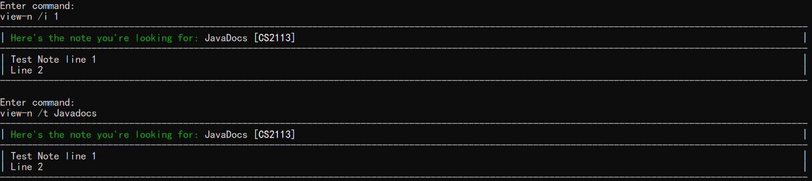

## Table of Contents
#### [1. Introduction](#intro)
#### [2. Quick Start](#quickstart)
#### [3. Features](#features)
##### &nbsp;&nbsp;&nbsp;&nbsp;&nbsp;&nbsp;[3.1 View Command List](#help)
##### &nbsp;&nbsp;&nbsp;&nbsp;&nbsp;&nbsp;[3.2 Add Note](#add-n)
##### &nbsp;&nbsp;&nbsp;&nbsp;&nbsp;&nbsp;[3.3 List Notes](#list-n)
##### &nbsp;&nbsp;&nbsp;&nbsp;&nbsp;&nbsp;[3.4 View Note](#view-n)
##### &nbsp;&nbsp;&nbsp;&nbsp;&nbsp;&nbsp;[3.5 Edit Note](#edit-n)
##### &nbsp;&nbsp;&nbsp;&nbsp;&nbsp;&nbsp;[3.6 Find Notes](#find-n)
##### &nbsp;&nbsp;&nbsp;&nbsp;&nbsp;&nbsp;[3.7 Pin Note](#pin-n)
##### &nbsp;&nbsp;&nbsp;&nbsp;&nbsp;&nbsp;[3.8 Archive Note](#archive-n)
##### &nbsp;&nbsp;&nbsp;&nbsp;&nbsp;&nbsp;[3.9 Unarchive Note](#unarchive-n)
##### &nbsp;&nbsp;&nbsp;&nbsp;&nbsp;&nbsp;[3.10 Delete Note](#delete-n)
##### &nbsp;&nbsp;&nbsp;&nbsp;&nbsp;&nbsp;[3.11 Create Tags](#create-t)
##### &nbsp;&nbsp;&nbsp;&nbsp;&nbsp;&nbsp;[3.12 List Tags](#list-t)
##### &nbsp;&nbsp;&nbsp;&nbsp;&nbsp;&nbsp;[3.13 Tag/Untag Notes](#tag-n)
##### &nbsp;&nbsp;&nbsp;&nbsp;&nbsp;&nbsp;[3.14 Tag/Untag Events](#tag-e)
##### &nbsp;&nbsp;&nbsp;&nbsp;&nbsp;&nbsp;[3.15 Delete Tags](#delete-t)
##### &nbsp;&nbsp;&nbsp;&nbsp;&nbsp;&nbsp;[3.16 Add Event](#add-e)
##### &nbsp;&nbsp;&nbsp;&nbsp;&nbsp;&nbsp;[3.17 Edit Event](#edit-e)
##### &nbsp;&nbsp;&nbsp;&nbsp;&nbsp;&nbsp;[3.18 Event Manager](#list-e)
##### &nbsp;&nbsp;&nbsp;&nbsp;&nbsp;&nbsp;[3.19 Remind](#remind-e)
##### &nbsp;&nbsp;&nbsp;&nbsp;&nbsp;&nbsp;[3.20 Delete Event](#delete-e)
##### &nbsp;&nbsp;&nbsp;&nbsp;&nbsp;&nbsp;[3.21 Exit](#exit)
#### [4. FAQ](#faq)
#### [5. Command Summary](#command)

<br>

## 1. <a id="intro">Introduction</a>

NotUS is a quick and simple, Command Line Interface (CLI) based, note-taking application for keyboard-inclined users. NotUS allows for users to categorize notes by tagging as well as pinning the more important notes. NotUS is also designed to assist in planning timetables to highlight possible clashes.

This document describes the features found in NotUS, along with example usages. It aims to help you get familiarised with the commands used in the application.

Any points with the 💡 emoji represents an additional information. You can access a summary of commands used in the application at the end of this document.

<br>

## 2. <a id="quickstart">Quick Start</a>

1. Ensure that you have Java 11 or above installed.
1. Down the latest version of `NotUS` from [here](https://github.com/AY2021S1-CS2113-T13-1/tp/releases) or under [releases from the homepage](https://github.com/AY2021S1-CS2113-T13-1/tp).
1. Go to the folder of the download and open your command terminal. Enter the following `java -jar Notus.jar`. Wait for the program to run.
1. If the program is running correctly, you should see the following:

<p align="center">
   
</p>

5. Use the command `help` to get a list of commands and their usages before using the application (if needed).

<br>

## 3. <a id="features">Features</a>

Parameters listed in [ ] denote optional entries. In some cases, at least one of the [ ] parameters must be listed. When listing the optional entries, the brackets, '[ ]', should be omitted. More information can be found under the respective commands. Texts listed in the following style refer to responses by the console running NotUS.

The following example shows how responses from the console will be displayed in this User Guide.

```css
Example message as seen on the console
```

<!--
The parameters for the following commands are **NOT** case-sensitive.
1. `delete-n`
1. `find-n`
1. `pin-n`
1. `create-t`
1. `tag-n`
1. '
-->

### <a id="help"><ins>3.1 View Command List:</ins> `help`</a>
Shows a list of all the commands that the user can enter.

Example of usage: 

`help`

Expected output: 

<p align="center">
   
</p>

<p align="center">
   
</p>

### <a id="add-n"><ins>3.2 Add Note:</ins> `add-n`</a>
Adds a new note to the list of note items (think of it as a notebook).

Format: `add-n /t TITLE [/tag TAG_1] [/tag TAG_2]... [/pin ISPIN] [/archive ISARCHIVE]`

💡 Each note has to have a **UNIQUE** title and it is **CASE-INSENSITIVE**. <br>
💡 As an extension to the above point, new notes cannot have the same title as those archived. <br>
💡 One can choose to add a `TAG` or/and `ISPIN`, `ISARCHIVE`. These parameters are optional.<br>
💡 Set `ISPIN` to "true" if you want the note to be pinned. Any other input value will leave the note unpinned.  
💡 Set `ISARCHIVE` to "true" if you want the note to be archived. Any other input value will leave the note unarchived.

Subsequently, the application prompts the user to enter the content of the note. 

Example of usage: 

`add-n /t JavaDocs /tag CS2113 /pin true` OR

`add-n /t JavaDocs /pin true` OR

`add-n /t JavaDocs /tag CS2113`

```css
Enter Note: 
*/del to delete previous line*
*/end on a new line to end note input*
```

`Test Note line 1`<br>
`Line 2`<br>
`/end`

💡 Note content must have at least 1 line.<br>
💡 Use `/del` to delete the previous line.<br>
💡 Use `/end` on a new line to denote the end of the note.

Expected output:

<p align="center">
   
</p>

### <a id="list-n"><ins>3.3 List Notes:</ins> `list-n`</a>
Shows a list of all the notes in the notebook.

Format: `list-n [/tag TAG_1] [/tag TAG_2]... [/sort DIRECTION] [/archive]`

- Specifying [/archive] will **ONLY** show archived notes. Even if the other optional parameters are listed, archived notes nor will any other notes be filtered or sorted.
- Specifying [/tag TAG] will only show the notes with the relevant tag.
- Specifying [/sort DIRECTION] will show the sorted list in ascending or descending alphabetical order according to the title of the notes.

Example of usage: 

`list-n /tag CS2113`

`list-n /sort up`

`list-n /archive`

💡 Use `/sort up` to display the list of notes in ascending order (A-Z).<br>
💡 Use `/sort down` to display the list of notes in descending order (Z-A). <br>
💡 The archived notes will **ONLY** be listed in chronological order. <br>
💡 The content of the note is truncated, thus partial content may be displayed when listing the notes. To view the full content of a particular note, use the view note command.
💡 Even if you input anything beyond `list-n` or `/archive` without the command delimiter (`/`), the program will execute the command. For example, `list-n the notes` or `list-n /archive test example` will still result in the program listing the notes/archived notes.

Expected output:

<p align="center">
   
</p>

### <a id="view-n"><ins>3.4 View Note:</ins> `view-n`</a>
View the selected note.

Format: `view-n [/i INDEX] [/t TITLE]`

- Views the note at that index or with the specific title entered. The index refers to the index number shown in the displayed note list. The index must be a **positive integer** (1, 2, 3, …). 
- At least one of the optional fields must be provided.
- If both the fields are provided, only the first one entered will be used to search for the note.


Example of usage: 

`view-n /i 1`

`view-n /t JavaDocs`

Expected output:

<p align="center">
   
</p>

#### <a id="edit-n">3.5 Edit Note: `edit-n`</a>
Edits an existing note.

Format: `edit-n /i INDEX [/t TITLE] ([/add INDEX STRING] OR [/ln LINE_INDEX CONTENTS] OR [/del INDEX]) [/c CONTENT] [/tag TAG TAG_COLOR /tag TAG1 TAG_COLOR...]`

- Edits a note at the specified INDEX. The index refers to the index number shown in the displayed note list. The index must be a **positive integer** (1, 2, 3, …).
- Only multiple use of the same type prefix [/add LINE_INDEX CONTENT], [/ln LINE_INDEX CONTENT], [/del LINE_INDEX] can be used per edit.
- [/add LINE_INDEX CONTENT] inserts the CONTENT at the specified LINE_INDEX to the note.
- [/ln LINE_INDEX CONTENT] edits the CONTENT of the specified LINE_INDEX in the note.
- [/del LINE_INDEX] deletes the CONTENT of the specified LINE_INDEX in the note.
- At least one of the optional fields must be provided.
- Existing values will be updated to the input values.
- When editing tags, the existing tags will be removed, while the non-existing tags will be added.

💡 Each note has to have a **UNIQUE** title and it is **CASE-INSENSITIVE**. <br>
💡 As an extension to the above point, new notes cannot have the same title as those archived. <br>
💡 Note content must have at least 1 line.

Example of usage: 

`edit-n /i 2 /t JavaDocs Notes`

`edit-n /i 2 /ln 1 Line 1 /c @param refers to parameters`

`edit-n /i 2 /add 2 Line 2.1 /add 3 Line 2.2`

`edit-n /i 2 /del 1 /del 2`

Expected output:

<p align="center">
   
</p>

### <a id="find-n"><ins>3.6 Find Notes:</ins> `find-n`</a>
Finds the notes and return a list of notes that contain the keyword(s) in the title.

Format: `find-n KEYWORDS`

Example of usage: 

`find-n C++ to Java`

`find-n Java`

Expected output:

<p align="center">
   
</p>

### <a id="pin-n"><ins>3.7 Pin Note:</ins> `pin-n`</a>
Pins an unpinned note to the top of the note list or unpin a pinned note.

Format: `pin-n [/i INDEX] [/t TITLE]`

- Pins a note to the top of the list. A pinned note will be unpinned. The index refers to the index number shown in the displayed note list. The index must be a **positive integer** (1, 2, 3, …).
- At least one of the optional fields must be provided.
- If both fields are provided, only the first one will be used to pin the note. 
 
Example of usage: 

`pin-n /i 1`

`pin-n /t JavaDoc`

Expected output:

<p align="center">
   
</p>

### <a id="archive-n"><ins>3.8 Archive Note:</ins> `archive-n`</a>
Archives a note.

Format: `archive-n [/i INDEX] [/t TITLE]`

- The content of archived notes are unable to be viewed. To view the content, you would need to unarchive the notes first. 
- The archived note will no longer be visible in the main notebook. To view the list of archived notes refer to [`list-n`](#list-n). 
- The index refers to the index number shown in the displayed note list. The index must be a **positive integer** (1, 2, 3, …).
- At least one of the optional fields must be provided.
 
Example of usage: 

`archive-n /i 1`

`archive-n /t JavaDoc`

Expected output:

<p align="center">
   
</p>

### <a id="unarchive-n"><ins>3.9 Unarchive Note:</ins> `unarchive-n`</a>
Unarchives a note.

Format: `unarchive-n [/i INDEX] [/t TITLE]`

- The index refers to the index number shown in the displayed note list. The index must be a **positive integer** (1, 2, 3, …).
- At least one of the optional fields must be provided.
 
Example of usage: 

`unarchive-n /i 1`

`unarchive-n /t JavaDoc`

Expected output:

<p align="center">
   
</p>

### <a id="delete-n"><ins>3.10 Delete note:</ins> `delete-n`</a>
Deletes an existing note.

Format: `delete-n [/i INDEX] [t/TITLE]`

- Deletes the note at that index or with the specific title entered. The index refers to the index number shown in the displayed note list. The index must be a **positive integer** (1, 2, 3, …).
- At least one of the optional fields must be provided.

💡 Partial title input is **NOT** possible.

Example of usage: 

`delete-n /i 1`

`delete-n /t JavaDocs`

Expected output:

<p align="center">
   
</p>

### <a id="create-t"><ins>3.11 Create Tags:</ins> `create-t`</a>
Create tags.

Format: `create-t /tag TAG [TAG_COLOR] [/tag TAG]...`

- Creates a tag with the name TAG. TAG can only be a single word.
- [TAG_COLOR] is an optional input to specify the tag color to display. The possible colors are red, green, blue, yellow, purple, cyan, white. The tag color is set as white by default.
- The user can create multiple tags within a single line.

💡 Creating a tag that already exists will override the tag color.

Example of usage: 

`create-t /tag CS2113`

`create-t /tag important red /tag CS2113 blue`

💡 If no tag color is specified, the color of the tag will be that of the default white color.

Expected output:

<p align="center">
   
</p>

### <a id="list-t"><ins>3.12 List Tags:</ins> `list-t`</a>
Shows a list of tags that have been created.

Example of usage: 

`list-t`

Expected output:

<p align="center">
   
</p>

### <a id="tag-n"><ins>3.13 Tag/Untag Notes:</ins> `tag-n`</a>
Tags or untags a note with the given tag name.

Format: `tag-n /i INDEX /tag TAG [TAG COLOR] [/tag TAG]...`

- Tags a note with a given TAG. If the note already contains the TAG, the tag will be removed from the note.The index refers to the index number shown in the displayed note list. The index must be a **positive integer** (1, 2, 3, …).
- The user can create tag or untag multiple tags to a note within a single line.

💡 If the user tries to tag a non-existing tag to a note, the application will automatically create a new tag, and add the tag to the note.

Example of usage: 

`tag-n /i 1 /tag CS2113`

`tag-n /i 1 /tag CS2113 /tag important`

Expected output:

<p align="center">
   
</p>

### <a id="tag-e"><ins>3.14 Tag/Untag Events:</ins> `tag-e`</a>
Tags or untags an event with the given tag name.

Format: `tag-e /i INDEX /tag TAG [TAG COLOR] [/tag TAG]...`

- Tags a note with a given TAG. If the event already contains the TAG, the tag will be removed from the event.The index
 refers to the index number shown in the displayed event list. The index must be a **positive integer** (1, 2, 3, …).
- The user can create tag or untag multiple tags to an event within a single line.

💡 If the user tries to tag a non-existing tag to an event, the application will automatically create a new tag, and add the tag to the event.

Example of usage: 

`tag-e /i 1 /tag CS2113`

`tag-e /i 1 /tag CS2113 /tag important`

<p align="center">
   
</p>

Expected output:

### <a id="delete-t"><ins>3.15 Delete Tags:</ins> `delete-t`</a>
Deletes a tag from the list of tags and remove the tag from the related notes and events.

Format: `delete-t /tag TAG [/tag TAG]...`

- Deletes the tag with the name TAG.
- The user can delete multiple tags within a single line.
- Notes and events with the tag, will have the tag removed.

Example of usage: 

`delete-t /tag CS2113`

Expected output:

<p align="center">
   
</p>

### <a id="add-e"><ins>3.16 Add Event:</ins> `add-e`</a>
Adds an event to the list.

Format: `add-e /t TITLE /timing DATETIME [/end DATETIME] [/repeat REPEAT] [/stop REPEAT_END] [/remind REMIND] [/tag TAG_1] [/tag TAG_2]...`

- Events have a default duration of 1 hour if [/end] is not specified.
- Events must end on the same day they start.
- Events cannot end before they start
- Specifying [/end DATETIME] will set the event to end a specific time.
- Specifying [/repeat RECURRING] will set the event as a recurring event.
- Specifying [/remind REMIND] will set the program to remind the event.

💡 DATETIME format pattern "dd-MM-yyyy HH:mm”<br>
💡 Repeat inputs can be `daily`, `weekly`, `monthly`, `yearly`<br>
💡 Remind inputs can be `[1-7]-day` or `1-week` <br>
💡 Remind inputs can be chained to indicate multiple reminders

Example of usage: 

`add-e /t CS2113 Tutorial /timing 2020-10-30 13:00 /end 2020-10-30 19:00 /repeat weekly /remind 1-day 3-day`

Expected output:

<p align="center">
   
</p>

### <a id="edit-e"><ins>3.17 Edit Event:</ins> `edit-e`</a>
Edits an existing event in the event list/timetable.

Format: `edit-e /i INDEX [/t TITLE] [/timing DATETIME] [/end DATETIME] [/repeat REPEAT] [/stop REPEAT_END] [/remind-add REMIND] [/remind-drop REMIND] [/remind-clear]`

- Edits the event at the specified INDEX. The index refers to the index number shown in the displayed events list. The index must be a **positive integer** (1, 2, 3, …).​
- At least one of the optional fields must be provided [/t TITLE], [/timing DATETIME], [/end DATETIME], [/repeat REPEAT], [/stop REPEAT_END], [/remind-add REMIND], [/remind-drop REMIND], [/remind-clear] [.
- Existing values will be updated to the input values.
- End date time must be on the same day as start date time.

- Specifying [/timing DATETIME] without [/end DATETIME] will have event duration maintained and end datetime changed. If end datetime would be past 2359, end datetime would be set at 2359.
- Specifying [/repeat RECURRING] will set the event that type of event.
- Specifying [/remind-add REMIND] will add that reminder to the event if it does not exist.
- Specifying [/remind-drop REMIND] will delete that reminder from the event if it exists.
- Specifying [/remind-add REMIND] will remove all reminders in the event if any exists.

💡 DATETIME format pattern "dd-MM-yyyy HH:mm”<br>
💡 Repeat inputs can be `none`, `daily`, `weekly`, `monthly`, `yearly`<br>
💡 Remind inputs can be `[1-7]-day` or `1-week` <br>
💡 Remind inputs can be chained to indicate multiple reminders

Example of usage: 

`edit-e /i 1 /t CS2113 Lecture /timing 2020-10-30 16:00 /stop 2020-12-01 12:00 /remind-clear`

Expected output:

<p align="center">
   
</p>

### <a id="list-e"><ins>3.18 Event Manager:</ins> `list-e`</a>
Display the module timetable on the current day.

Format: `list-e [/timing Year] [/timing Year-Month]`

- Having no optional prefixes will display all events stored. Recurring events will only display once. Index shown is the index used when deleting or editing events.
- Specifying [/timing Year] will display all events for the year. Will include repeated events. <br>
💡 Year format pattern "YYYY”. <br>
- Specifying [/timing Year-Month] will display all events for that month. Will include repeated events. <br>
💡 Year format pattern "YYYY-MM”.

Example of usage: 

`list-e /timing 2020-10`

Expected output:

<p align="center">
   
</p>

### <a id="remind-e"><ins>3.19 Remind:</ins> `remind-e`</a>
Reminds the specified event from the timetable.

Format: `remind-e`

- Shows all reminders for today.

Example of usage: 

`remind-e`

Expected output:

<p align="center">
   
</p>

### <a id="delete-e"><ins>3.20 Delete Event:</ins> `delete-e`</a>
Adds a new item to the list of todo items.

Format: `delete-e INDEX`

* Deletes the event at the specified INDEX. The index refers to the index number shown in the displayed event list (list-e). The index must be a **positive integer** (1, 2, 3, …).

Example of usage: 

`delete-e 1`

Expected output:

<p align="center">
   
</p>

### <a id="exit"><ins>3.21 Exit:</ins> `exit`</a>
Exits the program.

💡 Even if you input anything beyond exit, the program will terminate. For example, `exit the program` will still result in the program being terminated.

Example of usage: 

`exit`

<br>

## <a id="faq">4. FAQ</a>

**Q**: How do I transfer my data to another computer? 

**A**: The notes along with the list of all the notes and event are automatically saved in a human editable text file, whenever there is a change made. Once exported, you can transfer the file over to the new computer and load the data.

**Q**: What if the app crashes half way through what happens to my data?

**A**: All the data is saved in a text file whenever there are changes made throughout the program. Hence, you can start NotUS again and the updated data will be loaded in.

**Q**: What if I don't remember some of the commands? 

**A**: Type the command `help` for a list of useful commands.

<br>

## <a id="command">5. Command Summary</a>

Target Action | Example Code(s)
------------  | -------------
View command list | `help`
Add note | `add-n /t JavaDocs /tag CS2113 /pin true`<br>`add-n /t JavaDocs /pin true`<br>`add-n /t JavaDocs /tag CS2113`<br>`add-n /t JavaDocs`<br><br>`@param refers to param`<br>`@return refers to item to be returned`
Archive note | `archive-n /t JavaDocs`<br>`archive-n /i 1`
Unarchive note | `unarchive-n /t JavaDocs`<br>`unarchive-n /i 1`
List notes | `list-n`<br>`list-n /archive`<br>`list-n /tag CS2113`<br>`list-n /sort up`<br>Or any combination with `/tag` and `/sort`
View note | `view-n /i 1`<br>`view-n /t JavaDocs`<br>`view-n /i 1 /t JavaDocs`
Edit note | `edit-n /i 2 /t JavaDocs Notes`<br>`edit-n /i 2 /ln 1 /c @param refers to parameters`<br>`edit-n /i 2 /tag Notes`<br> Or any combination with `/t`, [`/ln` + `/c`] and `/tag` 
Find notes | `find-n Java`
Pin note | `pin-n /t JavaDocs Notes`<br>`pin-n /i 1`
Delete note | `delete-n /t JavaDocs Notes`<br>`delete-n /i 1`
Create tag | `create-t /tag Important red`<br>`create-t /tag NUS /tag CEG yellow`
List tags | `list-t`
Tag/Untag | `tag /i 1 /tag Important`<br>`tag /i 1 /tag Important red`<br>`tag /i 1 /tag Important red /tag NUS /tag CEG yellow`
Delete tag | `delete-t /tag Important`<br>`delete-t /tag Important red`<br>`delete-t /tag NUS /tag CEG yellow`
Add event | `add-e /t CS2113 /timing 16-10-2020 16:00`<br>`add-e /t CS2113 Lecture /timing 16-10-2020 16:00 /repeat ...`<br>`add-e /t CS2113 Lecture /timing 16-10-2020 16:00 /end 16-10-2020 18:00 /remind ...`<br>Or any combination with `/repeat` and `/remind`
Edit event | `edit-e /i 1 /t CS2113 Lecture`<br>`edit-e /i 1 /d 16-10-2020 15:55`<br>`edit-e /i 1 /repeat ...`<br>`edit-e /i 1 /remind ...`<br>Or any combination with `/t`, `/d`, `/repeat` and `/remind`)
Event Manager | `list-e`<br>`list-e /d 14-09-2020`
Remind | `remind-e 1`
Delete event | `delete-e 1`
Exit | `exit`
