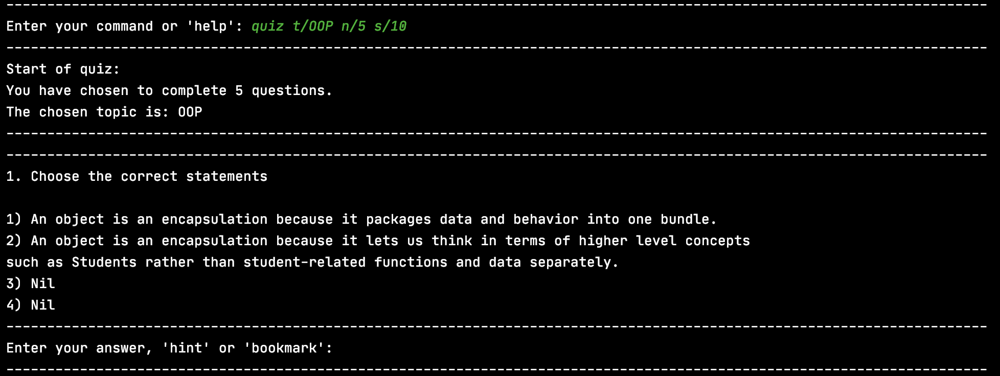
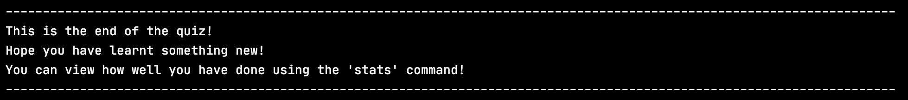
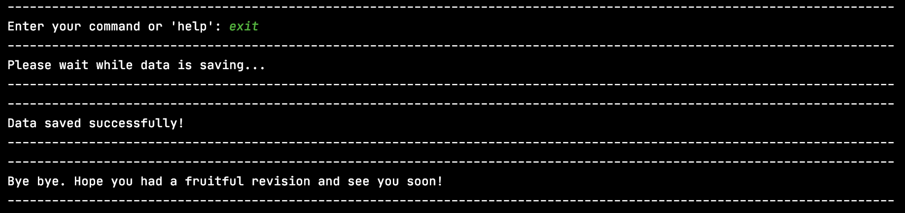

# User Guide for E-Duke-8

- [User Guide for E-Duke-8](#user-guide-for-e-duke-8)
  - [Introduction](#introduction)
  - [Quick Start](#quick-start)
  - [Features](#features)
    - [Welcome Page](#welcome-page)
    - [Viewing E-Duke-8 information : `about`](#viewing-e-duke-8-information--about)
    - [Viewing available commands : `help`](#viewing-available-commands--help)
    - [Listing all topics : `topics`](#listing-all-topics--topics)
    - [Accessing the CS2113T textbook content: `textbook`](#accessing-the-cs2113t-textbook-content-textbook)
    - [Starting a quiz: `quiz`](#starting-a-quiz-quiz)
    - [Showing a hint : `hint`](#showing-a-hint--hint)
    - [Exiting the program : `exit`](#exiting-the-program--exit)
  - [FAQ](#faq)
  - [Command summary](#command-summary)

## Introduction

E-Duke-8 helps CS2113/T students **learn and understand software engineering and OOP principles** through a gamified
platform and enhances their learning experience. 

It is a desktop application where CS2113/T students can attempt bite-sized quizzes, through the **Command Line Interface (CLI)**, to test their understanding of the concepts taught, and serves to consolidate key concepts for easy revision.


## Quick Start

1. Ensure that you have Java 11 or above installed.
2. Download the latest version of **E-Duke-8** from [here](https://github.com/AY2021S1-CS2113T-F12-3/tp/releases).
3. Copy the files to the folder you want to use for the application.
4. Double click on eduke8.jar to start up the program. If the program does not start up, continue to steps 5 and 6, otherwise skip to step 7.
5. If double clicking on the jar file does not work, open up the command prompt in the same folder used in step 3.
6. Enter the following command `java -jar eduke8.jar`.
7. Type a command in the terminal and press Enter to execute it. e.g. typing 'help' and pressing Enter will list all the commands that you can use in this application. Here is a list of commands you can try:
   - about : Provides information about E-Duke-8.
   - topics : Lists CS2113/T topics that E-Duke-8 knows.
   - textbook : Provides you with a link to the CS2113/T website.
   - quiz : Starts a quiz. Eg. `quiz t/OOP n/5` will start a quiz with five questions based on OOP concepts.
   - hint	  :   Shows a hint to the current question.
   - exit : Exits the app.

8. Refer to the section on **Features** below for details of each command.

## Features 

ℹ️ Notes about the command format:
- Words in UPPER_CASE are the parameters that you can specify for your usage.
- e.g. in `quiz t/TOPIC n/QUESTIONS`, 'TOPIC' is a parameter that allows you to choose the topic you want the quiz to be based on, and 'QUESTIONS' specifies the number of questions you want to have in your quiz. 

### Welcome Page

Data is automatically loaded from the files in the **data** folder for use in quizzes and notes.

To ensure that data could be loaded successfully, ensure that the data folder that comes along with the eduke8.jar file is placed in the same folder as eduke8.jar. This is part of the setup and is to be done prior to the running of the app. 

Upon successful startup, you should be greeted with a screen like this:


### Viewing E-Duke-8 information : `about`

Shows a message explaining what E-Duke-8 is about and your benefits of using it.

Example of usage:
```
about
```

What you should see:


### Viewing available commands : `help`

Shows a list of commands that you can use.

Example of usage:
```
help
```

What you should see:


### Listing all topics : `topics`

Shows the entire list of CS2113/T's topics that you can choose for your quiz to be based upon. 

You can see the number of questions available for each topic beside the topic itself.

Example of usage:
```
topics
```

What you should see:


### Accessing the CS2113T textbook content: `textbook`

You can find a link to the module's textbook using this command. 

Example of usage:
```
textbook
```

What you should see:


### Starting a quiz: `quiz`

Starts a quiz with the number of questions and topic as specified by you.

Regardless of right or wrong answer, an explanation about the question will be displayed after you gave an answer.

Note:
- Each of the questions in the quiz will be related to the topic you have chosen.
- The first question will be immediately displayed to you once the quiz starts.
- The quiz will only end when you have attempted all of the questions in the it.

Input format: `quiz t/TOPIC n/QUESTIONS`

Example of usage:
```
quiz t/OOP n/5
```
- This will start a quiz that contains 5 questions from the topic on OOP.

What you should see:



From here on you can either:
1) Enter in your answer by typing '1', '2', '3' or '4' and pressing enter.
2) Request for a hint by typing 'hint' and pressing enter. Refer to the next section on **Hint** for more information.

If you have entered the correct answer, this is what you will see:


If you have entered the wrong answer, this is what you will see:


After attempting all of the questions, the quiz will automatically end:

After the quiz ends, you will be prompted to enter in a new command. At this point, you can choose to start a new quiz again!

### Showing a hint : `hint`

Shows a hint to the current question.
- Do note that each question only contain exactly one hint.

Example of usage:
```
hint
```

What you should see:


### Exiting the program : `exit`

Exits E-Duke-8.
- You can only exit the application when you are not in a quiz.

Example of usage:
```
exit
```




## FAQ
**Q**: How do I change the questions in the quizzes?
**A**: Open topics.json in any text editor to edit the questions, make sure to follow the format of the questions already provided.

## Command summary

| Action | Format, Examples |
| ------ | ---------------- |
| Viewing E-Duke-8 information       | `about`                                                |
| Viewing available commands    | `help`                                              |
| Listing all topics        | `topics`  |
| Accessing the CS2113T textbook content        | `textbook`                                                 |
| Starting a quiz |  `quiz t/TOPIC n/QUESTIONS` <br/> e.g. `quiz t/OOP n/5`                                              |
| Showing a hint        |           'hint;                                      |
| Exit        | `exit`                                                 |

