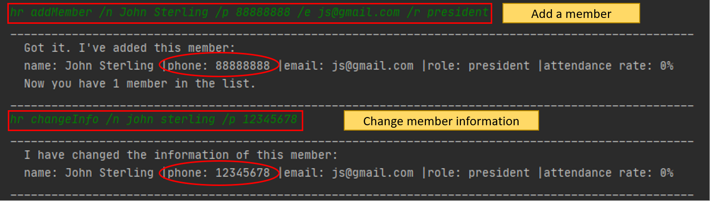
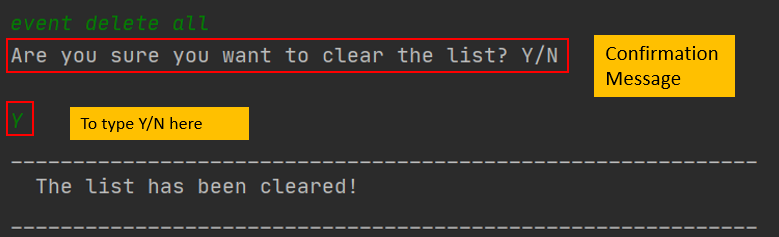

# User Guide
 

# Table of contents

- [1. Introduction](#1-introduction)
- [2. About this User Guide](#2-about-this-user-guide)
- [3. Quick Start](#3-quick-start)
- [4. Features](#4features)
  - [4.1 Help `help`](#41-help-help)
  - [4.2 Exit the program: `bye`](#42-exit-the-program-bye)
  - [4.3 HR features `HR`](#43-hr-features-hr)
    - [Add members: `addMember`](#add-members-addmember)
    - [Delete members: `delMember`](#delete-members-delmember)
    - [List members: `listMember`](#list-members-listmember)
    - [Change member information: `changeInfo`](#change-member-information-changeinfo)
    - [Search members: `search`](#search-members-search)
    - [View contacts of prof/admin: `list prof&admin`](#view-contacts-of-profadmin-list-profadmin)
    - [View contacts of connections: `list connections`](#view-contacts-of-connections-list-connections)
  - [4.4 Event features`event`](#44-event-featuresevent)
    - [Add an event: `addEvent`](#add-an-event-addevent)
    - [Delete an event: `delEvent`](#delete-an-event-delevent)
    - [Clear all events: `delEvent all`](#clear-all-events-delevent-all)
    - [List events: `listEvent`](#list-events-listevent)
    - [Countdown events `countdown`](#countdown-events-countdown)
    - [Mark an event as completed `done`](#mark-an-event-as-completed-done)
    - [Search for an Event `search`](#search-for-an-event-search)
    - [Add a participant to an event: `addAttendance`](#add-a-participant-to-an-event-addattendance)
    - [Delete a participant from an event: `delAttendance`](#delete-a-participant-from-an-event-delattendance)
    - [List participants in an event: `listAttendance`](#list-participants-in-an-event-listattendance)
  - [4.5 Finance features `finance`](#45-finance-features-finance)
    - [4.5.1 Add finance log entry: `addLog`](#451-add-finance-log-entry-addlog)
    - [4.5.2 Delete finance log entry: `delLog`](#452-delete-finance-log-entry-dellog)
    - [4.5.3 View financial summary: `summary`](#453-view-financial-summary-summary)
    - [4.5.4 Change finance log entry information: `changeLog`](#454-change-finance-log-entry-information-changelog)
  - [4.6 Import](#46-import)
  - [4.7 Saving the data](#47-saving-the-data)
- [5. FAQ](#5-faq)
- [6. Command Summary](#6-command-summary)
- [7. Glossary](#7-glossary)

## 1. Introduction

Welcome to **CCA Manager!**
CCA Manager is a revolutionary tool that changes the way you can manage interest groups with unrivaled efficiency and simplicity. Its lightweight Command Line Interface (CLI) allows administrators to breeze through tasks quickly and easily while offering powerful features to advanced users.

**Feature Overview**

* Allows you to manage a HR list of members and contacts
* Allows you to create events and record member attendance for events
* Allows you to track the financial spending and budgeting of your interest group
* You can import data from other programs
* Shorthand Commands allows you to quickly enter commands by reducing the amount of typing required
* Relative Time allows you to quickly specify the day of the event without having to type in the full date format

### 2. About this User Guide 
(By: Varsha)

This user guide provides a quick start guide for you to easily setup install CCA Manager, 
documentation of all the features that CCA Manager offers, frequently asked questions and a summary of the available commands.
To navigate between the different sections, you could use the table of contents above.

Additionally, throughout this user guide, there will be various icons used as described in the legend below to provide you useful information on using the app:
> :bulb: This symbol denotes a tip which you might find useful when using the application.

> :information_source: This symbol denotes some information that you will need to take note of when using the application.

> :`code` : Text that appears on the CLI / in code

> : [Hyperlinked]() : Leads you to the appropriate section

## 3. Quick Start
(By: Varsha)

The following steps will guide you through the process of running CCA Manager.   
 :one: Ensure that you have Java 11 or above installed.
  > :bulb: To check the version of Java on your computer, follow the instructions [here](https://www.wikihow.com/Check-Your-Java-Version-in-the-Windows-Command-Line).  
  > :bulb: To download the latest version of Java on your computer, visit [here](https://www.oracle.com/java/technologies/javase-downloads.html).  
  
 :two: Download the latest version of CCA manager from  [here](https://github.com/AY2021S1-CS2113T-F14-1/tp/releases)  
 
 :three: Navigate to the folder where you downloaded CCA Manager. Run the program by entering `java -jar CCAManager.jar` in a terminal. As seen in the figure below, the red arrow points to where you have to type in commands.
 
 > :information_source: To launch a terminal on Windows, open the start menu, type "Command Prompt" to search for the terminal and run it.   
> On MacOS, you can find the Terminal in the `/Applications/Utilities` folder. Double click Terminal to launch it.  
> On linux operating systems, the most common shortcut to opening the Terminal is CTRL+ALT+T.  
> To navigate to the folder with CCA Manager, use the command `cd <FOLDER NAME/PATH>` to go in to the folder. You can use `cd ..` to go back one level if you made a mistake.

 
 

You will see this welcome message if you have done the above steps correctly.  

## 4. Features 

This section will show the features of our program in detail.
You can follow along as we go through each of the features if you are starting out, or skip ahead to the Command Summary
to see the commands of all features at a glance.

#### Command Format 

Words in UPPER CASE are the parameters to be supplied by user.
> :information_source: Our program also supports shorthand commands.  You can use shorthand command format for faster access. Instead of typing the word in its entirety, you can use the shorthand replacement instead.
For example, as shown in the picture below, instead of typing `event`, you can type just the letter `e`. Both serve the same functionality.

### 4.1 Help `help`
Shows a list of available commands. 

This command allows you to view a summary of all the available commands and how to use them.  
Format: `help`

Expected Outcome: 

[Return to the top](#user-guide)

### 4.2 Exit the program: `bye` 
Exits the program.

With this command you can exit the program directly from the terminal without closing it.  
Format: `bye`

[Return to the top](#user-guide)

### 4.3 HR features `HR` 
#### Add members: `addMember`
(By:Ye Yutong)  

Allows you to add a member to the list of members. 

Format: `hr addMember /n NAME /p PHONE_NUMBER /e EMAIL /r ROLE` 

Shorthand Format:  
`hr` -> `h`  
`addMember` -> `a`/`add`  

Example of usage:  
 `hr addMember /n John Sterling /p 88888888 /e js@gmail.com /r president` 
 `hr add /n Harry Potter /p 12345678 /e H_P@gmail.com /r member` 
 `hr a /n sakata Gintoki /p 999999999 /e Ginsan@gmail.com /r member` 
 
 Expected Outcome:
 
 
 
 [Return to the top](#user-guide)
 
#### Delete members: `delMember`
(By:Ye Yutong)  

Allows you to delete a member from the list of members.  
Format: `hr delMember MEMBER_INDEX`  
Deletes the member at the specified MEMBER_INDEX. 

The MEMBER_INDEX refers to the index number shown in the list of members. 
The MEMBER_INDEX must be an integer greater than 0.  

Shorthand Format:  
`hr` -> `h`  
`delMember` -> `d`/`delete`  

Example of usage:  
`hr delMember 1`  
`hr delete 19`  
`hr d 5`  

 Expected Outcome:
 
 
 
 [Return to the top](#user-guide)

#### List members: `listMember`
(By:Ye Yutong)  

You can use this command to view the list of members, based on the order in which they are added into the list. 
Format: `hr listMember`  

Shorthand Format:  
`hr` -> `h`  
`listMember` -> `l` / `list`  

Example of usage:  
`hr listMember` 
`hr list` 
`hr l` 

 Expected Outcome:
 
 
 
 [Return to the top](#user-guide)

#### Change member information: `changeInfo`
(By:Ye Yutong)  

You can use this command to change contact information and role of member in the list, based on the given member name. 
Format: `hr changeInfo /n MEMBER_NAME (/p PHONE_NUMBER) (/e EMAIL) (/r MEMBER_ROLE)`  

MEMBER_NAME and at least one of PHONE_NUMBER, EMAIL and MEMBER_ROLE must be provided. 

Shorthand Format:  
`hr` -> `h`  
`changeInfo` -> `c`  

Example of usage:  
`hr changeInfo /n john sterling /p 12345678`  
`hr c /n Harry Potter /p 12345678 /e 123@gmail.com /r President`  

 Expected Outcome:
 
 
 
 [Return to the top](#user-guide)

#### Search members: `search`  
(by: Wang Zixin)  
You can use this command to search for a particular member.  
The search command will return the member that matches the criteria you specify.  
:bulb: If a member's information matches any of the conditions that the user inputs, 
it will return this member.  
Format: `hr search ITEM /n ITEM /p ITEM /e ITEM /r ITEM`  
:bulb: User can choose any parts of conditions above to search.  
:bulb: The ITEM without any symbol in front means searching the key from any parts of `Member`'s information.  

Shorthand Format:  
`hr` -> `h`  
`search` -> `s`  

Example of usage:  
`hr search peter`  
`hr search /n peter /r president`   

Expected outcomes:  
  

  

[Return to the top](#user-guide)  

#### View contacts of prof/admin: `list prof&admin`  
(by: Wang Zixin)  
You can use this command as a shortcut to view the contacts of the professors and administrators.  
:bulb: Professor/prof and administrator/admin are roles of members.  
Format: `hr list prof&admin`  

Shorthand Format:  
`hr` -> `h`  
`list` -> `l`  
`prof&admin` -> `pa`  

Example of usage:  
`hr list prof&admin`  

Expected outcome:  
  

[Return to the top](#user-guide)  

#### View contacts of connections: `list connections`  
(by: Wang Zixin)  
You can use this command as a shortcut to list the contacts of connections(alumni, speakers).  
:bulb: Alumni and speaker are roles of members.  
Format: `hr list connections`  

Shorthand Format:  
`hr` -> `h`  
`list` -> `l`  
`connections` -> `c`  

Example of usage:  
`hr list connections`  

Expected outcome:  
  

[Return to the top](#user-guide)  

### 4.4 Event features`event` 
(By: Varsha)

#### Add an event: `addEvent`
Allows you to add an event to the list of events. 
Format: `event addEvent /n EVENT_NAME /d EVENT_DATE /t EVENT_TIME` 

> :information_source: The EVENT_INDEX refers to the index number shown in the list of events. 
> :information_source: The EVENT_INDEX must be an integer greater than 0.  
> :information_source: The EVENT_DATE entered should be in the format YYYY-MM-DD.  
> :information_source: The EVENT_TIME entered should be in the 24-hour clock format (HH-mm).  

> :bulb: You can use Relative Time by specifying date of week for convenience. For example `/d next friday` will schedule the event on the next friday from current day.

Shorthand Format:  
`event` -> `e`  
`addEvent` -> `add`/`a`  

Example of usage:  
 `event addEvent /n arduino course /d 2020-12-30 /t 08-00` 
 `event add /n arduino course /d 2020-12-30 /t 23-59` 
 `event a /n arduino course /d 2020-12-30 /t 08-00` 
 `e a /n arduino course /d 2020-12-30 /t 23-59` 
 `e a /n arduino course /d next friday /t 00-00` 
 
Example scenario:  

Let's say you want to add an event called `arduino course` on `2000-12-30` at time `08-00`. 
Type `event addEvent /n arduino course /d 2020-12-30 /t 08-00` into the terminal and press enter to execute the command as shown below.

The result will be a message that the event has been successfully added as shown in the figure below.

[Return to the top](#user-guide)
 
#### Delete an event: `delEvent`
(By: Varsha)

 Allows you to delete an event from the list of events.   
 Format: `event delEvent EVENT_INDEX`  
 It Deletes the event at the specified EVENT_INDEX. 
 
> :information_source: The EVENT_INDEX refers to the index number shown in the list of events. 
> :information_source: The EVENT_INDEX must be an integer greater than 0.  

Shorthand Format:  
`event` -> `e`  
`addEvent` -> `del`/`d`  

Example of usage:     
`event delEvent 1`  
`event del 1`  
`event d 19`  
`e d 1`  
 
Example scenario:   

Let's say you want to remove the event that you have entered above. i.e. `event addEvent /n arduino course /d 2020-12-30 /t 08-00`
To delete, type `event delEvent 1` into the terminal and press enter as shown in the figure below.

 

The result will be a message that the event has been removed successfully as shown in the figure below.
 

 
 [Return to the top](#user-guide)

#### Clear all events: `delEvent all`
(By: Varsha)

Allows you to clear all events from the list of events.  
Format: `event delEvent all`

Shorthand Format:  
`event` -> `e`  
`delEvent` -> `del`/`d`  

Example of usage:   
`event delEvent all`  

Example scenario:   
You may want to clear all the events in your list. To do so, type in `event delEvent all` into the terminal and press enter. It will prompt you with a confirmation message.
Type in `Y` to clear the list as shown below.

[Return to the top](#user-guide)

#### List events: `listEvent`
(By: Varsha)

You can use this command to view the list of events, based on the order in which they are added into the list.  
Format: `event listEvent`  

Shorthand Format:  
`event` -> `e`  
`listEvent` -> `l`  

Example of usage:  
`event listEvent`  
`event l`  
`e l`  

Expected Outcome:

[Return to the top](#user-guide)

#### Countdown events `countdown`
(By: Varsha)

You can use this command to show the number of days remaining until an event. It also sorts them so that the event due first will be displayed first. 
Format: `event countdown`  

Shorthand Format:  
`event` -> `e`  
`countdown` -> `c`  

Example of usage:  
`event countdown`  
`e countdown`  
`e c`  

Expected Outcome:

[Return to the top](#user-guide)

#### Mark an event as completed `done`
(By: Varsha)

Allows you to mark an event as done.  
Format: `event done EVENT_INDEX`  

> :information_source: The EVENT_INDEX refers to the index number of the event that is to be marked as completed. 
> :information_source: The EVENT_INDEX must be an integer greater than 0.  

Shorthand Format:  
`event` -> `e`  

Example of usage:  
`event done 1`  
`e done 1`  

Example scenario:  
Let's say you have added one event to your list and the event is over. You can mark it as complete by entering `event done 1`in the terminal. The status will change 
from `Up-coming` to `Done` as shown below.

Expected Outcome:  

[Return to the top](#user-guide)

#### Search for an Event `search`
(By: Varsha)

Allows you to search for a particular event by name or date.  
Format: 'event search /s KEYWORD'  

Shorthand Format:  
`event` -> `e`  
`search` -> `s`  

Example of usage:  
`event search /s arduino course`  
`event search /s 2000-12-16`  
`e search /s 2000-12-16`  
`e s /s 2000-12-16`  

Expected Outcome:

The output when you search by name is as follows:  
 

The output when you search by date is as follows:   

> :information_source: Notice that both return the same output.
>
[Return to the top](#user-guide)

#### Add a participant to an event: `addAttendance`
(By:Ye Yutong)  

Allows you to add a participant to an event in the list of events. 
Format: `event addAttendance /n EVENT_NAME /m MEMBER_NAME` 
 
> :information_source: Both the `EVENT_NAME` and the `MEMBER_NAME` need to be added into the list of events and members prior to using this feature.  

Shorthand Format:  
`event` -> `e`  
`addAttendance` -> `aa`/`addAttend`  

Example of usage:  
 `event addAttendance /n arduino course /m peter` 
 `event addAttend /n Autodesk course /m John` 
 `event aa /n Machine Learning course /m John` 
 
Expected Outcome:

[Return to the top](#user-guide)
 
#### Delete a participant from an event: `delAttendance`
(By:Ye Yutong)  

Allows you to delete a participant from an event in the list of events.  
 Format: `event delAttendance /n EVENT_NAME /m MEMBER_NAME`  

Shorthand Format:  
`event` -> `e`  
`delAttendance` -> `da`/`delAttend`  

 Example of usage:    
 `event delAttendance /n arduino course /m peter` 
 `event delAttend /n Autodesk course /m John` 
 `event da /n Machine Learning course /m John` 
 
 Expected Outcome: 
 
 
 
 [Return to the top](#user-guide)

#### List participants in an event: `listAttendance`
(By:Ye Yutong)  

Allows you to view the list of participants in an event, based on the order in which they are added into the list.   
Format: `event listAttendance /n EVENT_NAME`  

Shorthand Format:  
`event` -> `e`  
`listAttendance` -> `la`/`listAttend`  

Example of usage:   
`event listAttendance /n arduino course`
`event listAttend /n Autodesk course`
`event la /n Machine Learning course`

Expected Outcome:

[Return to the top](#user-guide)

### 4.5 Finance features `finance`  
(by: Wang Zixin)  
#### 4.5.1 Add finance log entry: `addLog`  
Allows you to add an entry into the finance log.  
Format: `finance addLog ITEM_NAME ITEM_VALUE`  

Shorthand Format:  
`finance` -> `f`  
`addLog` -> `add`/`a`  

Example of usage:  
`finance addLog have lunch 4.5`  
`f addlog buy flight ticket 750`  

Expected outcomes:  
  

  

[Return to the top](#user-guide)  

#### 4.5.2 Delete finance log entry: `delLog`  
Allows you to remove an entry from finance log.  
Format: `finance delLog ITEM_INDEX`  

Shorthand Format:  
`finance` -> `f`  
`delLog` -> `del`/`d`

Example of usage:  
`finance dellog 3`  
`f del 1`  

Expected outcomes:  
  

  

[Return to the top](#user-guide)  

#### 4.5.3 View financial summary: `summary`  
This command allows you to view a summary of the financial log and shows the total amount of money expended.  
Format: `finance summary`  

Shorthand Format:  
`finance` -> `f`  
`summary` -> `s`/`l`

Example of usage:  
`finance summary`  

Expected Outcome:  
  

[Return to the top](#user-guide)  

#### 4.5.4 Change finance log entry information: `changeLog`  
Allows you to change the finance log entry's name and budget amount.  
Format: `finance changeLog /i INDEX /n ITEM_NAME ITEM_VALUE`  

Shorthand Format:  
`finance` -> `f`  
`changeLog` -> `c`

Example of usage:  
`finance changeLog /i 1 /n buy cake 5.5`  

Expected Outcome:  
  

[Return to the top](#user-guide)

### 4.6 Import

You can import data from other existing CSVs quickly with the import command.  
Format: `import FILENAME /c finance /name HEADER_NAME /value HEADER_NAME`  
OR `import FILENAME /c hr /name HEADER_NAME /phone HEADER_NAME /email HEADER_NAME /role HEADER_NAME`  
OR `import FILENAME /c event /name HEADER_NAME /date HEADER_NAME /time HEADER_NAME`

This command allows you to specify which columns of your CSV file you would like to copy over to the program.  

Example: Let's say you have a CSV file like shown below, and you would like to import it.    
  
In our example, the CSV file we are importing is in the same directory as CCA Manager.  
  
You can use the command `import sample.csv /c hr /name Member /phone Contact /email Email /role Role` to import the document.  

The expected outcome is as follows:  

  

If you would like to try out importing a file with a sample, we provide a sample file similar to the one shown in the above example.  
You can download the sample [here](https://raw.githubusercontent.com/AY2021S1-CS2113T-F14-1/tp/master/docs/sample.csv).

[Return to the top](#user-guide)

### 4.7 Saving the data
(By: Varsha)

CCA Manager saves all your data after every command. There is no need to save manually.

[Return to the top](#user-guide)

## 5. FAQ

This section details the frequently asked questions (FAQ) regarding the use of the application.

**Q** How do I transfer my data to another computer?  
**A** Install CCA Manager in the other computer and overwrite the empty data files it creates with the file that contains the data from your previous computer.  
You can find the data files in the "data" folder inside the folder that CCA Manager is running in.  

**Q** Is CCA Manager optimized for all Operating Systems(OS)?  
**A** CCA Manager is available for download on all major Operating Systems such as Windows, Mac and Linux.

**Q** Where can I find the release?  
**A** You can find it here [Download V2.1](https://github.com/AY2021S1-CS2113T-F14-1/tp/releases/tag/v2.1).

[Return to the top](#user-guide)

## 6. Command Summary

The following table provides a summary of all features and command formats.

Command | Format | Example
------- | ---------- | ------------
addAttendance  | `event addAttendance /n EVENT_NAME /m MEMBER_NAME` | `event addAttendance /n arduino course /m Peter` 
addMember  | `hr addMember /n NAME /p PHONE_NUMBER /e EMAIL /r ROLE` | `hr addMember /n Harry /p 12345678 /e HP@gmail.com /r member` 
addEvent | `event addEvent /n EVENT_NAME /d EVENT_DATE /t EVENT_TIME` | `event addEvent /n arduino course /d 2020-09-16 /t 8pm` 
addLog | `finance addLog ITEM_NAME ITEM_VALUE` | `finance addLog have lunch 4.5`
bye | `bye` | -
changeInfo | `hr changeInfo /n MEMBER_NAME (/p PHONE_NUMBER) (/e EMAIL) (/r MEMBER_ROLE)` | `hr changeInfo /n Jack /p 12345678 /r president`  
changeLog | `finance changeLog /i INDEX /n ITEM_NAME ITEM_VALUE` | `finance changeLog /i 1 /n buy cake 5.5`
delAttendance  | `event delAttendance /n EVENT_NAME /p MEMBER_NAME` | `event delAttendance /n arduino course /m Peter` 
delMember  | `hr delMember MEMBER_INDEX` | `hr delMember 1`
delEvent | `event delEvent EVENT_INDEX`  | `event delEvent 1`
delEvent all | `event delEvent all` | -
delLog | `finance delLog ITEM_INDEX` | `finance delLog 3`
event done   | `event done EVENT_INDEX`| `event done 2`
event search | `event search /s <KEYWORD>` | `event search /s arduino` 
event countdown | `event countdown` | -
help | `help` | -
hr search | `hr search ITEM (/n ITEM) (/p ITEM) (/e ITEM) (/r ITEM)` | `hr search /n Peter /r president`
import  | `import FILENAME /c CATEGORY (...)` | `import sample.csv /c hr /name Member /phone Contact /email Email /role Role`
listAttendance | `event listAttendance /n EVENT_NAME` | `event listAttendance /n arduino course`
listMember  | `hr listMember` | -
listEvent | `event listEvent` | -
list prof&admin | `hr list prof&admin` | -
list connections | `hr list connections` | -
summary | `finance summary` |   -

[Return to the top](#user-guide)

## 7. Glossary

This section explains certain technical terms used in the guide which may require more detail.

**CCA** - Co-curricular Activity  
**CSV - Comma-separated values. This typically refers to the file type with extension .csv   
**Command Line Interface(CLI)** - Processes commands to a computer program in the form of lines of text.  
**Terminal/Command Prompt** - An interface where you can type and execute text based commands. It is a basic feature of most Operating Systems.  
**Directory** - Folder. A directory is a more technical name for referring to folders. 
**Command** - A command is an instruction that will cause a program to perform a series of actions based on what was supplied to it.  
**Index** - An index (of a list) refers to which position the item is in the list. In the list (apple,pear,banana) the index of "pear" is 2 because it's the 2nd element.  
**HR** - Human Resource  
**OS** - Operating Systems  
