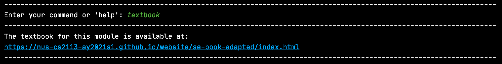
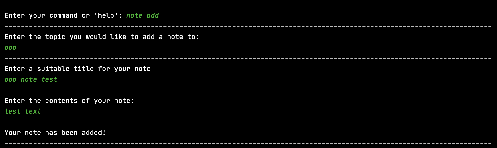
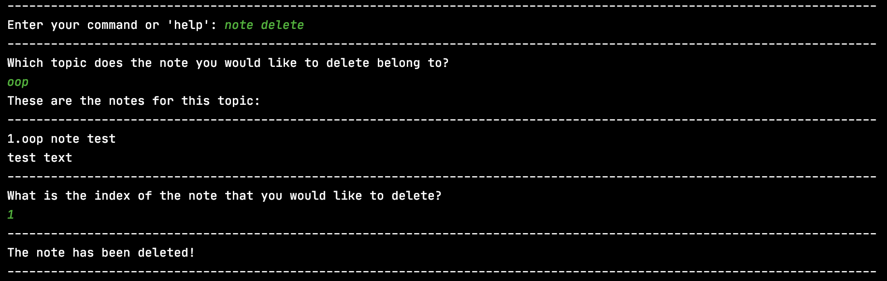
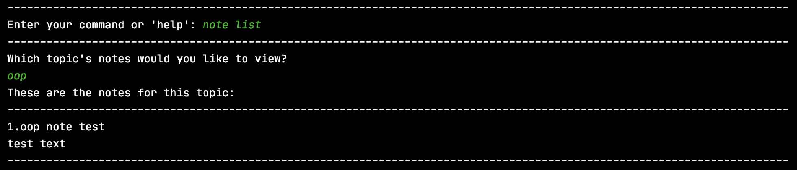

# User Guide for E-Duke-8
* Table of Contents
{:toc}

<div style="page-break-after: always;"></div>

## 1. Introduction

E-Duke-8 (pronounced "Educate") helps CS2113/T students **learn and understand software engineering and [Object-oriented Programming (OOP)](#7-glossary) principles** through a gamified
platform and enhances their learning experience. 

It is a desktop application where CS2113/T students can attempt bite-sized quizzes, through the [Command Line Interface (CLI)](#7-glossary), to test their understanding of the concepts taught, and serves to consolidate key concepts for easy revision.

On E-Duke-8, you can earn points for yourself as you attempt the quizzes! You can also view the statistics of your past quiz attempts to understand your current level of mastery of the various topics!

Challenge your friends to see who can earn the most points on E-Duke-8!

Understand more about E-Duke-8, and how you can use it to aid your learning, through this User Guide.

<div style="page-break-after: always;"></div>

## 2. Quick Start

1. Ensure that you have Java 11 or above installed.
2. Download the latest version of the jar file for **E-Duke-8** from [here](https://github.com/AY2021S1-CS2113T-F12-3/tp/releases).
3. Copy the files to the folder you want to use for the application.
4. Double click on the jar file to start up the program. If the program does not start up, continue to step 6, otherwise skip to step 8.
5. If double clicking on the jar file does not work, open up the command prompt in the same folder used in step 3.
6. Enter the following command `java -jar eduke8.jar` (assuming the downloaded jar file is named `eduke8.jar` but this can be changed).
7. Type a command in the terminal and press Enter to execute it. e.g. typing `help` and pressing Enter will list all the commands that you can use in this application. For a start, here is a list of basic commands you can try:
   - `about` : Provides information about E-Duke-8.
   - `help` : Displays available commands.
   - `topics` : Lists CS2113/T topics that E-Duke-8 knows.
   - `textbook` : Provides you with a link to the CS2113/T website.
   - `quiz` : Starts a quiz. Eg. `quiz t/OOP n/5 s/10` will start a quiz with five questions based on OOP concepts. You will have 10 seconds to complete each question. 
   - `exit` : Exits the app.

8. Refer to the section on [Features](#3-features) below for the full list of commands you can use and the details of each.

<div style="page-break-after: always;"></div>

## 3. Features 

ℹ️ Notes about the command format:
- Words in UPPER_CASE are the parameters that you can specify for your usage.
- e.g. in `quiz t/TOPIC n/NUM_QUESTIONS s/TIMER`, 'TOPIC' is a parameter that allows you to choose the topic you want the quiz to be based on, 'NUM_QUESTIONS' specifies the number of questions you want to have in your quiz, and 'TIMER' specifies the number of seconds given to complete each question. 


### 3.1. Loading Data 

Data will be automatically loaded from the files in the `data` folder for use in quizzes and notes.
You will see this message while the data loads:


If the data has been loaded successfully you should see this message:


If you wish to edit the data available, such as adding your own questions to the question bank, then do follow the instructions found in [**FAQ**](#4-faq).
However, it is recommended that you do this only after fully exploring E-Duke-8.

If have trouble opening E-Duke-8 and received the following warning message, then please refer to the section [**6. Troubleshooting**](#6-troubleshooting) for help in resolving the issue.


<div style="page-break-after: always;"></div>

### 3.2. Welcome Page

Upon successful startup, you should be greeted with a screen like this:


### 3.3. Viewing E-Duke-8 information: `about`

Shows a message explaining what E-Duke-8 is about and your benefits of using it.

Example of usage:
```
about
```

What you should see:


<div style="page-break-after: always;"></div>


### 3.4. Viewing available commands: `help`

Shows a list of commands that you can use.

Example of usage:
```
help
```

What you should see:


### 3.5. Listing all topics: `topics`

Shows the entire list of CS2113/T's topics that you can choose for your quiz to be based upon. 

You can see the number of questions available for each topic beside the topic itself.

Example of usage:
```
topics
```

What you should see:


<div style="page-break-after: always;"></div>

### 3.6. Accessing the CS2113T textbook content: `textbook`

You can find a link to the module's textbook using this command. 

Example of usage:
```
textbook
```

What you should see:



<div style="page-break-after: always;"></div>

### 3.7. Starting a quiz: `quiz`

By following a specific input format for your command (shown below), you can start a quiz where the number of questions, topic and time limit to complete each question are specified by you.

While on a question, you can choose to answer it, ask for a hint (if you are unsure of the answer) or bookmark it for future reference!

You will have to complete the question within the specified time as well. If you are unable to complete it in time, it will be regarded as an incorrect answer and the correct answer, along with the explanation, will be shown to you. You will then be directed to start the next question where the timer will restart. 

A correct answer without requesting for a hint will earn you **2 points**! Whereas a correct answer with hint requested will earn you **1 point**. You will not be awarded any points for incorrect answers. You can view the points you have accumulated with the `stats` command, which will be further explained in a [later section](#312-displaying-stats-stats) of this guide.

Regardless of right or wrong answer, an explanation about the question will be displayed after you give an answer. You will then be directed to start the next question.

Note:
- The maximum time limit for each question that you can choose is 1000 seconds.
- Each of the questions in the quiz will be related to the topic you have chosen.
- You can choose any topic (not case-sensitive) from the [topic](#35-listing-all-topics-topics) list.
- The [topic](#35-listing-all-topics-topics) list also shows you the number of questions you can choose from for each topic.
- The first question will be immediately displayed to you once the quiz starts.
- The quiz will only end when you have attempted all of the questions in it.
- Refer to [**FAQ**](#4-faq) to know more about the quiz system and the point system.

Input format: `quiz t/TOPIC n/NUM_QUESTIONS s/TIMER`

Example of usage:
```
quiz t/OOP n/5 s/10
```
- This will start a quiz that contains 5 randomly-chosen questions from the topic on OOP. Each question will have to be completed within 10 seconds. 

<div style="page-break-after: always;"></div>

What you should see:


From here on you can either:

1) Enter in your answer by typing '1', '2', '3' or '4' and pressing enter.

2) If you do not know the answer, you can request for a hint by typing `hint` and pressing enter. Refer to the [section on hints](#38-showing-a-hint-hint) for more information.

3) If you would like to refer to the question in future, you can also `bookmark` it. Refer to the [section on bookmark](#39-bookmarking-a-question-bookmark) for more information.

If you have entered the correct answer, this is what you will see:


If you have entered the wrong answer, this is what you will see:


If you did not answer the question within the specified time, this is what you will see: 


After every question, this is what you will see: 

Please press "Enter" to proceed to the next question. Once the new question appears, the timer will then restart! 

After attempting all of the questions, the quiz will automatically end:


After the quiz ends, you will be prompted to enter in a new command. At this point, you are free to choose any feature of E-Duke-8 you want to access, or you can also start a new quiz!

<div style="page-break-after: always;"></div>

### 3.8. Showing a hint: `hint`

Shows a hint to the current question.

Example of usage:
```
hint
```

What you should see:


    
Note: 
- Once a hint is used for a question, it will be recorded into your [stats](#312-displaying-stats-stats).
- When a hint is used, getting the question correct will earn you 1 point instead of 2.
- Refer to [**FAQ**](#4-faq) Q4 to understand why you should use hint despite the penalties.

<div style="page-break-after: always;"></div>

### 3.9. Bookmarking a question: `bookmark`

Stores any question encountered in a quiz in a list.

Note: 
- Bookmarking a question can only be done during a quiz

Example of usage:
```
bookmark
```

What you should see: 


<div style="page-break-after: always;"></div>

### 3.10. Listing out all bookmarked questions: `bookmark list`

Lists out all the bookmarked questions and each of their four options. The correct answer will be shown too.

Note:
- Listing out all bookmarked questions can only be done in the main menu


Example of usage:
```
bookmark list
```

What you should see:


<div style="page-break-after: always;"></div>

### 3.11. Deleting a bookmark: `bookmark delete`

You can delete a bookmark by specifying its index. The index can be found in the bookmark list when you use the `bookmark list` command.

Input format: `bookmark delete INDEX`

Example of usage:
```
bookmark delete 2
```

What you should see:


<div style="page-break-after: always;"></div>

### 3.12. Displaying stats: `stats`

Displays the accumulated statistics of your quiz attempts on E-Duke-8 which includes the points you have earned, questions done, questions answered correctly and hints used. Both overall statistics and topic-level statistics will be displayed.

Example of usage:
```
stats
```

If you are a new user, this is what you should see:


<div style="page-break-after: always;"></div>


If you have attempted the quizzes on E-Duke-8, you would be able to see your own stats. 

This is an example of what you should see:


- Refer to [**FAQ**](#4-faq) for more information about the point system in E-Duke-8.

<div style="page-break-after: always;"></div>

### 3.13. Adding a note: `note add`

Adds a note to a specified topic.

Note:
- There can be many notes under each topic
- E-Duke-8 will guide you through the note-adding process

Example of usage:
```
note add
```

What you should see:



<div style="page-break-after: always;"></div>


### 3.14. Deleting a note: `note delete`

Deletes a note from a specific topic.

Example of usage:
```
note delete
```

What you should see:




### 3.15. Listing out notes: `note list`

Lists out all notes belonging to a specific topic.

Example of usage:
```
note list
```

What you should see:



<div style="page-break-after: always;"></div>

### 3.16. Exiting the program: `exit`

Exits E-Duke-8.
- You can only exit the application when you are not in a quiz.
- If you are in the middle of a quiz and really want to exit, you can give random answers for the questions.

Example of usage:
```
exit
```


<div style="page-break-after: always;"></div>

### 3.17. Saving user data

User data will be saved after every command that changes the data completes such as at the end of using
`quiz`, `note`, and `bookmark`. There will be a final save confirmation message upon successful exit of the application
through the `exit` command.
You will see this message while the data saves:


When the data has been saved successfully you should see this message:


This is stored in the `user.json` file in the `data` folder and can be transferred between machines to keep your own
history. Please do not attempt to edit this file as it will disrupt the running of application (Refer to [**FAQ**](#4-faq) Q7).
If you want a better score you can always reattempt a quiz!

<div style="page-break-after: always;"></div>

## 4. FAQ

**Q1**: Am I be able to re-attempt the same question after my quiz ends?

**A1**: Yes, you may. Questions for the quizzes are chosen randomly from all of the questions in a certain topic. Hence, there is a chance that the question you have attempted before gets chosen again if you choose to attempt another quiz from the same topic.

**Q2**: Why does my stats only improve as I do more quizzes? Shouldn't the penalities from my previous quizzes remain?

**A2**: E-Duke-8 tries to motivate you to understand CS2113/T concepts better. E-Duke-8 also encourages learning from failure. Therefore, you do not have to be disheartened by incorrect answers when attempting quizzes. Learn from the explanations given and get the question correct in your future quiz attempts to improve your stats!
A correct answer in a future quiz attempt would also mean that you have come to understand the concept being tested in the question, and hence, you should deserve the points for it.  

**Q3**: Why does my hint usage indicator for a question not disappear after I re-attempt the question without using hint?

**A3**: This is because the hint usage serves as an indicator that you might still have some doubts in the topic, and hence you might want to read more about it. Resetting the count for hint usage might take away this benefit. 

**Q4**: Using hints will limit the total points that I can earn to build up my stats, so why should I still use hint?

**A4**: While points you earn will indeed be lesser, you are still encouraged to use hints when you have any doubts while answering questions, as they help to spur your thinking, or to confirm your thoughts. 
Furthermore, hints might give you an alternative perspective to think about the question at hand, which may be helpful to how you answer similar questions in the future.

**Q5**: How are the points awarded for correct answers?

**A5**: A correct answer without requesting for a hint will earn you **2 points**, whereas a correct answer with hint requested will earn you **1 point**. You will not be awarded any points for incorrect answers.

**Q6**: How do I change the questions in the quizzes?

**A6**: You may download the sample `topics.json` from the [releases page](https://github.com/AY2021S1-CS2113T-F12-3/tp/releases).
Make sure to include this file in the `main` folder located in the `data` folder.
If these folders do not exist yet please run the application once to create it.

The directory structure should look something like this (assuming the main jar file is named `eduke8.jar` but this can be changed):

```
yourFolder
|   eduke8.jar
|
----data
    |
    ----main
    |   |   topics.json
    |   |   ...
    |
    ----logs
        |   ...
```

Your changes will not be reflected if the directory structure does not match that above.

Open `topics.json` in any text editor to edit the questions, make sure to follow the format of the questions
already provided. An example is shown below.

```json
[
  {
    "topic": "Topic Title", 
    "questions": [
      {
        "description": "What is your question?",
        "hint": "Put the hint here",
        "explanation": "Put the explanation here",
        "options": [ 
          {
            "description": "This is the first option and correct answer",
            "correct": true
          },
          {
            "description": "This is the second option",
            "correct": false
          },
          {
            "description": "This is the third option",
            "correct": false
          },
          {
            "description": "This is the fourth option",
            "correct": false
          }
        ]
      }
    ]
  }
]
```

Note:
- The title will be loaded with spaces replaced with underscores.
- There must be 4 options for each question.
- There must be one and only one option chosen as the correct answer by specifying `true` as the value of the
`correct` field. 
- If you edit the title of existing topics or description of existing questions then their associated user 
data might be erased.
- The title of a topic cannot be blank or repeated (not case-sensitive).
- If the title includes a backslash, you may not be able to use the title in anywhere of the program.
- The description of a question cannot be blank or repeated (not case-sensitive).
- If you want to re-attempt the same question, you can simply start a new quiz with the topic that the question is from.
- If you do not want to give a hint or explanation please provide an empty quotation marks, `""`, do not remove the key from the question.
- Make sure you follow the types of values used which is either a word/sentence enclosed with quotation marks, `""`, or a `true`/`false` value.

<div style="page-break-after: always;"></div>


**Q7**: What happens if I modify the user data in `user.json`?

**A7**: If you wish to modify the user data, the application may not be able to load it successfully. You will 
receive the following message, and the affected user data will be erased.


Therefore, it is recommended that you do not modify the user data. Do build up your stats by attempting more quizzes! 

<div style="page-break-after: always;"></div>

## 5. Command summary

| Action | Format, Examples |
| ------ | ---------------- |
| Viewing E-Duke-8 information       | `about`                                                |
| Viewing available commands    | `help`                                              |
| Listing all topics        | `topics`  |
| Accessing the CS2113T textbook content        | `textbook`                                                 |
| Starting a quiz |  `quiz t/TOPIC n/QUESTIONS s/TIMER` <br/> e.g. `quiz t/OOP n/5 s/10`                                              |
| Showing a hint        |           `hint`                                      |
| Bookmarking a question | `bookmark` | 
| Listing out all bookmarked questions | `bookmark list` | 
| Deleting a bookmark | `bookmark delete` | 
| Displaying statistics | `stats` | 
| Adding a note | `note add` | 
| Deleting a note | `note delete` | 
| Listing out notes | `note list` | 
| Exit        | `exit`                                                 |

<div style="page-break-after: always;"></div>

## 6. Troubleshooting

If you have trouble starting the application there could be two sources of error for loading data.
It is possible that the data for `topics.json` or `user.json` has been tampered with wrongly and thus cannot be parsed
correctly. Please ensure that if you wish to edit the data in `topics.json`, such as to add questions, then you should follow the instructions found in [**FAQ**](#4-faq) Q6 carefully.

On the other hand, `user.json` should not be manually edited.
If you have accidentally changed this file, you may delete
the file to reset the data.
A new file will be created on start up.

If the above fixes do not work you may delete the `data` folder and use the default questions or 
download `topics.json` from the [releases page](https://github.com/AY2021S1-CS2113T-F12-3/tp/releases) again.

## 7. Glossary

- **Command Line Interface (CLI):** CLI is a text-based interface that allows users to respond to visual prompts by typing single commands into the interface and receiving a reply in the same way. (From [techopedia](https://www.techopedia.com/definition/3337/command-line-interface-cli))

- **Object-oriented Programming (OOP):** OOP is a programming paradigm. A programming paradigm guides programmers to analyze programming problems, and structure programming solutions, in a specific way. (From [CS2113/T textbook](https://nus-cs2113-ay2021s1.github.io/website/se-book-adapted/chapters/oop.html))
