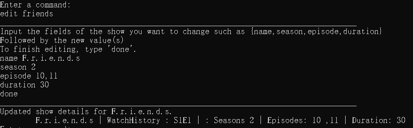

# **WatchNext** User Guide

* [1. Introduction](#1-introduction)
    + [1.a What does **WatchNext** do?](#1a-what-does-watchnext-do)
    + [1.b. Why use **WatchNext**?](#1b-why-use-watchnext)
    + [1.c. What will this guide do?](#1c-what-will-this-guide-do)
* [2. Quick Start](#2-quick-start)
* [3. Command Format](#3-command-format)
* [4. Features](#4-features)
    + [4.a. Viewing Help](#4a-help---views-help)
    + [4.b. Adding shows](#4b-add---adds-a-show)
    + [4.c. Editing shows](#4c-edit---edits-your-show-details)
    + [4.d. Adding ratings](#4d-rating---modifies-rating-of-your-show)
    + [4.e. List shows](#4e-list---displays-all-your-shows-in-list)
    + [4.f. Deleting shows](#4f-delete---deletes-your-show)
    + [4.g. Deleting ratings](#4g-deleterating---deletes-rating-of-your-show)
    + [4.h. Change Rating](#4h-changerating---changes-rating-of-your-show)
    + [4.i. Update episode](#4i-episode---changes-the-episode-of-the-show-you-are-currently-watching)
    + [4.j. Update season](#4j-season---changes-the-season-of-the-show-you-are-currently-watching)
    + [4.k. Exiting **WatchNext**](#4k-bye---exits-the-program)
- [5. Frequently Asked Questions](#5-faq)   
- [6. Command Summary](#6-command-summary)   

## 1. Introduction

### 1.a What does **WatchNext** do?

**WatchNext** is a program made for teenagers and young adults.For users who use multiple free streaming platforms or other open source stream websites,
the application will track their progress in the different shows they watch, and the upcoming shows they wish to watch.In addition, it provides a timer 
to limit your weekly show progress to help manage your time.

**WatchNext** is optimized for users who prefer to work with the Command Line Interface (CLI).

### 1.b Why use **WatchNext**?
**WatchNext** allows users who watch shows on multiple free streaming platforms or other open source stream websites.It is very difficult and especially taxing to track your favourite shows through browser bookmarks, 
especially for younger teenagers and adults who serve a large part of the user demographic in consuming said media.

This motivated our team to create an application that would not only help track all your shows, but also potentially create a community where everyone will be able to share their favourite shows and their current watchlist.
 

### 1.c What will this guide do?
This guide aims to educate you on how to use our application by providing example usages of all its features. The features can be found in Section 4: “Features”.

Interested in using **WatchNext**? Jump to Section 2: “Quick Start” to get started!

## 2. Quick Start

Ensure that you have Java 11 installed in your Computer.

1.Download the latest version from [here](https://github.com/AY2021S1-CS2113T-W12-3/tp).

2.Copy the file to the folder you want to use as the home folder for your program.

3.Open a command window in that folder.

4.Run the command `java -jar (Version Number).jar`.

[NOTE]
*_(Version Number)_* refers to the name of our latest jar release.

&nbsp;  

## 3. Command Format

Words in `UPPER_CASE` are the parameters to be supplied by the user e.g. rating `SCORE`.

The maximum length for a Show or Movie’s `NAME` is 100 characters.

## 4. Features
 
#### 4.a `help` - Views help
 The help list contains information about all accepted commands.
 
 Format:
  `help`
  
 Example of usage:
 `help`
  
Expected outcome:
 

 
&nbsp;

#### 4.b `add` - Adds a show
 The `add` command adds a show into your existing watchlist.
 
  Format:
   `add <SHOWNAME> <SEASON> <NUMBER OF EPISODES>,<EPISODE YOU ARE WATCHING>`
   
  Example of usage:
  `add Friends 2 10,10`
 
 Expected outcome:
  
 
  
 &nbsp;
 
#### 4.c `edit` - Edits your show details
 The `edit` command edits the name or number of seasons/episodes an existing show in your watchlist.
  
   Format:
     `edit <SHOWNAME>`
     
   Example of usage:
    `edit Friends`
    
 Then you will be prompted to enter the fields you want to change such as:
 name, season, episode, duration of episodes
 
    Example of usage:
     `name F.r.i.e.n.d.s` , `season 2`, `episode 10,11`, `duration 1 1 90`
     
 When you have completed all changes, use `done`.
 
 Expected outcome:
  
 
  
 &nbsp;
 
### 4.d `rating` - Modifies rating of your show
 The `rating` command gives a rating (out of 10) for an existing show in your watchlist.
 
   Format:
    `rating <SHOWNAME> <SCORE>`
    
   Example of usage:
   `rating Friends 9`
   
   Expected outcome:
    
   
    
   &nbsp;
 
### 4.e `list` - Displays all your shows in list
This command displays all existing shows in your watchlist in an easy-to-read format, including the episode and season that you are currently at.

   Format:
    `list`
    
   Example of usage:
   `list`
   
   Expected outcome:
    
   
    
   &nbsp;

### 4.f `delete` - Deletes your show
 This command removes a specified show from the watchlist.
 
 Format:
  `delete <SHOWNAME>`
  
 Example of usage:
 `delete Friends`
 
 Expected outcome:
  
 

 &nbsp;
  
 
### 4.g `deleterating` - Deletes rating of your show
This command deletes the rating for an existing show in the watchlist.

 Format:
  `deleterating <SHOWNAME>`
  
 Example of usage:
 `deleterating Friends`
 
 Expected outcome:
  
 

 &nbsp;

### 4.h `changerating` - Changes rating of your show
This command changes the rating for an existing show which already has a rating in the watchlist.

 Format:
  `changerating <SHOWNAME> <NEWSCORE>`
  
 Example of usage:
 `changerating Friends 10`
 
 Expected outcome:
  
 
  
 &nbsp;

### 4.i `episode` - Changes the episode of the show you are currently watching
This command updates the episode for an existing show that you currently have in your watchlist.

 Format:
  `episode <SHOWNAME> <EPISODE>`
  
 Example of usage:
 `episode Friends 10`
 
 Expected outcome:
  
 
  
 &nbsp;
 
### 4.j `season` - Changes the season of the show you are currently watching
This command updates the season for an existing show that you currently have in your watchlist.

 Format:
  `season <SHOWNAME> <SEASON>`
  
 Example of usage:
 `season Friends 3`
 
 Expected outcome:
  
 
  
 &nbsp;
 
### 4.k `bye` - Exits the program
This command exits the program.

Format:
 `bye`
 
Example of usage:
`bye`

Expected outcome:
 

 
&nbsp;

### 5. FAQ

**Q**: Is my watchlist saved after i exit the program?

**A**: Of course! The watchlist is saved into a local storage file after every input entered by the user.The same file will be loaded up when you start **WatchNext** again.

### 6. Command Summary

* Display help  `help`

* Add show   `add Friends 2 10,10`

* Edit show   `edit Friends`

* Add rating  `rating Friends 9`

* Show watchlist  `list`

* Delete show   `delete Friends`

* Change rating   `changerating Friends 10`

* Delete rating  `deleterating Friends`

* Update episode  `episode Friends 10`

* Update season   `season Friends 3`

* Exit program  `bye`

