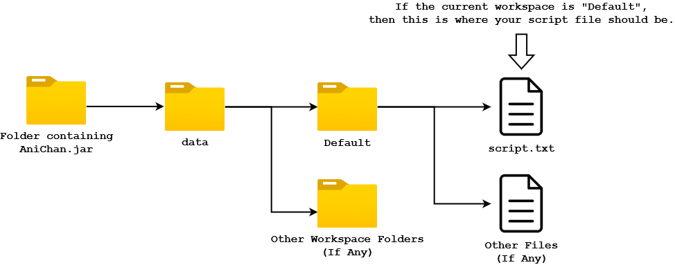
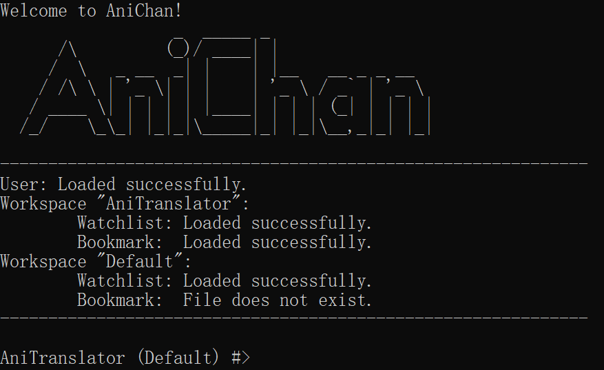

# AniChan User Guide


   

<br/>

## Table of Contents
1. [Introduction](#1-introduction)

2. [Quick Start](#2-quick-start)

3. [Features](#3-features)
<br/>&nbsp;3.1 [View the help](#31-view-the-help)
<br/>&nbsp;3.2 [Estimate time need to translate the script](#32-estimate-time-needed-to-translate-the-script)
<br/>&nbsp;3.3 [Browse through all anime](#33-browse-through-anime)
<br/>&nbsp;3.4 [Search](#34-search-for-anime)
<br/>&nbsp;&nbsp;&nbsp;&nbsp;&nbsp;&nbsp;&nbsp;3.4.1 [Search by anime title](#341-search-by-anime-title)
<br/>&nbsp;&nbsp;&nbsp;&nbsp;&nbsp;&nbsp;&nbsp;3.4.2 [Search by genre](#342-search-by-genre)
<br/>&nbsp;3.5 [View the information of an anime](#35-view-the-information-of-an-anime)
<br/>&nbsp;3.6 [Workspace management](#36-workspace-management)
<br/>&nbsp;&nbsp;&nbsp;&nbsp;&nbsp;&nbsp;&nbsp;3.6.1 [Create new workspace](#361-create-new-workspace)
<br/>&nbsp;&nbsp;&nbsp;&nbsp;&nbsp;&nbsp;&nbsp;3.6.2 [Switch workspace](#362-switch-workspace)
<br/>&nbsp;&nbsp;&nbsp;&nbsp;&nbsp;&nbsp;&nbsp;3.6.3 [List workspaces](#363-list-workspaces)
<br/>&nbsp;&nbsp;&nbsp;&nbsp;&nbsp;&nbsp;&nbsp;3.6.4 [Delete workspace](#364-delete-workspace)
<br/>&nbsp;3.7 [Watchlist management](#37-watchlist-management)
<br/>&nbsp;&nbsp;&nbsp;&nbsp;&nbsp;&nbsp;&nbsp;3.7.1 [Create a new watchlist](#371-create-new-watchlist)
<br/>&nbsp;&nbsp;&nbsp;&nbsp;&nbsp;&nbsp;&nbsp;3.7.2 [List all created watchlist(s)](#372-list-all-created-watchlists)
<br/>&nbsp;&nbsp;&nbsp;&nbsp;&nbsp;&nbsp;&nbsp;3.7.3 [Select a watchlist to use](#373-select-a-watchlist-to-use)
<br/>&nbsp;&nbsp;&nbsp;&nbsp;&nbsp;&nbsp;&nbsp;3.7.4 [Delete a watchlist](#374-delete-a-watchlist)
<br/>&nbsp;&nbsp;&nbsp;&nbsp;&nbsp;&nbsp;&nbsp;3.7.5 [Add an anime to the current watchlist](#375-add-an-anime-to-the-current-watchlist)
<br/>&nbsp;&nbsp;&nbsp;&nbsp;&nbsp;&nbsp;&nbsp;3.7.6 [Remove an anime from the current watchlist](#376-remove-an-anime-from-the-current-watchlist)
<br/>&nbsp;&nbsp;&nbsp;&nbsp;&nbsp;&nbsp;&nbsp;3.7.7 [View all anime in watchlist](#377-view-all-anime-in-watchlist)
<br/>&nbsp;3.8 [Bookmark](#38-bookmark)
<br/>&nbsp;&nbsp;&nbsp;&nbsp;&nbsp;&nbsp;&nbsp;3.8.1 [List all bookmark entries](#381-list-all-bookmark-entries)
<br/>&nbsp;&nbsp;&nbsp;&nbsp;&nbsp;&nbsp;&nbsp;3.8.2 [Add a bookmark entry](#382-add-a-bookmark-entry)
<br/>&nbsp;&nbsp;&nbsp;&nbsp;&nbsp;&nbsp;&nbsp;3.8.3 [Delete a bookmark entry](#383-delete-a-bookmark-entry)
<br/>&nbsp;&nbsp;&nbsp;&nbsp;&nbsp;&nbsp;&nbsp;3.8.4 [Edit a bookmark entry episode](#384-edit-a-bookmark-entry-episode)
<br/>&nbsp;&nbsp;&nbsp;&nbsp;&nbsp;&nbsp;&nbsp;3.8.5 [Add a note to bookmark entry](#385-add-a-note-to-bookmark-entry)
<br/>&nbsp;&nbsp;&nbsp;&nbsp;&nbsp;&nbsp;&nbsp;3.8.6 [Remove a note from bookmark entry](#386-remove-a-note-from-bookmark-entry)
<br/>&nbsp;&nbsp;&nbsp;&nbsp;&nbsp;&nbsp;&nbsp;3.8.7 [View information of a bookmark entry](#387-view-information-of-a-bookmark-entry)
<br/>&nbsp;3.9 [Exit AniChan](#39-exit-anichan)
<br/>&nbsp;3.10 [Saving and loading data](#310-saving-and-loading-data)

4. [FAQ](#4-faq)

5. [Command Summary](#5-command-summary)

<br/>

## 1. Introduction
**Welcome to AniChan!**

AniChan is a free desktop command-line application aimed to improve the efficiency of anime translators. With AniChan, translators could manage their time more effectively by identifying the time needed to translate a script. Moreover, AniChan comes with management features such as workspace, watchlist and bookmark that can help them stay organized and focused on their work.

AniChan can also be used on all major operating systems such as Windows and Linux. You can refer to the [Quick Start](#2-quick-start) guide located below for more information on getting your journey started with AniChan!

### 1.1 Purpose
This guide provides you with in-depth information on setting up AniChan and how to use the various features offered.

<br/>

### 1.2 Using this guide

Along the way you might encounter several icons. These icons can help provide several types of information that may be useful to you. 

> :bulb: Take note when you see this icon, as it might tell you something important.

> :memo: This icon represents a friendly tip that might be useful when using our application.

> :warning: A caution that you have to keep in mind when using the command

Lastly, text that are blue like this [example](#12-using-this-guide), are clickable links that will bring you to the relevant part of this user guide. 

<br/>

## 2. Quick Start
1.  Ensure that you have Java 11 or above installed.
2.  Download the latest version of **AniChan** from [here](https://github.com/AY2021S1-CS2113T-F12-2/tp/releases/tag/V2.0).
3.  Copy the file to the folder you want to use as the home folder for **AniChan**.
4.  Open **command prompt** or **terminal** and change directory into the folder. Run `java -jar AniChan.jar`.
5.  You will be first greeted by the **command prompt** for your name and gender as shown below.
6.  Upon completing these 2 prompts, you can begin using **AniChan**!
7.  Type a command into the **command prompt** and press `Enter` to execute it. For example, typing `help` and pressing `Enter` will display a useful help message to get you started.


*Figure 1: Example of First Time Setup*

<br/>

## 3. Features 
**Some useful notes on the command format of AniChan**

*   Commands are case-sensitive. <br/>
E.g. Only `help` will work, and so `HELP`, `hElp`, and its other variant will not work.

*   All parameter options are lowercase letters. <br/>
E.g. `-l` in this case would be a lowercase letter of 'L'. Not to be mistaken with `1` or `I`.

*   Words in UPPERCASE are values that can be supplied to the command. <br/>
E.g. In `browse -s <SORT_CATEGORY> -p <PAGE_NO.>`, `SORT_CATEGORY` and `PAGE_NO.` can be replaced with `name` and `1` respectively. 

*   Angle brackets (`<MANDATORY>`) are mandatory, while square brackets (`[OPTIONAL]`) are optional. <br/>
E.g. `estimate <SCRIPT_NAME> [-t WORDS_PER_HOUR]` can be used as `estimate script.txt` or `estimate script.txt -wph 300`.

*   Order of parameters (`-n`, `-l`, etc.) are not important, but they have to be defined after the non-parameter fields. <br/>
E.g. Both `browse -s name -p 2` and `browse -p 2 -s name` gives the same result, but in the case of `estimate script.txt -wph 300` and `estimate -wph 300 script.txt`, the latter will not work because "script.txt" is not an parameter.

> :bulb: This is what the input prompt means: **WORKSPACE-NAME (WATCHLIST-NAME) #>**

<br/>

### 3.1 View the help
This command will provide the details of all available commands and their usage. 
This is done by displaying the ‘Command Summary’ as listed below to the user. 

Format: `help`

<br/>

### 3.2 Estimate time needed to translate the script
This command allows you to estimate the time needed to translate a script. It estimates based on the amount of words you can translate in an hour, or by using the average translators’ speed of 400, 500, and 600 words per hour. Hence, this would allow you to better manage and plan your time.

Format: `estimate <SCRIPT_FILE_NAME> [-wph WORDS_PER_HOUR]`
*   It only accepts one `.txt` file (other file extensions will be supported in a future version).
*   If the parameter `-wph` is not specified, the average translator's speed will be used to generate three estimations for you to consider.

> :bulb: Remember to specify the file extension. For example, `script.txt` and not `script`.

> :bulb: Put the script in the current workspace folder. If the current workspace is "Default", then from the folder containing `AniChan.jar`, put it in the subfolder named "Default" of the "data" folder (i.e. `data/Default/script.txt`) as shown in the diagram below. 
> <br/><br/> 

<br/>

Example of usage: `estimate script.txt`

The expected outcome: 
```
Average translator (400 words per hour) takes: 5 hour(s) 47 minute(s).
Average translator (500 words per hour) takes: 4 hour(s) 38 minute(s).
Average translator (600 words per hour) takes: 3 hour(s) 51 minute(s).
```
<br/>

Example of usage: `estimate script.txt -wph 777`

The expected outcome:
```
You would need 2 hour(s) 58 minute(s).
```
<br/>

### 3.3 Browse through anime
This command will provide a realistic **browsing** experience as you are able to ‘flip’ through pages of different anime series. This is a useful way to get a quick overview of all available anime series.

`browse` will also has various options to customise each browsing session by being able to sort the anime list.

Format: `browse [-s SORT_CATEGORY] [-o DISPLAY_ORDER] [-p PAGE_NUMBER`]
*   `-s` will indicate how the list is sorted and will accept the values `name` or `rating` 
*   `-o` will arrange the list in descending or ascending order by using the values `asc` or `dsc`
*   The order of the options does not matter
*   If no option or only `-o` is specified then it will display anime in no particular order.

> :memo: It will actually be sorted according to its ID which is assigned randomly by our data source.

<br/>

Here are some commonly used `browse` commands to get you started. Feel free to experiment with different combinations!
*   `browse -s name` browse alphabetically from A - Z
*   `browse -s rating -o dsc` browse starting from the most highly rated anime

<br/>

Example of usage: `browse -s name -o asc`

The expected outcome:
```
1.   .hack//Gift                                         [Id: 413]
2.   .hack//Legend Of The Twilight                       [Id: 267]
3.   .hack//Liminality                                   [Id: 268]
4.   .hack//Sign                                         [Id: 30 ]
5.   3x3 Eyes                                            [Id: 269]
6.   A Chinese Ghost Story                               [Id: 284]
7.   ARIA The ANIMATION                                  [Id: 436]
8.   Abashiri Ikka                                       [Id: 274]
9.   Ace wo Nerae!                                       [Id: 280]
10.  Ace wo Nerae! 2                                     [Id: 283]
11.  Ace wo Nerae: Final Stage                           [Id: 281]
12.  After War Gundam X                                  [Id: 72 ]
13.  Agatha Christie's Great Detectives Poirot and Ma... [Id: 213]
14.  Agent Aika                                          [Id: 333]
15.  Ah! My Goddess: The Movie                           [Id: 273]
16.  Ai Yori Aoshi                                       [Id: 35 ]
17.  Ai Yori Aoshi: Enishi                               [Id: 360]
18.  Aim for the Ace! (1979)                             [Id: 282]
19.  Air                                                 [Id: 81 ]
20.  Air Master                                          [Id: 199]
Browsing Page: 1
```

<br/>

### 3.4 Search for anime
Search is a versatile tool that will allow you to search through all available anime for a specific anime, anime belonging to a certain genre, or all anime that has a keyword.

The following subsections below describes the various search-relation operations.

<br/>

### 3.4.1 Search by anime title
Search for all anime titles that contain or match precisely the search term.

Format: `search -n <SEARCH_TERM>` 

> :bulb: The search term is not case-sensitive.

<br/>

Example of usage: `search -n bey`

The expected outcome:
```
[ID:216] Haruka: Beyond the Stream of Time – A Tale of the Eight Guardians
[ID:257] Beyblade
[ID:410] InuYasha the Movie 2: The Castle Beyond the Looking Glass
```

<br/>

### 3.4.2 Search by genre
Search for anime that has the genre matching the search term.

Format: `search -g <SEARCH_TERM>`

<br/>

Here are some popular anime genres that you can try out!
*   Action
*   Adventure
*   Music
*   Mecha
*   Sci-Fi

<br/>

Example of usage: `search -g Slice of Life`

The expected outcome:
```
[ID:7] Honey and Clover
[ID:8] Hungry Heart: Wild Striker
[ID:35] Ai Yori Aoshi
[ID:39] Beck: Mongolian Chop Squad
[ID:48] Azumanga Daioh: The Animation
[ID:81] Air
...
[ID:446] Strawberry Marshmallow
[ID:447] KamiChu!
[ID:464] I My Me! Strawberry Eggs
[ID:467] Kiki's Delivery Service
[ID:475] Marmalade Boy Movie
[ID:488] Teacher's Time
```

<br/>

### 3.5 View the information of an anime
View all the information regarding a specific anime.

Format: `info <ANIME_ID>`

<br/>

Example of usage: `info 1`

The expected outcome:
```
Here is the information for the anime:
Index: 1
Name: Cowboy Bebop
Episodes: 26
Release Date: 03/Apr/1998
Rating: 86
Genre: [Action, Adventure, Drama, Sci-Fi]
```

<br/>

### 3.6 Workspace management
The workspace management feature provides translators the flexibility of organising their application data like watchlist and bookmark easily.

The following subsections below describes the various workspace-relation operations.

<br/>

#### 3.6.1 Create new workspace
Creates a new workspace to manage your watchlist(s) and bookmark.

> :memo: Every new workspace you create will generate a similarly named folder to store the watchlist(s) and bookmark. This helps to avoid accidental intermixing of data when you are working on multiple translation projects.

> :bulb: Workspace name can only consist of alphanumeric characters and/or spaces.

Format: `workspace -n <NAME>`

<br/>

Example of usage: `workspace -n Crispy Donuts Studio`

The expected outcome:
```
Successfully added new workspace: Crispy Donuts Studio
```

<br/>

#### 3.6.2 Switch workspace
Switches your currently active workspace.

> :memo: As you may create multiple workspaces to organise your translation work, this command allows you to switch between them. A workspace named `Default` is created when you run AniChan for the first time.

Format: `workspace -s <NAME>`

<br/>

Example of usage: `workspace -s Crispy Donuts Studio`

The expected outcome:
```
Workspace switched to Crispy Donuts Studio
```

<br/>

#### 3.6.3 List workspaces
Lists all your existing workspaces.

Format: `workspace -l`

<br/>

Example of usage: `workspace -l`

The expected outcome:
```
Currently, you have 2 workspace(s):
1. Default
2. Crispy Donuts Studio
```

<br/>

#### 3.6.4 Delete workspace
Deletes an existing workspace and all its data.

> :bulb: Note the command is irreversible and case-sensitive. All watchlists and bookmark created in this workspace will be deleted along with it.

Format: `workspace -d <NAME>`

<br/>

Example of usage: `workspace -d Default`

The expected outcome:
```
Successfully deleted workspace: Default
```

<br/>

### 3.7 Watchlist management
The watchlist management feature provide translators with a simple way to keep track of animes and group them based on their own criteria. This enables translators to stay organized, productive, and focus on their work rather than being concerned over irrelevant issues.

The following subsections below describes the various watchlist-relation operations.

> :bulb: The term **active watchlist** refers to the watchlist that you are using for adding anime into or removing anime from.

<br/>

#### 3.7.1 Create new watchlist
Creates a new watchlist to keep track of anime(s).

Format: `watchlist -n <WATCHLIST_NAME>`

> :bulb: Watchlist name can only contain a maximum of 30 alphanumeric characters and/or spaces, but cannot contain spaces only.
> :warning: Watchlist name has to be unique in the workspace.

<br/>

Example of usage: `watchlist -n Adventure Anime`

The expected outcome:
```
Watchlist "Adventure Anime" has been created successfully!
```

<br/>

#### 3.7.2 List all created watchlist(s)
Lists all watchlist(s) that has been created.

Format: `watchlist -l`

<br/>

Example of usage: `watchlist -l`

The expected outcome:
```
Currently, you have 2 watchlist(s):
    1. Default
    2. Adventure Anime
```

<br/>

#### 3.7.3 Select a watchlist to use
If you have created multiple watchlists, you can select another watchlist to be the active watchlist, which you can use for adding anime into or removing anime from.

Format: `watchlist -s <WATCHLIST_ID>`

> :bulb: Notice how the name of the watchlist in your prompt has changed.

<br/>

Example of usage: `watchlist -s 2`

The expected outcome:
```
"Adventure Anime" is now your active watchlist!
```

<br/>

#### 3.7.4 Delete a watchlist
Delete a watchlist that is no longer needed or was created by mistake.

Format: `watchlist -d <WATCHLIST_ID>`

> :bulb: Deletion only works when you have at least two watchlist.

> :warning: If you delete the active watchlist, then the watchlist whose index is 1 in the list (after the deletion) will become the new active watchlist.

<br/>

Example of usage: `watchlist -d 2`

The expected outcome:
```
Watchlist "Adventure Anime" has been deleted successfully!
Changed active watchlist to: "Default".
```

<br/>

### 3.7.5 Add an anime to the current watchlist
Add an anime to the currently selected watchlist

Format: `add <ANIME_ID>`

> :warning: You cannot add duplicate anime into the same watchlist.

<br/>

Example of usage: `add 3`

The expected outcome: 

```
Trigun added to watchlist!
```

<br/>

### 3.7.6 Remove an anime from the current watchlist
Remove an anime from the currently selected watchlist

Format: `remove <ANIME_ID_IN_WATCHLIST>`
> :bulb: The index used has to be the anime ID in the watchlist, and not the general anime ID

<br/>

Example of usage: `remove 1`

The expected outcome:

```
Trigun successfully removed from watchlist
```

<br/>

### 3.7.7 View all anime in watchlist
View all the anime that you have stored in your current watchlist, or in a specific watchlist

Format: `view [-v <WATCHLIST_ID>]`
*   If the parameter `-v` is not specified, the anime in the current watchlist you are using will be shown.

<br/>

Example of usage: `view`

The expected outcome:
```
Here are the anime in Default watchlist:
	1. Cowboy Bebop
   	2. Witch Hunter Robin
```
<br/>

Example of usage: 'view -v 2'

The expected outcome:
```
Here are the anime in To Translate watchlist:
	1. Naruto
        2. Yakitate!! Japan
```
<br/>

### 3.8 Bookmark
`Bookmark` is the feature to use when you need your own customised list of anime. It provides you with greater personalisation such as tracking each episode and writing useful notes for each series. These features further enhance the manageability of translation jobs and allow you to easily access important information. 

The following subsections below describes the various bookmark-relation operations.

<br/>

#### 3.8.1 List all bookmark entries
List all anime within the bookmark.

Format: `bookmark -l`

> :bulb: List Bookmark displays `<BOOKMARK_ID>`s together with anime names. This command is especially useful since `<BOOKMARK_ID>` is used by many other `bookmark` commands.

<br/>

Example of usage: `bookmark -l`

The expected outcome:
```
Listing all anime in bookmark:
  1. InuYasha the Movie 3: Swords of an Honorable Ruler
  2. To Heart 2
```

<br/>

#### 3.8.2 Add a bookmark entry
Add an anime to the bookmark.

Format: `bookmark -a <ANIME_ID>`

> :memo: Add Bookmark `<ANIME_ID>` is identified using `[Id: 1]` from `1. Cowboy Bebop [Id: 1]` which can be found in both outputs of `search` and `browse` command

<br/>

Example of usage: `bookmark -a 3`

The expected outcome:
```
Saving 3. Trigun to bookmark.
```

<br/>

#### 3.8.3 Delete a bookmark entry
Delete an anime from the bookmark.

Format: `bookmark -d <BOOKMARK_ID>`

<br/>

Example of usage: `bookmark -d 2`

The expected outcome:
```
Removing To Heart 2! :(
```

<br/>

#### 3.8.4 Edit a bookmark entry episode 
Edit the current episode for an anime within a bookmark.

Format: `bookmark <BOOKMARK_ID> -e <EPISODE>`

<br/>

Example of usage: `bookmark 2 -e 5`

The expected outcome:
```
Editing Trigun to have 5 episode(s).
```

<br/>

#### 3.8.5 Add a note to bookmark entry
Add a note for an anime within the bookmark.

Format: `bookmark <BOOKMARK_ID> -n <NOTE>`

<br/>

Example of usage: `bookmark 2 -n Episode 5: Schedule push back`

The expected outcome:
```
Adding note:"Episode 5: Schedule push back" to Trigun!
```

<br/>

#### 3.8.6 Remove a note from bookmark entry
Remove a note from an anime within the bookmark.

Format: `bookmark <BOOKMARK_ID> -r <NOTE_ID>`

<br/>

Example of usage: `bookmark 2 -r 1`

The expected outcome:
```
Deleting note: Episode 5: Schedule push back
From: Trigun.
```

<br/>

#### 3.8.7 View information of a bookmark entry
View the detailed information for an anime, the current episode you are working on and the important notes you might have.

Format: `bookmark <BOOKMARK_ID>`

<br/>

Example of usage: `bookmark 2`

The expected outcome:
```
Here is the information for that anime.
Index: 3
Name: Trigun
Episodes: 26
Release Date: 01/Apr/1998
Rating: 79
Genre: [Action, Adventure, Comedy, Drama, Sci-Fi]

Current Episode: 5

Notes for anime:
1. Episode 5: Schedule push back

```

<br/>

### 3.9 Exit AniChan
Exit **AniChan**.

Format: `exit`

<br/>

Example of usage: `exit`

The expected outcome:
```
Sayonara <NAME>!
```

<br/>

### 3.10 Saving and loading data

User, workspace(s), watchlist(s), and bookmark(s) data will be **saved automatically** when they are created or modified, and will be **loaded automatically** when **AniChan** is launched. 

In the folder where **AniChan** is launched, there will be a `data` folder which would contain these data:
*   User data will be stored in `data/user.txt`.
*   Watchlist(s) data will be stored in `data/<WORKSPACE-NAME>/watchlist.txt`, e.g. if "AniTranslator" is the name of your workspace, then the watchlist data can be found in `data/AniTranslator/watchlist.txt`.
*   Bookmark(s) data will also be stored in the same location as watchlist data, `data/WORKSPACE-NAME/bookmark.txt`.



*Figure 2: Example of Data Loaded On Startup*

<br/>

## 4. FAQ

<!-- @@author ChanJianHao -->
**Q:** What is a workspace?
<br/>
**A:** Workspace is a functionality in **AniChan** which provides users the flexibility to organise information. 
As application data like watchlist and bookmarks are linked to workspace, switching workspace would provide a 
clean slate environment to work in.
<br/>

**Q:** How can I save my data?
<br/>
**A:** **AniChan** automatically saves your data on every action you take. You can find them in `/data` folder in the same
directory you run **AniChan** in.
<br/>

**Q:** Can I edit the information in `data` directory?
<br/>
**A:** Yes! As **AniChan** saves and loads your information from the data directory, editing the files in `data` folder
works. However, we would strongly recommend you not to as you may cause data corruption. Use **AniChan** instead if you wish to edit your information!
<!-- @@author -->

<br/>

## 5. Command Summary

| Feature                                      | Command                                                  |
| ---                                          | ---                                                      |
| Help                                         | `help`                                                   |
| Estimate time needed to translate the script | `estimate <SCRIPT_FILE_NAME> [-wph WORDS_PER_HOUR]`      |
| Browse                                       | `browse [-s SORT_OPTION] [-p PAGE_NO.] [-o SORT_ORDER]`  |
| Search by title                              | `search -n <SEARCH_TERM>`                                |
| Search by genre                              | `search -g <SEARCH_TERM>`                                |
| View anime information                       | `info <ANIME_ID>`                                        |
| Create new workspace                         | `workspace -n <NAME>`                                    |
| Switch workspace                             | `workspace -s <NAME>`                                    |
| List workspace                               | `workspace -l`                                           |
| Delete workspace                             | `workspace -d <NAME>`                                    |
| Create watchlist                             | `watchlist -n <WATCHLIST_NAME>`                          |
| List all watchlist                           | `watchlist -l`                                           |
| Select watchlist                             | `watchlist -s <WATCHLIST_ID>`                            |
| Delete watchlist                             | `watchlist -d <WATCHLIST_ID>`                            |
| Add to watchlist                             | `add <ANIME_ID>`                                         |
| Remove from watchlist                        | `remove <ANIME_ID_IN_WATCHLIST>`                         |
| View anime in watchlist                      | `view [-v WATCHLIST_ID]`                                 |
| List bookmark                                | `bookmark -l`                                            |
| Add bookmark entry                           | `bookmark -a <ANIME_ID>`                                 |
| Delete bookmark entry                        | `bookmark -d <BOOKMARK_ID>`                              |
| Edit bookmark episode                        | `bookmark <BOOKMARK_ID> -e <EPISODE>`                    |
| Add note to bookmark                         | `bookmark <BOOKMARK_ID> -n <NOTE>`                       |
| Remove note from bookmark                    | `bookmark <BOOKMARK_ID> -r <NOTE_ID>`                    |
| View bookmark                                | `bookmark <BOOKMARK_ID>`                                 |
| Exit                                         | `exit`                                                   |
