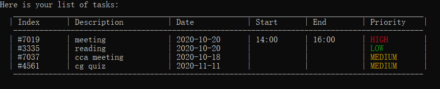

# **WatchNext** User Guide

* [1. Introduction](#1-introduction)
    + [1.a What does **WatchNext** do?](#1a-what-does-watchnext-do)
    + [1.b. Why use **WatchNext**?](#1b-why-use-watchnext)
    + [1.c. What will this guide do?](#1c-what-will-this-guide-do)
* [2. Quick Start](#2-quick-start)
* [3. Command Format](#3-command-format)
* [4. Features](#4-features)
    + [4.a. Viewing Help](#4a-help---views-help)
    + [4.b. Adding shows](#4b-add---adds-a-show)
    + [4.c. Editing shows](#4c-edit---edits-your-show-details)
    + [4.d. Adding ratings](#4d-rating---modifies-rating-of-your-show)
    + [4.e. List shows](#4e-list---displays-all-your-shows-in-the-list)
    + [4.f. Deleting shows](#4f-delete---deletes-your-show)
    + [4.g. Deleting ratings](#4g-deleterating---deletes-rating-of-your-show)
    + [4.h. Change Rating](#4h-changerating---changes-rating-of-your-show)
    + [4.i. Update episode](#4i-episode---changes-the-episode-of-the-show-you-are-currently-watching)
    + [4.j. Update season](#4j-season---changes-the-season-of-the-show-you-are-currently-watching)
    + [4.k. Manage your watch time](#4k-managing-your-watch-time-limit)
        + [4.k.a Watching a show ](#4ka-watch---watch-a-show-in-your-watchlist)
        + [4.k.b Updating your watch time limit](#4kb-updatetimelimit---update-your-watch-time-limit)
    + [4.m. Exiting **WatchNext**](#4-m-bye---exits-the-program)
- [5. Frequently Asked Questions](#5-faq)   
- [6. Command Summary](#6-command-summary)   

## 1. Introduction

#### **WatchNext** is a show tracker made for teenagers and young adults.

### 1.a. What does **WatchNext** do?

For users who watch their favourite shows on multiple free streaming platforms and other open source streaming websites,
WatchNext will track their progress for the different shows they watch, and upcoming shows that they intend to watch.In addition, it provides a tracker 
to limit users' weekly watch time to help users better manage their time.

For students, **WatchNext** serves the same purpose for lectures and webcasts.

**WatchNext** is optimized for users who prefer to work with the Command Line Interface (CLI).

### 1.b. Why use **WatchNext**?

**WatchNext** allows users who watch shows on multiple free streaming platforms or other open source stream websites to keep track of which episode they are at.
 It is difficult and can be taxing to track your favourite shows through browser bookmarks.
This is especially pertinent for younger teenagers and adults who make up a large part of video entertainment media consumers.

For students, there is also a need for to manually track lecture videos and webcast progress as lecturers may use different learning management systems.

This motivated our team to create an application that would not only help track all your shows and lectures, 
but also foster a community where everyone will be able to share their favourite shows and their watchlist with like-minded individuals and friends.
<!-- I used foster for ambiguous language so we can get away with the feature not being implemented yet -->
 
### 1.c. What will this guide do?

This guide aims to equip you with the knowledge on how to use our application by providing example usages of all its features. 
The features can be found in [Section 4: “Features”](#4-features).

Interested in using **WatchNext**? Jump to [Section 2: “Quick Start”](#2-quick-start) to get started!

## 2. Quick Start

Ensure that you have Java 11 installed in your Computer.

1.Download the latest version from [here](https://github.com/AY2021S1-CS2113T-W12-3/tp).

2.Copy the file to the folder you want to use as the home folder for your program.

3.Open a command window in that folder.

4.Run the command `java -jar WatchNext.jar`.

5.You will be greeted with this:

&nbsp;  

## 3. Command Format

*Words in `UPPER_CASE` and within the `<>` field are the parameters to be supplied by the user e.g. rating `<SCORE>`.

*The maximum length for a Show `NAME` is 100 characters.

## 4. Features
 
#### 4.a. `help` - Views help
 The help list contains information about all accepted commands.
 
 Format:
  `help`
  
 Example of usage:
 `help`
  
Expected outcome:
 

 
&nbsp;

#### 4.b. `add` - Adds a show
 The `add` command adds a show into your existing watchlist.
 
  Format:
   `add <SHOWNAME> <SEASON> <NUMBER OF EPISODES>,<EPISODE YOU ARE WATCHING> <DURATION OF EPISODE>`
   
   **[NOTE]**
   The `<DURATION OF EPISODE>` is in minutes.
   
  Example of usage:
  `add Friends 2 10,10 60`
 
 Expected outcome:
  
 
  
 &nbsp;
 
#### 4.c. `edit` - Edits your show details
 The `edit` command edits the name or number of seasons/episodes an existing show in your watchlist.
  
   Format:
     `edit <SHOWNAME>`
     
   Example of usage:
    `edit Friends`
    
 Then you will be prompted to enter the fields you want to change such as:
 name, season, episode, duration(of an episode).
 
    Example of usage:
     `name F.r.i.e.n.d.s` , `season 2`, `episode 10,11`, `duration 90`
     
 When you have completed all changes, input `done`.
 
 Expected outcome:
  
 
  
 &nbsp;
 
### 4.d. `rating` - Modifies rating of your show
 The `rating` command gives a rating (out of 10) for an existing show in your watchlist.
 
   Format:
    `rating <SHOWNAME> <SCORE>`
    
   Example of usage:
   `rating Friends 9`
   
   Expected outcome:
    
   
    
   &nbsp;
 
### 4.e. `list` - Displays all your shows in the list
This command displays all existing shows in your watchlist in an easy-to-read format, including the episode and season that you are currently at.

   Format:
    `list`
    
   Example of usage:
   `list`
   
   Expected outcome:
    
   
    
   &nbsp;

### 4.f. `delete` - Deletes your show
 This command removes a specified show from the watchlist.
 
 Format:
  `delete <SHOWNAME>`
  
 Example of usage:
 `delete Friends`
 
 Expected outcome:
  
 

 &nbsp;
  
 
### 4.g. `deleterating` - Deletes rating of your show
This command deletes the rating for an existing show in the watchlist.

 Format:
  `deleterating <SHOWNAME>`
  
 Example of usage:
 `deleterating Friends`
 
 Expected outcome:
  
 

 &nbsp;

### 4.h. `changerating` - Changes rating of your show
This command changes the rating for an existing show which already has a rating in the watchlist.

 Format:
  `changerating <SHOWNAME> <NEWSCORE>`
  
 Example of usage:
 `changerating Friends 10`
 
 Expected outcome:
  
 
  
 &nbsp;

### 4.i. `episode` - Changes the episode of the show you are currently watching
This command updates the episode for an existing show that you currently have in your watchlist.

 Format:
  `episode <SHOWNAME> <EPISODE>`
  
 Example of usage:
 `episode Friends 10`
 
 Expected outcome:
  
 
  
 &nbsp;
 
### 4.j. `season` - Changes the season of the show you are currently watching
This command updates the season for an existing show that you currently have in your watchlist.

 Format:
  `season <SHOWNAME> <SEASON>`
  
 Example of usage:
 `season Friends 3`
 
 Expected outcome:
  
 
  
 &nbsp;
 
### 4.k. Managing your watch time limit

 **WatchNext** allows you to set and track your daily watch time with its two commands , `watch` and `updatetimelimit`. 
 
### 4.k.a. `watch` - Watch a show in your watchlist

This command increments the current episode that you are on, and updates your watch time limit.

 Format:
  `watch <SHOWNAME> `
  
 Example of usage:
 `watch friends`
 
 Expected outcome:
  
 
  
 &nbsp;

### 4.k.b. `updatetimelimit` - update your watch time limit

This command updates the current episode that you are on, and updates your current watch time limit.

 Format:
  `updatetimelimit <DURATION LIMIT> `
  
  **[NOTE]**
 1. `<DURATION LIMIT>` should be entered in minutes. Your set duration will be stored until the next day.
 2. If you have watched a show before updating your time limit, it will automatically be taken into account after you enter the `updatetimelimit` command.
 
 Example of usage:
 `updatetimelimit 420 `
 
 Expected outcome:
  
 
  
 &nbsp;
 
### 4. m. `bye` - Exits the program
This command exits the program.

Format:
 `bye`
 
Example of usage:
`bye`

Expected outcome:
 

 
&nbsp;

### 5. FAQ

**Q**: Is my watchlist saved after I exit the program?

**A**: Of course! The watchlist is saved into a local storage file after every input entered by the user.The same file will be loaded up when you start **WatchNext** again.

**Q**: What should I do if there was an error while I was typing in some input?

**A**: It depends on the nature of the error. WatchNext provides insightful error messages which will inform and guide you on any actions necessary. 

### 6. Command Summary

|Action|Format|Example|
|--------|----------|---------------|
|Display help | `help`| `help`|
|Add show  |`add <SHOWNAME> <SEASON> <NUMBER OF EPISODES>,<EPISODE YOU ARE WATCHING> <DURATION OF EPISODE>` |`add Friends 2 10,10`|
|Edit show |`edit <SHOWNAME>`| `edit Friends`|
|Add rating |`rating <SHOWNAME> <SCORE>`| `rating Friends 9`|
|Show watchlist |`list`|  `list`|
|Delete show |`delete <SHOWNAME>`|   `delete Friends`|
|Change rating |`changerating <SHOWNAME> <NEWSCORE>`|   `changerating Friends 10`|
|Delete rating |`deleterating <SHOWNAME>`|  `deleterating Friends`|
|Update episode |`episode <SHOWNAME> <EPISODE>`|  `episode Friends 10`|
|Update season |`season <SHOWNAME> <SEASON>`|   `season Friends 3`|
|Watch a show  |`watch <SHOWNAME>`|  `watch Friends`|
|Update watch time limit |`updatetimelimit <DURATION LIMIT>`|   `updatetimelimit 100`|
|Exit program |`bye`|   `bye`|

