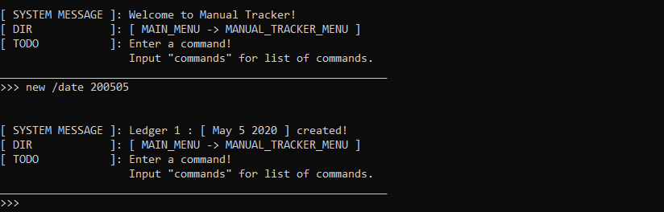
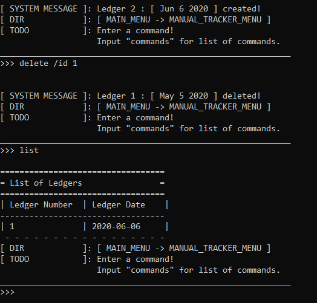
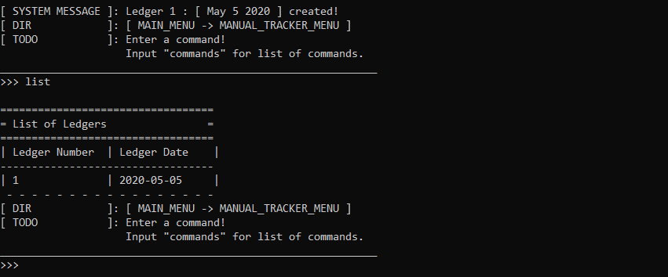
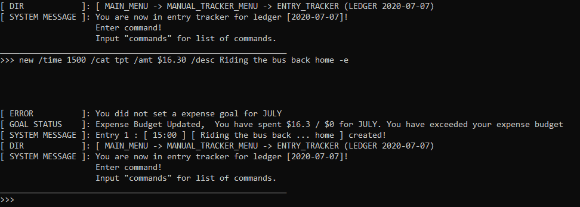
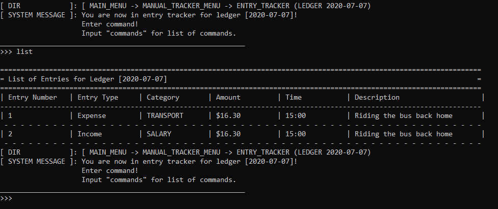
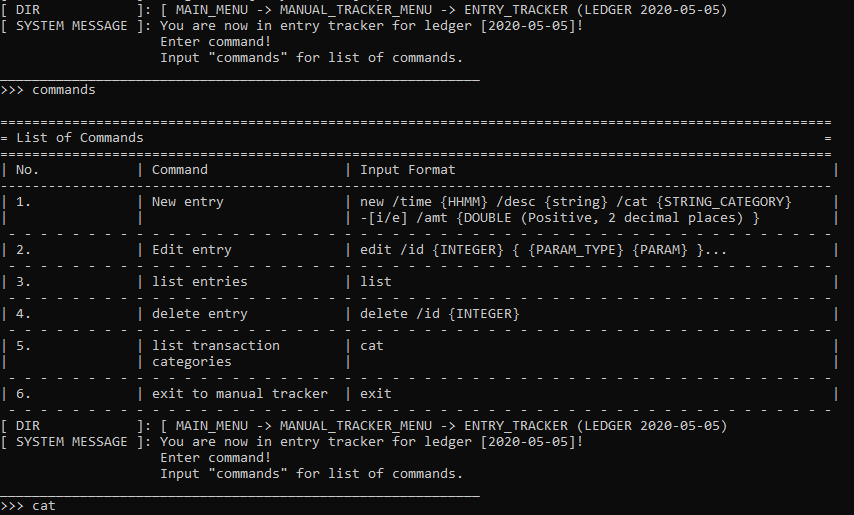
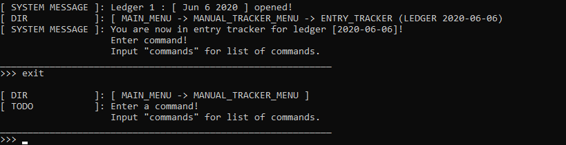
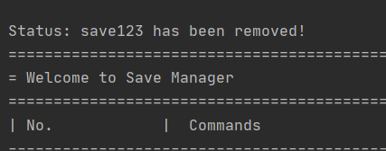

FinanceIt is an all-in-one desktop application that handles the finance tracking needs of university students who are comfortable with a CLI interface.
It includes 5 different finance tools, all of which take in typed commands from the users to execute their respective functions.

* Table of Contents
{:toc}

# Set-up
## Setting up for Testers (IMPORTANT)

Prerequisites: A computer
1. Download the executable from our [latest release](https://github.com/AY2021S1-CS2113-T16-1/tp/releases/) .
1. Save the executable file in your preferred folder.
1. Run the program via the command line. The command is: ```java -jar financeit.jar```.

## Setting up in Intellij

Prerequisites: JDK 11, update Intellij to the most recent version.
1. Download the latest release from the release page.
1. Open Intellij (if you are not in the welcome screen, click `File` > `Close Project` to close the existing project dialog first)
1. Set up the correct JDK version, as follows:
   1. Click `Configure` > `Structure for New Projects` and then `Project Settings` > `Project` > `Project SDK`
   1. If JDK 11 is listed in the drop down, select it. If it is not, click `New...` and select the directory where you installed JDK 11
   1. Click `OK`
1. Import the project into Intellij as follows:
   1. Click `Open or Import`.
   1. Select the project directory, and click `OK`
   1. If there are any further prompts, accept the defaults.
1. After the importing is complete, locate the `src/main/java/seedu.financeit/Financeit.java` file, right-click it, and choose `Run Financeit.main()`. If the setup is correct, you should see something like the below:

__Output:__


# Overview
## Main Features

Feature|Command|Description|
-------|-------|-----------|
Manual Tracker|```manual```| Manual entry of transactions. In Manual Tracker, the user manages daily lists of entries called Ledgers. 
Entry Tracker|```entry```| Subsidiary subroutine of Manual Tracker. In Entry Tracker, the user manages ledger entries, which represents a unit of transaction for a particular day.
Recurring Tracker|```recur```| In recurring Tracker, the user manages special recurring entries that are deducted on a regular basis, which are too cumbersome to record regularly with Entry Tracker.
Goal Tracker|```goal```| fillme
Save Manager|```saver```| Allows save of multiple program running states and load them anytime you want. May also delete and reset running state.
Finance Tools|```finance```| FinanceTools contains tools related to financial calculations.

## Auxillary Features
These commands are not part of the main features, but are helpful for other functions of the program:

Feature|Command|Description|
-------|-------|-----------|
Logger|```logger```| Toggles logger visibility. If toggled on, log information will be displayed on the console.
  
# Main Menu
Gateway to the various other features of the application. 
Upon running the application, you should be greeted by the main menu. Enter the corresponsing commands shown on the table to visit the desired feature!

Feature|Command|
-------|-------|
Manual Tracker|```manual```| 
Entry Tracker|```entry```| 
Recurring Tracker|```recur```| 
Goal Tracker|```goal```| 
Save Manager|```saver```| 
Finance Tools|```financial```| 
Logger|```logger```| 
Quit|```quit```|


**Main Menu: Exit** <br />
Exits from the program. If you have an outstanding list, it will be saved automatically as lastSave.txt in
the saveStates folder. This folder will be automatically created when you first run the program.

>Syntax

    exit

> Example: 


    
# Manual Tracker
Users can manage lists of entries, which are known as ledgers. Each list represents a single date of record.
> Example
    If I wish to record my income and expenditures on 30 October 2020, I will use the program as follows:
    1. Use Manual Tracker to create a ledger of date 20-10-03
    2. Open the ledger of date 20-10-03 
    3. Use Entry Tracker to create entries to record the transactions for that particular date.
    
    
No. |Content|
----|------|
3.2.1|[Add Ledger](#manualTracker1)
3.2.2|[Remove Ledger](#manualTracker2)
3.2.3|[Open Ledger](#manualTracker3)
3.2.4|[Show Ledger List](#manualTracker4)
3.2.5|[Show commands](#manualTracker5)
3.2.6|[Exit](#manualTracker6)

## Add ledger
Add a ledger to the record, representing a date.

>Syntax

    new {PARAM_TYPE} {PARAM} 
    
Param Type| Param | Param Format
----------|-------|------------|
`/date`|Date of the ledger, and all the entries under that ledger.| Input string of the date in YYMMDD, YY-MM-DD or YY-M-D

> Example: 


    
## Remove ledger
Remove a specified ledger from the record, referenced by date or id on the list.
This means that the user only need to specify one of the two param types, either ```/date``` or ```/id```.

>Syntax
 
    delete {PARAM_TYPE} {PARAM}
    
Param Type| Param | Param Format
----------|-------|------------|
`/date`|Date of the ledger, and all the entries under that ledger.| Input string of the date in YYMMDD, YY-MM-DD or YY-M-D
`/id`|Index of the ledger in the list, where the first ledger is of index 1. | Input positive integer 

> Example: 


    
## Open ledger
Users will gain access into the entries associated with the specified ledger, referenced by date or id on the list.
This means that the user only need to specify one of the two param types, either ```/date``` or ```/id```.

* Automatic creation of non-existing ledgers 
    * If the ledger specified do not exist and if the param type supplied is "/date", the program will create a new ledger
    in accordance to the date supplied.
    * If the user specifies a non-existing index, then the program will not have enough information to create the new ledger instance. Automatic creation
    will not apply in this particular case.
    
Refer to Feature Entry Tracker onwards for further instructions.

>Syntax

    open {PARAM_TYPE} {PARAM}


Param Type| Param | Param Format
----------|-------|------------|
`/date`|Date of the ledger, and all the entries under that ledger.| Input string of the date in YYMMDD, YY-MM-DD or YY-M-D
`/id`|Index of the ledger in the list, where the first ledger is of index 1. | Input positive integer 

> Example: 


    
## Show ledger list
Shows the record of ledgers that has been added.

>Syntax

    list

> Example: 



## Print command list
Prints available commands that users can enter in for manualTracker.

>Syntax

    commands

> Example: 


    
## Exit to Main Menu
Exit to main menu where users can choose another feature to use.

>Syntax

    exit

> Example: 
    


    
# Entry Tracker
Subroutine that is subsidiary off the ManualTracker. 
Users can manage entries associated with the ledger they have opened.
Entries are specified by the following parameters:

* Time of transaction
   * Time in which the transaction ocurred
* Type of transaction 
   * Income or Expense
* Category of transaction. The user is only limited to the following set of categories. 
   * Income: {Salary, Allowance, Others}
   * Expense: {Transport, Food, Travel, Shopping, Bills, Others}
* Amount
   * Amount involved in the transaction. 
      * If the transaction type is expense, the amount is considered as a deduction to the account.
      * If the transaction type is income, the amount is considered as a credit to the account.
* Description
   * User input texts to help them record the details of the transaction.

> Example

    Ledger of date 20-10-03
        Entry 1: Shopping at MBS : $1500
        Entry 2: Salary : $3000
    
    From the above, we can infer that on the date 20-10-03, the user has one expense entry and one income entry.
    
No. |Content|
----|------|
3.3.1|[Add Entry](#entryTracker1)
3.3.2|[Edit Entry](#entryTracker2)
3.3.3|[Remove Ledger](#entryTracker3)
3.3.4|[Show Entry List](#entryTracker4)
3.3.5|[Show commands](#entryTracker5)
3.3.6|[Show Categories](#entryTracker6)
3.3.7|[Exit](#entryTracker7)

## Add entry
Add an entry to the ledger record.

__Note:__
* For transaction categories, we require the users to enter the shortcut equivalent to the categories listed above. Refer to the following table.

Category|Category shortcut|Compatible transaction type
----------|-------|------------|
FOOD|fd|Expense
BILLS|bll|Expense
TRANSPORT|tpt|Expense
TRAVEL|tvl|Expense
SALARY|slr|Expense
ALLOWANCE|alw|Income
OTHERS|oth|Income

>Syntax

    add {PARAM_TYPE} {PARAM}

        
Param Type| Param | Param Format
----------|-------|------------|
`/time`|Time of the entry.| Input string of the date in HHMM, HHMMSS or H.
`/amt`|Amount involved in the transaction.| Input floating point number in 2 d.p
`/cat`|Category of transaction. | Input string belonging in the set: {tpt, fd, tvl, shp, bll, slr, alw}
`-i or -e`|Type of transaction. | No parameter required. 

> Example: 




## Edit entry
Add an entry to the ledger record.
Users only need specify the param to edit, there is no need to fill out all params.

__Note__
* While the index is compulsory to be provided, the rest of the params are not compulsory.
The users will include the params that they wish to modify.
* Hence, a sample command ```entry edit /id 1 /time 1600``` will modify entry at __index 1__ to __time 1600__.

>Syntax

    edit /id {PARAM_INDEX} {PARAM_TYPE} {PARAM} ... 
        
Param Type| Param | Param Format
----------|-------|------------|
`/id`|Index of the entry in the list, where the first entry is of index 1. | Input positive integer
`/time`|Time of the entry.| Input string of the date in HHMM, HHMMSS or H.
`/amt`|Amount involved in the transaction.| Input floating point number in 2 d.p
`/cat`|Category of transaction. | Input string belonging in the set: {tpt, fd, tvl, shp, bll, slr, alw}
`-i or -e`|Type of transaction. | No parameter required. 
        
> Example: 


    
## Remove entry
Remove a specified entry from the record, referenced by id on the list.

>Syntax

    delete {PARAM_TYPE} {PARAM} 
            
Param Type| Param | Param Format
----------|-------|------------|
`/time`|Time of the entry.| Input string of the date in HHMM, HHMMSS or H.
`/id`|Index of the entry in the list, where the first entry is of index 1. | Input positive integer

> Example: 


    
## Show entry list
Shows the record of entries that has been added.

>Syntax

    list

> Example: 



## Print command list
Prints available commands that users can enter in for manualTracker.

>Syntax

    commands

> Example: 



## Print categories
Prints expenditure category shortcuts that the user can input in entry creation/ edit commands.

>Syntax

    cat

> Example: 


    
## Exit to Manual Tracker Main Routine
Exit to Manual tracker where users can choose another ledger.

>Syntax

    exit

> Example: 


    
# Recurring Tracker
Users can manage expenses/income that recurs on a monthly basis e.g. monthly bill or salary.

## Add entry
Creates a recurring entry. Entries can either be income or expense. If income, entries
can be set to "auto" which indicates that the income is automatically credited to the user's
bank account e.g. Salary which is transferred into bank account by company. 
Else, it will indicate a manually credited income, which requires the user to 
collect or take action upon e.g. collecting payment from customers (as a supplier), redeeming
of reward points on a monthly basis.

Vice versa for expense entries.

>Syntax

    add {-e OR -i} [-auto] /desc <DESCRIPTION> /amt <AMOUNT> /day <DAY_OF_MONTH> [/notes <NOTES>]
    
**Parameters** <br />
* `-e` OR `-i` - Indicates whether entry is income or expense (Mandatory to have 1 of 2)
* `-auto` - Whether entry is auto or manual (only serves as a reminder for user, 
is not linked to any functionality)
* `/desc` - Description of entry (Mandatory)
* `/amt` - Amount (Mandatory)
* `/day` - Day of month which entry occurs on (Mandatory)
* `/notes` - Additional notes and remarks

>Example
    
    add -e -auto /desc Netflix /amt 40 /day 2 /notes Cancel if Homemade ends
    //Netflix, $40 per month, auto-payment via credit card 
    on the 2nd of every month. Saved with a note of “Cancel if Homemade ends"
    
    add -i /desc Redeem air miles for vouchers /amt 50 /day 27
    //Redeem air miles for vouchers, $50 per month, user has to take manual action 
    on or by 27th of every month.
    
## List all entries
Displays a list of all recurring entries.

>Syntax

    list
    
**Parameters** <br />
None
 3  
## Delete entry
Deletes an entry at the given index. Index can be found via `list` and then checking the 
associated index in the leftmost column

>Syntax

    delete /id <INDEX>
    
**Parameters** <br />
* `/id` - Index of item to be deleted. 1-based indexing (Mandatory)

>Example
    
    delete /id 15
    
## Edit entry
Update one or more fields of an existing entry. Overwrites any existing value corresponding to the 
field(s) being modified.

>Syntax

    edit /id <INDEX> [field(s) to edit]
    
**Parameters** <br />
* `/id` - Index of entry to edit. 1-based indexing (Mandatory)
* `field(s) to edit` - Follows the same format as add entry E.g. to edit amount, use `/amt <NEW_AMT>`

>Example
    
    edit /id 2 /desc Updated name!! /day 23
    //Overwrites existing description and day. Other fields are untouched.
    
## Exit tracker
Exits to main menu.

>Syntax

    exit

    
# FinanceTools
FinanceTools contains tools related to financial calculations.

## Simple Interest Calculator
Calculate simple interest earned.
<br />
Simple interest is based on the principal amount of a deposit.

**Parameters** <br />
* ```/a``` - Amount (Mandatory)
* ```/r``` - Interest Rate (Mandatory)

>Syntax:
    
    simple /a {AMOUNT} /r {INTEREST_RATE}
   
> Example: 

    simple /a 1000 /r 5

.PNG)
## Yearly Compound Interest Calculator
Calculate yearly compound interest earned with optional yearly deposit.
<br />
Compound interest is based on the principal amount and the interest that accumulates on it every period.

**Parameters** <br />
* ```/a``` - Amount (Mandatory)
* ```/r``` - Interest Rate (Mandatory)
* ```/p``` - Number of Years (Mandatory)
* ```/d``` - Yearly Deposit (Optional)

>Syntax:
    
    cyearly /a {AMOUNT} /r {INTEREST_RATE} /p {YEARS} /d {YEARLY_DEPOSIT}
   
> Example: 

    cyearly /a 1000 /r 3 /p 2
    cyearly /a 1000 /r 3 /p 2 /d 1200

.PNG)
<br />
<br />
.PNG)
## Monthly Compound Interest Calculator
Calculate monthly compound interest earned with optional monthly deposit.
<br />
Compound interest is based on the principal amount and the interest that accumulates on it every period.

**Parameters** <br />
* ```/a``` - Amount (Mandatory)
* ```/r``` - Interest Rate (Mandatory)
* ```/p``` - Number of Months (Mandatory)
* ```/d``` - Monthly Deposit (Optional)

>Syntax:
    
    cyearly /a {AMOUNT} /r {INTEREST_RATE} /p {MONTHS} /d {MONTHLY_DEPOSIT}
   
> Example: 

    cmonthly /a 1000 /r 3 /p 2
    cmonthly /a 1000 /r 3 /p 2 /d 100

.PNG)
<br />
<br />
.PNG)
## Cashback Calculator
Calculate cashback earned.

**Parameters** <br />
* ```/a``` - Amount (Mandatory)
* ```/r``` - Cashback Rate (Mandatory)
* ```/c``` - Cashback Cap (Mandatory)

>Syntax:
    
    cashb /a {AMOUNT} /r {CASHBACK_RATE} /c {CASHBACK_CAP}
   
> Example: 

    cashb /a 1000 /r 5 /c 1000
    cashb /a 1000 /r 5 /c 10

.PNG)
<br />
<br />
.PNG)

## Miles Credit Calculator
Calculate cashback earned.

**Parameters** <br />
* ```/a``` - Amount (Mandatory)
* ```/r``` - Miles Rate (Mandatory)

>Syntax:
    
    miles /a {AMOUNT} /r {MILES_RATE}
   
> Example: 

    miles /a 1000 /r 5

.PNG)
## Account Storage
Store account information.
<br />

Additionally, it implements the following operations:
* ```info``` - list account(s) information
* ```clearinfo``` - clear all information
* ```store /rm <ACCOUNT_NO>``` - delete corresponding account number in list

**Parameters** <br />
* ```/n``` - Account Name (Optional)
* ```/ir``` - Interest Rate (Optional)
* ```/r``` - Cashback Rate (Optional)
* ```/c``` - Cashback Cap (Optional)
* ```/o``` - Other Notes (Optional)
* ```/rm``` - Account Number (Optional)

>Syntax:
    
    store /n {ACCOUNT_NAME} /ir {INTEREST_RATE} /r {CASHBACK_RATE} /c {CASHBACK_CAP} /o {OTHER_NOTES}
   
> Example: 

    store
    store /n myaccount
    store /n myaccount /ir 2
    store /n myaccount /ir 2 /r 2
    store /n myaccount /ir 2 /r 2 /c 100
    store /n myaccount /ir 2 /r 2 /c 100 /o main account
    store /rm 1

.PNG)
<br />
<br />
.PNG)
<br />
<br />
.PNG)
<br />
<br />
.PNG)
<br />
<br />
.PNG)
<br />
<br />
.PNG)
<br />
<br />
.PNG)

## Command and Calculation History
Store the commands inputted and results from calculations in FinanceTools.

>Syntax:
    
    history
   
> Example: 

    history

.PNG)
## Exit FinanceTools
Exit FinanceTools to Main Menu.

>Syntax:
    
    exit
   
> Example: 

    exit

.PNG)

# Goal Tracker
Goal Tracker that helps user to track their monthly incomes and expenses goal.

## Set Goal
**Set Income Goal** <br />
Setting of income goal for respective months.

>syntax

    income *amount* for *month in int form*
    
 
>Example:

    income 5000 for 08


**Set Expense Goal** <br />
Setting of expense goal for respective months.

>syntax

    expense *amount* for *month in int form*
   
>Example

    expense 2000 for 07


## Display Goal
Display income and expense goal for the individual month.

>syntax

    display income/expense for *month in int form*
   
>Example

    display income for 08
    display expense for 07


## Exit Display Goal 
The system will auto prompt the user whether they want to exit DisplayGoal and return to Goal tracker main menu.

>syntax 

    enter *y* to exit

>Example

    y
    


## Edit Goal
Edit income and expense goal for the individual month.

>syntax

    edit income/expense *amount* for *month in int form*
 
>Example
    
    edit income 2000 for 08
    edit expense 1000 for 07


## Exit Goal Tracker
Exit Goal Tracker program and return to FinanceIt main UI.

>syntax

    exit
    
>Example 

    exit
    
# Save Manager
This utility feature helps to save multiple program states and load them at will.


## Menu

<br />
Main menu shows all the available commands and how to use them.
<br />
You can enter "help" anytime to return to this main menu


## List Save

<br />
You can enter "list" to list all backup saves.
<br />
>Example

    list


## Add Save

<br />
To create a back up save
<br />
>Syntax

    add /name {SAVE_NAME}
>Example

    add /name save12345


<br />
In your data/backup directory, you can see 3 text files created.


<br />
In your names.txt file, an additional entry will be appended.


## Load Save

<br />
To load a back up save
<br />
>Syntax

    load /name {SAVE_NAME}
>Example

    load /name save12345


## Delete Save

<br />
To remove a back up save
<br />
>Syntax

    delete /name {SAVE_NAME}
>Example

    delete /name save123


<br />
As you can see, the 3 text files you want to delete are gone.
<br />
names.txt file is also updated.


## Reset

<br />
To reset all data currently used by the program enter "reset"
<br />
>Example

    reset


# Summary of Features 

## Manual Tracker

No. | Feature | Syntax |
----|---------|---------|
1.|Open Ledger|_ledger open /date {YYMMDD}_|
2.|New Ledger|_ledger new /date {YYMMDD}_|
3.|List Ledgers|_ledger list_|
4.|Delete Ledgers|_ledger delete /date {YYMMDD}_|;
5.|Exit to Main Menu|_exit_|

## Entry tracker

No. | Feature | Syntax |
----|---------|---------|
1.|New Entry|_entry new /time {HHMM} /desc {string} /cat {category} -[i/e]_|
2.|Edit Entry|_entry edit /id {integer} {param-type/parameter to edit}_|
3.|list Entries|_entry list_|
4.|Delete Entry|_entry delete /id {integer}_|
5.|List Transaction Categories|_cat_|
6.|Exit to Manual Tracker|_exit_|

## FinanceTools

No. | Feature | Syntax |
----|---------|---------|
1.|Simple Interest Calculator|_simple /a {AMOUNT} /r {INTEREST_RATE}_|
2.|Yearly Compound Interest Calculator|_cyearly /a {AMOUNT} /r {INTEREST_RATE} /p {YEARS} /d {YEARLY_DEPOSIT}_|
3.|Monthly Compound Interest Calculator|_cmonthly /a {AMOUNT} /r {INTEREST_RATE} /p {MONTHS} /d {MONTHLY_DEPOSIT}_|
4.|Cashback Calculator|_cashb /a {AMOUNT} /r {CASHBACK_RATE} /c {CASHBACK_CAP}_|
5.|Miles Credit Calculator|_miles /a {AMOUNT} /r {MILES_RATE}_|
6.|Account Storage|_store /n {ACCOUNT_NAME} /ir {INTEREST_RATE} /r {CASHBACK_RATE} /c {CASHBACK_CAP} /o {OTHER_NOTES}_|
7.|List Account(s) Information|_info_|
8.|Clear All Account Information|_clearinfo_|
9.|Command and Calculation History|_history_|
10.|Exit to Main Menu|_exit_|

## Goal Tracker

No. | Feature | Syntax |
----|---------|---------|
1.|Set Expense Goal|_expense {AMOUNT} for {MONTH IN INT VALUE}_|
2.|Set Income Goal|_income {AMOUNT} for {MONTH IN INT VALUE}_|
3.|Edit Expense Goal|_edit expense {AMOUNT} for {MONTH IN INT VALUE}_|
4.|Edit Income Goal|_edit income {AMOUNT} for {MONTH IN INT VALUE}_|
5.|Display Expense Goal|_display expense for {MONTH IN INT VALUE}_|
6.|Display Income Goal|_display income for {MONTH IN INT VALUE}_|
7.|Exit to Main Menu|_exit_|

## Save Manager

No. | Feature | Syntax |
----|---------|---------|
1.|List save|_list_|
2.|Add save|_add /name {SAVE_NAME}_|
3.|Load save|_load /name {SAVE_NAME}_|
4.|Delete save|_delete /name {SAVE_NAME}_|
5.|Reset program|_reset_|
6.|Return to main menu|_exit_|

