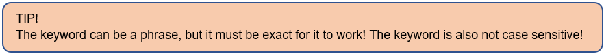

# User Guide

## Introduction

**_25HoursADay_** is a scheduling application optimized for users via a convenient yet powerful Command Line Interface (CLI) 
while still having the benefits of a Graphical User Interface (GUI). If you can type fast, **_25 hours a day_** can 
schedule your tasks and events faster than traditional GUI apps.

## Foreword

25HoursADay is targeted towards students from National University of Singapore (NUS). This user guide is designed to provide documentation for potential users who will use 25HoursADay on a day-to-day basis. This document will provide a step-by-step guide to show you how to access following features of the program:
1)	View available commands of the program
2)	Add tasks and events to the program
3)	View your personalized calendar and the items available
4)	Search an item in the program
5)	Prioritize your tasks and keep track of your progress

After familiarizing with all the functionalities, you will definitely be able to better manage your day-to-day matters. Feeling excited? Let’s begin!

## Table of Contents
* [Important Notes](#important-notes)
* [Quick Start](#quick-start)
* [Features](#features)
    * [View available commands](#viewing-available-commands-help)
    * [Add a task](#adding-a-task)
        * [add a todo task](#adding-a-todo-task-todo)
        * [add a deadline task](#adding-a-deadline-task-deadline)
    * [Mark a task as done](#marking-a-task-as-done-done)
    * [Add an event](#adding-an-event)
        * [add an activity event](#adding-an-activity-event-act)
        * [add an exam event](#adding-an-examination-event-exam)
        * [add a lab event](#adding-a-laboratory-session-event-lab)
        * [add a lecture event](#adding-a-lecture-event-lect)
        * [add a tutorial event](#adding-a-tutorial-event-tut)
    * [Add additional information of an event](#adding-additional-information-to-an-event-a)
    * [View additional information of an event](#viewing-the-additional-information-of-an-event-v)
    * [Delete a calendar item](#deleting-a-calendar-item)
        * [delete a task](#deleting-a-task--t)
        * [delete an event](#deleting-an-event--e)
    * [Find a calendar item](#finding-a-calendar-item)
        * [find any item available](#finding-an-item-from-the-calendar-list-f)
        * [find a task](#finding-an-item-from-the-task-list-ft)
        * [find an event](#finding-an-item-from-the-event-list-fe)
    * [Prioritize task](#prioritizing-a-task-t)
    * [Print tasks](#printing-tasks-print-tasks)
    * [Print events](#printing-events-print-events)
    * [Print progress](#printing-progress-print-progress)
    * [Give suggestion](#giving-suggestion-suggestion)
    * [Print time line](#printing-timeline)
        * [print default timeline](#printing-default-calendar-print-timeline)
        * [print weekly timeline](#printing-calendar-for-the-current-week-print-timeline-week)
        * [print monthly timeline](#printing-calendar-for-current-month-print-timeline-month)
        * [print specific timeline of a day](#printing-calendar-before-a-specific-date-print-timeline-date)
    * [Print countdown](#printing-countdown)
        * [print countdown for all items with due date](#printing-countdown-of-both-deadline-and-exam-events-countdown)
        * [print countdown for deadlines](#printing-countdown-for-deadline-tasks-only-countdown-deadlines)
        * [print countdown for exams](#printing-countdown-for-exam-events-only-countdown-exams)
    * [Save the data](#saving-the-data)
    * [Exit the program](#exiting-the-program-bye)
* [Frequently Asked Questions (FAQ)](#faq)
* [Command summary](#command-summary)

## Important Notes

Before we jump into the main content, kindly read this section before proceeding to the feature section for a better understanding of it. This section consists of the legends and common terminology used in the feature section.

The following table shows the list of legends used in this document:

The following table displays the list of terminologies used in this document:

|Term| Meaning | 
|--------|----------|
|Task|A to-do item or a deadline item|
|Event|An activity or a school event|
|School event|Lectures, tutorials, laboratory sessions or examinations|
|Task list|List of tasks*|
|Event list|List of events*|
|Task number|Refers to the index of the task in the task list|
|Event number|Refers to the index of the event in the event list|

*You may view your task list and event list using the `print task` and `print events` feature respectively.

## Quick Start

1. Ensure you have Java 11 or above installed.
1. Down the latest version of the project file **_25HoursADay.jar_** from [here](https://github.com/AY2021S1-CS2113T-T12-2/tp/releases/tag/V1.0).
1. Copy the file to the folder you want to use as the _home folder_ for the project file.
1. In the _Command Prompt_, navigate to the working directory of the _home folder_.
1. type the command "java -jar" and drag the downloaded **_25HoursADay.jar_** onto the command box and press _Enter_ to strat the programme.
1. The _Command Prompt_ should display similar output as shown in the figure below:
    
1. Type the command in the _Command Prompt_ and press _Enter_ to execute it. 
    1. E.g. typing `help` and pressing _Enter_ will display the help information:
1. Refer to the [Features](#features) below for details of each command.

## Features 

This section provides the features **_25 hours a day_** has to offer. It entails a brief description of what it does and how to use it.

### Viewing available commands: `help`

As a first-time user you can always type help in the terminal to view the list of available commands. 

Format: `help`

### Adding a task:

Are you sometimes overwhelmed by different tasks and not sure how to document them properly? Why not just use our task adding features? This feature allows you to add 2 types of tasks:
•	Todo task which has no specific due date and just serves as a reminder for your day to day matters.
•	Deadline tasks which has a specific due date and the program has a count down feature to monitor them.

The following 2 sub-sections will provide you with the guide on how to add a task to the calendar list.  

#### Adding a todo task: `todo`

This function allows you to add a todo task, such as exercise plans or small reminders for your day to day matters 
which can be a great help if you are a forgetful person.

Format: `todo <task_description`

Example: 

`todo exercise for 10 minutes` adds a todo task of exercising for 10 minutes to the calendar list as demonstrated in the figure below.

#### Adding a deadline task: `deadline`

This function allows you to add a deadline task, such as project submission or assignment submission and the program 
will keep track of the due date which will definitely make your study life more manageable!

Format: `deadline <task_description> / <due_date>`

Example:

`deadline project submission /301020` adds a deadline task of project submission which is due on 30 October 2020 
as illustrated by the figure below.

### Marking a task as done: `done`

To help manage your tasks better, you can mark a task on your calendar list as completed by using the `done` command. 
If the task is done, you will be able to see a small tick [/] beside the task. Else, you will see a cross [X] beside the task

Format: `done <task_number>`

Example:

`done 1` - By using this command, you will mark the first task on your task list as done! 

### Adding an event:

When you have a lot of events, you can add them to the calendar list in different types, including school events, 
such as`lecture`, `tutorial`, `exam`, and `lab` events, and other events in `activitie` type.
You can add `lecture`, `tutorial`, and `lab` events as recurring events, but the `exam` and `activitie` events cannot be recurring. 
When you add events to the list, you can use `lect`, `lab`, `tut`, `exam` or `act` command in following formats:  

#### Adding an activity event: `act`

This function allows you to add school activities, such as interview workshops or Co-Curriculum Activities (CCAs). 
This definitely the best way to keep track of your commitments and will surely make your student life more colourful and gain the most out of it! 

Format: `act <activity_description> @<venue> / <date> <time>`

Example:

`act CCA @NUS UTOWN / 200920 1600` - adds a CCA event held at NUS UTOWN on 20th September 2020, 4pm as shown in the figure below.

#### Adding an examination event: `exam`

You can add an examination event to the calendar list by using the following format.

Format: `exam <module_name> @<venue> / <date> <time>`

Example of usage:

`exam CS1000 @com1-b1-12 / 121020 1700` - adds CS1000 exam at 2020-10-20 5p.m. to the event list. The venue is com1-b1-12.

`exam CS1221 @MPSH2 / 221120 1100` - adds CS1221 exam at 2020-11-22 11a.m. to the event list. The venue is MPSH2.

#### Adding recurring laboratory session events: `lab`

When you have new recurring lecture events and want to add them to the calendar list, you can use `lab` command.

Format: `lab <module_name> @<venue> -r <recurring_number> / <date> <time>`

Example of usage:

`lab CS1000 @com1-b1-14 -r 9 / 200920 1600` - adds CS1000 lab at 2020-09-20 4p.m.  to the event list, the venue is com1-b1-14 and the lab will happen for the next 9 weeks.

`lab CS2100 @com2-2112 -9 / 220920 1300` - adds CS2100 lab at 2020-09-22 1p.m. to the event list, the venue is com2-2112 and the lab will happen for the next 9 weeks.

#### Adding recurring lecture events: `lect`

When you have new recurring lecture events and want to add them to the calendar list, you can use `lect` command.

Format: `lect <module_name> @<venue> -r <recurring_number> / <date> <time>`

Example of usage:

`lect CS2113 @lt12 -r 10 / 020220 1600` - adds CS2113 lecture at 2020-02-02 4p.m. to the event list, the venue is lt12 and the lecture will happen for the next 10 weeks.

`lect CS2100 @lt11 -r 5 / 101020 1300` - adds CS2100 lecture at 2020-10-10 1p.m. to the event list, the venue is lt11 and the lecture will happen for the next 5 weeks.

#### Adding recurring tutorial events: `tut`

When you have new recurring lecture events and want to add them to the calendar list, you can use `tut` command.

Format: `tut <module_name> @<venue> -r <recurring_number> / <date> <time>`

Example of usage:

`tut CS1000 @com1-b1-12 -r 5 / 121020 1700` - adds CS1000 lab at 2020-10-20 5p.m. to the event list, the venue is com1-b1-12 and the tutorial will happen for the next 5 weeks.

`tut CS2100 @com1-1111 -r 5 / 151020 1400` - adds CS2100 lab at 2020-10-15 2p.m. to the event list, the venue is com1-1111 and the tutorial will happen for the next 5 weeks.

### Additional information of an event

#### Adding additional information to an event: `/a`

You can add additional information pertaining to an event in your calendar list.

Format: `/a <event_number? - <additional information>`

Example of usage:

`/a 1 - This is the additional information for event number 1`

#### Viewing the additional information of an event: `/v`

You can view the additional information pertaining to an event in your calendar list.

Format: `/v <event_number>`

Example of usage:

`/v 1` - This lists the additional information that you have added for event number 1.

### Deleting a calendar item:

You may delete any calendar item that you deem unnecessary by using the following command:

#### Deleting a task: `-t`

You can delete a task from your calendar list.

Format: `-t <task_number>`

Example of usage:
 
 `-t 1` - This removes task number 1 from your calendar.

#### Deleting an event: `-e`

You can delete an event from your calendar list.

Format: `-e <event_number>`

Example of usage:
 
 `-e 1` - This removes event number 1 from your calendar.

### Finding a calendar item:

You can find a calendar item based on a specific keyword. Additionally, you may filter the search based on whether it is a task or an event. 

#### Finding an item from the calendar list: `/f`

You can search the entire calendar based on a keyword.

Format: `/f <keyword>`

Example of usage: 

`/f Tuition` - the lists of items (both tasks and events) containing the keyword “Tuition” will appear.

#### Finding an item from the task list: `/ft`

You can search the task list based on a keyword.

Format: `/ft <keyword>`

Example of usage: 

`/ft Tuition` - the lists of tasks containing the keyword “Tuition” will appear.

#### Finding an item from the event list: `/fe`

You can search the event list based on a keyword.

Format: `/fe <keyword>`

Example of usage: 

`/fe Tuition` - the lists of events containing the keyword “Tuition” will appear.

### Prioritizing a task: `*t`                                                                                                    

When you have important tasks, you can prioritize them in the task list to distinguish from ordinary tasks.
If you want to prioritize an important task, you can use *t <task_number> to mark the task as important. 
    
Format: `*t <task_number>`
    
Example of usage: 

`*t 1` - marks the first task in the task list as important.

### Printing tasks: `print tasks`

If you want to prioritize or delete some of the tasks on hand but cannot recall the task number as there are simply 
too many tasks, you can always ask the program to print out all tasks saved in the program. 
In this way, you can have a better picture of the tasks on hand! 

Format: `print tasks`

### Printing events: `print events`

If you want to delete past events or to add additional information to a certain event, you can always ask the program 
to display all events saved in the program. This feature will definitely save your brain space wated on memorising them.

Format: `print events`

### Printing important tasks: `print *`
    
If you just want to view all the important tasks instead of all the tasks in the calendar list now, 
you can type `print *` command to view the list of important tasks together with their information.                           
                                                    
Format: `print *`

### Printing progress: `print progress`

If you have a lot of tasks and want to trace the progress of how many of the tasks have been finished, 
you can type  `print progress` command to see the fraction and percentage proportion of the finished tasks among all the tasks.

Format: `print progress`

### Giving suggestion: `suggestion`

When you have a lot of tasks and do not know which several tasks should be prepared first, you can get some simple suggestions from the 25HoursADay. 
The program can select several important and recent tasks and print them out together will their information. 
If you want to get the suggestions, you can type the `suggestion` command to see suggestions.  
Print simple suggestions about preparing which tasks first.
    
Format: `suggestion`

### Printing timeline

If you want to see your calendar items in timeline format, you can always use the personalised calendar feature. 
There are four kinds of personalised calendar that you can print: default calendar, weekly calendar, monthly calendar, 
and calendar before a specific date you choose.

#### Printing default calendar: `print timeline`

Print the personal calendar including all calendar items, with todo items (which do not have a specific date) printed as a list at the bottom of the timeline.

Format: `print timeline`

#### Printing calendar for the current week: `print timeline week`

Print the personal calendar for the current week.

Format: `print timeline week`

#### Printing calendar for current month: `print timeline month`

Print the personal calendar for the current month.

Format: `print timeline month`

#### Printing calendar before a specific date: `print timeline date`

Print the calendar before a specific date.

Format: `print timeline date <DATE>`

### Printing countdown:
      
If you want to see the countdown of all the upcoming exams and know how much time you still have to review, or you want to 
double check how many days you still have before the deadline, you can type the `countdown`, `countdown exams`, or `countdown deadlines` command.

#### Printing countdown of both deadline and exam events: `countdown`

If you type `countdown`, you can see the countdown of all the unfinished deadlines tasks and all the upcoming exam events.

The remaining date is printed in ascending order.

All the unfinished deadlines will be printed before all the upcoming exams.

Format: `countdown`
 
 

#### Printing countdown for exam events only: `countdown exams`

If you type `countdown exams`, you can see the countdown of all upcoming exams.

The remaining date for the exams is printed in ascending order.

Format: `countdown exams`

#### Printing countdown for deadline tasks only: `countdown deadlines`

If you type `countdown deadlines`, you can see the countdown of all unfinished deadlines.

The remaining dates for the deadlines are printed in ascending order.

Format: `countdown deadlines`

### Saving the data

When you close the program or you make some changes to the program such as adding an event, the data for the tasks and events 
are automatically saved locally. So, there is no need for users to save manually.
Next time when you open the program, all the data will automatically be loaded from the local file to the program.

### Exiting the program: `bye`

If you want to exit the program, you can always type `bye` in the terminal to quit and all the data entered will be saved 
automatically for your future use. 

Format: `bye`

## FAQ

Want to find out more about 25HoursADay? 
How to transfer our data to another device? Or how to store our data? 
Here are the most common questions that NUS students would ask about our app. 
The questions and the answers to them can be found below.

**Q**: How do I transfer my data to another computer? 

**A**: Download the program in the other computer and overwrite the empty data file it creates with the data from your 
previous **_25HoursADay.jar_**.

**Q**: Can I use **_25 hours a day_** on different operating systems like Linux, Windows, or macOS?  

**A**: Yes, **_25 hours a day_** is compatible with Linux, Windows and macOS.

**Q**: Will the data be saved if I accidentally close my program without typing the command bye?  

**A**: Yes, the data will automatically be saved locally even when you close your program halfway.

**Q**: If I wrongly deleted my task, can I undo it?

**A**: No, currently **_25 hours a day_** doesn't have an undo feature, therefore you need to manually add your task back 
using `add` command.

## Command Summary

|Term| Meaning | Command Format|
|--------|----------------|--------|
|Add|activity event|`act <activity_description> @<venue> / <date> <time>`|
|Add|additional information for event|`/a <event_number> - <additional_information>`|
|Add|deadline task|`deadline <task_description>/ <due_date>`|
|Add|exam event|`exam<module_name> @<venue> / <date> <time>`|
|Add|lab event|`lab <module_name> @<venue> -r <recurring_number> / <date> <time>`|
|Add|lecture event|`lect <module_name> @<venue> -r <recurring_number> / <date> <time>`|
|Add|todo task|`todo <task_description>`|
|Add|tutorial event|`tut <module_name> @<venue> -r <recurring_number> / <date> <time>`|
|Delete|events|`-e <event_number>`|
|Delete|tasks|`-t <task_number>`|
|Find|all items|`/f <keyword>`|
|Find|events|`/fe <keyword>`|
|Find|tasks|`/ft <keyword>`|
|Print|countdown for all items|`countdown`|
|Print|countdown for deadlines|`countdown deadlines`|
|Print|countdown for exams|`countdown exams`|
|Print|events|`print events`|
|Print|important tasks|`print *`|
|Print|progress|`print progress`|
|Print|tasks|`print tasks`|
|Print|timeline (default)|`print timeline`|
|Print|timeline before a date|`print timeline date <DATE>`|
|Print|timeline for current month|`print timeline month`|
|Print|timeline for current week|`print timeline week`|
|Quit|exit the program|`bye`|
