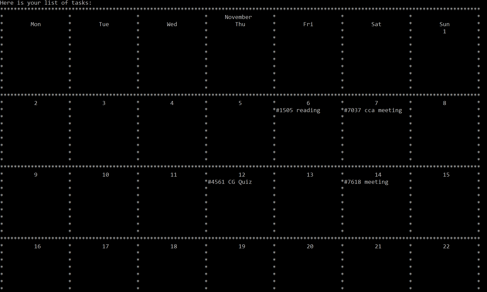
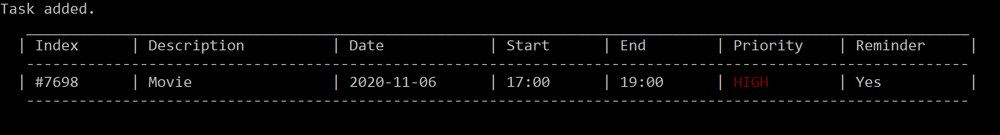

# User Guide
PlaNUS is a desktop application for NUS students to manage their tasks and schedule,
optimized for use via Command Line Interface (CLI).

This user guide is a document aiming to help users in understanding the features
provided by PlaNUS and the instructions required for each step.

- [Quick start](#quick-start)
- [Features](#features)
    - [Showing commands](#showing-all-commands--help)
    - [Adding task](#adding-a-task--add)
    - [Editing task](#editing-a-task--edit)
    - [Displaying tasks](#displaying-tasks--list)
    - [Searching task](#searching-relevant-tasks--search)
    - [Removing task](#removing-a-task--delete)
    - [Clearing task](#clearing-tasks--clear)
    - [Exiting program](#exiting-program--bye)
- [FAQ](#faq)
- [Command summary](#command-summary)


<div style="page-break-after: always; visibility: hidden"> 
\pagebreak 
</div>

## Quick start


1. Ensure that you have Java 11 or above installed.

2. Download the latest "planus.jar" from [here](https://github.com/AY2021S1-CS2113T-W12-1/tp/releases/download/v1.0/planus.jar).

3. For first time Windows user, open command prompt and run the following line to enable color display of command prompt:

    `reg add HKCU\Console /v VirtualTerminalLevel /t REG_DWORD /d 1`
    
4. Open a **new** command prompt/terminal and run "planus.jar" with following command:

    `java -jar planus.jar`
    
    Following content is display if there's no existing data file:
    
    
    
    
5. **Maximise** the command prompt/terminal window to get a full display of the contents.

6. Type a command in command prompt/terminal and press Enter to execute it.

7. Refer to the [Features](#features) below for details of each command.


<div style="page-break-after: always; visibility: hidden"> 
\pagebreak 
</div>


## Features 


### Notes about command format:
```
- Words in UPPER_CASE are the parameters to be supplied by the user. 
    - e.g. in "add DESCRIPTION [d/DATE] [st/START_TIME] [et/END_TIME] [p/PRIORITY]", 
    DESCRIPTION is a parameter which can be used as "add user guide".
      
- Parameter in square bracket is optional. 
    - e.g. in "add DESCRIPTION [d/DATE] [st/START_TIME] [et/END_TIME] [p/PRIORITY]", 
    DATE, START_TIME, END_TIME and PRIORITY are optional parameters which can be omitted.
    
- Within square bracket, optional flags could be enabled, flags are separated by '|'.
    - e.g. in "list [-d|-p|-w|-m]",
    The flag parameter is an optional parameter. When it is used, any one of the flags
    like -d or -p or -w or -m could be enabled. 
    
- Input date format is dd-MM-yyyy.
    - e.g. 20/02/2020
      
- Input time format is HHmm in 24-hrs.
    - e.g. 1830
    
- Input priority format is 1, 2 or 3 represents LOW, MEDIUM and HIGH respectively.
    - e.g. 1

- Index of a task is the number displayed after "#" and before description of the task.
    - e.g. "#1029 meeting", 1029 is the index.
```    
    
### <span style="color:red">Showing all commands</span> : `help`

Shows the commands available with the formats.

Format: `help`

Example of usage: 

`help`

Expected outcome:


### <span style="color:red">Adding a task</span> : `add`

Add a task to the task list and display a message.
Default date will be the day when the tasked is added.
Default priority is low.

Format: `add DESCRIPTION [d/DATE] [st/START_TIME] [et/END_TIME] [p/PRIORITY]`

Example of usage: 

`add meeting st/1000`  
`add borrow book`  

Expected outcome:


### <span style="color:red">Editing a task</span> : `edit`

Edit a task in the task list using index and display a message.

Format: `edit INDEX [des/DESCRIPTION] [d/DATE] [st/START_TIME] [et/END_TIME] [p/PRIORITY]`

Example of usage: 

`edit 8833 des/reading`  
`edit 4893 st/1400 et/1600 p/3`

Expected outcome:

Initial list:


After edits:


### <span style="color:red">Displaying tasks</span> : `list` 

Default display mode: display **all** tasks in the **order of their addition** to the list.  
`-d`: display **all** tasks by **date**, from oldest to newest.  
`-p`: display **all** tasks by **priority**, from HIGH to LOW.  
`-w`: display **only tasks in current week** in the **order of their addition** to the list.    
`-m`: display **only tasks in current month** in the **order of their addition** to the list.   
`d/DATE`: display **all tasks of a date provided** in **order of their addition** to the list.  

Format: `list [-d|-p|-w|-m|d/DATE]`

Example of usage: 

`list`  
`list -d`  
`list -w`  
`list d/20-10-2020`  

Expected outcome:

list:


list -d:


list -p:


list -w:


list -m:




### <span style="color:red">Searching relevant task(s)</span> : `search`

Search and display task(s) with given keyword, this feature is case-insensitive.

Format: `search KEYWORD`

Example of usage: 

`search meeting`

Expected outcome:


### <span style="color:red">Removing a task</span> : `delete`

Delete a task from the task list us an index.

Format: `delete INDEX`

Example of usage: 

`delete 8833`

Expected outcome:


    

### <span style="color:red">Clearing tasks</span> : `clear`

Delete all tasks in the list.

Format: `clear`

Example of usage: 

`clear`

Expected outcome:

    All tasks cleared.


### <span style="color:red">Setting a reminder for tasks</span> : `reminder`

Allows you to set a reminder for any specific task on the list.
You can specify a time for the reminder, if no time has been specified, the default time will be set to 1 hour
before the start time of the task.

Format: `reminder INDEX [t/TIME]`

Example of usage: 

`reminder 5349 t/2315`

Expected outcome:



Once the specified time is reached:


### <span style="color:red">Exiting program</span> : `bye`

Display a message and exits the program.

Format: `bye`

Example of usage: 

`bye`

Expected outcome:

    Bye! See you again!


### Saving data to file

Data will be automatically saved after modification commands like 
`add`, `delete`, `edit` and so forth.


<div style="page-break-after: always; visibility: hidden"> 
\pagebreak 
</div>


## FAQ

**Q**: How do I transfer my data to another computer? 

**A**: Copy the existing data file to the computer, then create a "data" folder under the 
same folder as "planus.jar". Lastly, copy the data file to "data" folder and name it "data.json".


<div style="page-break-after: always; visibility: hidden"> 
\pagebreak 
</div>


## Command Summary

Action | Format | Example
------ | ------ | -------
add | `add DESCRIPTION [d/DATE] [st/START_TIME] [et/END_TIME] [p/PRIORITY]` | `add meeting st/1400`
edit | `edit INDEX [des/DESCRIPTION] [d/DATE] [st/START_TIME] [et/END_TIME] [p/PRIORITY]` | `edit 1234 p/3`
list | <code>list [-d&#124;-p&#124;-w&#124;-m&#124;d/DATE]</code> | `list -d`, `list d/10-10-2020`
search | `search KEYWORD` | `search meet`
delete | `delete INDEX` | `delete 212`
clear | `clear` | `clear`
bye | `bye` | `bye`
