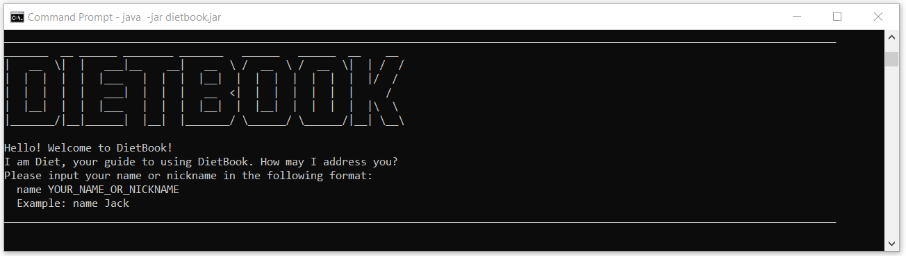

# DietBook User Guide

## Introduction
DietBook is a desktop application, optimized for use via a **Command Line Interface** (CLI). It is designed to **track your food and nutritional intake** as well as provide you with your **daily calorie recommendation**. As the application mainly targets _NUS students staying on campus_, it has a **database prepopulated with food items commonly found around NUS**. This allows for such food items to be easily added to the list of food items consumed for tracking.

* Table of Contents
{:toc} 

## Quick Start
1. Ensure that you have **Java 11** installed.
1. Download the latest version of `dietbook.jar` from [here](https://github.com/AY2021S1-CS2113-T14-4/tp/releases).
1. Copy the file to the folder you want to use as the home folder for your DietBook.
1. Navigate to the folder containing the jar file on command prompt and run the command `java -jar dietbook.jar`. 
1. Enable full-screen for a better experience but rest assure that DietBook will still function normally even in non full-screen mode.
1. For **first time users**: <br/>
A CLI, similar to the one shown below, should appear within a few seconds. Follow the instructions provided to setup DietBook or refer to [name](#entering-username-name) and [info](#entering-user-information-info) for more detailed explanations.<br/>
  
1. Start using DietBook by typing any valid command and pressing Enter to execute it.
1. Refer to the [Features](#features) section below for more details of each command or jump to [Command Summary](#command-summary) section for a list of valid commands.

## Features 

Notes about the command format:

* Words in `UPPER_CASE` are parameters to be supplied by the user.<br/> 
e.g. For `delete INDEX`, `delete 1` would be a valid command.
  
* Parameters in square brackets are optional. However, if all parameters are optional, at least one parameter needs to be given. In such cases, any one of the parameters would be valid.<br/>
e.g. For `add x/PORTION_SIZE n/FOOD_NAME k/CALORIE [c/CARBOHYDRATE] [p/PROTEIN] [f/FAT]`, `add x/1 n/Toast k/120`, `add x/1 n/Toast k/120 c/18`,  `add x/1 n/Toast k/120 c/18 p/3`, `add x/1 n/Toast k/120
 c/18 p/3 f/4` are all valid commands.
 
* For commands with multiple parameters, the parameters can be in any order.<br/>
e.g. For `add n/FOOD_NAME x/PORTION_SIZE`, `add n/mee x/1` and `add x/1 n/mee` are both valid.

* Command words and parameter indicators are case-sensitive.<br/>
e.g. `help` is a valid command but `Help` is not.<br/>
e.g. For `add n/FOOD_NAME x/PORTION_SIZE`, `add n/mee x/1` is valid but `add N/mee x/1` is not.

* A single spacing to separate command words, parameters, command word and parameters is required.<br/>
e.g. For `calculate all`, `calculate all` is valid but `calculateall` and `calculate` &nbsp; &nbsp; &nbsp; &nbsp; `all` is not.<br/>
e.g. For `delete INDEX`, `delete 1` is valid if there is a food item with index 1 but`delete1` is not.<br/>
e.g. For `add n/FOOD_NAME x/PORTION_SIZE`, `add n/mee x/1` is valid but `add n/meex/1` is not.<br/>

### Features related to user information

#### Entering username: `name`

Stores the user's name into DietBook during the initial setup.

Format: `name YOUR_NAME`

* The name given must not be empty.
* This command is **only used when setting up DietBook for the first time**. Any subsequent editing of the name can be done using the [editinfo](#Editing user information: `editinfo`) command.

Example of usage:

* `name Tom and Jerry`<br/>
* `name Jack`

Output example for usage example 2:
```
Hi Jack!
Before we get started, I would like to know about about you so that I can make more 
accurate calculations for you :). Therefore, could you please share with me the following:
- Your gender either F for female or M for male or O for others.
- Your age which is a positive integer.
- Your height in cm.
- Your original weight in kg, the weight when you first started using DietBook or you current weight.
- Your current weight in kg.
- Your target weight in kg, or your current weight if that is also your target weight.
- Your activity level, represented by a number from 1 to 5.
  1 = You hardly engage in any exercise or have a job that requires little to no physical activity.
  2 = You engage in some form of light exercise or have a job that requires some physical activity.
  3 = You engage in moderate amount of exercise or have a job that requires moderate physical activity.
  4 = You engage in vigorous exercise or have a physically demanding job.
  5 = You engage in extremely vigorous exercise or have an extremely physically demanding job.

Please input your details in the following format:
  info g/GENDER a/AGE h/HEIGHT o/ORIGINAL_WEIGHT c/CURRENT_WEIGHT t/TARGET_WEIGHT l/ACTIVITY_LEVEL
  Example: info g/F a/21 h/165 o/65 c/65 t/55 l/2
```

#### Entering user information : `info`

Stores the user's personal information into DietBook during the initial setup. 

Format: `info g/GENDER a/AGE h/HEIGHT o/ORIGINAL_WEIGHT c/CURRENT_WEIGHT t/TARGET_WEIGHT l/ACTIVITY_LEVEL`

* This command is **only used when setting up DietBook for the first time**. Any subsequent editing of user information can be done using the [editinfo](#Editing user information: `editinfo`) command.
* The gender must be either **`M` for male, `F` for female or `O` for others**.
* The age must be a positive integer **from 0 to 150, inclusive**.
* The height in cm must be a positive integer **from 1 to 300, inclusive**.
* The original, current and target weight in kg must be a positive integer ***from 1 to 500, inclusive**.
* The activity level must be a positive integer **from 1 to 5, inclusive**.
  * 1 = You hardly engage in any exercise or have a job that requires little to no physical activity.
  * 2 = You engage in some form of light exercise or have a job that requires some physical activity.
  * 3 = You engage in moderate amount of exercise or have a job that requires moderate physical activity.
  * 4 = You engage in vigorous exercise or have a physically demanding job.
  * 5 = You engage in extremely vigorous exercise or have an extremely physically demanding job.

Example of usage:

* `info g/M a/21 h/175 o/85 c/85 t/75 l/2` stores the user's gender, age, height, original, current and target weight as well as the activity level to `male`, `21`, `175`, `85`, `85`, `75` and `You engage in some form of light exercise  or have a job that requires some physical activity.` respectively.

Output example:
```
Thank you! DietBook has been initialised and you may start by entering any valid commands. 
If you require a list of valid commands, you can enter: help
```

#### Viewing user information: `userinfo`

Shows the user information stored in DietBook.

Format: `userinfo` 

Output example: 
```
Here is your information:
  Name: Jack
  Gender: male
  Age: 21
  Height: 175cm
  Original weight: 85kg
  Current weight: 85kg
  Target weight: 75kg
  Activity level: You engage in some form of light exercise or have a job that requires some physical activity.
```

#### Editing user information: `editinfo`

Edits the user information stored in DietBook.

Format: `editinfo [n/NAME] [g/GENDER] [a/AGE] [h/HEIGHT] [o/ORIGINAL_WEIGHT] [c/CURRENT_WEIGHT] [t/TARGET_WEIGHT] [l/ACTIVITY_LEVEL]` 

* Although all parameters are listed as optional, **at least one of the optional fields needs to be provided**. In this case, any one of the parameters would work.
* If more than one parameter is given, they can be in any order.
* Existing values will be updated to the input values.
* The name must not be empty.
* The gender must be either **`M` for male, `F` for female or `O` for others**.
* The age must be a positive integer **from 0 to 150, inclusive**.
* The height must be a positive integer **from 1 to 300, inclusive**.
* The original, current and target weight must be a positive integer **from 1 to 500, inclusive**.
* The activity level must be a positive integer **from 1 to 5, inclusive**.
  * 1 = You hardly engage in any exercise or have a job that requires little to no physical activity.
  * 2 = You engage in some form of light exercise or have a job that requires some physical activity.
  * 3 = You engage in moderate amount of exercise or have a job that requires moderate physical activity.
  * 4 = You engage in vigorous exercise or have a physically demanding job.
  * 5 = You engage in extremely vigorous exercise or have an extremely physically demanding job.

Example of usage: 

* `editinfo n/John` edits the name of the user to be `John`.
* Both `editinfo c/75 l/4` and `editinfo l/4 c/75` edits the current weight and activity level of the user to be `75` and `You engage in vigorous exercise or have a physically demanding job.` respectively.
 
Output example for usage example 2: 
```
Got it! I've updated your personal information:
  Name: Jack
  Gender: male
  Age: 21
  Height: 175cm
  Original weight: 85kg
  Current weight: 75kg
  Target weight: 75kg
  Activity level: You engage in vigorous exercise or have a physically demanding job.
```

### Features related to the food database

#### To view all food in the database: `data`

Displays a list of provided food database.

Format: `data`

Output example:
```
Here are the food items in the database:
  1. Prawn Mee Soup(Dry)(Large) | calorie : 490 | protein : 0 | carbohydrate : 0 | fats : 0
  2. Prawn Mee Soup(Dry)(Small) | calorie : 390 | protein : 0 | carbohydrate : 0 | fats : 0
  3. Fried Hokkien Prawn Mee(Large) | calorie : 470 | protein : 0 | carbohydrate : 0 | fats : 0
  4. Fried Hokkien Prawn Mee(Small) | calorie : 350 | protein : 0 | carbohydrate : 0 | fats : 0
  5. Clay Pot Chicken | calorie : 440 | protein : 0 | carbohydrate : 0 | fats : 0
  6. Black Pepper Chicken | calorie : 490 | protein : 0 | carbohydrate : 0 | fats : 0
  7. Ayam Penyet Set | calorie : 699 | protein : 0 | carbohydrate : 0 | fats : 0
  8. Steamed Chicken Set  | calorie : 475 | protein : 0 | carbohydrate : 0 | fats : 0
  9. Ikan Grouper Penyet Set | calorie : 669 | protein : 0 | carbohydrate : 0 | fats : 0
  10. Bouillabaisse with cock crab and poached lobster | calorie : 520 | protein : 35 | carbohydrate : 45 | fats : 56
  11. Chicken wings with Reblochon pomme pur??e | calorie : 450 | protein : 32 | carbohydrate : 25 | fats : 66
  12. Sea bass with prawn tortellini, fennel pur??e and white wine sauce | calorie : 530 | protein : 25 | carbohydrate : 76 | fats : 43
```

#### To add a food from the database: `add` `Coming Soon!`

Adds a desired food in the database into the DietBook.

Format: `add n/FOOD_NAME x/PORTION_SIZE`

Example of Usage:
* `add n/Prawn Mee x/1` adds the first instance of food with a name that contains Prawn Mee with a portion of 1.

Output example:
```Here are the food items in DietBook:
   1. Prawn Mee Soup(Dry)(Large) | calorie : 490 | protein : 0 | carbohydrate : 0 | fats : 0 -- (1)
```

### Features related to the food list

* To add you own food: add x/PORTION_SIZE n/FOOD_NAME k/CALORIE [c/CARBOHYDRATE] [p/PROTEIN] [f/FAT]
    * Examples of usage : 
        * Example 1 : add x/1 n/Salty Chicken Rice k/300 c/10 p/20 f/50
        * Output of Example 1 : 
        ```
        Got it! I've added this food item:
          Salty Chicken Rice | calorie : 300 | protein : 20 | carbohydrate : 10 | fats : 50 -- (1)
        ```
        * Example 2 : add x/2 n/Chilli Pepper Crab k/400 c/10 p/10 f/20
        * Output of Example 2 :
        ```
        Got it! I've added this food item:
          Chilli Pepper Crab | calorie : 400 | protein : 10 | carbohydrate : 10 | fats : 20 -- (2)
        ```

* To view all food in DietBook: list
    * Example of usage : list
    * Output :
    ```
    Here are the food items in DietBook:
      1. Salty Chicken Rice | calorie : 300 | protein : 20 | carbohydrate : 10 | fats : 50 -- (1)
      2. Salty Chicken Rice | calorie : 300 | protein : 20 | carbohydrate : 10 | fats : 50 -- (1)
      3. Chilli Pepper Crab | calorie : 400 | protein : 10 | carbohydrate : 10 | fats : 20 -- (2)
    ```
* To view all food in DietBook recorded within a time period: list yyyy-mm-ddTHH:mm yyyy-mm-ddTHH:mm
    * Example of usage : list 2020-10-29T11:30 2020-10-29T16:40
    * Output :
    ```
    Here are the food items recorded in DietBook between 29 Oct 2020 1130 and 29 Oct 2020 1640:
      1. Salty Chicken Rice | calorie : 300 | protein : 20 | carbohydrate : 10 | fats : 50 -- (1)
      2. Salty Chicken Rice | calorie : 300 | protein : 20 | carbohydrate : 10 | fats : 50 -- (1)
      3. Chilli Pepper Crab | calorie : 400 | protein : 10 | carbohydrate : 10 | fats : 20 -- (2)
    ```
        
* To view all food in DietBook recorded from a certain date until now: list yyyy-mm-ddTHH:mm 
    * Example of usage : list 1066-10-14T08:00
    * Output :
    ```
    Here are the food items recorded in DietBook between 14 Oct 1066 0800 and 29 Oct 2020 1317:
      1. Salty Chicken Rice | calorie : 300 | protein : 20 | carbohydrate : 10 | fats : 50 -- (1)
      2. Salty Chicken Rice | calorie : 300 | protein : 20 | carbohydrate : 10 | fats : 50 -- (1)
      3. Chilli Pepper Crab | calorie : 400 | protein : 10 | carbohydrate : 10 | fats : 20 -- (2)
    ```
* To delete a food from DietBook: delete INDEX
    * Example of usage : delete 2
    * Output : 
    ```
    Noted. I've removed this food item:
      Salty Chicken Rice | calorie : 300 | protein : 20 | carbohydrate : 10 | fats : 50 -- (1)
    ```
    * The list after delete is done :
    ```
    Here are the food items in DietBook:
      1. Salty Chicken Rice | calorie : 300 | protein : 20 | carbohydrate : 10 | fats : 50 -- (1)
      2. Chilli Pepper Crab | calorie : 400 | protein : 10 | carbohydrate : 10 | fats : 20 -- (2)
    ```
* To delete all food items from the DietBook: clear
    * Example of usage : clear 
    * Output : 
    ```
    All previous data has been deleted...
    DietBook is now empty.
    ```
    * Before clearing : 
    ```
        Here are the food items in DietBook:
          1. Salty Chicken Rice | calorie : 300 | protein : 20 | carbohydrate : 10 | fats : 50 -- (1)
          2. Chilli Pepper Crab | calorie : 400 | protein : 10 | carbohydrate : 10 | fats : 20 -- (2)
    ```
    * After clearing : 
    ```
    DietBook is currently empty.
    ```
### Features related to nutritional intake and recommendation

To get recommended calorie intake: recommend
* Example of usage :
* Output : 
    ```
    Hi Jack!
    Here is your daily recommended calorie intake: 2607kcal
    ```

We use the following list as an example, to set up the list we have the following sequence of inputs
```
add x/1 n/Salty Chicken Rice k/300 c/10 p/20 f/50
add x/2 n/Chilli Pepper Crab k/400 c/10 p/10 f/20
add x/1 n/Steak Buns k/500 c/20 p/50 f/10
add x/3 n/Sweat potato tea k/300 c/30 p/0 f/0
add x/1 n/Chicken Wing Noodles k/400 c/10 p/30 f/10
list
```

```
Here are the food items in DietBook:
  1. Salty Chicken Rice | calorie : 300 | protein : 20 | carbohydrate : 10 | fats : 50 -- (1)
  2. Chilli Pepper Crab | calorie : 400 | protein : 10 | carbohydrate : 10 | fats : 20 -- (2)
  3. Steak Buns | calorie : 500 | protein : 50 | carbohydrate : 20 | fats : 10 -- (1)
  4. Sweat potato tea | calorie : 300 | protein : 0 | carbohydrate : 30 | fats : 0 -- (3)
  5. Chicken Wing Noodles | calorie : 400 | protein : 30 | carbohydrate : 10 | fats : 10 -- (1)
```

 * To calculate carbohydrate intake: calculate carbohydrate
    * Input : calculate carbohydrate
    * Output : 
 ```
 Total carbohydrate intake: 80g
 ```
* To calculate carbohydrate intake within a time period: calculate carbohydrate yyyy-mm-ddTHH:mm yyyy-mm-ddTHH:mm
   * Input : calculate carbohydrate 2020-10-29T08:00 2020-10-29T17:00
   * Output : 
 ```
 Time period: between 29 Oct 2020 0800 and 29 Oct 2020 1700

 Total carbohydrate intake: 80g
 ```

* To calculate carbohydrate intake from a certain date until now: calculate carbohydrate yyy-mm-ddTHH:mm
   * Input : calculate carbohydrate 2020-10-29T08:00
   * Output : 
 ```
 Time period: between 29 Oct 2020 0800 and 29 Oct 2020 1340
 
 Total carbohydrate intake: 80g
 ```

Similar Inputs and outputs for the following 
 * To calculate calorie intake: calculate calorie
 * To calculate calorie intake within a time period: calculate calorie yyyy-mm-ddTHH:mm yyyy-mm-ddTHH:mm
 * To calculate calorie intake from a certain date until now: calculate calorie yyyy-mm-ddTHH:mm

 * To calculate protein intake: calculate protein
 * To calculate protein intake within a time period: calculate protein yyyy-mm-ddTHH:mm yyyy-mm-ddTHH:mm
 * To calculate protein intake from a certain date until now: calculate protein yyyy-mm-ddTHH:mm

 * To calculate fat intake: calculate fat
 * To calculate fat intake within a time period: calculate fat yyyy-mm-ddTHH:mm yyyy-mm-ddTHH:mm
 * To calculate fat intake from a certain date until now: calculate fat yyyy-mm-ddTHH:mm

 * To calculate all nutritional intake: calculate all
    * Input : calculate all
    * OutPut : 
    ```
    Total calorie intake: 1900kcal
    Total carbohydrate intake: 80g
    Total protein intake: 110g
    Total fat intake: 90g
    ```
 * To calculate all nutritional intake within a time period: calculate all yyyy-mm-ddTHH:mm yyyy-mm-ddTHH:mm
     * Input : calculate all 2020-10-29T08:00 2020-10-29T17:00
     * OutPut : 
     ```
     Time period: between 29 Oct 2020 0800 and 29 Oct 2020 1700
     
     Total calorie intake: 1900kcal
     Total carbohydrate intake: 80g
     Total protein intake: 110g
     Total fat intake: 90g
     ```
 * To calculate all nutritional intake from a certain date until now: calculate all yyyy-mm-ddTHH:mm
     * Input : calculate all 2020-10-29T08:00
     * OutPut : 
     ```
     Time period: between 29 Oct 2020 0800 and 29 Oct 2020 1345
     
     Total calorie intake: 1900kcal
     Total carbohydrate intake: 80g
     Total protein intake: 110g
     Total fat intake: 90g
     ```
 
### Other features

#### To view a list of valid commands: help: `help`

Displays the helping guide for commands.

Format: `help`

Output example: 
```
Listed below are the valid commands for DietBook:

For user information related commands
  To view user information: userinfo
  To edit user information: editinfo [n/NAME] [g/GENDER] [a/AGE] [h/HEIGHT] [o/ORIGINAL_WEIGHT] [c/CURRENT_WEIGHT] [t/TARGET_WEIGHT] [l/ACTIVITY_LEVEL]

For database related commands
  [Coming Soon] To add a food from the database: add n/FOOD_NAME x/PORTION_SIZE
  [Coming Soon] To add a food from the database consumed at a certain time: add n/FOOD_NAME x/PORTION_SIZE yyyy-mm-ddTHH:mm
  To view all food in the database: data

For food list related commands
  To add a food not in the database that was just consumed: add x/PORTION_SIZE n/FOOD_NAME k/CALORIE [c/CARBOHYDRATE] [p/PROTEIN] [f/FAT]
  To add a food not in the database consumed at a certain time: add x/PORTION_SIZE n/FOOD_NAME k/CALORIE [c/CARBOHYDRATE] [p/PROTEIN] [f/FAT] yyyy-mm-ddTHH:mm
  To view all food in DietBook: list
  To view all food in DietBook recorded within a time period: list yyyy-mm-ddTHH:mm yyyy-mm-ddTHH:mm
  To view all food in DietBook recorded from a certain date until now: list yyyy-mm-ddTHH:mm
  To delete a food from DietBook: delete INDEX
  To delete all food items from the DietBook: clear

For nutritional intake and recommendation related commands
  To get recommended calorie intake: recommend

  To calculate carbohydrate intake: calculate carbohydrate
  To calculate carbohydrate intake within a time period: calculate carbohydrate yyyy-mm-ddTHH:mm yyyy-mm-ddTHH:mm
  To calculate carbohydrate intake from a certain date until now: calculate carbohydrate yyy-mm-ddTHH:mm

  To calculate calorie intake: calculate calorie
  To calculate calorie intake within a time period: calculate calorie yyyy-mm-ddTHH:mm yyyy-mm-ddTHH:mm
  To calculate calorie intake from a certain date until now: calculate calorie yyyy-mm-ddTHH:mm

  To calculate protein intake: calculate protein
  To calculate protein intake within a time period: calculate protein yyyy-mm-ddTHH:mm yyyy-mm-ddTHH:mm
  To calculate protein intake from a certain date until now: calculate protein yyyy-mm-ddTHH:mm

  To calculate fat intake: calculate fat
  To calculate fat intake within a time period: calculate fat yyyy-mm-ddTHH:mm yyyy-mm-ddTHH:mm
  To calculate fat intake from a certain date until now: calculate fat yyyy-mm-ddTHH:mm

  To calculate all nutritional intake: calculate all
  To calculate all nutritional intake within a time period: calculate all yyyy-mm-ddTHH:mm yyyy-mm-ddTHH:mm
  To calculate all nutritional intake from a certain date until now: calculate all yyyy-mm-ddTHH:mm

For other system related commands
  To view a list of valid commands: help
  To exit DietBook: exit
```
 #### To exit DietBook: `exit`
 
 Exits the DietBook.
 
 Format: `exit`
 
 Output example:
 ```
 Bye! Hope to see you again soon!
 ```
 
 #### Saving the DietBook: `Coming soon!`
 
 Saves the DietBook data when the exit command have been input. The saved data is in 2 files: UserInfo.txt and FoodList.txt.
 
 Output example:
 
  ```
  Your data has been saved successfully.
  ```

## FAQ

**Q**: How do I transfer my data to another computer? 

**A**: Either download `dietbook.jar` on the other computer and overwrite the empty data files with the data files from your previous computer or copy the whole DietBook home folder from the previous computer to the new computer.

## Command Summary

Action | Format, Examples
---- | ----
Enter name | **Note**: Used only when setting up DietBook for the first time.<br/>`name YOUR_NAME` <br/> e.g.,`name Jack`
Enter info | **Note**: Used only when setting up DietBook for the first time.<br/>`info g/GENDER a/AGE h/HEIGHT o/ORIGINAL_WEIGHT c/CURRENT_WEIGHT t/TARGET_WEIGHT l/ACTIVITY_LEVEL` <br/> e.g.,`info g/M a/21 h/175 o/85 c/85 t/75 l/2`
View user info | `userinfo`
Edit user info | `editinfo [n/NAME] [g/GENDER] [a/AGE] [h/HEIGHT] [o/ORIGINAL_WEIGHT] [c/CURRENT_WEIGHT] [t/TARGET_WEIGHT] [l/ACTIVITY_LEVEL]` <br/> e.g.,`editinfo c/75 l/4`
