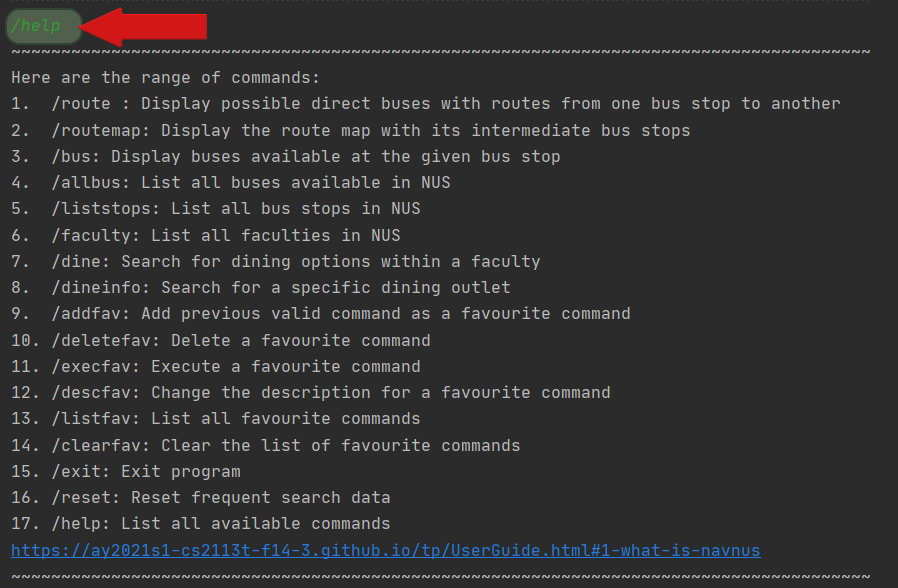
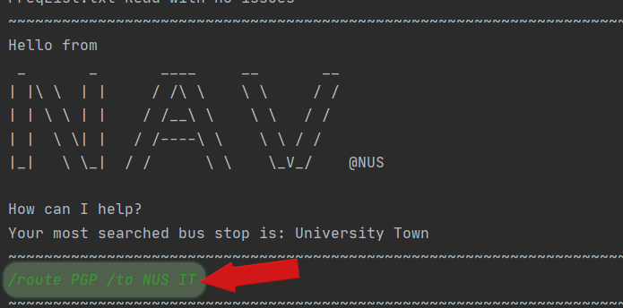
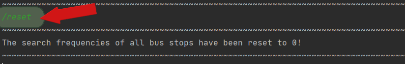

# User Guide

## Opening words
Welcome to Nav@NUS application's user guide! <br><br>
The purpose of this user guide is to provide you with all the necessary information to use this application to navigate
around NUS campus via the school's shuttle service.<br>

## Table of Contents
- [1. What is Nav@NUS?](#1-what-is-navnus)
- [2. Quick Start](#2-quick-start)
- [3. Features](#3-features)
  * [3.1. List available help: ```/help```](#31-list-available-help-help)
  * [3.2. Check for direct bus: ```/route```](#32-check-for-direct-bus-route)
  * [3.3. Check bus route: ```/routemap```](#33-check-bus-route-routemap)
  * [3.4. Check for buses at a bus stop: ```/bus```](#34-check-for-buses-at-a-bus-stop-bus)
  * [3.5. List all bus available in NUS ```/allbus```](#35-list-all-bus-available-in-nus-allbus)
  * [3.6. List all bus stops in NUS: ```/liststops```](#36-list-all-bus-stops-in-nus-liststops)
  * [3.7. Search for dining options within a faculty: ```/dine```](#37-search-for-dining-options-within-a-faculty-dine)
  * [3.8. Search for specific dining outlet: ```/dineinfo```](#38-search-for-specific-dining-outlet-dineinfo)
  * [3.9. Add a favourite command: `/addfav`](#39-add-a-favourite-command-addfav)
  * [3.10. List all favourite commands: `/listfav`](#310-list-all-favourite-commands-listfav)
  * [3.11. Delete a favourite command: `/deletefav`](#311-delete-a-favourite-command-deletefav)
  * [3.12. Execute a favourite command: `/execfav`](#312-execute-a-favourite-command-execfav)
  * [3.13. Change the description for a favourite command: `/descfav`](#313-change-the-description-for-a-favourite-command-descfav)
  * [3.14. Clear the list of favourite commands: `/clearfav`](#314-clear-the-list-of-favourite-commands-clearfav)
  * [3.15. Similarity Checks](#315-similarity-checks)
  * [3.16. Reset frequent search data: ```/reset```](#316-reset-frequent-search-data-reset)
  * [3.17. Exit the program: ```/exit```](#317-exit-the-program-exit)
- [4. FAQ](#4-faq)
- [5. Command Summary](#5-command-summary)
- [6. Glossary](#6-glossary)

## 1. What is Nav@NUS?
Are you new to NUS? <br>
Are you searching for ways to get around NUS all squeezed up in front of a tiny information board?<br>
We have just the right solution for you!<br><br>
Introducing **Nav@NUS**, you new navigation assistant!
Nav@NUS is a useful command line interface (CLI) application to guide you in navigating around the NUS campus
via the school's shuttle services. This application enables you to retrieve key bus information easily, skipping the 
hassle of physically checking the bus stop's notice board.Nav@NUS is a tool tailor made for anyone unfamiliar to 
NUS  campus,students,professors and visitors included. Nav@NUS brings convenience to you and wishes your 
commute in NUS to be as effortless as possible. Nav@NUS uses a CLI to facilitate quick typing and retrieval of 
information that you require.

Nav@NUS consists of 3 main features:

* **Route**: Searches for bus routes from your location to your intended destination.
* **Dine**: Seeks dining options for you to explore culinary world of NUS.
* **Fav**: Saves your commands for you to have a personalised user experience catered to your needs.

Skip the tight squeeze near information boards and use Nav@NUS today!

## 2. Quick Start
The following steps will guide you through the process of running **Nav@NUS**.

1. Ensure that you have Java `11` or above installed in your computer. If you do not have it installed,
follow the guide [here](https://docs.oracle.com/en/java/javase/11/install/installation-jdk-microsoft-windows-platforms.html#GUID-A7E27B90-A28D-4237-9383-A58B416071CA).
2. Download the latest `Nav@NUS.jar` from [here](https://github.com/AY2021S1-CS2113T-F14-3/tp/releases).
3. Open command prompt on your computer.
Orientate yourself to the command line interface. As seen in the figure below, the red arrow points to
where you have to type in commands.

Figure 1.1 Windows CLI

3. Copy the jar file to the folder you want to use as the _home folder_ for Nav@NUS.jar bus application. In the example
shown in Figure 1.3, the home folder is found in the address path of "C:\Users...\CS2113T Empty folder".

Figure 1.3 Path of home folder
4. In the command prompt, type `cd` and the directory of the _home folder_. Press <kbd>Enter</kbd> to continue.
5. Run the .jar file in the command prompt as follows by typing `java -jar duke.jar` and press <kbd>Enter</kbd>.
6. Your screen should show the start screen of Nav@NUS.

Figure 1.4 Start screen of Nav@NUS
7. Try keying in `/help` and press <kbd>Enter</kbd>!

## 3. Features 
There are 17 features available in Nav@NUS. The following are instructions for using the features.

>Notes about command format:  
>
>1. Words in **bold** are parameters to be provided by the user.
>2. Parameters to be entered by the user are not case-sensitive.

### 3.1. List available help: ```/help```
This command lists a set of features along with their respective commands available to users.

Format: <code>/help</code>

The expected outcome is as follows:<br><br>
<br>

### 3.2. Check for direct bus: ```/route```
This command displays all bus routes from one location to another that do not require changing buses.

The format of this command is as follows: <br>
<code>/route <strong>location_1</strong> /to <strong>location_2 </strong> </code>

#### Examples of Usage
**<u>Example 1</u>**<br>
Let's say you are currently at **PGP** and want to find out the buses you can board from **PGP** bus station to get to **NUS IT**.

To find all such bus routes:

1. Type <code>/route <strong>PGP</strong> /to <strong>NUS IT</strong></code> into the CLI and press <kbd>Enter</kbd> 
to execute the command as shown in the figure below.<br><br>
<br>

2. The result will be a message displaying the list of buses you can take with their routes as shown in the figure below.<br><br>
<br>

**<u>Example 2</u>**<br>
Let's say you are currently at **University Health Centre** and you want to go to **PGPR**. But you accidentally type **"Univerity 
Health Center"** instead. 

These are the steps to follow: 

1. You type <code>/route <strong>Univerity Health Center</strong> /to <strong>PGPR</strong></code> into the CLI and 
press <kbd>Enter</kbd> to execute the command as done in example 1.

2. The result will be a message displaying suggestions for possible spelling errors you may have made.<br><br>
<br>

3. Type <code>/route <strong>University Health Centre</strong> /to <strong>PGPR</strong></code> into the CLI
following the suggestion given.

4. The result will be a message displaying the list of buses you can take with their routes as shown in the figure 
below.<br><br>
<br>

### 3.3. Check bus route: ```/routemap```
This command displays the full route of the bus that you have specified.

Format: <code>/routemap <strong>bus code</strong></code> <br>

#### Examples of Usage
**<u>Example 1</u>**<br>
This command is exceptionally useful to find indirect bus routes.
Let us suppose that you are at **Raffles Hall** with only bus AA2 available and would like to go to **University Town**. 
You would notice that there is no direct bus to **University Town**. You could use the <code>/routemap</code> to find
indirect routes to your intended destination. 

To find indirect bus routes:

1. You type <code>/routemap <strong> AA2 </strong></code> into the CLI and press <kbd>Enter</kbd>.<br><br>
<br>

2. The result will display the whole bus route of bus AA2.<br><br>
<br>

3. With the information that bus AA2 could bring you to bus stops after **Raffles Hall** e.g. **Kent Vale**, you can now check 
if there is a direct bus route from these bus stops.<br><br>
<br>

**<u>Example 2</u>**<br>
This command is also useful in showing you the previous bus stops of your intended bus. You could use this information
to gauge how crowded the bus would be.<br><br>
Let us suppose that you are at **Raffles Hall** intending to board AA2. 

These are the steps to follow:

1. You type in <code>/routemap <strong> AA2 </strong></code> into the CLI and press <kbd>Enter</kbd>.<br><br>
<br>

2. The result will display the whole bus route of bus AA2. You will observe that the bus passes through **University Town**
which is relatively more crowded than other bus stops.<br><br>
<br>

3. With this information, you could explore other bus routes to your destination.

### 3.4. Check for buses at a bus stop: ```/bus```
This command displays all buses available at a specific bus stop.

The format of this command is as follows: <br>
<code>/bus<strong> bus stop</strong></code> <br>

#### Examples of Usage
**<u>Example 1</u>**<br>
Let's say that you are at <strong>University Town</strong> bus stop, and you want to know the buses which are available for you to take. Instead of searching for the bus stops which all the buses stop at, you can easily access this information by using the <code>/bus</code> command. 

To search for available buses at University Town:

1. Type <code>/bus <strong>University Town</strong></code> into the CLI and press <kbd>Enter</kbd> to execute the command as shown in the figure below. <br><br>
<br>

2. The result will be a message displaying the buses available at University Town. <br><br>
<br>

**<u>Example 2</u>** <br>
Let's say that you are at the <strong>museum</strong> bus stop, and you want to know the buses which are available for you to take. However, you make a spelling error and type <strong>"musuem"</strong> instead. <br>

These are the steps to fix the mistake:

1. The result will be a message displaying bus stop suggestions for possible error in user input.<br><br>
<br>

2. Type <code>/bus <strong>museum</strong></code> into the CLI as suggested in the above output.<br>

3. The result will be a message displaying the buses available at the museum.<br><br>
<br>

### 3.5. List all bus available in NUS ```/allbus```
This command lists all buses available in NUS with their respective routes.

The format for this command is as follows:<br> 
<code>/allbus</code> <br>

#### Examples of Usage
Let's say you want to see a list of all bus routes so that you can plan your trip around NUS accordingly. 

To see the complete list of buses:

1. Type <code>/allbus</code> into the CLI and press <kbd>Enter</kbd>.<br><br>
<br>

### 3.6. List all bus stops in NUS: ```/liststops```
This command lists all bus stops in NUS.

The format for this command is as follows:<br> 
<code>/liststops</code> <br>

#### Examples of Usage
Let's say you want to know more about the bus stops in NUS. 

To see the description of each location:

1. Type <code>/liststops</code> into the CLI and press <kbd>Enter</kbd>.<br><br>
<br>

### 3.7. Search for dining options within a faculty: ```/dine```
This command lists out all dining outlets available within a chosen faculty.

The format of this command is as follows:<br> 
<code>/dine <strong>faculty</strong></code> <br>

#### Examples of Usage
**<u>Example 1</u>**
Let's say you want to know all the dining options available in <strong>School of Business</strong>.

These are the steps to follow:

1. Type <code>/dine <strong>business</strong></code> into the CLI and press <kbd>Enter</kbd> to execute the command as shown in the figure below.<br><br>
<br>


### 3.8. Search for specific dining outlet: ```/dineinfo```
Search for all dining outlets that contains the keyword, and display their location and operating hours.

The format of this command is as follows:<br>
<code>/dineinfo <strong>outlet</strong></code>

#### Examples of Usage
**<u>Example 1</u>**
Let's say you want to find information of the dining outlet <strong>Arise & Shine</strong>.

These are the steps to follow:

1. Type <code>/dineinfo <strong>arise</strong></code> into the CLI and press <kbd>Enter</kbd> to execute the command as shown in the figure below.<br><br>
<br>

### 3.9. Add a favourite command: `/addfav`

### 3.10. List all favourite commands: `/listfav`

### 3.11. Delete a favourite command: `/deletefav`

### 3.12. Execute a favourite command: `/execfav`

### 3.13. Change the description for a favourite command: `/descfav`

### 3.14. Clear the list of favourite commands: `/clearfav`

### 3.15. Similarity Checks
When you enter a location and make a spelling error or a typo in the name, the app performs a similarity check with 
existing location names and suggests some locations to you. The app executes this command automatically and does not 
require any explicit input from you.

#### Examples of Usage
Let's say you want to find all buses that stop at **Opp HSSML**, but you type <code>/bus <strong>Opp HSML</strong></code> instead.

You will receive a message with suggested location names you can use as shown in the figure below.<br><br>
<br>

You may then type in the command again with the correct location to see a list of buses that stop at **Opp HSSML** 
as shown in the figure below.<br><br>
<br>

>Note: This check is only applicable to bus stop names, so the app performs it only when you enter a 
><code>/route</code> command or a <code>/bus</code> command. 

### 3.16. Reset frequent search data: ```/reset```
This command resets the data set used to display most frequently search bus stop on application start-up.

Format:<code>/reset</code>

#### Examples of usage
**<u>Example 1</u>**<br>
Let us suppose that you are transitioning to a new academic semester, and the locations that you will key in to the
application changes. To create a new data set that will cater to your needs in this new semester, you will key in the
command <code>/reset</code> to reset the data set and start the application on a clean slate.<br><br>
<br>

### 3.17. Exit the program: ```/exit```
This command helps you exit the application.

The format of this command is as follows:<br>
<code>/exit</code>

The application exits after displaying the following message.<br>
```
So long buddy!
```

## 4. FAQ
This section addresses some common questions to aid in possible issues faced.

**Q:** Where can I find the release? <br>
It can be found at [here](https://github.com/AY2021S1-CS2113T-F14-3/tp/releases).

## 5. Command Summary
The following table provides a summary of features and command formats.

>Note: No additional parameter is needed if it is not mentioned. eg help <br>

Command | Format | Example
--- | --- | ---
/route | `/route` **location1** /to **location2** | `/route` **PGP** /to **Raffles Hall**
/routemap | `/routemap` **bus code** | `/routemap` **AA1** 
/bus | `/bus` **location** | `/bus` **PGP**
/allbus | `/allbus` | `/allbus`
/liststops | `/liststops`| `/liststops`
/dine | `/dine` **faculty** | `/dine` **business**
/dineinfo | `/dineinfo` **outlet** | `/dineinfo` **arise**
/addfav | | 
/deletefav | |
/execfav | |
/descfav | |
/listfav | |
/clearfav | |
/exit | `/exit` | `/exit`
/help | `/help` | `/help`
/reset | `/reset` | `/reset`

## 6. Glossary
This section defines key technical terms we have used throughout the user guide.
1. Case-sensitive: Capital and lower case letters are treated differently.
2. Command Line Interface(CLI): Processes commands to a computer program in the form of lines of text.
