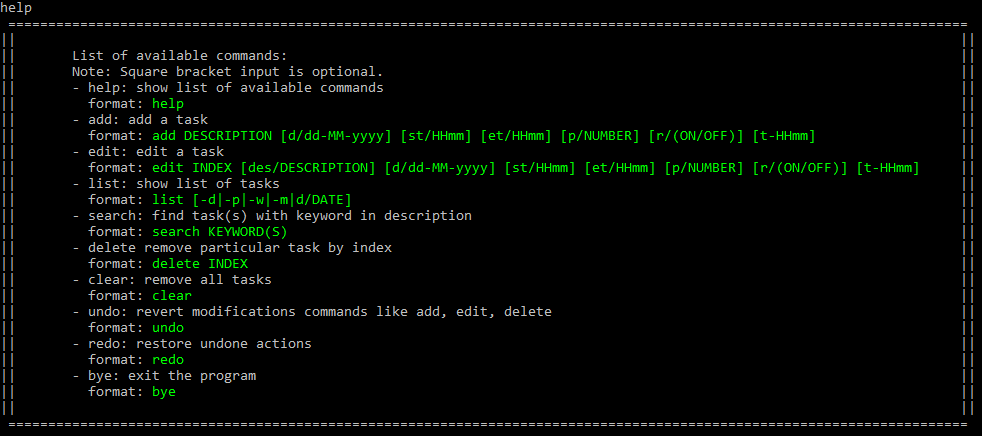
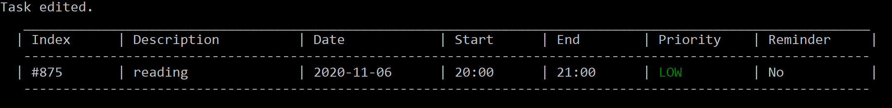
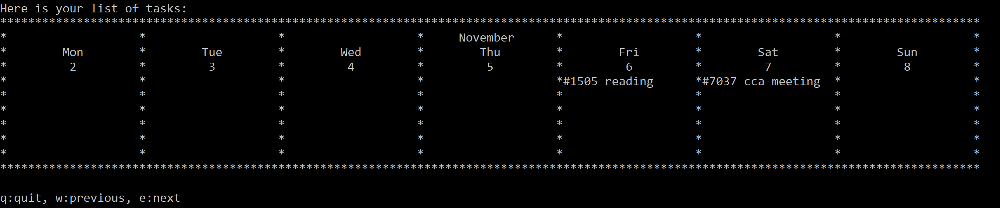

# User Guide
- [What is PlaNUS](#what-is-planus)
- [About this document](#about-this-document)
- [Quick start](#quick-start)
- [Features](#features)
    - [Showing commands](#showing-all-commands--help)
    - [Adding task](#adding-a-task--add)
    - [Editing task](#editing-a-task--edit)
    - [Displaying tasks](#displaying-tasks--list)
    - [Searching task](#searching-relevant-tasks--search)
    - [Removing task](#removing-a-task--delete)
    - [Clearing task](#clearing-tasks--clear)
    - [Setting reminder](#setting-a-reminder--reminder)
    - [Exiting program](#exiting-program--bye)
- [FAQ](#faq)
- [Java 11 Installation Guide](#java-11-installation-guide)
- [Command summary](#command-summary)


<div style="page-break-after: always; visibility: hidden"> 
\pagebreak 
</div>

## What is PlaNUS
PlaNUS is a desktop application for NUS students to manage their tasks and schedule.
With this system, you can add your upcoming tasks into the list, and then display
them in a table view or in a calendar view, so that you may easily see and plan your
schedule ahead. This application is optimized for use via Command Line Interface (CLI),
this means that you operate the application by typing commands into the command box.

This is what **PlaNUS** looks like: 


*Figure 1. The user interface for PlaNUS.*

<div style="page-break-after: always; visibility: hidden"> 
\pagebreak 
</div>

## About this document
This user guide is a document aiming to help users in understanding the features
provided by PlaNUS and the instructions required for each step.

Included is a quick start guide, a brief explanation of each features available,
as well as a summary of commands for quick reference at the bottom of the document.

<div style="page-break-after: always; visibility: hidden"> 
\pagebreak 
</div>

## Quick start

1. Ensure that you have Java 11 or above installed. To check that if you have Java 11 installed for Windows user,
open command prompt by pressing `Windows key + R` and type `cmd`, then type `java -version` in the command prompt
and press `Enter`.

2. If you do not have Java 11 installed, go [here](#java-11-installation-guide).

3. For first time Windows user, open command prompt and run the following line to enable color display of command prompt:

    `reg add HKCU\Console /v VirtualTerminalLevel /t REG_DWORD /d 1`
    
4. Download the latest "planus.jar" from [here](https://github.com/AY2021S1-CS2113T-W12-1/tp/releases/tag/v2.0).
    
5. Open a **new** command prompt in the folder where "planus.jar" is located at.
For Windows user, you can do so by going to the folder in file explorer,
and at the location bar type `cmd` and press `Enter`.

6. Run "planus.jar" with the following command:

    `java -jar planus.jar`
    
    The following content will be displayed if there's no existing data file:
    
    
    
    *Figure 2. The first thing you will see upon opening the application.*
    
    
7. **Maximise** the command prompt window to get a full display of the contents.

8. Type a command in command prompt and press `Enter` to execute it.

9. Refer to the [Features](#features) below for details of each command.


<div style="page-break-after: always; visibility: hidden"> 
\pagebreak 
</div>


## Features 


### Notes about command format:
```
- Words in UPPER_CASE are the inputs to be supplied by the user while words in LOWER_CASE are the command words.
    - e.g. in "add DESCRIPTION [d/DATE] [st/START_TIME] [et/END_TIME] [p/PRIORITY]", 
    add is a command word while DESCRIPTION is a description about the task.
      
- Parameter in square bracket is optional. 
    - e.g. in "add DESCRIPTION [d/DATE] [st/START_TIME] [et/END_TIME] [p/PRIORITY]", 
    DATE, START_TIME, END_TIME and PRIORITY are optional inputs which can be omitted.
    
- Input date format is dd-MM-yyyy.
    - e.g. 20-02-2020 means 20th February 2020
      
- Input time format is HHmm in 24-hrs.
    - e.g. 1830 means 6.30pm
    
- Input priority format is 1, 2 or 3 which represents LOW, MEDIUM and HIGH respectively.
    - e.g. 1

- Task index is the number displayed between "#" and description of the task.
    - e.g. "#1029 meeting", 1029 is the index.

- If only the index is entered for the edit command, command will still be valif.
    - e.g. "edit 1028' is valid. 
```    

### Showing all commands : `help`

Shows the commands available with the formats.

Format: `help`

Expected outcome:



*Figure 3. A list of available commands and their formats will be displayed.*

### Adding a task : `add`

Add a task to the task list and display task that was added.

If the date and priority are omitted,
default date will be the day when the tasked is added and
default priority will be low. If the timings are omitted, the time displayed will be empty.

Format: `add DESCRIPTION [d/DATE] [st/START_TIME] [et/END_TIME] [p/PRIORITY]`

Example of usage: 

`add meeting st/1000`  
`add borrow book`  

Expected outcome:


*Figure 4. After adding "meeting" starting at 10.00am.*


*Figure 5. After adding "borrow book" with no other inputs.*


### Editing a task : `edit`

Edit a task in the task list using its index and display the task edited.

Format: `edit INDEX [des/DESCRIPTION] [d/DATE] [st/START_TIME] [et/END_TIME] [p/PRIORITY]`

Example of usage: 

`edit 8833 des/reading`  
`edit 4893 st/1400 et/1600 p/3`

Expected outcome:


*Figure 6. Initial list before edits.*



*Figure 7. After editing the description of task #8833.*


*Figure 8. After editing the timings and priority of task #4893.*

### Displaying tasks : `list` 

Default/no suffix: display **all** tasks in the **order of their addition**.  
`-d`: display **all** tasks by **date**, from oldest to newest.  
`-p`: display **all** tasks by **priority**, from HIGH to LOW.  
`-w`: display **only tasks in current week** in a weekly view.   
`-m`: display **only tasks in current month** in a monthly view.  
`d/DATE`: display **all tasks under a specified date** in **order of their addition**.  

Format: `list [-d|-p|-w|-m|d/DATE]`

Regarding the format, '|' means "or", thus the suffix can either be `-d`, `-p`, `-w`, `-m`, or `d/DATE`.
It can also be nothing since square brackets denote optional.  
Under partial display modes like daily, weekly and monthly view, 
you could enter `q`, `w` and `e` to quit, view previous and next period respectively.

Example of usage: 

`list`  
`list -d`  
`list -w`  
`list d/20-10-2020`  

Expected outcome:

`list`:


*Figure 9. Default list, tasks are in order of their addition to the list.*

`list -d`:


*Figure 10. List tasks by date, from oldest to newest.*

`list -p`:


*Figure 11. List tasks by priority, from HIGH to LOW.*

`list -w`:



*Figure 12. Display tasks in a weekly view for the current week.*

`list -m`:


*Figure 13. Display tasks in a monthly view for the current month.*


### Searching relevant task(s) : `search`

Search and display task(s) with given keyword, keywords do not have to be case-sensitive.

Format: `search KEYWORD`

Example of usage: 

`search meeting`

Expected outcome:


*Figure 14. A list of tasks containing the keyword will be displayed.*


### Removing a task : `delete`

Delete a task from the task list using its index and display the task deleted.

Format: `delete INDEX`

Example of usage: 

`delete 8833`

Expected outcome:


*Figure 15. The task that was deleted will be displayed.*
    

### Clearing tasks : `clear`

Delete all tasks in the list.

Format: `clear`

Expected outcome:

    All tasks cleared.


### Setting a reminder : `reminder`

Allows you to set a reminder for any specific task on the list.
You can specify a time for the reminder, if no time has been specified, the default time will be set to 1 hour
before the start time of the task.

Format: `reminder INDEX [t/TIME]`

Example of usage: 

`reminder 8833 t/2305`

Expected outcome:


*Figure 16. Setting a reminder for task #8833 at 11.05pm.*


*Figure 17. Once the specified time has arrived.*


### Exiting program : `bye`

Display a goodbye message and exits the program.

Format: `bye`

Expected outcome:

    Bye! See you again!


### Saving data to file

Data will be automatically saved after modification commands like 
`add`, `delete`, `edit` and so forth.


<div style="page-break-after: always; visibility: hidden"> 
\pagebreak 
</div>


## FAQ

**Q**: How do I transfer my data to another computer? 

**A**: Copy the existing data file to the computer, then create a "data" folder under the 
same folder as "planus.jar". Lastly, copy the data file to "data" folder and name it "data.json".

**Q**: There is an error and I cannot open the application.

**A**: Check that your Java version is 11. Press `Windows key + R`, type `cmd` and press `Enter`.
In the command prompt, type `java -version` and press `Enter` to see your Java version.
If the version is not correct, go [here](#java-11-installation-guide).
<div style="page-break-after: always; visibility: hidden"> 
\pagebreak 
</div>

## Java 11 Installation Guide

1. Click [here](https://docs.aws.amazon.com/corretto/latest/corretto-11-ug/downloads-list.html) to go to the
download page for Java 11 JDK. Click on the download link with **zip file** corresponding to your operating system.

2. Create a new folder named "Java" in your C drive and extract the contents of the zip file there.

3. Go to [LumiNUS](https://luminus.nus.edu.sg/) under the CS2113T module, go to "Files", in the "Resources" folder,
download SwitchJava.bat and SwitchJava.sh and move them to your created "Java" folder.

4. For Windows user, open command prompt in the "Java" folder by typing `cmd` at the location bar of the file explorer,
and run the batch file by typing `SwitchJava.bat` and press `Enter`.

<div style="page-break-after: always; visibility: hidden"> 
\pagebreak 
</div>

## Command Summary

Action | Format | Example
------ | ------ | -------
add | `add DESCRIPTION [d/DATE] [st/START_TIME] [et/END_TIME] [p/PRIORITY]` | `add meeting st/1400`
edit | `edit INDEX [des/DESCRIPTION] [d/DATE] [st/START_TIME] [et/END_TIME] [p/PRIORITY]` | `edit 1234 p/3`
list | <code>list [-d&#124;-p&#124;-w&#124;-m&#124;d/DATE]</code> | `list -d`, `list d/10-10-2020`
search | `search KEYWORD` | `search meet`
delete | `delete INDEX` | `delete 212`
clear | `clear` | `clear`
bye | `bye` | `bye`
