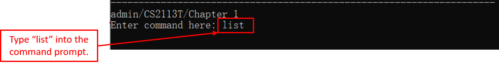
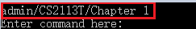

# Kaji - User Guide
By: `Team F11-3` Since: `August 2020`
## Table of content
1. [Overview](#1-overview) 
1.1. [About Kaji](#11-about-kaji) 
1.2. [About this User Guide](#12-about-this-user-guide) 
1.3. [Understanding the Command Line Interface (CLI)](#13-understanding-the-command-line-interface-cli) 
1.4. [Understanding Kaji](#14-understanding-kaji) 
&nbsp;&nbsp;&nbsp;&nbsp;&nbsp;&nbsp;&nbsp;1.4.1. [Content Management](#141-content-management) 
&nbsp;&nbsp;&nbsp;&nbsp;&nbsp;&nbsp;&nbsp;1.4.2. [Schedule Management](#142-schedule-management) 
2. [Quick Start](#2-quick-start) 
3. [Features](#3-features) 
3.1. [Admin Level](#31-admin-level) 
&nbsp;&nbsp;&nbsp;&nbsp;&nbsp;&nbsp;&nbsp;3.1.1. [Adding a module: `add`](#311-adding-a-module-add) 
&nbsp;&nbsp;&nbsp;&nbsp;&nbsp;&nbsp;&nbsp;3.1.2. [Listing modules available: `list`](#312-listing-modules-available-list) 
&nbsp;&nbsp;&nbsp;&nbsp;&nbsp;&nbsp;&nbsp;3.1.3. [Editing a module name: `edit`](#313-editing-a-module-name-edit) 
&nbsp;&nbsp;&nbsp;&nbsp;&nbsp;&nbsp;&nbsp;3.1.4. [Removing a module: `remove`](#314-removing-a-module-remove) 
&nbsp;&nbsp;&nbsp;&nbsp;&nbsp;&nbsp;&nbsp;3.1.5. [Accessing the module level: `go`](#315-accessing-the-module-level-go) 
3.2. [Module Level](#32-module-level) 
&nbsp;&nbsp;&nbsp;&nbsp;&nbsp;&nbsp;&nbsp;3.2.1. [Adding a chapter: `add`](#321-adding-a-chapter-add) 
&nbsp;&nbsp;&nbsp;&nbsp;&nbsp;&nbsp;&nbsp;3.2.2. [Listing chapters available: `list`](#322-listing-chapters-available-list) 
&nbsp;&nbsp;&nbsp;&nbsp;&nbsp;&nbsp;&nbsp;3.2.3. [Editing a chapter name: `edit`](#323-editing-a-chapter-name-edit) 
&nbsp;&nbsp;&nbsp;&nbsp;&nbsp;&nbsp;&nbsp;3.2.4. [Removing a chapter: `remove`](#324-removing-a-chapter-remove) 
&nbsp;&nbsp;&nbsp;&nbsp;&nbsp;&nbsp;&nbsp;3.2.5. [Accessing the chapter level: `go`](#325-accessing-the-chapter-level-go) 
&nbsp;&nbsp;&nbsp;&nbsp;&nbsp;&nbsp;&nbsp;3.2.6. [Returning to admin level: `back`](#326-returning-to-admin-level-back) 
&nbsp;&nbsp;&nbsp;&nbsp;&nbsp;&nbsp;&nbsp;3.2.7. [Starting a revision session: `revise`](#327-starting-a-revision-session-revise) 
&nbsp;&nbsp;&nbsp;&nbsp;&nbsp;&nbsp;&nbsp;3.2.8. [Rating a chapter: `rate`](#328-rating-a-chapter-rate) 
&nbsp;&nbsp;&nbsp;&nbsp;&nbsp;&nbsp;&nbsp;3.2.9. [Rescheduling a chapter: `reschedule`](#329-rescheduling-a-chapter-reschedule) 
3.3. [Chapter Level](#33-chapter-level) 
&nbsp;&nbsp;&nbsp;&nbsp;&nbsp;&nbsp;&nbsp;3.3.1. [Adding a flashcard: `add`](#331-adding-a-flashcard-add) 
&nbsp;&nbsp;&nbsp;&nbsp;&nbsp;&nbsp;&nbsp;3.3.2. [Listing flashcards available: `list`](#332-listing-flashcards-available-list) 
&nbsp;&nbsp;&nbsp;&nbsp;&nbsp;&nbsp;&nbsp;3.3.3. [Editing a flashcard content: `edit`](#333-editing-a-flashcard-content-edit) 
&nbsp;&nbsp;&nbsp;&nbsp;&nbsp;&nbsp;&nbsp;3.3.4. [Removing a flashcard: `remove`](#334-removing-a-flashcard-remove) 
&nbsp;&nbsp;&nbsp;&nbsp;&nbsp;&nbsp;&nbsp;3.3.5. [Returning to module level: `back`](#335-returning-to-module-level-back) 
&nbsp;&nbsp;&nbsp;&nbsp;&nbsp;&nbsp;&nbsp;3.3.6. [Checking overall performance for a chapter: `showrate`](#336-checking-overall-performance-for-a-chapter-showrate) 
3.4. [General](#34-general) 
&nbsp;&nbsp;&nbsp;&nbsp;&nbsp;&nbsp;&nbsp;3.4.1. [Showing a list of commands available: `help`](#341-showing-a-list-of-commands-available-help) 
&nbsp;&nbsp;&nbsp;&nbsp;&nbsp;&nbsp;&nbsp;3.4.2. [Listing the chapters due for today: `due`](#342-listing-the-chapters-due-for-today-due) 
&nbsp;&nbsp;&nbsp;&nbsp;&nbsp;&nbsp;&nbsp;3.4.3. [Listing the chapters due in the upcoming week: `preview`](#343-listing-the-chapters-due-in-the-upcoming-week-preview) 
&nbsp;&nbsp;&nbsp;&nbsp;&nbsp;&nbsp;&nbsp;3.4.4. [Viewing the revision history: `history`](#344-viewing-the-revision-history-history) 
&nbsp;&nbsp;&nbsp;&nbsp;&nbsp;&nbsp;&nbsp;3.4.5. [Excluding or including modules and chapters: `exclude`](#345-excluding-or-including-modules-and-chapters-exclude) 
&nbsp;&nbsp;&nbsp;&nbsp;&nbsp;&nbsp;&nbsp;3.4.6. [Exiting the program: `exit`](#346-exiting-the-program-exit) 
4. [Command Summary](#4-command-summary) 
4.1. [Admin Level](#41-admin-level) 
4.2. [Module Level](#42-module-level) 
4.3. [Chapter Level](#43-chapter-level) 
4.4. [General](#44-general) 

--------------------------------------------------------------------------------------------------------------------

## 1. Overview
This section gives an overview about Kaji and the purpose of this user guide.

### 1.1. About Kaji
In your past learning experience, have you encountered these problems? A large number of lecture notes and materials have made your computer desktop messy, 
and there is no way to find the materials you want. When the exam is approaching, you don’t know which subject to review first, or suddenly find that you have 
forgotten everything you learned before. No one wants to forget what they have dedicated time to learn.

Don't worry! <strong>Kaji</strong> will help you solve all these problems!

KAJI is a schedule manager that implements Spaced Repetition, optimised for use via a Command Line Interface (CLI).

### 1.2. About this User Guide
This User Guide explains how to use Kaji. It provides an understanding of the features and commands, as well as some common use cases of this application.

In this guide, we cover:
* How to use the Command Line Interface (CLI)
* Syntax of the commands available in different levels in Kaji
* Common use cases for each command
* Summary of all the commands

### 1.3. Understanding the Command Line Interface (CLI)
A <b>command line interface (CLI)</b> is a text-based user interface (UI) used to view and manage computer files. Command line interfaces are also called command-line user interfaces, console user interfaces and character user interfaces.

### 1.4. Understanding Kaji

#### 1.4.1. Content Management

#### 1.4.2. Schedule Management

--------------------------------------------------------------------------------------------------------------------

## 2. Quick Start
To get started on this application, please perform the following steps:

1. Ensure that you have Java 11 or above installed.
1. Download the latest version of `Kaji` from [here](https://github.com/AY2021S1-CS2113T-F11-3/tp/releases).
1. Copy the file to the folder you want to use as the <I>home folder</I> for your Kaji.
1. Double-click the file to start the app or open a command window in the folder you saved Kaji and run the command `java -jar kaji.jar`. You should get the output as shown below:  

1. Type the command in the command window and press Enter to execute it. 
   e.g. typing `help` and pressing Enter will open the help window. 
   Some example commands you can try:
   * `help` : List commands available
   * `exit` : Exits the app.
1. Refer to [Features](#3-features) below for details of each command.

--------------------------------------------------------------------------------------------------------------------

## 3. Features
This section introduces the syntax and usages of the commands for the features available in Kaji. 
In explaining the syntax, do take note of the following command format which applies to all Kaji commands:
* Words in `UPPER_CASE` are the parameters that you need to provide.
    * <b>Example:</b> In `add MODULE_NAME`, `MODULE_NAME` is a parameter which can be used as `add CS2113`.
* Parameters cannot be given in any order.
    * <b>Example:</b> In `edit MODULE_INDEX MODULE_NAME`, entering `edit CS2113 1` will result in an error as 
      the `MODULE_INDEX` and `MODULE_NAME` parameters are in the wrong order.

### 3.1. Admin Level

#### 3.1.1. Adding a module: `add`
(by Jiayi)

#### 3.1.2. Listing modules available: `list` 
(by Zeyu)

This command shows a list of modules on the admin level.

Format: `list`

Here are some key points:
* Do not need to add `admin` after `list`.
* All list commands have the same command word `list`. 

Example of usage: 
* At Admin Level: enter the command `list`.
* Here is the expected output:

* After listing all modules, you can try all commands available in **Admin Level**.

#### 3.1.3. Editing a module name: `edit` 
(by Zeyu)

This command modifies the module name you want to change.

Format: `edit INDEX MODULE_NAME`

Here are some key points:
* You can only edit content on the level below the one you are on.
* Edit the name / content at the specified `INDEX`.
* The index refers to the index number shown in the displayed content list.
* The index **must be a positive integer** 1, 2, 3, …

Example of usage: 
* At Admin Level: enter `edit 1 CS2113T` changes current Module name at index 1 to CS2113T.
* Here is the expected output:

* After editing the module name, you can try all commands available in **Admin Level**.

#### 3.1.4. Removing a module: `remove` 
(by Jia Ern)

Removes a module from Kaji.

Format: `remove MODULE_INDEX`

Here are some key pointers:
* Removes the module based on the index provided.
* `MODULE_INDEX` refers to the index number shown in the current module list. 
* Index provided **must be a positive integer** 1, 2, 3, ...

Example:  
For instance, you are currently at the admin level and want to remove the module `CS2113T`, the steps to do so are shown below:
* Step 1: Ensure you are at the admin level:  

* Step 2: Enter the command `remove 1` to remove the first module in the list which in this case is `CS2113T`:  

* Step 3: The module as well as the chapters and flashcards in it are removed, and the output message below will be shown:  

#### 3.1.5. Accessing the module level: `go`
(by Jiayi)

### 3.2. Module level

#### 3.2.1. Adding a chapter: `add`
(by Jiayi)

#### 3.2.2. Listing chapters available: `list`
(by Zeyu)

This command shows a list of chapters on the module level.

Format: `list`

Here are some key points:
* Do not need to add `module_name` after `list`.
* All list commands have the same command word `list`.

Example of usage: 
* At Module Level: enter the command `list`.
* Here is the expected output:

* The date in the bracket is the due date for each chapter.
* After listing all chapters, you can try all commands available in **Module Level**.

#### 3.2.3. Editing a chapter name: `edit`
(by Jane)

You can edit the name of an existing chapter from the list of chapters.
You can do so by using the `edit` command, followed by the edited name of the chapter.

**Format:** `edit CHAPTER_INDEX CHAPTER_NAME`

Here are some key pointers:
* `CHAPTER_INDEX` **must be a positive integer** 1, 2, 3, ...,
and must be a valid index number for a chapter as displayed from the list of chapters.
* `CHAPTER_NAME` is the edited name of your chapter.

**Example:**

Let's say you want to edit the chapter name to `Chapter 1` for the chapter `chap 1`.
1. Type `list` into the command prompt and press `Enter` to execute it. 

2. From the list of chapters displayed, you can see that the chapter `CHAPTER_INDEX` is 1. 

3. Next, you can type `edit 1 Chapter 1` into the command prompt and press `Enter` to execute it. 

4. After the chapter name has been successfully edited, the result will be displayed as shown. 

#### 3.2.4. Removing a chapter: `remove`
(by Jia Ern)

Removes a chapter from Kaji.

Format: `remove CHAPTER_INDEX`

Here are some key pointers:
* Removes the chapter based on the index provided.
* `CHAPTER_INDEX` refers to the index number shown in the current chapter list. 
* Index provided **must be a positive integer** 1, 2, 3, ...

Example:  
For instance, you are currently at the module level `CS2113T` and want to remove the chapter `Chapter 1`, the steps to do so are shown below:
* Step 1: Ensure you are at the module level:  

* Step 2: Enter the command `remove 1` to remove the first chapter in the list which in this case is `Chapter 1`:  

* Step 3: The chapter and the flashcards in it are removed, and the output message below will be shown:  

#### 3.2.5. Accessing the chapter level: `go` 
(by Yan An)

Proceeds to the Chapter Level with reference to one of the Chapters within the module.

Format: `go CHAPTER_NAME`
 
Example:  
For instance, you are currently in Module level `Module` and want to head to Chapter level `Chapter1` , the steps to
 do so are shown below:

* Step 1: Enter the command `go Chapter1` to head down to the Chapter level below:  

  
   Figure <>. Example of the "go" command 

* Step 2: You should return to the Admin level as shown below:  

  
   Figure <>. Example of the "go" command Result

#### 3.2.6. Returning to admin level: `back`
(by Yan An)

Returns to the Admin level.

Format: `back`
 
Example:  
For instance, you are currently in Module level `Module` and want to return to the Admin level, the steps to do so
 are shown below:

* Step 1: Enter the command `back` to return to the previous level which is the module level:  

  
   Figure <>. Example of the "back" command 

* Step 2: You should return to the Admin level as shown below:  

  
   Figure <>. Example of the "back" command Result

#### 3.2.7. Starting a revision session: `revise`
(by Jia Ern)

Starts a revision session for a chapter.

Format: `revise CHAPTER_INDEX` 

Here are some key pointers: 
* Revision can only be done at module level. 
* Starts a revision based on the index provided. 
* The index refers to the index number shown in the chapter list for the module level you are currently in.  
* Index provided **must be a positive integer** 1, 2, 3, ...

Example:  
For instance, you are currently in the module level `CS2113T` and want to start a revision for `Chapter 1`, the steps to do so are shown below:
* Step 1: Ensure you are at the module level:  

* Step 2: Enter the command `revise 1` to start a revision on the first chapter in the list which in this case is `Chapter 1`:  

* Step 3: If the chapter is not due for revision yet, you will be shown the below message:  

* Step 4: Enter `Y` to start the revision.
* Step 5: The message below will be shown at the start of the revision:  

* Step 6: The question of the flashcard will be shown:  

* Step 7: Enter `s` to see the answer for the flashcard:  

* Step 8: Based on the difficulty of the flashcard, you may enter either `e`/`m`/`h`/`c` to rate the flashcard as shown below:  

* Step 9: If you entered `c`, the same flashcard will be shown again after your last flashcard, and the process will repeat until you enter `e`/`m`/`h` for the particular flashcard you could not answer for.  
* Step 10: Once all the flashcards have been revised, the output message below will be shown:  

#### 3.2.8. Rating a chapter: `rate`
(by Jiayi)

#### 3.2.9. Rescheduling a chapter: `reschedule`
(by Jane)

You can reschedule the due date of an existing chapter from the list of chapters.
Rescheduling a chapter allows you to reschedule a chapter to an earlier or later date than the specified due date.
You can do so by using the `reschedule` command, followed by the due date that you want to reschedule the chapter to.

**Format:** `reschedule CHAPTER_INDEX DATE`

Here are some key pointers:
* `CHAPTER_INDEX` **must be a positive integer** 1, 2, 3, ...,
and must be a valid index number for a chapter as displayed from the list of chapters.
* `DATE` is the rescheduled due date of your chapter.
* `DATE` should be in the format `yyyy-MM-dd`.

**Example:**

Let's say you want to reschedule the due date to `2020-12-20` for the chapter `Chapter 1`.
1. Type `list` into the command prompt and press `Enter` to execute it. 

2. From the list of chapters displayed, you can see that the chapter `CHAPTER_INDEX` is 1. 

3. Next, you can type `reschedule 1 2020-12-20` into the command prompt and press `Enter` to execute it. 

4. After the due date of the chapter has been successfully rescheduled, the result will be displayed as shown. 

### 3.3. Chapter Level

#### 3.3.1. Adding a flashcard: `add`
(by Jane)

After adding a new chapter, the first thing you might want to do is to add a flashcard to the chapter.
You can do so by using the `add` command, followed by the details of the flashcard.

**Format:** `add q:QUESTION | a:ANSWER`

Here are some key pointers:
* `QUESTION` is the question of your flashcard.
* `ANSWER` is the answer of your flashcard.
* You need to type `q:` before the `QUESTION` parameter. 
* You need to type `a:` before the `ANSWER` parameter.
* Having `|` between `q:QUESTION` and `a:ANSWER` is required.

**Example:**

Let's say you want to add a new flashcard with `1+1` as the `QUESTION` and `2` as the `ANSWER`:
1. Type `add q:1+1 | a:2` into the command prompt and press `Enter` to execute it. 

2. After the flashcard has been successfully added to the chapter, the result will be displayed as shown. 

#### 3.3.2. Listing flashcards available: `list`
(by Jane)

After adding flashcards to the chapter, you can view the list of flashcards that you have for the chapter.
You can do so by using the `list` command.

**Format:** `list`

Here are some key pointers:
* You cannot type in any parameters after the `list` command.

**Example:**

Let's say you want to view all the flashcards for a chapter:
1. Type `list` into the command prompt and press `Enter` to execute it. 

2. The result for the list of flashcards will be displayed as shown. 

#### 3.3.3. Editing a flashcard content: `edit`
(by Jane)

You can edit the question and/or answer of an existing flashcard from the list of flashcards.
You can do so by using the `edit` command, followed by the details of the flashcard.

**Format:** `edit FLASHCARD_INDEX q:QUESTION | a:ANSWER`

Here are some key pointers:
* `FLASHCARD_INDEX` **must be a positive integer** 1, 2, 3, ...,
and must be a valid index number for a flashcard as displayed from the list of flashcards.
* `QUESTION` is the edited question of your flashcard.
* `ANSWER` is the edited answer of your flashcard.
* You need to type `q:` before the `QUESTION` parameter. 
* You need to type `a:` before the `ANSWER` parameter.
* Having `|` between `q:QUESTION` and `a:ANSWER` is required.
* If the question or answer of your flashcard does not need to be edited,
you do not need to type any content for the parameter `QUESTION` or `ANSWER`.

**Example:**

Let's say you want to edit the question to `2*1` for the flashcard that has `1+1` as the question and `2` as the answer.
1. Type `list` into the command prompt and press `Enter` to execute it. 

2. From the list of flashcards displayed, you can see that the flashcard `FLASHCARD_INDEX` is 1. 

3. Next, you can type `edit 1 q:2*1 | a:` into the command prompt and press `Enter` to execute it. 

4. After the flashcard has been successfully edited, the result will be displayed as shown. 

#### 3.3.4. Removing a flashcard: `remove`
(by Jia Ern)

Removes a flashcard from Kaji.

Format: `remove FLASHCARD_INDEX`

Here are some key pointers:
* Removes the flashcard based on the index provided.
* `FLASHCARD_INDEX` refers to the index number shown in the current flashcard list. 
* Index provided **must be a positive integer** 1, 2, 3, ...

Example:  
For instance, you are currently at the chapter level `Chapter 1` and want to remove the flashcard `[Q] 1+1= | [A] 2`, the steps to do so are shown below:
* Step 1: Ensure you are at the chapter level:  

* Step 2: Enter the command `remove 1` to remove the first flashcard in the list which in this case is `[Q] 1+1= | [A] 2`:  

* Step 3: The flashcard is removed, and the output message below will be shown:  

#### 3.3.5. Returning to module level: `back`
(by Jia Ern)

Returns to the module level.

Format: `back`
 
Example:  
For instance, you are currently in chapter level `Chapter 1` and want to return to the module level `CS2113T`, the steps to do so are shown below:
* Step 1: Ensure you are at the chapter level:  

* Step 2: Enter the command `back` to return to the previous level which is the module level:  

* Step 3: You should return to the module level as shown below:  

#### 3.3.6. Checking overall performance for a chapter: `showrate`
(by Jiayi)

### 3.4. General

#### 3.4.1. Showing a list of commands available: `help`
(by Zeyu)

This command shows a list of commands available.

Format: `help`

Here is a key point:
* This command can be **called from any Level**.

Example of usage: 
* At Any Level: enter the command `help`.
* Here is part of the expected output, the whole output is a list of all commands useage:

* After knowing waht are the commands, you can try any commands on the correct level.

#### 3.4.4. Viewing the revision history: `history`
(by Zeyu)

You can view the revision completed in the session/in a day by using this command.

Format: 
`history` 
`history DATE` 

Here are some key points:
* This command can be **called from any Level**.
* If you enter `history`, Kaji will show the revision completed today (the day you enter `history`).
* If you enter `history DATE`, the `DATE` need to be in the format of yyyy-mm-dd, then Kaji will show the revision completed on the given date.

Example of usage (`history` format): 
* At Any Level: enter the command `history`.
* Here is the expected output:

Example of usage (`history DATE` format): 
* At Any Level: enter the command `history 2020-10-30`.
* Here is the expected output:

* After knowing the revision you have completed, you can try any commands on the correct level.

#### 3.4.6. Exiting the program: `exit`
(by Zeyu)

You can exit Kaji by using this command.

Format: `exit`

Example of usage: 
* At Any Level: enter the command `exit`
* Here is the expected output:

### 4.5 Scheduling In KAJI
(by Yan An)

Now that you know how to make KAJI manage your Database of revision content for you, **what about scheduling?** For your benefit, the **scheduling** in KAJI is mostly **automated**! 

**You don't have to do a thing** to enjoy the benefits of Spaced Repetition. Everything is scheduled for you, so all you have to do is to use the commands [`due`](#) and [`preview`](#) to view what chapters are due and complete the revision  for them accordingly. 

Despite that, this **does not mean that you cannot customise** the scheduling process. KAJI allows you to [`reschedule`](#451) and [`exclude`](#451) Chapters manually if you wish to do so, but more on that later. First, let us get into the specific introduction of each command.
  

### 4.5.1. Listing the chapters due for today: `due`
(by Yan An)

As you now know, **each Chapter will be scheduled** to be due on a date. However, it will be **tedious** for you to go through each chapter **one by one** to find their deadlines. Our **solution** to that, is the `due` command.

The `due` command simplifies the process for by **showing you the Chapters that you have scheduled on that day** and the Modules they belong to.
  

#### Format: `due`

#### Key Pointers:
* There are **no parameters** for this command.
* This command can be **called from any Level**

#### Example: 
At any point, if you want to **see what Chapters are due**, all you have to do is enter the `due` command. Below is an example of an execution of the `due` command.

* ***Step 1***: Key the **`due`** command **into the prompt** as shown below and **press *[Enter]***

  
   Figure <>. Example of the "due" command 

* ***Upon completion***: This is what you will see:

  
   Figure <>. Example of the "due" result

[Labeled expected output]

  

### 4.5.2. Listing the chapters that are due in the upcoming week: `preview`
(by Yan An)

Beyond simply being able to view the Chapters that are due on the day itself, what if you would like to **view your upcoming revision schedule** so that you can **plan ahead**? For that specific purpose, we have the `preview` command.

The `preview` command shows you **the Chapters that you have scheduled for each day of the upcoming week** and the Modules that they belong to.
 

#### Format: `preview`

#### Key Pointers:
* There are **no parameters** for this command.
* This command can be **called from any Level**

#### Example: 
At any point, if you **want to see a preview of which Chapters are going to be due within the upcoming week**, all you have to do is enter the `preview` command. Below is an example of an execution of the `preview` command.

* ***Step 1***: Key the **`preview`** command **into the prompt** as shown below and **press *[Enter]***

  
   Figure <>. Example of the "preview" command  

* ***Upon completion***: This is what you will see:

  
   Figure <>. Example of the "preview" result

[Labeled expected output]

  

### 4.5.3. Customising your list of Excluded Modules: `exclude`
(by Yan An)

As your Database grows in size over time, you might want to **customise the automated scheduling** that KAJI provides for you. However, it would **take considerable effort** for you to **delete** an entire Module or Chapter, only to find that you have to **add it back** into your Database **Card by Card**.

Our solution to that is an Exclusion List: **a list of Chapters that KAJI will ignore** as it creates your schedule for you. In this way, you will only have to **add** a Chapter to the list to **exclude** it from your schedule and **remove** it from the list to **include** it back into your schedule.

The `exclude` command allows you to **add or remove** a single Chapter or an entire Module, to and from your Exclusion list to **customise which Chapters are scheduled** in your Database.
 

#### Format: `exclude \PRIMARY_OPTION`
\PRIMARY_OPTION has two values which changes the mode of the `exclude` command:
* ***more***: This option allows you to use `exclude` to **add** to the Exclusion List
* ***less***: This option allows you to use `exclude` to **remove** from the Exclusion List

#### Key Pointers:
* This command can be **called from any Level**
* This command **checks if the Chapter/Module** you are adding into the Exclusion List **exists**, so the List will
 not be filled with non-existing exclusions.
* After calling the command with either "more" or "less", there will be **a guided secondary option** on whether you
 would like to add/remove **a single Chapter** or **an entire Module**
* The name entry of the Chapter/Module to be operated on is **case-sensitive**

#### Example
At any point, if you **customise your Exclusion List**, all you have to do is enter the `exclude` command with the
 choice of "more" or "less" in the format specified above. Below are examples of the execution of the `exclude` command using both options.

Example of ***`exclude more`***
* ***Step 1***: Key the **`exclude more`** command **into the prompt** as shown below and **press *[Enter]***

  
   Figure <>. Example of the "exclude more" command  

* ***Step 2***: Key either **"chapter"**, to exclude a new Chapter, or **"module"**, to exclude an entire Module
, **into the prompt** as shown below and **press *[Enter]***

  
   Figure <>. Example of "exclude more" Secondary Option 

* ***`exclude more`*** + ***chapter***    
        

  
   Figure <>. Example of "exclude more" with Chapter as the Secondary Option 

* ***Step 3***: Key the **Module name** of the Module that the Chapter you wish to exclude from your schedule
     belongs to **into the prompt** as shown below and **press *[Enter]***
        

  
   Figure <>. Example of "exclude more" + ModuleName prompt 

  
   Figure <>. Example of "exclude more" + ModuleName filled 

* ***Step 4***: Key the **Chapter name** that you wish to exclude from your schedule **into the prompt** as shown
 below and **press *[Enter]***
        

  
   Figure <>. Example of "exclude more" + ChapterName prompt 

  
   Figure <>. Example of "exclude more" + ChapterName result

* ***Upon completion***: This is what you will see:

  
   Figure <>. Example of "exclude more" + chapter Result

* ***`exclude more`*** + ***module***
        

  
   Figure <>. Example of "exclude more" with Module as the Secondary Option

* ***Step 3***: Key the **Module name** that you wish to exclude from your schedule **into the prompt** as shown
 below and **press *[Enter]***

  
   Figure <>. Example of "exclude more" + module prompt

  
   Figure <>. Example of "exclude more" + module filled  

* ***Upon completion***: This is what you will see:

  
   Figure <>. Example of "exclude more" + module Result 

Example of ***`exclude less`***
* ***Step 1***: Key the **`exclude less`** command **into the prompt** as shown below and **press *[Enter]***

  
   Figure <>. Example of "exclude less" command  

* ***Step 2***: Key either **"chapter"**, to include a excluded Chapter, or **"module"**, to include a excluded
 Module, **into the prompt** as shown below and **press *[Enter]***

  
   Figure <>. Example of "exclude less" Secondary Option

* ***`exclude less`*** + ***chapter***
        

  
   Figure <>. Example of "exclude less" with Chapter as the Secondary Option

* ***Step 3***: Key the **Module name** of the Module that the Chapter you wish to include back into your schedule
     belongs to **into the prompt** as shown below and **press *[Enter]***

  
   Figure <>. Example of "exclude less" + chapter ModuleName prompt 

  
   Figure <>. Example of "exclude less" + chapter ModuleName filled

* ***Step 4***: Key the **Chapter name** that you wish to include back into your schedule **into the prompt** as shown
 below and **press *[Enter]***

  
   Figure <>. Example of "exclude less" + chapter ChapterName prompt

  
   Figure <>. Example of "exclude less" + chapter ChapterName filled

* ***Upon completion***: This is what you will see:

  
   Figure <>. Example of "exclude less" + chapter Result 

* ***`exclude less`*** + ***module***
        

  
   Figure <>. Example of "exclude less" with Module as the Secondary Option

* ***Step 3***: Key the **Module name** that you wish to include back into your schedule **into the prompt** as shown
 below and **press *[Enter]***

  
   Figure <>. Example of "exclude less" + module ModuleName prompt 

  
   Figure <>. Example of "exclude less" + module ModuleName filled 

* ***Upon completion***: This is what you will see:

  
   Figure <>. Example of "exclude less" + module Result

 

--------------------------------------------------------------------------------------------------------------------

## 4. Command Summary

### 4.1. Admin Level

| Action | Format, Examples |
|--------|------------------|

### 4.2. Module Level

| Action | Format, Examples |
|--------|------------------|

### 4.3. Chapter Level

| Action | Format, Examples |
|--------|------------------|

### 4.4. General

| Action | Format, Examples |
|--------|------------------|
