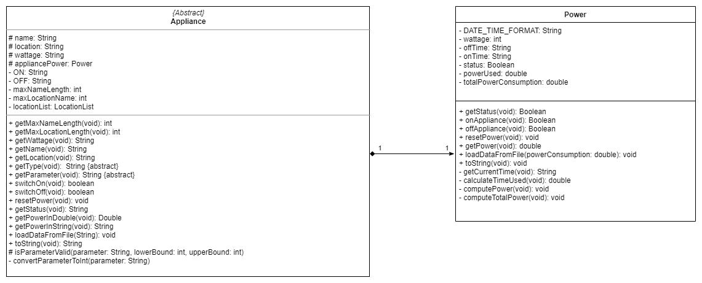

# Yang Fan - Project Portfolio Page

## Overview
SmartHomeBot is a **desktop application that consolidates all home appliance’s control into a 
centralized system via a Command Line Interface (CLI)**. SmartHomeBot is a National University of Singapore team project, *JAVA* is the main language used, under module   
**CS2113: Software Engineering & Object Oriented Programming**. This application is a simulation of control panel for home appliances. Smart Home gadgets like Smart Switch, Smart WiFi LED, Fan and Air Conditional can be integrated in the future. This appliance allows user to control four main types of appliances such as Fan, Light, Air Conditional and SmartPlug. User able to add the appliances as their own configuration of their house and data will be saved locally. Control on and off of the appliances allows user to monitor the power usage of the smart devices.  
 
### Summary of Contributions

#### Code Contributed
Click on [RepoSense](https://nus-cs2113-ay2021s1.github.io/tp-dashboard/#breakdown=true&search=fanceso&sort=groupTitle&sortWithin=title&since=2020-09-27&timeframe=commit&mergegroup=&groupSelect=groupByRepos&checkedFileTypes=functional-code~test-code~other~docs) to find out more about  my contribution to the project on Github.

##### Main Functions Implemented
I am mainly responsible for the monitoring of power usage of all Appliances within SmartHomeBot. Which consists of: 

###### *Data*
- `Power`: Data which stores as appliance's status and its power consumption usage.

  

The class diagram above shows how power is been stored and computed. The calculation of kWh requires time and here the system time from the machine is used. Whenever user is using the appliance, the monitor of the power consumption will be always calculating with the appliance's respective `ON/OFF` status and its wattage.

###### *Logic*
- `Usage` : Command to compute and display total power consumption usage. 
- `Reset` : Command to reset all previous recorded power consumption usage.     

The functionalities and manipulation of above mentioned are under my responsibilities, I will have to seek feedbacks from my fellow teammates for bugs and functionalities requests. 

#### Enhancements implemented
I implemented the Usage command which will record and monitor the actual usage according to the Local System Time from the Machine, this will give an accurate usage from real life. Upon user leaving the program, all appliances will be turn off asn stop its monitoring as program was terminated. In order to have a good user experience, I have implemented *Auto-Formatting* for the printing out result. Every new appliance and location is added or delete to the application, the longest length of these string will be found out as the required printing index. The format of printing is showing in the screenshot below.

  

#### Contributions to the DeveloperGuide: 
Write up about the introduction and appendix of SmartHomeBot, in charge of overall styling and alignments of the contents and diagrams. Provided Sequence Diagrams for the Architecture, Overview with example, UI, Usage Command and Reset Command. Also, provide class diagram for TextUi.  

#### Review/mentoring contributions:

I also actively take part in reviewing my teammates code through GitHub:
* [Pull Request 1](https://github.com/AY2021S1-CS2113-T14-1/tp/pull/31)
* [Pull Request 2](https://github.com/AY2021S1-CS2113-T14-1/tp/pull/223)

In addition, we often meet up on Zoom and other communication channels. I will be the one who takes care of admin issues and note down the to do list for the team.

#### Contributions beyond the project team:

I also actively take part in other group's project development by reviewing their program for tutorials and PE dry runs. 
* [Bug Issue 1](https://github.com/fanceso/ped/issues)
* [Comments 1](https://github.com/nus-cs2113-AY2021S1/tp/pull/19)
* [Comments 2](https://github.com/nus-cs2113-AY2021S1/tp/pull/3)
* [Comments 3](https://github.com/nus-cs2113-AY2021S1/tp/pull/15)
