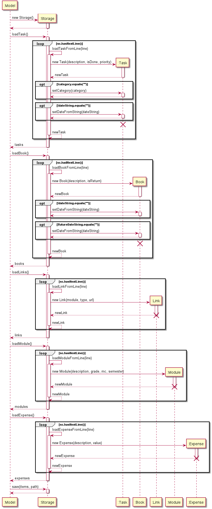
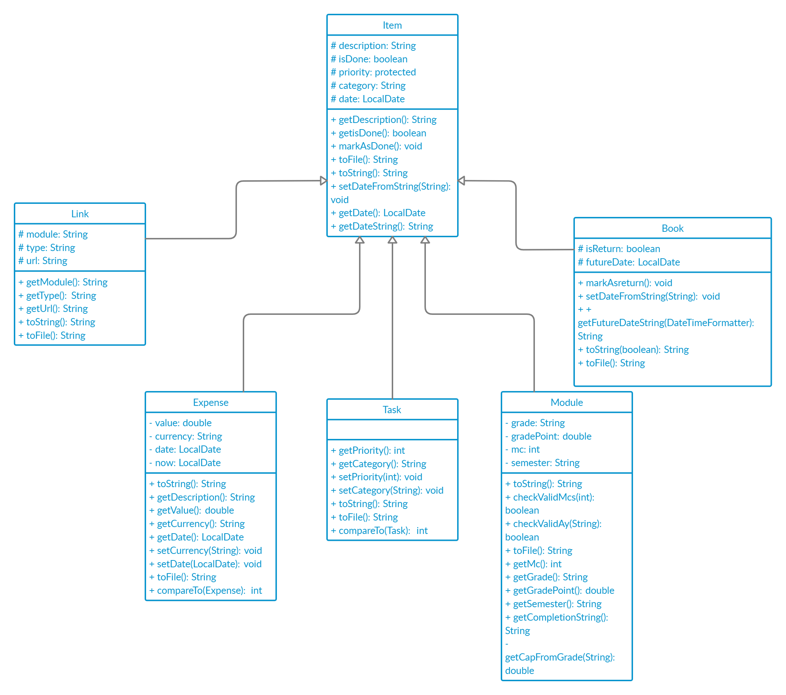

## Guo Ai - Project Portfolio 

## Overview
termiNus is an interactive task manager for students in NUS.

## Summary of Contributions:

##### Code Contributed
- [My RepoSense Report](https://nus-cs2113-ay2021s1.github.io/tp-dashboard/#breakdown=true&search=guoai&sort=groupTitle&sortWithin=title&since=2020-09-27&timeframe=commit&mergegroup=&groupSelect=groupByRepos&checkedFileTypes=docs~functional-code~test-code~other)

##### Enhancement implemented:
1. Features added to Task List
   - Implement the `category` command.
      - Allow users to set the category of a task.
   - Implement the listing sorted tasks feature.
      - Allow users to list the tasks sorted firstly by priority in ascending order (high-priority tasks are displayed 
      first). If multiple tasks have the same priority, they are sorted based on category lexicographically.
2. Features added to Expense List
   - Implement the `spend` command.
     - Allow users to add an expense item with a value to the expense list.
     - Allow users to optionally label expense items with currency and date.
   - Implement the `list expenses` command.
     - Allow users to list all the expense items in the expense list.
     - Allow users to see the summary of the total amount of expenses spent for each currency, and for date ranges 
     including today, this week, this month, and this year, for all the expense items in the expense list.
     - The listed expense items listed are sorted.
        - First sort based on date in descending order (i.e. the latest expense items are shown first).
        - If multiple expense items have the same date, sort them based on currency lexicographically.
   - Implement the `list expenses <optional arguments>` command.
     - Allow users to list all the expense items with a specified currency, date, or date range (i.e. `DAY`, `WEEK`, 
     `MONTH`, `YEAR`).
     - Allow users to see the summary of the total amount of expenses spent for each currency for all the listed expense 
     items.
     - The expense items listed are sorted.
   - Implement the `delete` command.
     - Allow users to delete:
        - One expense item identified by index from the expense list.
        - One or multiple expense item(s) with a specified currency or date from the expense list.
     - Display the deleted expense item(s).
3. Features added to all the 5 Item Lists (i.e. Task List, Expense List, Module List, Link List, Book List)
   - Implement the `find` command.
     - Allow users to search for items (i.e. tasks, expenses, modules, links, books) whose description contains the 
     keyword(s) specified.
     - If the input keyword contains only one word (i.e. no whitespaces), match the description of items using the entire
     word. The keyword must be a whole word in the description.
     - If the input keyword contains multiple words separated by whitespaces, in order for the item to be matched, the 
     entire keyword string must appear in the item description, and each individual word in the keyword string must also 
     be a whole word in the item description.
4. Write JUnit tests to test the features.   
5. Provide a skeleton codebase based on my ip. Almost all the functionalities changed, but the basic structure for 
commands, storage, UI, runner, and exception did not change.
6. Refactor code and build a structure for classes.
   - Refactor the previous `Task` and `TaskList` classes into superclasses `Item` and `ItemList`.
   - All other Items (i.e. `Task`, `Expense`, `Module`, `Link`, `Book`) and Item Lists (i.e. `TaskList`, `ExpenseList`, 
   `ModuleList`, `LinkList`, `BookList`) inherit from `Item` and `ItemList` classes.
   - This design is used among all the features and incorporates more OOP principle.
7. Follow software engineering principles
   - Apply SLAP principle, DRY principle, facade design pattern when implementing features.
   - Use functional programming and improve readability when writing code as much as possible.

##### Contributions to User Guide:

1. Add user guide sections for all commands related to expenses
   - `spend` command
   - `list` command and subcommands
   - `delete` command and subcommands
2. Add user guide sections for `find` command

##### Contributions to Developer Guide:

1. Add a sequence diagram for `Stroage` generated with PlantUML.
1. Add a class diagram for `Item` class and its subclasses.
1. Explain usage for the `Storage` component.
1. Explain the `Item` class and its subclasses.
1. Describe implementation details of `list` command for expenses and `delete` command.

##### Contributions to Team-based tasks:

1. Set up the GitHub team organization and invite teammates
2. Set up the GitHub team repository
3. Refactor code and build a structure for classes 
   - `Item` and its subclasses
   - `ItemList` and its subclasses
4. Add issues to issue tracker, assign teammates, and add labels
5. Smoke test on some features.

##### Review/mentoring contributions: 

1. Review, approve, and merge some of teammates' PRs.
   - Example:
   [#184](https://github.com/AY2021S1-CS2113-T14-3/tp/pull/184)
2. Communicate and explain the refactoring about `Item` and `ItemList` and their subclasses to teammates in group chat, 
so that more OOP can be applied.
3. Provide details when creating PR to inform teammates of the updates.
   - Example:
   [#214](https://github.com/AY2021S1-CS2113-T14-3/tp/pull/214)

##### Contributions beyond the project team:
- Create and host weekly project meetings

### Contributions to the User Guide (Extracts)

### Adding an expense item: `spend`
Add an expense item into the expense list.

Format: `spend <description> <compulsory arguments> <optional arguments>`

List of `<compulsory arguments>`:
- `v/<value>` sets the amount of money spent.

🚩: value has a limit of **100 trillion** (100,000,000,000,000). 

🚩: value must be **non-negative**.

List of `<optional arguments>`:
- `currency/<currency>` sets the currency of the expense.
- `date/<yyyy-MM-dd>` sets the date of the expense.

🚩: By default, the currency is set to "SGD" and date is set to the date when the user executes the `spend` command.

🚩: `currency` is user defined. It **does not** have to be a legal currency in the world.

🚩: Optional and compulsory arguments can be typed in **any** order.

Example of usage:

`spend lunch v/5`

`spend lunch v/5 currency/CNY`

`spend lunch v/5 date/2020-10-28`

`spend lunch v/5 date/2020-11-08 currency/USD `

Output:

```
    ____________________________________________________________
     Got it. I've added this expense item:
       lunch (5.00 USD) (date: Sunday, November 8, 2020)
     Now you have 9 expense items in the list.
    ____________________________________________________________

```

### Displaying expense items on list: `list expenses`
List all the expense items in the expense list and shows total amount of money spent for each currency and the current 
day, week, month, and year.

Format: `list expenses`

🚩: Expense list is sorted **based on date** (*from the most recent to the least recent*). If the date of two expense items 
are the **same**, the expense list is sorted **based on currency lexicographically**.


Example of usage:

`list expenses`

Output:

```
    ____________________________________________________________
     Here are the expense item(s) in your list:

     dinner (0.60 A) (date: Monday, November 9, 2020)
     breakfast (0.10 SGD) (date: Sunday, November 8, 2020)
     book (0.50 SGD) (date: Sunday, November 8, 2020)
     bread (0.20 USD) (date: Sunday, November 8, 2020)
     lunch (5.00 USD) (date: Sunday, November 8, 2020)
     bottle (3.00 SGD) (date: Saturday, November 7, 2020)
     pen (1.00 SGD) (date: Saturday, November 7, 2020)
     earphone (0.30 SGD) (date: Saturday, November 7, 2020)
     tablet (0.40 USD) (date: Saturday, November 7, 2020)

     Your total expense for today is:
     0.60 SGD
     5.20 USD

     Your total expense for this week is:
     4.90 SGD
     5.60 USD

     Your total expense for this month is:
     0.60 A
     4.90 SGD
     5.60 USD

     Your total expense for this year is:
     0.60 A
     4.90 SGD
     5.60 USD
    ____________________________________________________________

```

### Displaying expense items by a certain currency on list: `list expenses (by currency)` 
List all the expense items in the expense list based on currency and shows total amount of money spent for each currency.

Format: `list expenses currency/<currency_name>`

🚩: currency_name is **case-sensitive**.

Example of usage:

`list expenses currency/USD`

Output:

```
    ____________________________________________________________
     Here are the expense item(s) in your expense list of currency USD:
     bread (0.20 USD) (date: Sunday, November 8, 2020)
     lunch (5.00 USD) (date: Sunday, November 8, 2020)
     tablet (0.40 USD) (date: Saturday, November 7, 2020)

     The total amount listed:
     5.60 USD
    ____________________________________________________________
    
```

### Displaying expense items on a certain date on list: `list expenses (by date)` 
List all the expense items in the expense list based on the date and shows total amount of money spent for each currency.

Format: `list expenses date/<YYYY-MM-DD>`

Example of usage:

`list expenses date/2020-11-08`

Output:

```
    ____________________________________________________________
     Here are the expense item(s) in your expense list of date Sunday, November 8, 2020:
     breakfast (0.10 SGD) (date: Sunday, November 8, 2020)
     book (0.50 SGD) (date: Sunday, November 8, 2020)
     bread (0.20 USD) (date: Sunday, November 8, 2020)
     lunch (5.00 USD) (date: Sunday, November 8, 2020)

     The total amount listed:
     0.60 SGD
     5.20 USD
    ____________________________________________________________
```

### Displaying expense items for a certain time period on list: `list expenses (by time period)` 
List all the expense items in the expense list based on the time period and shows total amount of money spent for each currency.

Format: `list expenses for/<time period>`

🚩: `<time period>` can only be `day`, `week`, `month`, or `year`.

🚩: time period is **case-insensitive**.

Example of usage:

`list expenses for/week`

Output:
```    
    ____________________________________________________________
     Here are the expense item(s) in your expense list for this week:
     breakfast (3.00 SGD) (date: Saturday, November 7, 2020)
     bus (1.00 SGD) (date: Saturday, November 7, 2020)
     pencil (0.30 SGD) (date: Saturday, November 8, 2020)
     pen (0.40 USD) (date: Saturday, November 9, 2020)

     The total amount listed:
     4.30 SGD
     0.40 USD
    ____________________________________________________________

```  

### Deleting an expense item from the list: `delete expense`
Delete an expense item from the list.

Format: `delete expense <expenseIndexNumber>`

🚩: `<expenseIndexNumber>` corresponds to the index given on `list expenses` command output.

Example of usage:

`delete expense 2`

Output: 

```
    ____________________________________________________________
     Noted. I've removed all these expense item(s)

     breakfast (0.10 SGD) (date: Sunday, November 8, 2020)
    ____________________________________________________________

```

### Deleting all the expense items of a certain currency: `delete expenses (by currency)`
Delete expense items of the same currency.

Format: `delete expenses currency/<currency_name>`

🚩: currency_name is **case-sensitive**.

Example of usage:

`delete expenses currency/SGD`

Output:

```
    ____________________________________________________________
     Noted. I've removed all these expense item(s)

     earphone (0.30 SGD) (date: Saturday, November 7, 2020)
     pen (1.00 SGD) (date: Saturday, November 7, 2020)
     book (0.50 SGD) (date: Sunday, November 8, 2020)
     bottle (3.00 SGD) (date: Saturday, November 7, 2020)
    ____________________________________________________________

```

### Deleting all expense items of the same date: `delete expenses (by same date)`
Delete expense items of the same date.

Format: `delete expenses date/<yyyy-MM-dd>`

🚩: `date` argument must be in the format of `yyyy-MM-dd`, e.g. `2020-11-08`.

Example of usage:

`delete expenses date/2020-11-08`

Output:

```
    ____________________________________________________________
     Noted. I've removed all these expense item(s)

     bread (0.20 USD) (date: Sunday, November 8, 2020)
     lunch (5.00 USD) (date: Sunday, November 8, 2020)

```

### Searching for an item with keyword: `find`
Finds all items in the corresponding item list with matching description.

Format: `find {tasks,links,books,expenses,modules} k/<keyword>`

🚩: `<keyword>` is **case-insensitive**.

🚩: `<keyword>` can be a **single word** or a **phrase**.
 
🚩: `<keyword>` must contain **whole words** from the item description, e.g `tp meeting`, `ip` etc.

🚩: Incomplete keywords will **not be matched**. e.g `mee`, `t` etc.

🚩: `<keyword>` for finding modules or links can only be the related **module name**.

Example of usage:

`find tasks k/tp meeting`

Output:

```
    ____________________________________________________________
     Here are the matching items in your list:
     1.[T][N] tp meeting (p:0) (category: cs2113)
     2.[T][N] tp meeting 2 (p:0)
    ____________________________________________________________

```

`find expenses k/dinner`

Output:

```
    ____________________________________________________________
     Here are the matching items in your list:
     1.dinner (0.60 A) (date: Monday, November 9, 2020)
    ____________________________________________________________

```

### Contributions to the Developer Guide (Extracts)

### Storage

This section describes how the `Storage` class works

#### High level description

Methods handling data loading (i.e. `loadTask()`, `loadBook()`, `loadLinks()`, `loadModule()`, `loadExpense()` methods) 
return an `ArrayList` of items (i.e. `Task`, `Book`, `Link`, `Module`, `Expense`). These will be the initial values of 
the item list (i.e. `TaskList`, `BookList`, `LinkList`, `ModuleList`, `ExpenseList`). The `save()` method takes an 
inherited instance of `ItemList` and a `String` specifying the path to which the file will be saved. The `ItemList` will 
be parsed and saved into files (each `ItemList` will be saved to a separate file) at the specified path.  
  
Formats of the files: 
  
- `tasks.txt`:  
  
There are 6 fields stored for each `Task`:  
1. String `T` for "Task"  
2. Whether the `Task` has been done or not (1 for done, 0 for not done)  
3. Description of the `Task`  
4. Priority of the `Task` (an Integer)
5. Category of the `Task`
6. Date of the `Task`  
  
All the fields are separated by `|` with a leading and a trailing space. Each `Task` is stored as one line.  
  
Example: `T | 0 | borrow book | 1 | book | 28-10-2020`  
  
- `books.txt`:  

There are 5 fields stored for each `Book`:  
1. String `B` for "Book"  
2. Whether the `Book` has been returned or not (1 for returned, 0 for not returned)   
3. Name/Description of the `Book`  
4. Borrow date of the `Book`  
5. Return date of the `Book`  

All the fields are separated by `|` with a leading and a trailing space. Each `Book` is stored as one line.  
  
Example: `B | 0 | cooking book | 11-11-2011 | 11-12-2011`  
  
- `links.txt`:  

There are 3 fields stored for each `Link`:  
1. Module of the `Link`  
2. Use of the `Link`  
3. URL of the `Link`  
  
All the fields are separated by `|` with a leading and a trailing space. Each `Link` is stored as one line.  

Example: `CS2113 | lecture | https://cs2113Lecture.zoom.com`  
  
- `modules.txt`:  

There are 4 fields for each `Module`:  
1. Module code  
2. Grade  
3. Modular credits  
4. Academic year and semester  

All the fields are separated by `|` with a leading and a trailing space. Each `Module` is stored as one line.  
  
- `expenses.txt`

There are 4 fields for each `Expense`:
1. Description
2. Value
3. Currency
4. Date

All the fields are separated by `|` with a leading and a trailing space. Each `Module` is stored as one line.

Currency has default value "SGD".

Date has default value of the date that the `spend` command is executed.

Date will be in the format of `yyyy-MM-dd`, e.g. `2020-11-09`.
  
#### Implementation details

The following sequence diagram shows how the `Storage` works.


  
1. At the start of `Duke`, a new `Storage` object will be created.
2. `Duke` calls loading methods (i.e. `loadTask()`, `loadBook()`, `loadLinks()`, `loadModule()`, `loadExpense()`) 
sequentially. Each loading method calls the corresponding helper method (i.e. `loadTaskFromLine()`, `loadBookFromLine()`, 
`loadLinkFromLine()`, `loadModuleFromLine()`, `loadExpenseFromLine()`) to load `Item`s from each line in the file. 
3. After each command, `Duke` calls the `save()` method of `Storage` to save all the `Item`s in the list to files.

### Item component

`Item` is a super class with 5 subclasses inheriting it: `Task`, `Expense`, `Module`, `Link`, `Book`.

Here is the class diagram for `Item` class and its subclasses.



The `Item` class and its subclasses:
- Contains getters and setters to retrieve and set the attributes.