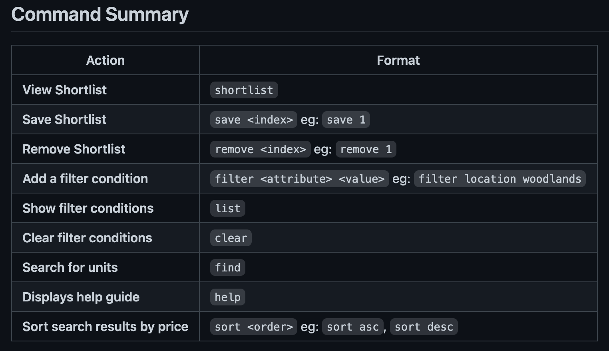
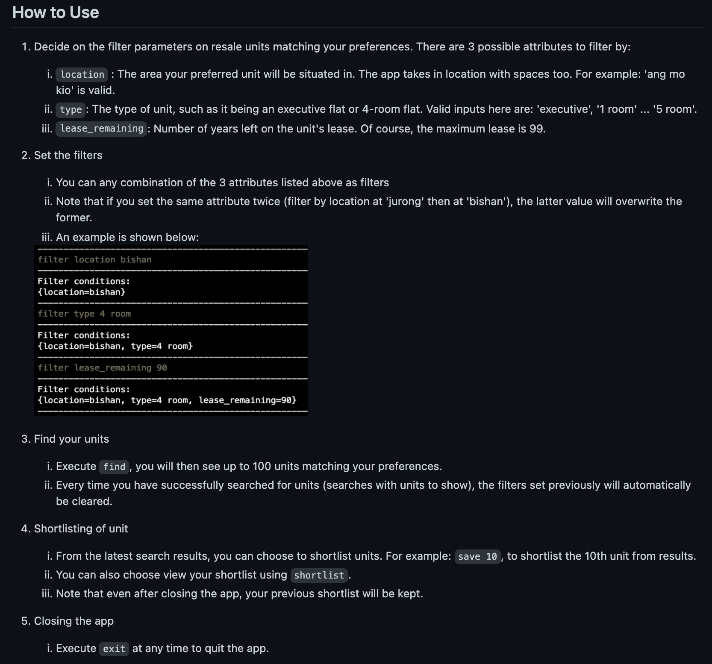
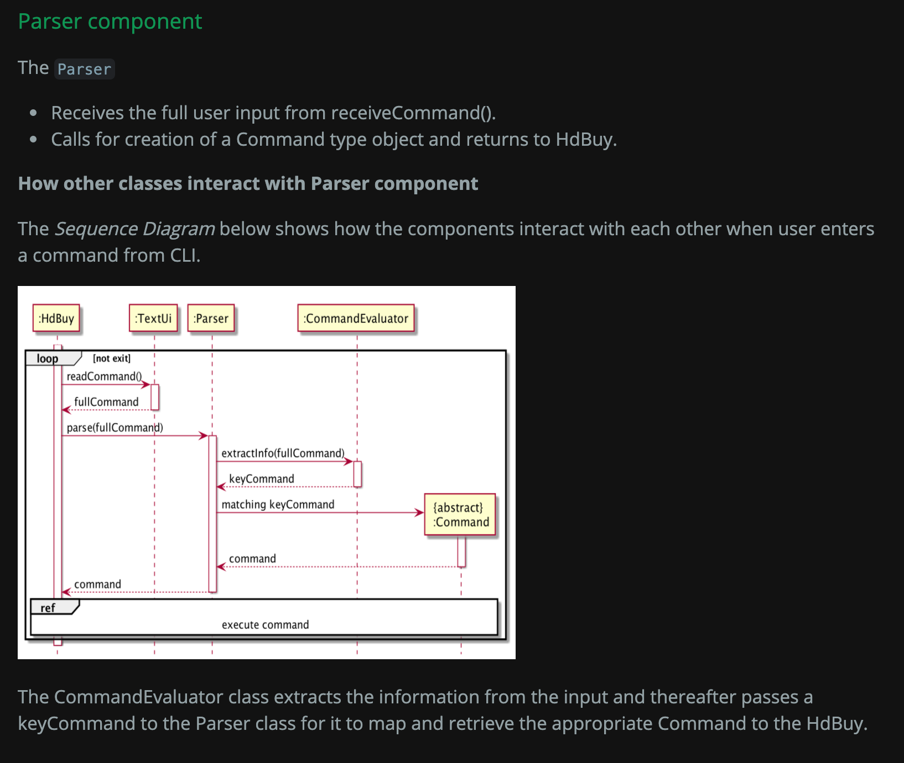
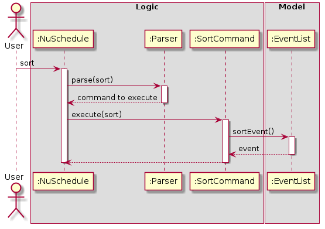

## Project: HdBuy (Wong Jun Hong Jaden's Project Portfolio Page)

HdBuy allow users to easily find and bookmark resale flats available matching their preferences.

* **Code contributed**:
    - [RepoSense link](https://nus-cs2113-ay2021s2.github.io/tp-dashboard/?search=&sort=groupTitle&sortWithin=title&timeframe=commit&mergegroup=&groupSelect=groupByRepos&breakdown=true&checkedFileTypes=docs~functional-code~test-code~other&since=&tabOpen=true&tabType=authorship&tabAuthor=jadenwjh&tabRepo=AY2021S2-CS2113-F10-1%2Ftp%5Bmaster%5D&authorshipIsMergeGroup=false&authorshipFileTypes=docs~functional-code~test-code~other)

* **New Feature**: Added the ability for users to make search queries from resale flat database.
  * What it does: allows the user to search and view the most updated resale flats in Singapore.
    - [ApiRepository](https://github.com/AY2021S2-CS2113-F10-1/tp/blame/master/src/main/java/seedu/hdbuy/api/ApiRepository.java)
    - [UnitsGenerator](https://github.com/AY2021S2-CS2113-F10-1/tp/blame/master/src/main/java/seedu/hdbuy/api/UnitsGenerator.java)
    - [ResponseDecoder](https://github.com/AY2021S2-CS2113-F10-1/tp/blame/master/src/main/java/seedu/hdbuy/api/ResponseDecoder.java)
    - [QueryFormatter](https://github.com/AY2021S2-CS2113-F10-1/tp/blame/master/src/main/java/seedu/hdbuy/api/QueryFormatter.java)
    - [GetRequest](https://github.com/AY2021S2-CS2113-F10-1/tp/blame/master/src/main/java/seedu/hdbuy/api/GetRequest.java)
    - [FindCommand](https://github.com/AY2021S2-CS2113-F10-1/tp/blame/master/src/main/java/seedu/hdbuy/command/FindCommand.java)
    - [FilterCommand](https://github.com/AY2021S2-CS2113-F10-1/tp/blame/master/src/main/java/seedu/hdbuy/command/FilterCommand.java)

* **New Feature**: Added the ability for users to shortlist units from search results.
  * What it does: allows the user to save / add / remove a resale flat of interest in a shortlist.
    - [StorageManager](https://github.com/AY2021S2-CS2113-F10-1/tp/blame/master/src/main/java/seedu/hdbuy/storage/StorageManager.java)
    - [UnitDecoder](https://github.com/AY2021S2-CS2113-F10-1/tp/blame/master/src/main/java/seedu/hdbuy/storage/UnitDecoder.java)
    - [ShortList](https://github.com/AY2021S2-CS2113-F10-1/tp/blame/master/src/main/java/seedu/hdbuy/data/ShortList.java)
    - [SearchUnits](https://github.com/AY2021S2-CS2113-F10-1/tp/blame/master/src/main/java/seedu/hdbuy/data/SearchedUnits.java)
    - [RemoveCommand](https://github.com/AY2021S2-CS2113-F10-1/tp/blame/master/src/main/java/seedu/hdbuy/command/RemoveCommand.java)
    - [SaveCommand](https://github.com/AY2021S2-CS2113-F10-1/tp/blame/master/src/main/java/seedu/hdbuy/command/SaveCommand.java)
    - [ShortlistCommand](https://github.com/AY2021S2-CS2113-F10-1/tp/blame/master/src/main/java/seedu/hdbuy/command/ShortlistCommand.java)

* **New Feature**: Added the ability for user to undo and list search parameters.
  * What it does: allows the user to view and undo previously set parameters.
    - [UserInput](https://github.com/AY2021S2-CS2113-F10-1/tp/blame/master/src/main/java/seedu/hdbuy/data/UserInput.java)
    - [ListCommand](https://github.com/AY2021S2-CS2113-F10-1/tp/blame/master/src/main/java/seedu/hdbuy/command/ListCommand.java)
    - [ClearCommand](https://github.com/AY2021S2-CS2113-F10-1/tp/blame/master/src/main/java/seedu/hdbuy/command/ClearCommand.java)

* **New Feature**: Added the ability for user to sort resale flats from search results by price.
  * What it does: allows the user to view resale flats by low / high price.
    - [SortCommand](https://github.com/AY2021S2-CS2113-F10-1/tp/blame/master/src/main/java/seedu/hdbuy/command/SortCommand.java)
    - [SearchUnits](https://github.com/AY2021S2-CS2113-F10-1/tp/blame/master/src/main/java/seedu/hdbuy/data/SearchedUnits.java)

* **Enhancement**: JUnit tests to hit minimum 90% coverage.
  * Highlights: Conducted unit and integration tests.
    - [CommandEvaluatorTest](https://github.com/AY2021S2-CS2113-F10-1/tp/blame/master/src/test/java/seedu/hdbuy/parser/CommandEvaluatorTest.java)
    - [ParserTest](https://github.com/AY2021S2-CS2113-F10-1/tp/blame/master/src/test/java/seedu/hdbuy/parser/ParserTest.java)
    - [SortCommandTest](https://github.com/AY2021S2-CS2113-F10-1/tp/blame/master/src/test/java/seedu/hdbuy/command/SortCommandTest.java)
    - [SearchedUnitsTest](https://github.com/AY2021S2-CS2113-F10-1/tp/blame/master/src/test/java/seedu/hdbuy/data/SearchedUnitsTest.java)
    - [QueryFormatterTest](https://github.com/AY2021S2-CS2113-F10-1/tp/blame/master/src/test/java/seedu/hdbuy/api/QueryFormatterTest.java)
    - [ShortListTest](https://github.com/AY2021S2-CS2113-F10-1/tp/blame/master/src/test/java/seedu/hdbuy/data/ShortListTest.java)
    - [ApiRepositoryTest](https://github.com/AY2021S2-CS2113-F10-1/tp/blame/master/src/test/java/seedu/hdbuy/api/ApiRepositoryTest.java)
    - [StorageManagerTest](https://github.com/AY2021S2-CS2113-F10-1/tp/blame/master/src/test/java/seedu/hdbuy/storage/StorageManagerTest.java)
    - [UnitDecoderTest](https://github.com/AY2021S2-CS2113-F10-1/tp/blame/master/src/test/java/seedu/hdbuy/storage/UnitDecoderTest.java)
    - [SaveRemoveCommandTest](https://github.com/AY2021S2-CS2113-F10-1/tp/blame/master/src/test/java/seedu/hdbuy/command/SaveRemoveCommandTest.java)
    - [FindCommandTest](https://github.com/AY2021S2-CS2113-F10-1/tp/blame/master/src/test/java/seedu/hdbuy/command/FindCommandTest.java)
    - [ExceptionTest](https://github.com/AY2021S2-CS2113-F10-1/tp/blame/master/src/test/java/seedu/hdbuy/common/exception/ExceptionTest.java)
    - [HdBuyTest](https://github.com/AY2021S2-CS2113-F10-1/tp/blame/master/src/test/java/seedu/hdbuy/HdBuyTest.java)
    - [CommandTypeTest](https://github.com/AY2021S2-CS2113-F10-1/tp/blame/master/src/test/java/seedu/hdbuy/parser/CommandTypeTest.java)
    - [DefaultCommandTest](https://github.com/AY2021S2-CS2113-F10-1/tp/blame/master/src/test/java/seedu/hdbuy/command/DefaultCommandTest.java)
    
* **Enhancement**: Ensure user inputs are correctly processed and invalid inputs are detected.
  * Highlights: Redesigned Parser package to make it more defensive.
    - [Parser](https://github.com/AY2021S2-CS2113-F10-1/tp/blame/master/src/main/java/seedu/hdbuy/parser/Parser.java)
    - [CommandEvaluator](https://github.com/AY2021S2-CS2113-F10-1/tp/blame/master/src/main/java/seedu/hdbuy/parser/CommandEvaluator.java)
    
* **Enhancement**: Refactored TextUi class and removed unnecessary exception classes.
  * Highlights: Simplified methods for calling exceptions.
    - [TextUi](https://github.com/AY2021S2-CS2113-F10-1/tp/blame/master/src/main/java/seedu/hdbuy/ui/TextUi.java)
    
* **Enhancement**: Refactored source code to follow OOP as closely as possible.
  * Highlights: Reduce coupling to make it easier for unit testing. Improve readability.
    - All other classes mentioned above were also subjected to review
    - [HelpCommand](https://github.com/AY2021S2-CS2113-F10-1/tp/blame/master/src/main/java/seedu/hdbuy/command/HelpCommand.java)
    - [HdBuy](https://github.com/AY2021S2-CS2113-F10-1/tp/blame/master/src/main/java/seedu/hdbuy/HdBuy.java)
    - [DefaultCommand](https://github.com/AY2021S2-CS2113-F10-1/tp/blame/master/src/main/java/seedu/hdbuy/command/DefaultCommand.java)
    - [Command](https://github.com/AY2021S2-CS2113-F10-1/tp/blame/master/src/main/java/seedu/hdbuy/command/Command.java)
    - [CloseCommand](https://github.com/AY2021S2-CS2113-F10-1/tp/blame/master/src/main/java/seedu/hdbuy/command/CloseCommand.java)
    - [CommandKey](https://github.com/AY2021S2-CS2113-F10-1/tp/blame/master/src/main/java/seedu/hdbuy/common/CommandKey.java)
    - [HdBuyLogger](https://github.com/AY2021S2-CS2113-F10-1/tp/blame/master/src/main/java/seedu/hdbuy/common/HdBuyLogger.java)
    - [QueryKey](https://github.com/AY2021S2-CS2113-F10-1/tp/blame/master/src/main/java/seedu/hdbuy/common/QueryKey.java)
    - [Unit](https://github.com/AY2021S2-CS2113-F10-1/tp/blame/master/src/main/java/seedu/hdbuy/common/Unit.java)

* **Project management**:
  * Managed releases `v1.0`,`v2.0`,`v2.1` (3 releases) on GitHub
  
* **Community**:
  * PRs reviewed (with non-trivial review comments): [\#42](https://github.com/AY2021S2-CS2113-F10-1/tp/pull/42), [\#25](https://github.com/AY2021S2-CS2113-F10-1/tp/pull/25), [\#27](https://github.com/AY2021S2-CS2113-F10-1/tp/pull/27), [\#29](https://github.com/AY2021S2-CS2113-F10-1/tp/pull/29)
  * Contributed to forum discussions (examples: [Calling constructor in Sequence diagram in PlantUML](https://github.com/nus-cs2113-AY2021S2/forum/issues/55), [Gradle-wrapper build issue](https://github.com/nus-cs2113-AY2021S2/forum/issues/57))
  * Reported bugs and suggestions for other teams in the class (examples: [GULIO \#5](https://github.com/nus-cs2113-AY2021S2/tp/pull/5))

* **Documentation**:
  * User Guide:
    * [Wrote Quick Start, How to Use, FAQ, Features, Command Summary](https://github.com/AY2021S2-CS2113-F10-1/tp/blame/master/docs/UserGuide.md)
    * Maintained User Guide by testing instructions on the latest version of HdBuy.
    * Added 'Quick Start' section for first-time users to set up HdBuy.
    
    
    
    * Added 'Command Summary' section for users and testers to refer commands easily.
            
    

  * User Guide:
    * Added 'How to Use' section to familiarise users with commands for the first time.
    
    
    
    * Added 'Features' section to give detailed information on each command.
    

* **Documentation**:
  * Developer Guide:
    * [Wrote **table of contents** and **instructions for manual testing**](https://github.com/AY2021S2-CS2113-F10-1/tp/blame/master/docs/DeveloperGuide.md)
    
    * Contribution to Storage Component and its [diagrams](https://github.com/AY2021S2-CS2113-F10-1/tp/blame/master/docs/diagrams/StorageSequence.puml)
            
        

  * Developer Guide:

    * Contribution to Api Component and its [diagrams](https://github.com/AY2021S2-CS2113-F10-1/tp/blame/master/docs/diagrams/ApiSequence.puml)
    
        

  * Developer Guide:
    * Contribution to Parser Component and its [diagrams](https://github.com/AY2021S2-CS2113-F10-1/tp/blame/master/docs/diagrams/ParserSequence.puml)
        
        
    
    * Contribution to Command Component and its [class diagram](https://github.com/AY2021S2-CS2113-F10-1/tp/blame/master/docs/diagrams/CommandClass.puml)
        
        

  * Developer Guide:
    
    * [Drew FindCommand sequence diagram](https://github.com/AY2021S2-CS2113-F10-1/tp/blame/master/docs/diagrams/FindCommand.puml)
        
        
    
    * [Drew FilterCommand sequence diagram](https://github.com/AY2021S2-CS2113-F10-1/tp/blame/master/docs/diagrams/FilterCommand.puml)
        
        
        

  * Developer Guide:
    
    * [Drew RemoveCommand sequence diagram](https://github.com/AY2021S2-CS2113-F10-1/tp/blame/master/docs/diagrams/RemoveCommand.puml)
        
        
    
    * [Drew SaveCommand sequence diagram](https://github.com/AY2021S2-CS2113-F10-1/tp/blame/master/docs/diagrams/SaveCommand.puml)
        
        
        

  * Developer Guide:
    
    * [Drew ClearCommand sequence diagram](https://github.com/AY2021S2-CS2113-F10-1/tp/blame/master/docs/diagrams/ClearCommand.puml)
        
        
    
    * [Drew ShortlistCommand sequence diagram](https://github.com/AY2021S2-CS2113-F10-1/tp/blame/master/docs/diagrams/ShortlistCommand.puml)
        
        
        

  * Developer Guide:
    
    * [Drew CloseCommand sequence diagram](https://github.com/AY2021S2-CS2113-F10-1/tp/blame/master/docs/diagrams/CloseCommand.puml)
        
        
    
    * [Drew HelpCommand sequence diagram](https://github.com/AY2021S2-CS2113-F10-1/tp/blame/master/docs/diagrams/HelpCommand.puml)
        
        
        

  * Developer Guide:
    
    * [Drew ListCommand sequence diagram](https://github.com/AY2021S2-CS2113-F10-1/tp/blame/master/docs/diagrams/ListCommand.puml)
        
        
    
    * [Drew SortCommand sequence diagram](https://github.com/AY2021S2-CS2113-F10-1/tp/blame/master/docs/diagrams/SortCommand.puml)
        
        