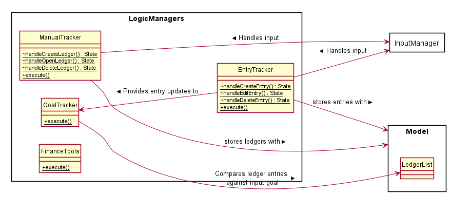

# Looi Kai Wen's Project Portfolio Page

# Project: FinanceIt

# Overview
FinanceIt is an all-in-one desktop application that handles the finance tracking needs of university students who are 
comfortable with a CLI interface. In the application, it consists of 5 sub-application that helps student to manage
their finance. <br/>

# Summary of Contributions: Code management
1. Project Management
    * Managed releases `v1.0` - `v-2.0` on GitHub (2 releases)
1. Contributions to the project on RepoSense. <br/>
    * **Code contributed:** [RepoSense Link](https://nus-cs2113-ay2021s1.github.io/tp-dashboard/#breakdown=true&search=kaiwen98&sort=groupTitle&sortWithin=title&since=2020-09-27&timeframe=commit&mergegroup=&groupSelect=groupByRepos&checkedFileTypes=docs~functional-code~test-code~other)
    
1. Contributions to TP repository 
    1. Report and maintenance of [project issues and milestones](https://github.com/AY2021S1-CS2113-T16-1/tp/issues?q=+is%3Aissue+author%3Akaiwen98+)
        1. Bug reporting: [#16](https://github.com/AY2021S1-CS2113-T16-1/tp/issues/16), [#19](https://github.com/AY2021S1-CS2113-T16-1/tp/issues/19), [#3](https://github.com/AY2021S1-CS2113-T16-1/tp/issues/3)
        1. Features (ManualTracker): [#24](https://github.com/AY2021S1-CS2113-T16-1/tp/issues/24)

    1. [Pull Requests](https://github.com/AY2021S1-CS2113-T16-1/tp/pulls?q=is%3Apr+is%3Aclosed+author%3Akaiwen98) to TP for code contribution 
        1. Functional code contributions:
            1. Dynamic Table Printer to be used for output throughout the software: [#7](https://github.com/CS2113-AY2021S1-T16-1/tp/pull/7)
            1. Contributions to ManualTracker and EntryTracker feature: [#28](https://github.com/AY2021S1-CS2113-T16-1/tp/pull/28), [#1](https://github.com/AY2021S1-CS2113-T16-1/tp/pull/1)
            1. Contributions to code quality and organisation: [#99](https://github.com/AY2021S1-CS2113-T16-1/tp/pull/99), [#105](https://github.com/AY2021S1-CS2113-T16-1/tp/pull/105), [#70](https://github.com/AY2021S1-CS2113-T16-1/tp/pull/70), [#50](https://github.com/AY2021S1-CS2113-T16-1/tp/pull/50)   
        1. Error Handling contributions: [#14](https://github.com/AY2021S1-CS2113-T16-1/tp/pull/14)
        1. Logging contributions: [#241](https://github.com/AY2021S1-CS2113-T16-1/tp/pull/241), [#273](https://github.com/AY2021S1-CS2113-T16-1/tp/pull/273)
        1. Code testing contributions: [#240](https://github.com/AY2021S1-CS2113-T16-1/tp/pull/240), [#57](https://github.com/AY2021S1-CS2113-T16-1/tp/pull/57), [#45](https://github.com/AY2021S1-CS2113-T16-1/tp/pull/45)

# Summary of Contributions: Documentation
# Contributions to UG

# Manual Tracker
Users can manage lists of entries, which are known as ledgers. Each list represents a single date of record.

> Example
    If I wish to record my income and expenditures on 30 October 2020, I will use the program as follows:
    1. Use Manual Tracker to create a ledger of date 20-10-03
    2. Open the ledger of date 20-10-03 
    3. Use Entry Tracker to create entries to record the transactions for that particular date

## Add ledger
Add a ledger to the record, representing a date.

>Syntax

    new {PARAM_TYPE} {PARAM} 
    
Param Type| Param | Param Format
----------|-------|------------|
`/date`|Date of the ledger, and all the entries under that ledger.| Input string of the date in YYMMDD, YY-MM-DD or YY-M-D

> Example: 


    
## Remove ledger
Remove a specified ledger from the record, referenced by date or id on the list.
This means that the user only need to specify one of the two param types, either ```/date``` or ```/id```.

>Syntax
 
    delete {PARAM_TYPE} {PARAM}
    
Param Type| Param | Param Format
----------|-------|------------|
`/date`|Date of the ledger, and all the entries under that ledger.| Input string of the date in YYMMDD, YY-MM-DD or YY-M-D
`/id`|Index of the ledger in the list, where the first ledger is of index 1. | Input positive integer 

> Example: 


    
## Open ledger
Users will gain access into the entries associated with the specified ledger, referenced by date or id on the list.
This means that the user only need to specify one of the two param types, either ```/date``` or ```/id```.

* Automatic creation of non-existing ledgers 
    * If the ledger specified do not exist and if the param type supplied is "/date", the program will create a new ledger
    in accordance to the date supplied.
    * If the user specifies a non-existing index, then the program will not have enough information to create the new ledger instance. Automatic creation
    will not apply in this particular case.
    
Refer to Feature Entry Tracker onwards for further instructions.

>Syntax

    open {PARAM_TYPE} {PARAM}


Param Type| Param | Param Format
----------|-------|------------|
`/date`|Date of the ledger, and all the entries under that ledger.| Input string of the date in YYMMDD, YY-MM-DD or YY-M-D
`/id`|Index of the ledger in the list, where the first ledger is of index 1. | Input positive integer 

> Example: 


<div style="page-break-after: always;"></div> 

# Contributions to DG

### Manual Tracker & Entry Tracker
**Overview** <br />

__Ledgers and Entries__

In this feature, we represent the transactions incurred by the users as ```Entry``` instances.
Instances of ```Entry``` class are categorised by the date of origin, which is represented by
```Ledger``` instances.

```Entry``` instances are characterized by the following: 
* Time of transaction
* Type of transaction: Income/ Expense 
* Amount in transaction
* Category of spending/ expenditure
* Description

```Ledger``` instances are characterized by the following: 
* Time of transaction
* Collection of ```Entry```instances

**Manual Tracker** <br />

The Manual Tracker is a feature that allows users to manage Ledgers with create, delete
and open operations. Ledgers is a class that maintains a list of transactions that are 
recorded for a given date. 

The Entry Tracker is fundamentally similar to the Manual Tracker, except it manages ```Entry``` instances
instead of ```Ledger```. Entry Tracker is initialized when a ```Ledger``` instance is "opened", whereby 
the Entry Tracker facilitate the manipulation of the collection of ```Entry``` instances that are associated with
that particular ```Ledger``` instance.

For the sake of brevity, this section will focus on the discussion of the Manual Tracker. 
The edit operation of the Entry Tracker will be discussed at the [end of this section](#entryseq); it is sufficiently unique to Manual Tracker operations to merit detailed discussion.

The Manual Tracker is capable of executing the following states of operation:

|States| Operations | 
|--------|----------|
|```MAIN_MENU```|Go to main menu for users to choose the available operations
|```CREATE_LEDGER```|Create a ledger specified by date, and append it to ```ledgerList```.
|```DELETE_LEDGER```|Delete an existing ledger, referenced by date or index.
|```OPEN_LEDGER```|Go to subroutine "Entry Tracker" for the entries recorded  under the specified ledger.

**Architecture in Context** 

**Logic Manager and Parser** 



|Class| Function |	
|--------|----------|	
|```InputParser```| Breaks input string by user into ```commandString``` and a sequence of ```paramTypes```-```param``` pairs. <br><br> The latter subsequence of the string is passed into ParamParser for further processing. <br><br> Information obtained from input parsing will be used to populate an instantiated ```CommandPacket``` instance, which will then be passed to the entity that called the parsing function.	
|```ParamParser```| Process the sequence of ```paramTypes```-```param``` pairs and populate the ```paramMap``` in the instantiated ```CommandPacket``` instance.	
|```ManualTracker```| [Refer to section](#logicManager_handler).
|```EntryTracker```| Omitted for brevity.


**Functions with Sequence Diagrams** <br />

**<a name = entryseq></a>Entry Tracker: Edit of entries** <br />
The editing of details within the entry is performed in two phases: Entry Retrieval and Entry Edit.


1. __Phase 0: Instruction retrieval__ 
    1. At ```EntryTracker.handleMainMenu()```, the user's input is registered via ```java.util.Scanner``` instance.
    1. Input is parsed by ```InputParser.parseInput()```, and ```EntryTracker.packet``` is set to the returned ```CommandPacket``` instance.
    1. The ```commandString``` of the ```CommandPacket``` instance is evaluated, and the corresponding handle method() is executed.<br>
    In this case, ```handleEditEntry()``` will be called.
1. __Phase 1: Entry retrieval([Sequence Diagram](#diag3))__
    1. At ```handleEditEntry()```, the following processes will be executed:
        1. A singleton instance of ```RetrieveEntryHandler``` is retrieved. The input String array will be passed into 
        ```retrieveEntryHandler.setRequiredParams()``` to set required params for a successful parse.
        1. ```retrieveEntryHandler.handlePacket(packet)``` is called to handle params in the packet.
            1. Refer to the section on [Param Handling](#impl_logic) for more details pertaining to general param handling. 
            1. For ```retrieveEntryHandler```, the ```handleSingleParam``` abstract method will be implemented as shown in the [following table](#table3).
            1. From ```EntryTracker```, call ```entryList.getItemAtCurrIndex``` to retrieve the entry specified by the index set to modify earlier.

#### <a name = table3></a> Param Handling Behavior

|ParamType|ParamType String| Expected Param | Operation | Verification method |
|---------|----------------|----------------|-----------|---------------------|
|```PARAM.INDEX```|"/index"|Valid index on the list <br/>from 1 onwards.|Call ```entryList.setIndexToModify()``` <br/>to set index of retrieved item. | ```ParamChecker.checkAndReturnIndex(packet)```|

#### <a name = diag3></a> Sequence Diagram 


1. __Phase 2: Entry edit ([Sequence Diagram](#diag4))__ 
    1. Following Phase 1, the following processes will be executed:
        1. The singleton instance of ```EditEntryHandler``` is retrieved. There is no need to call ```EditEntryHandler.setRequiredParams()```
        ; this command does not require params to modify. Instead, it acceps any params supplied and performs the edit accordingly.
        1. `editeEntryHandler.setPacket(packet)` is called to set packet.
    1. ```EditEntryHandler.handlePacket()``` is called to handle params in the packet.
        1. Refer to the section on [Param Handling](#impl_logic) for more details pertaining to general param handling. 
        1. For ```EditEntryHandler```, the ```handleSingleParam``` abstract method will be implemented as shown in the [following table](#table4).

#### <a name = table4></a> Param Handling Behavior           

|ParamType|ParamType String| Expected Param | Operation | Verification method |
|---------|----------------|----------------|-----------|---------------------|
|```PARAM.AMOUNT```|"/amt"|Positive Double in 2 decimal places|Call ```entryList.setAmount()``` to set amount | ```ParamChecker.checkAndReturnDoubleSigned(packet)```|
|```PARAM.TIME```|"/time"|Various format of time in string, eg. "15:00"|Call ```entryList.setTime()``` to set index of retrieved item. | ```ParamChecker.checkAndReturnTime(packet)```|
|```PARAM.INC```|"-i"|Income entry type flag|Call ```entryList.setEntryType(EntryType.INC)``` to set index of retrieved item. | ```nil```|
|```PARAM.EXP```|"-e"|Expense entry type flag|Call ```entryList.setEntryType(EntryType.EXP)``` to set index of retrieved item. | ```nil```|
|```PARAM.DESCRIPTION```|"/desc"|Description in string, ';' character is illegal.|Call ```entryList.setDescription()``` to set index of retrieved item. | ```ParamChecker.checkAndReturnDescription(packet)```|
|```PARAM.CATEGORY```|"/cat"|A set of strings that corresponds with entry type|Call ```entryList.setCategory()``` to set index of retrieved item. | ```ParamChecker.checkAndReturnCategories(packet)```|

#### <a name = diag4></a> Sequence Diagram 


<div style="page-break-after: always;"></div>

&nbsp;

